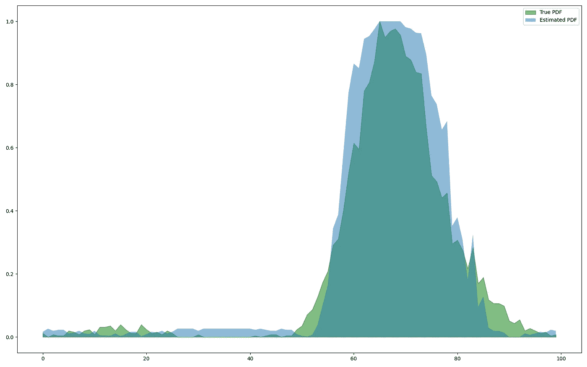
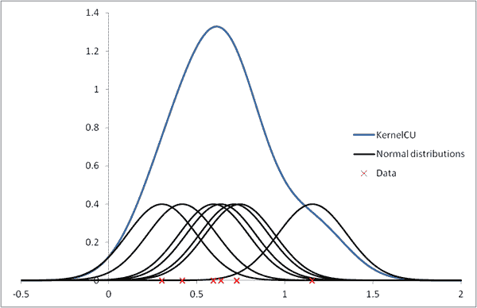
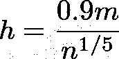
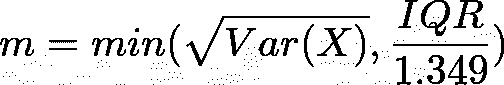
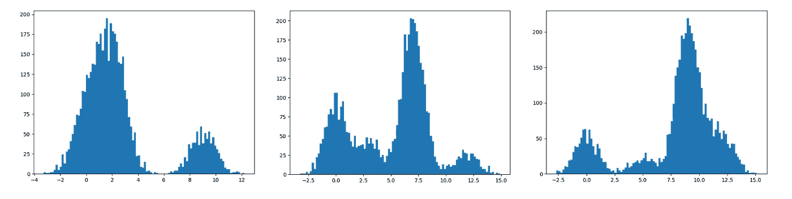
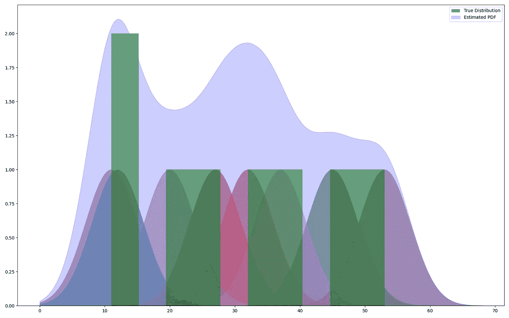
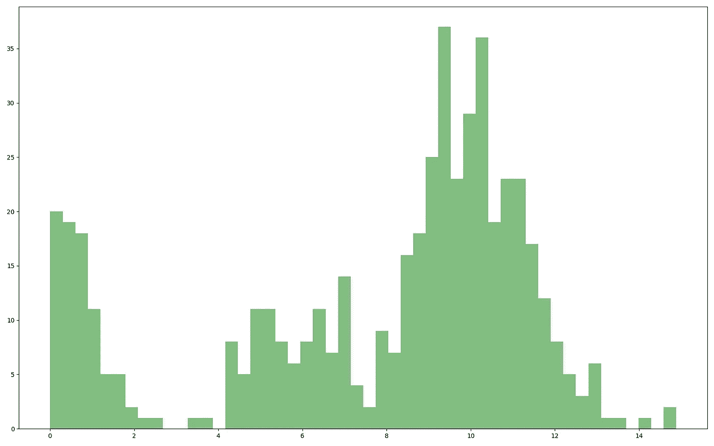
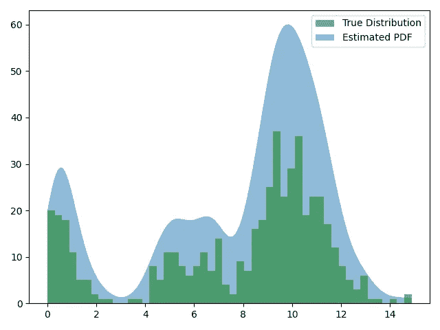
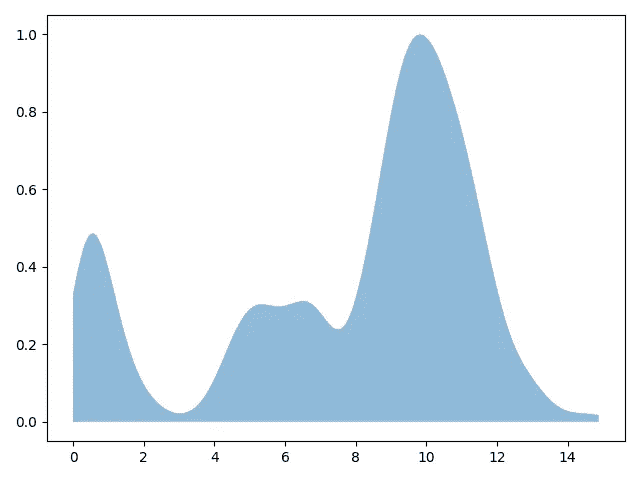

# 几率有多大？—核密度估计

> 原文：<https://medium.com/analytics-vidhya/what-are-the-odds-kernel-density-estimation-75c9980931e4?source=collection_archive---------8----------------------->



由作者创建

很多时候，知道一组给定观察值的概率密度函数是非常有用的。不幸的是，大多数随机数据样本可能具有未知的密度函数，因此需要估计概率密度。

进入**核密度估计:**一种估计随机变量密度函数的非参数方式。

在本帖中，我们将从理论和数学上解释内核密度估计，以及从头开始的 Python 实现！

# 概观

核密度估计(KDE)本质上是一种数据平滑方法，在数据分布上拟合一条平滑线。如前所述，这通常是为了估计给定分布的概率密度函数。事实上，人们可以从这个估计的概率密度中进行采样，并生成看起来像是来自与原始数据相同的分布的数据。

# 理论

作为非参数，KDE 不考虑任何类型的基础分布，这意味着它不假设一组数据将有一个特定的形状或模型。更确切地说，正如它的名字所表明的，它使用一个*内核函数*来拟合一条穿过数据的平滑线。

## KDE 描述

KDE 算法可以表示为:


其中 *K* 是核函数， *n* 是观测值的个数， *x* 是特定的观测值。KDE 本质上是以数据集中每个点为中心的分布的总和，其中要求和的分布是核概率密度函数。



[信用](https://www.vosesoftware.com/riskwiki/KernelCUdistribution.php)

还有一个参数， *h，*称为带宽。带宽控制每个零件周围分布的跨度，进而影响分布的平滑度。

## 带宽优化

由于带宽控制着数据的总体拟合度，因此选择不当的带宽会导致估计过度平滑或平滑不足。因此，存在一个最佳带宽。

从表面上看，选择一个好的带宽值有一些通用的经验法则:

*   由于数据的缺乏和/或稀疏，小数据集通常需要更高的带宽值，因此需要包含更多的点以获得足够的上下文。
*   较大的数据集有更多的点，因此可以使用较低的带宽，因为良好的上下文需要较少的蔓延。

还存在西尔弗曼的最优估计:



其中 *h* 为最佳带宽， *m* 为:



当然，对于最佳带宽选择，还有更复杂的方法，但是它们远比本文的范围复杂。

## 核

核只是一个概率密度函数，它必须具有以下一组属性:

*   **对称性:**一个核函数一定是对称的，于是 *k(x)* = *k(-x)*
*   **非负**:一个核函数必须有一个完全正的范围，因此对于域 **{x ∈ R}** 这个范围必须是 **{y ∈ R | y ≥ 0}**
*   **面积必须为 1:** 核函数的面积必须等于 1

## 普通内核

由于核本质上是概率密度函数，一些最常用的核是:

*   高斯核
*   三角形内核
*   Epanechnikov 核

# 履行

我们将从头开始用 Python 实现 KDE，并看一些例子。

我们将使用以下库:

```
import numpy as np
import matplotlib.pyplot as pltfrom typing import *
```

首先，我们将创建一个函数，它可以生成一些我们可以在示例中使用的随机数据:

```
def generate_random_data(num_points: int, n_randomization: int=3):
    x = np.random.randn(num_points)

    for _ in range(n_randomization):
        random_slice = int(np.random.rand() * num_points) x[random_slice:] += np.random.randint(0, 10)

    return x
```

我们现在可以画出一些我们产生的随机数据的例子。我们将为 5000 个数据点创建一个包含 100 个柱的直方图:

```
plt.hist(generate_random_data(5000), bins=100)
plt.show()
```



随机生成的示例

既然我们可以生成一些好的测试数据，我们将最终实现内核密度估计本身。在 Python 中，我们可以把它写成:

```
def kde(bandwith: float, data: List, kernel: Callable):
    mixture = np.zeros(1000)
    points = np.linspace(0, max(data), 1000) for xi in data:
        mixture += kernel(points, xi, bandwith)

    return mixture
```

回想一下这个公式，我们看到它只是对数据中每一点的内核求和。

现在要使用它，我们显然需要一个内核函数。我们现在将实现最简单和最基本的内核函数作为概念证明。

高斯核函数可以实现为:

```
def gaussian(x: Any, xi: float, bandwith: float):
    exp_section = np.exp(-np.power(x - xi, 2.0)) return exp_section / (2 * np.power(bandwith, 2.0)))
```

我们现在可以把所有东西放在一起，对一些测试数据使用我们的 KDE 函数。出于可视化的目的，如果我们使用一些简单的测试数据，并绘制 KDE 函数中的每一个高斯函数，我们将看到如下所示:



毫不奇怪，我们看到每个数据点周围都是高斯分布的混合体(我们的核函数)。

现在我们已经看到了概念验证，让我们实际上在一些更复杂的测试数据上使用它:

```
dist = generate_random_data(500)hist = np.histogram(dist, bins=50)[1]
```

绘制测试分布图:

```
plt.figure(
    figsize=(16, 10)
)plt.hist(dist, bins=50, 
         alpha=0.5, color='green', label='True Distribution')
plt.show()
```

在这种情况下，我们的随机数据分布如下:



应用我们的 KDE:

```
points = kde(0.5, dist, gaussian)
```

绘制我们的估计分布图:

```
plt.fill_between(np.linspace(0, max(dist), 1000), 
                 points, alpha=0.5, label='Estimated PDF')

plt.legend(loc='upper right')
plt.show()
```



正如我们所见，KDE 对分布的估计相当准确。现在这个估计在技术上还不是一个概率密度，因为它的范围远远大于 1。为了解决这个问题，我们需要做的就是将其规范化:

```
points = kde(0.5, dist, gaussian)
points /= np.abs(points).max(axis=0)  # Normalizing
```

以下是标准化后我们的估计值:



最后，我们有我们的概率密度函数估计！

# 结论

对给定分布的概率密度函数有一个粗略的估计比仅仅一个直方图更有价值。核密度估计是一个强大而简单的工具，可以帮助数据科学家对未知分布有更深入的了解。

# 进一步阅读/参考

*   [核密度估计简介](https://www.mvstat.net/tduong/research/seminars/seminar-2001-05/)
*   [KDE 可视化](https://mathisonian.github.io/kde/)
*   [更多 KDE 信息](https://www.real-statistics.com/distribution-fitting/kernel-density-estimation/)
*   [KDE 幻灯片](https://indico.cern.ch/event/485764/contributions/2005624/attachments/1250052/1843072/KDE_TanazA.Mohayai.pdf)
*   [关于 KDE 及其应用的全面论文](https://www.itm-conferences.org/articles/itmconf/pdf/2018/08/itmconf_sam2018_00037.pdf)