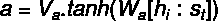

# 什么关注？为什么关注

> 原文：<https://medium.com/analytics-vidhya/what-attention-why-attention-ad38589ef67d?source=collection_archive---------8----------------------->

# 介绍

想象一下，你在一家超市想买一些谷类食品，你会怎么做？你会一次看完店里所有的商品吗？不，你没有，你找到了谷物货架，只看着它们，而忽略了商店里的其他商品换句话说，你关注了谷物货架注意力网络在 NLP 的深度学习的帮助下做了类似的事情

这个概念是在关于神经机器翻译的[论文](https://arxiv.org/pdf/1409.0473.pdf)中介绍的，在详细介绍它之前，让我们先简短地看一下在此之前使用了什么

# 编码器-解码器架构

NMT 最初基于 seq2seq 编码器-解码器架构(本文介绍)，该架构有 3 个重要部分:编码器、上下文向量和解码器。编码器是一个 RNN(或 LSTM/RNN ),接收输入序列并将其转换为上下文向量。上下文向量传递给解码器，解码器对上下文向量进行解码以给出输出序列

## 编码器

几个 RNN(或 LSTM/GRU，以获得更好的性能)的堆栈从输入和前一个隐藏状态中接受单个元素，从输入中收集信息，并将隐藏状态传递给下一个 LSTM。隐藏状态的计算如下

W_hh 是与先前输入状态相关联的权重
W_hx 是与当前输入序列相关联的权重

## 解码器

几个 RNN(或 LSTM/GRU)单元的堆栈，它接受编码器的最后一个隐藏状态作为上下文向量，最后一个编码器单元的单元状态作为初始值，并预测输出序列

# seq2seq 模型的缺点

1.  编码器-解码器网络需要将来自源句子的所有信息压缩到单个模糊长度向量中。这可能在长句和比训练语料库中的句子更大的句子中产生问题
2.  它没有考虑单词的个体贡献量，另一方面，注意力理解在个体时间步骤中关注哪些单词

# 注意机制

(巴哈马收件人)

为了解决上述问题，在[论文](https://arxiv.org/abs/1409.3215)中引入了注意力机制，它保持相同的 RNN 编码器，但是对于每个时间步长，它计算每个标记的隐藏表示的注意力分数。设输入为 x，输出为 y

我们将使用双向编码器，从左到右以及从右到左阅读句子，这包括一个单词注释中的前面和后面的单词

向前隐藏状态=

向后隐藏状态=

源隐藏状态=

在这个模型中，条件概率定义如下

这里 g 是具有非线性激活的全连接层，并且将所有显示输入作为级联，s_i 是时间步长 I 的解码器隐藏状态，并且计算如下

(f 是 RNN/LSTM 函数)

c_i 是使用注意力分数为每个时间步长计算的上下文向量，注意力分数是使用对齐模型计算的，以对位置 I 处的输入和位置 j 处的输出的匹配程度进行评分

(分数标准化的 softmax)

在 Bahdanau 的论文中，对齐分数 a()由具有单个隐藏层的前馈网络来参数化，并且该网络与模型的其他部分联合训练

(全连接层，输入是双向编码器的级联隐藏状态和解码器的最后隐藏状态)

c_t(上下文向量)是源句子中元素的加权平均值，它表示关于当前元素 h_j(out)和相似性得分 e_ij 的句子表示，然后上下文向量与当前隐藏状态和最后的目标标记 y_t-1 相结合以生成当前标记 y_j

对每个标记 y_t 重复这个过程，直到输出序列结束

注意力得分可以用多种方法计算，这里有一些流行的注意力得分机制

# 全球关注

全局注意力模型的思想是在导出上下文向量 c_t 时考虑编码器的所有隐藏状态，这里通过将当前隐藏状态与每个源隐藏状态进行比较来确定分数

(分数标准化的 softmax)

有三种计算分数的方法

(圆点)

(常规)

(串联)

在精神上，全局注意力类似于我们之前讨论过的 bahda nu 注意力，但两者之间存在某些差异，而 bahda nu 使用前向和后向编码器状态与目标序列的先前隐藏状态的串联，全局注意力只是使用编码器和解码器 LSTM 的顶部隐藏状态。

# 当地的关注

它选择性地聚焦于小的上下文窗口，并且是可微分的，首先，该模型在时间 t 为每个目标单词生成“对齐位置”p_t，然后，上下文向量 c_t 被导出为窗口内的一组编码器隐藏状态的加权平均值(p _ t-D，p_t + D ),其中 D 是根据经验选择的，如果窗口跨越句子边界，则我们简单地忽略外部部分，并且聚焦于窗口内的单词

局部注意模型有两种变体

*单调对齐* —这里位置向量 p_t 设置为 p_t = t，假设源句子和目标句子是单调对齐的，对齐计算如下

单调对齐几乎与全局注意相同，除了向量α_it 是固定长度和更短

*预测比对* —与单调比对不同，这里我们不假设 p_t 的值，我们使用以下等式进行预测

W_p 和 v_p 是与模型的其余部分一起训练的模型参数。S 是源序列的长度，因为我们已经添加了 sigmoid the 的范围是[0，S]

对齐计算如下

为了有利于 p_t 附近的点，高斯分布以 p_t 为中心

# 分层注意

该模型主要用于诸如文档分类的应用，它具有反映该模型的分层结构的分层结构，该模型具有在单词级和句子级应用的两级注意机制，使得它能够在构建文档表示时更多或更少地考虑重要内容。如果我们想到一个文档，它有一个如下的嵌套结构

字符>单词>句子>文档

相应地，层次结构是从 doc 到 char(自顶向下)或者相反(自底向上)构建的。网络通过建立句子的表示，然后将这些集合成一个文档表示来构建文档表示。通过对句子中的单词进行编码并对它们应用注意机制来构建句子表示，从而产生句子表示。以相同的方式构建文档表示，但是它仅接收句子向量作为输入。

在单词级，我们使用双向 GRU 作为 RNN 单元，这为我们提供了单词注释，该注释总结了来自向后和向前方向的信息，产生了变量 h_it

然后我们像以前一样应用注意力机制

我们使用 tanh 来保持值在[-1，1]之间

在句子层面，我们重复同样的过程，但是 s_i 作为双向 GRU 细胞的输入

可训练的权重和偏差被随机初始化，并且在训练过程中被共同学习。最终输出是文档向量 v，它可以用作文档分类的特征。

# 参考

[序列对序列学习用神经网络](https://arxiv.org/abs/1409.3215)
[注意？立正！](https://lilianweng.github.io/lil-log/2018/06/24/attention-attention.html#definition)
[介绍自然语言处理问题中的注意机制](https://arxiv.org/abs/1811.05544)
[联合学习对齐和翻译的神经机器翻译](https://arxiv.org/pdf/1409.0473.pdf)
[基于注意的神经机器翻译的有效方法](https://arxiv.org/pdf/1508.04025.pdf)
[用于文档分类的分层注意网络](https://www.cs.cmu.edu/~diyiy/docs/naacl16.pdf)
[利用分层注意网络进行文本分类](https://humboldt-wi.github.io/blog/research/information_systems_1819/group5_han/)