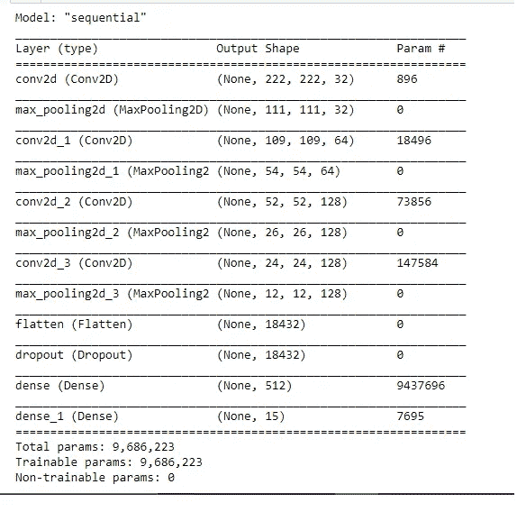

# 你的模型能看到什么？

> 原文：<https://medium.com/analytics-vidhya/what-can-your-model-see-295ab52dbb88?source=collection_archive---------11----------------------->

# 从计算机视觉模型的角度可视化您的影像数据集


克里斯托夫·高尔在 [Unsplash](https://unsplash.com?utm_source=medium&utm_medium=referral) 上拍摄的照片

建立计算机视觉模型的过程是计算密集型的，并且随着训练时间的增加会变得昂贵。然而，提高模型的准确性是大多数从业者害怕的另一项艰巨的任务。计算机视觉模型或神经网络通常出现或共有的另一个问题是，模型在训练和验证期间表现良好，但在生产中表现不太好。为了正确地调试这个问题，您需要能够可视化您的模型在看什么。

有检查卷积层学习的过滤器的方法。这些可视化技术可用于调试计算机视觉模型。让我们检查其中的一些。

# **可视化中间激活**

这是一种可视化由每个卷积图层及其相应池生成的要素地图的方法。给定一定的输入(在我们的例子中是图像)，该层将产生一个输出，这些输出被称为该特定层的激活。输出可以被可视化为 2D 图像。

[PlantVillage 疾病数据集](https://www.kaggle.com/abdallahalidev/plantvillage-dataset)用于训练本文中使用的模型。

让我们直奔主题吧

```
# import the required modulesfrom keras import layers
from keras import models
from keras import optimizersfrom keras import backend as Kimport cv2
import tensorflow as tf
```

这是模型的样子



让我们想象一下我们的测试图像

我们将构建一个 Keras 模型，该模型将成批的图像作为输入，并输出所有卷积和池层的激活，以便检索您想要查看的函数图。我们将使用 Keras 类模型来做到这一点。输入张量(或输入张量列表)和输出张量用于创建模型(或输出张量列表)。生成的类是一个 Keras 模型，它的工作方式类似于顺序模型，将指定的输入映射到指定的输出。模型类不同于顺序类，因为它允许模型具有不同的输出。

```
layer_outputs = [layer.output for layer in model.layers[:8]] #Extract the top 8 layers
activation_model = models.Model(inputs=model.input, outputs=layer_outputs) # Creates a model that will return these outputs, given the model input
```

当给定图像输入时，该模型返回原始模型中的层激活值。

```
img_tensor=np.expand_dims(image, axis=0) # expanding the image dimension
activations = activation_model.predict(img_tensor)
first_layer_activation = activations[0]
```

可视化第四通道

让我们立刻想象一下所有的渠道，以便对幕后发生的变化有一个总体的了解。

激活的稀疏性随着层深度而增加:在第一层，输入图像激活所有滤波器；但是，随着层数的增加，越来越多的过滤器变得无效。这表明在输入图像中没有找到过滤器的模式。

我们刚刚展示了深度神经网络表示的一个基本的普遍属性:随着层的深度增加，由层导出的特征变得越来越抽象。更高层的激活保存越来越少的关于正在被看到的真实输入的信息，以及越来越多的关于目标的信息。神经网络充当输入图像中编码的不同信息的分离器。

这类似于人类看待和概念化信息的方式

# **可视化类激活的热图**

这种可视化对于理解给定图像的哪些部分导致了 convnet 的最终分类决策非常重要。这对于识别“模型在看什么”很重要。它包括在输入图像上生成类激活的热图。类别激活热图是与特定输出类别相关联的分数的 2D 网格，针对任何输入图像中的每个位置进行计算，指示每个位置相对于所考虑的类别的重要性。

实现如下所示

热图将回答以下问题:

*   为什么模型把图像归为某一类？在这种情况下是细菌斑点。
*   叶子的哪些地方受到了细菌斑点的影响？

这些可视化技术可以用来解释模型的性能。一旦一个模型可以成功通过这个阶段，那么在部署到生产时，对该模型性能的信心肯定会增加。

```
1.François Chollet (2018). Deep Learning with python. Shelter Island: Manning Publications Co.
```