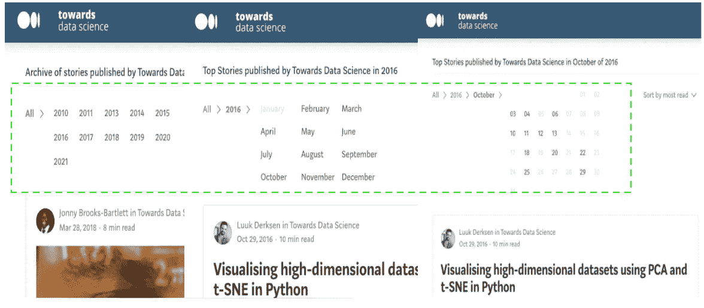
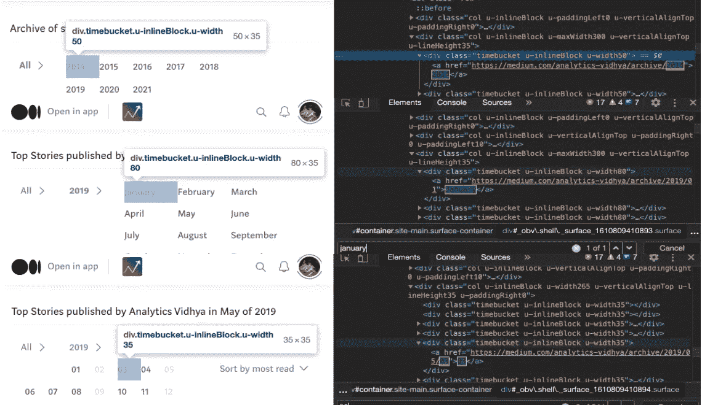
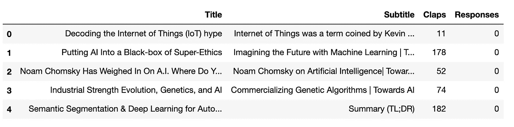

# 如何使用 Python 从数据科学出版物中抓取文章

> 原文：<https://medium.com/analytics-vidhya/what-data-science-articles-attract-more-attention-part-1-efe8faf209d0?source=collection_archive---------28----------------------->

## 哪些数据科学文章更受关注(第 1 部分)


Elena Mozhvilo 在 [Unsplash](https://unsplash.com?utm_source=medium&utm_medium=referral) 上的照片

*你有没有想过，是什么让一篇文章变得伟大？* *数据科学世界的读者对哪些特定领域更感兴趣？我当然做了！*我的目标是通过分析媒体上数据科学出版物的文章来找到这些问题的答案。这一系列文章将涵盖诸如网络抓取、清理文本数据和主题建模等领域。

在本系列的第 1 部分中，我们将通过使用 Python 的 web 抓取从各种数据科学出版物中获取历史文章。

## **数据科学出版物**

有很多关于 Medium 的出版物，涵盖了数据科学和编程等主题。我们将从三个出版物获取文章， [TDS](https://towardsdatascience.com/) 、[走向 AI](https://medium.com/towards-artificial-intelligence) 和 [Analytics Vidhya](https://medium.com/analytics-vidhya) 。这应该为我们未来的分析提供足够大的数据集。

***导航到档案***

通过简单的谷歌搜索，我们可以获得我们感兴趣的出版物档案的链接。除了 TDS 之外，几乎所有出版物都有以下形式的 URL“https://medium . com/publication-name/archive”。但是页面的布局保持不变。

让我们检查出版物的存档页面，在页面顶部，我们可以找到文章发表的年份，通过单击其中一年，我们将看到月份，类似地，要获得天数，我们需要单击特定的月份。现在，需要注意的一件事是，不是所有的年份都有月份，也不是所有的月份都有日子。



[https://towardsdatascience.com/archive](https://towardsdatascience.com/archive)

## 我们如何获得所有日期的链接？

我们首先检查归档页面，我们可以看到链接存储在带有类*‘time bucket…’*的*‘div’*容器中。三个容器的类的命名约定的唯一区别是宽度。



检查[分析 Vidhya](https://medium.com/analytics-vidhya/archive) 存档页面。

现在我们已经获得了获取链接所需的所有信息，我们可以编写代码了。让我们从这个任务所需的导入开始，我们将使用 Python 库请求和 BeautifulSoup 来发出 HTTP 请求并从 HTML 中提取数据。

```
from bs4 import BeautifulSoup
import requests
```

接下来我们定义名为 ***get_all_links*** 的函数，它使用出版物存档的 url 作为输入，并返回所有日期的链接。它分为三部分—获取年、获取月和获取日。在代码中，我们还有额外的变量，如 *years_no_months* 和 *all_links_no_days* ，它们收集没有月份的年份和没有日期的月份的链接。

```
def get_all_links(url):
    '''function to obtain all the links to archive pages'''
    # url - url to publication archive
    r = requests.get(url)
    # get years
    soup = BeautifulSoup(r.text, 'html.parser')
    search = soup.find_all('div', class_='timebucket u-inlineBlock u-width50')
    years = []
    for h in search:
        years.append(h.a.get('href'))

    # get months 
    years_months = []
    years_no_months = [] # for the years that don't have months
    for year in years:
        y_soup =BeautifulSoup(requests.get(year).text,'html.parser')
        search_months = y_soup.find_all('div', class_='timebucket u-inlineBlock u-width80')
        months = []
        if search_months:
            for month in search_months:
                try:
                    months.append(month.a.get('href'))
                except:
                    pass
            years_months.append(months)
        else:
            years_no_months.append(year)years_months = [item for sublist in years_months for item in sublist] 

    # get days
    all_links = []
    all_links_no_days = [] # for the month that don't have days
    for month_url in years_months:
        m_soup = BeautifulSoup(requests.get(month_url).text, 'html.parser')
        all_days = m_soup.find_all('div', class_='timebucket u-inlineBlock u-width35')
        days = []
        if all_days:
            for day in all_days:
                try:
                    days.append(day.a.get('href'))
                except:
                    pass
            all_links.append(days)
        else:
            all_links_no_days.append(month_url)    
    all_links = [item for sublist in all_links for item in sublist]
    final_links = years_no_months+all_links_no_days+all_links
    return final_linkstowards_ai_links = get_all_links('[https://medium.com/towards-artificial-intelligence/archive'](/towards-artificial-intelligence/archive'))
```

最终输出是出版物档案中所有页面的链接列表。

```
['https://medium.com/towards-artificial-intelligence/archive/2015', ...]
```

## 我们如何获得单个文章的数据？

检查页面也是这个任务的一个很好的起点。所有文章框都有标准格式，因此获得一个框的信息将允许我们收集所有其他文章的所有信息。

在我们编写代码之前，我们需要建立存储我们需要的信息的元素和它们的类。此时，我们只对每篇文章的标题、副标题、鼓掌次数和回复感兴趣。


检查单个物品

我们现在有了编写代码的所有信息，我们从主脚本的较小片段开始。为了从单个链接中获取所有文章，我们使用类“streamItem …”搜索“div”容器。

```
link = 'https://medium.com/towards-artificial-intelligence/archive/2015'soup_ = BeautifulSoup(requests.get(link).text, 'html.parser')
articles = soup_.find_all('div', class_='streamItem streamItem--postPreview js-streamItem')
```

接下来，我们获取一篇文章的标题和副标题，在下面的代码中，我们有两个元素用于标题*‘H3’*和*‘H2’*，这是因为一些作者选择了一种*不同的方法来编写标题*。对于缺少标题或副标题的情况，我们将其设置为空，但是该值可以更改为任何值。

```
article = articles[0] #get single article
if article.h3:
    title = article.h3.getText()
elif article.h2:
      title = article.h2.getText()
else:
    title = ''if article.h4:
    subtitle = article.h4.getText()
else:
    subtitle = ''
```

为了获得掌声和响应，我们找到相应的元素及其类，在这种情况下，我们不只是对文本感兴趣，我们需要获得整数值。有时，单个文章的点击量达到数千，在这种情况下，它们以下列形式表示' 1k '，' 2.2k '等，为了处理这种情况，我们用空条目替换' K '，将字符串转换为整数，然后乘以 1000。对于所有其他值，我们要么将其转换为整数，要么将其设置为零。

当一篇文章有一些来自读者的回应时，它们会有以下几种形式:1 个回应、2 个回应等等。所以在这里，我们只想获得整数，我们这样做是通过在字符串中搜索 *'\d+'* 正则表达式。

```
import re
s_clap =article.find('button', class_='button button--chromeless u-baseColor--buttonNormal js-multirecommendCountButton u-disablePointerEvents')
if s_clap:
    s_clap = s_clap.getText()
    if 'K' in s_clap:
         clap = int(float(s_clap.replace('K', '')))*1000
    else:
        clap = int(s_clap)       
else:
    clap = 0s_response = article.find('a', class_='button button--chromeless u-baseColor--buttonNormal')
if s_response:
    s_response = s_response.getText()
    response =int(re.search(r'\d+', s_response).group()))
else:
    response = 0
```

现在我们将所有的代码片段集成到一个名为***get _ data _ all _ articles***的函数中，它的主要参数是我们前面提到的***get _ all _ links***函数的输出(链接到单个出版物的所有存档页面)。

```
from tqdm import tnrange #to keep track of the progress 
import pandas as pd
import redef get_data_all_articles(final_links):
    titles, sub_titles, claps, responses = [], [], [], []

    for link, z in zip(final_links, tnrange(len(final_links))):
        soup_ =BeautifulSoup(requests.get(link).text, 'html.parser')
        articles = soup_.find_all('div', class_='streamItem streamItem--postPreview js-streamItem')
        title, subtitle, clap, response = [], [], [], []
        for article in articles:
            if article.h3:
                title.append(article.h3.getText())
            elif article.h2:
                title.append(article.h2.getText())
            else:
                title.append('') if article.h4:
                subtitle.append(article.h4.getText())
            else:
                subtitle.append('') s_clap =article.find('button', class_='button button--chromeless u-baseColor--buttonNormal js-multirecommendCountButton u-disablePointerEvents')
            if s_clap:
                s_clap = s_clap.getText()
                if 'K' in s_clap:
                    clap.append(int(float(s_clap.replace('K', '')))*1000)
                else:
                    clap.append(int(s_clap))              
            else:
                clap.append(0)
            s_response = article.find('a', class_='button button--chromeless u-baseColor--buttonNormal')
            if s_response:
                s_response = s_response.getText()
                response.append(int(re.search(r'\d+', s_response).group()))
            else:
                response.append(0)
        titles.append(title)
        sub_titles.append(subtitle) 
        claps.append(clap)
        responses.append(response) 
    titles = [item for sublist in titles for item in sublist]
    sub_titles = [item for sublist in sub_titles for item in sublist]
    claps = [item for sublist in claps for item in sublist]
    responses = [item for sublist in responses for item in sublist]
    frame = pd.DataFrame([titles, sub_titles, claps, responses]).transpose()
    frame.columns = ['Title', 'Subtitle', 'Claps', 'Responses']
    return framedata_set = get_data_all_articles(towards_ai_links)
```

运行脚本可能需要一些时间，这取决于 HTTP 请求的数量，每页包含 10 篇文章，一些出版物有相当大的存档。该脚本包括 *tqdm* 包来跟踪进度。

运行脚本后，我们得到以下数据集



面向 AI 发布的[最终数据集](https://medium.com/towards-artificial-intelligence)

**总结**

我们通过从一些出版物的档案中获取数据集，开始了我们的旅程，以揭示读者对数据科学中的哪些领域更感兴趣。关于文章的信息并不局限于我们所介绍的特性，还有更多的指标需要获取，比如作者是否有图片，文章有多长等等。这可以以类似于获得标题、副标题、掌声和响应的方式来完成。

请关注本系列的后续文章，我们将继续进行数据清理和主题建模。