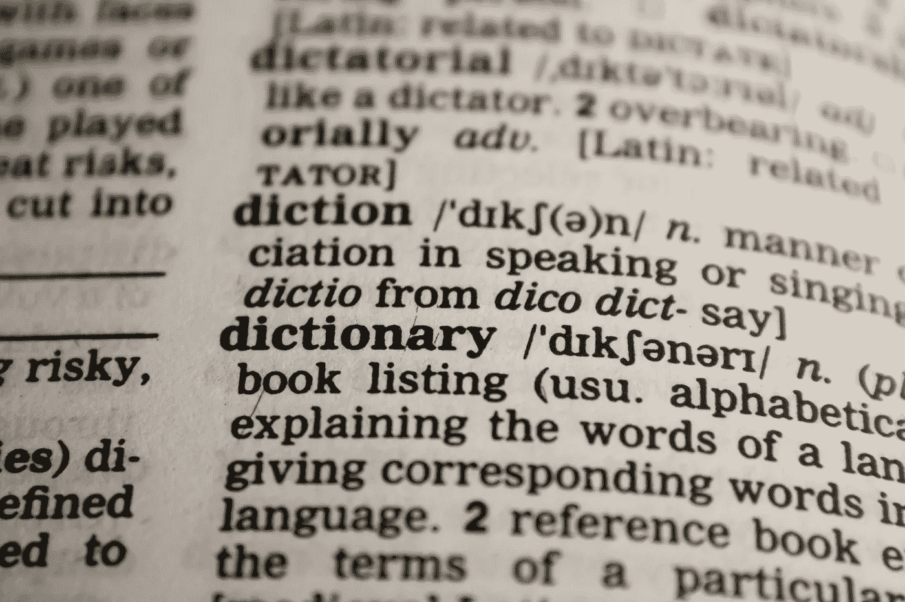
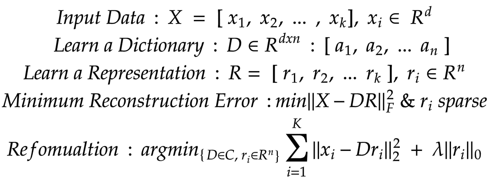
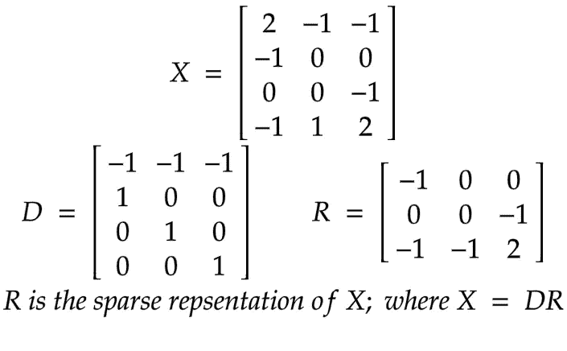

# “字典学习”到底是什么？

> 原文：<https://medium.com/analytics-vidhya/what-dictionary-learning-actually-is-812d264e9646?source=collection_archive---------0----------------------->

由 [PDPics](https://pixabay.com/users/pdpics-44804/)

也称为稀疏字典学习，稀疏编码。然而，字典学习的概念是最大似然领域中被误解的概念之一，尽管它经常出现在研究论文中。

> 什么是字典学习？

首先，这与字典数据结构没有任何关系。“字典”的概念来自线性代数中给定向量空间的构建基础。基矩阵也称为字典矩阵，并且旨在生成字典矩阵的构建算法给出了“字典学习”的名称。

字典学习是一种稀疏编码模式。其中从分析实现的角度来看，编码模式是无损的。并且从数值实现的角度来看，保证了全局最优编码，因为解析重构是凸优化问题。

> 字典学习用在哪里？

由于字典学习的概念是用于向量空间编码的明确定义的解析解，因此字典学习的概念从纯数学推导被用于可以分析 EEG 脑图像的神经网络训练。信号处理、遥感、数据压缩、图像处理、视频处理、神经网络训练等领域是广泛使用字典学习的热门领域。

> 词典学习的理论背景

如果你熟悉线性代数中的基、生成集和排序的概念，这将有助于你更深入地理解我们将要讨论的概念。如果不熟悉或不了解，请在继续之前查看[此视频](https://www.youtube.com/watch?v=AqXOYgpbMBM)。

简而言之，字典学习是一种在给定向量集上计算“基”的数值解决方案。那么，*为什么我们不能用解析解呢？从计算复杂性的角度来看，这是一个 NP 完全问题。因此，不能保证我们能得到解决方案，尤其是对于大型矩阵。*

字典(碱基矩阵)由原子(碱基)组成，原子不需要明确正交，并且可能是一个过完备的生成集(违反了碱基的线性无关性)

字典学习在约束优化问题下训练，其中约束是将系数的稀疏度增加到给定阈值以上，并且优化是为了最小化学习矩阵‘D’及其系数矩阵‘R’与输入数据矩阵‘X’的乘积之差。

*在示例 x_1 = [2，-1，0，1]中，维度“d”为 4。并且，输入向量空间‘X’的基底‘D’在这里是手工计算的数值及其系数矩阵‘R’。如图所示，编码 R 矩阵具有比 X 输入向量空间更低的维数(4 < 3)。所以，在操作这里用 R 空间编码代替 X.*

分析上，已经建立了几种方法来解决上述约束优化问题，并且每种方法都有其优点和缺点。例如，最优方向法(MOD)在低维空间是有效的，当 n >最小样本量时保证最优解。然而，它在高维输入向量空间上计算量很大，因为它正在计算 r 的伪逆。此外，K-SVD 是另一种基于 K 均值概念的方法。

> 词典学习实例

出于实现的目的，这里我使用了`sk-learn`内置的`DictionaryLearning`模块。另外，`sk-learn` 模块支持比我在这里实现的更多的字典学习配置，因此我鼓励你点击[这个链接](https://scikit-learn.org/stable/modules/generated/sklearn.decomposition.DictionaryLearning.html)来获得更多关于这个模块的信息。

由我们的实现生成的编码向量空间比上面说明的 R 矩阵更加稀疏。此外，现在你可以看到，随着稀疏度的增加，编码矢量变得更加简单和精确。

为什么稀疏性很重要？一般来说，编码的稀疏度越高，所得到的字典对噪声的弹性就越高。因此，由该向量空间馈入的算法可以很容易地提高精度，同时减少处理时间。然而，“稀疏性在 ML 中的重要性”是一个改天再讨论的话题。同时，如果您想了解更多的知识，我鼓励您阅读这篇关于[稀疏编码](http://www.scholarpedia.org/article/Sparse_coding)的文章。

> 为什么用在机器学习中？

简单地说，因为字典学习是一种稀疏编码算法。在机器学习中，算法几乎总是由表示学习系统或数据编码系统支持。然而，字典学习也有一些好处。如果“k `>最小样本大小和向量不受噪声的影响，则可以保证得到的字典可以对训练向量空间中的任何点进行最佳编码，即使对于在训练时间内没有看到的向量也是如此。此外，编码稀疏和正交使得它最适合用于神经网络或一般的 ML 算法。

我希望你现在能很好地理解字典学习的基础。但是，从这里开始的词典学习，尤其是深度学习领域，还有很多需要探索的地方。我希望这些知识能在旅途中有所帮助！

*最后，感谢您阅读本文！！*