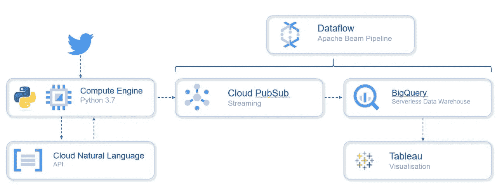
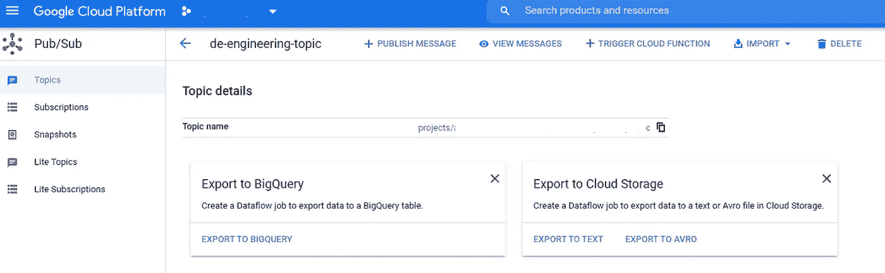
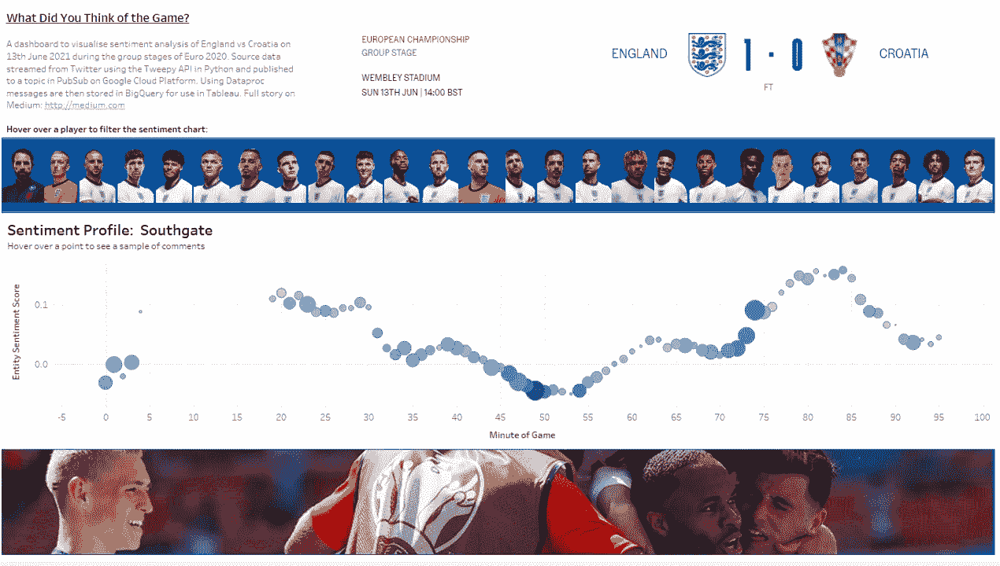

# "你认为昨晚的比赛怎么样？"

> 原文：<https://medium.com/analytics-vidhya/what-did-you-think-of-the-match-last-night-b1380f070e51?source=collection_archive---------15----------------------->

# 使用谷歌云平台、Python、Tweepy & Tableau 进行英格兰对克罗地亚比赛期间的 Twitter 实体和情感分析

随着欧洲锦标赛于 2021 年 6 月 11 日拉开帷幕，小组赛是国家队参赛的第一步。在一系列的友谊赛之后，他们有希望微调他们的战术并最终确定他们的首发阵容，小组赛是球迷开始做梦并开始看到无疑确保成功的辉煌迹象，或令人沮丧的疲软迹象。作为与此同时的一个练习，我想看看在一个特定的游戏中对玩家的情绪是如何变化的，并在一个时间线上将其可视化，以便对这一运动进行一些分析。

为了这篇文章的目的，我想集中在英格兰的第一场比赛(我的球队！)6 月 13 日对阵克罗地亚。为了做到这一点，我利用谷歌云平台(GCP)的后端活动和可视化的 Tableau。

我的目标是保持这篇文章相当高的水平，但源代码可以在下面的 GitHub gists 中找到。该解决方案将作为一个轻触式的一次性项目来展示这些工具是如何连接在一起的，而不是一个工业级的解决方案，因此准备好看到大量的改进空间。

让我们开始吧！

托马斯·塞勒在 [Unsplash](https://unsplash.com/s/photos/football?utm_source=unsplash&utm_medium=referral&utm_content=creditCopyText) 上的照片

# 方法

该设计相对简单(如下所示):

我们需要采取 5 个关键步骤:

1.  获得对 Twitter API 的访问权，并传输到 Python。这将是我们的原始数据源
2.  将这些推文过滤到我们感兴趣的推文中。)并通过调用谷歌的自然语言 API 来识别推文中的实体和情感
3.  将结构展平成表格形式，为分析做准备
4.  将这些增强的消息流入 PubSub，并使用数据流管道将消息写入 BigQuery 表
5.  将 Tableau Public 连接到 BigQuery 并可视化结果

**推特 API**

与 Twitter 的连接是通过 Tweepy Python 包中的 API 调用实现的。这里我不会对 Tweepy 或 API 进行全面的概述，但是有几篇关于这方面的好文章。(我特别喜欢 YouTube 上来自 CodingEntrepenuers 的视频[https://youtu.be/dvAurfBB6Jk](https://youtu.be/dvAurfBB6Jk))，其中包含了对构建过程的深入了解，以及讲师使用的相关 Git 库的链接。)

以下要点显示了所需的一些关键元素以及 Python 脚本的外观(请注意，脚本需要更新才能用于其他用户/项目):

**过滤器**

一旦我们有了 Twitter 的应用程序凭证，并且脚本被设置为开始传输 tweets，那么就有几个步骤需要考虑。我们将通过谷歌自然语言 API 的输出来丰富信息流，这是一种已计算成本的资源，每月可免费使用多达 5000 次调用，因此我们希望确保调用尽可能有效，以避免巨额超支。我们的做法有两个方面:

1 —首先，我们将 Tweepy 调用限制在我们已经定义的流标签(#ENGCRO 等。)这是一个保存在 lst_hashtags 变量中的列表。

2 —其次，我们在 write_to_pubsub 函数中进行过滤，专门包含英格兰球员的姓名。这是一个保存在 lst_teams 变量中的列表。

我们的假设是，在这场特定比赛的正确背景下，我们将会看到一系列提及我们感兴趣的球员的推文。

**分析&展平**

在这个阶段，我们现在应该有一个标准化的 tweets 管道，准备用 Google 自然语言 API 的输出来丰富它。

Google 自然语言 API 向开发者提供自然语言理解技术，包括情感分析、实体分析、实体情感分析、内容分类、语法分析。这对于像这样的项目特别有用，因为它消除了构建和训练特定模型的需要，从而节省了时间。

由于这个项目正在分析的 tweets 可能包含多个具有不同情绪的实体，我选择使用实体情绪调用这个 API，因为这将区分实体并对每个实体应用情绪分析。进一步说，想象一下这条推文:

**《凯恩好》**

情感分析将表明对实体的非常积极的情感，在这种情况下是‘Kane’。然而，想象一下第二条推文:

**《凯恩好，匹克福德坏》**

我们需要能够分离出实体(在这种情况下是‘凯恩’和‘皮克福德’)，并为每个实体分配适当的情感(和量级)。

为了便于下游存储和分析，我们只分析了 tweet 中的前三个实体。下面的脚本展示了如何处理 tweet。它对推文进行一些重新格式化，处理时间戳，过滤掉非英语语言的推文，并在调用 API 之前应用团队过滤器。一旦 API 返回，它就拉平实体/情绪/幅度响应以保持前三个。

**在 BigQuery 中创建我们的目标表**

在 BigQuery 中创建一个表非常简单。登录到您的 GCP 项目，选择 BigQuery 快捷方式>创建数据集>创建表，并输入您需要的字段。出于这个项目的目的，这些字段应该与写入消息队列的字段的名称和类型相匹配。为了更深入地了解这一点，我在 Qwiklabs 上找到了一堆非常有用的实验室，从[https://www.qwiklabs.com/catalog_lab/685](https://www.qwiklabs.com/catalog_lab/685)开始(*Qwiklabs 是一个付费产品，但当我注册时，我收到了几个邀请，可以享受 30 天的免费访问，这对于完成几个实验室来说是足够的时间)

**将增强的推文流式传输到 BigQuery**

因此，到目前为止，我们已经获得了我们的 tweet 流，过滤出我们感兴趣的 tweet，将每个 tweet 传递给 NL API，接收响应，并将实体限制为 3 个。我们现在可以存储这些数据，为分析做准备。我们这样做的方式是将丰富的 tweets 流(发布)到 Google PubSub 主题，并使用数据流管道订阅该主题，检索消息并将它们写入 BigQuery 表。

Google PubSub 用于流分析和数据集成管道，以接收和分发数据，这使其成为管理管道将处理的推文流量和数量的理想选择。实际上，下面的代码从重新格式化的 tweet 中提取 BigQuery 需要的字段，并将这些字段作为消息写入(发布)到 PubSub 队列(topic):

在这个阶段，我们有一个 PubSub 主题，它很好地填充了增强的 tweets，但是我们如何将它放入数据库呢？现在，这就是使用谷歌管道真正有用的地方。我们需要创建一个作业，从队列中提取消息，确认消息(删除它)并将消息以表格格式写出。这可能需要一些时间来设置，但幸运的是，在 PubSub 主题屏幕上，我们可以看到有两个模板作业已经设置好可以使用:“导出到 BigQuery”和“导出到云存储”。

发布/子主题详细信息屏幕

单击导出到 BigQuery，输入您的主题的详细信息和我们在几段前创建的 BigQuery 表，GCP 会自动设置计算实例和数据流作业，如果您的流脚本已经在运行，您会看到 BigQuery 表中出现行，可以立即进行分析，但值得注意的是，只要流和数据流作业正在运行，它就会继续写入行。

**分析**

GCP 有自己的分析套件，包括 Data Studio，但为了提高速度，我使用了 Tableau，因为我对它很熟悉，它有一个现成的 BigQuery 连接。Tableau 是一个数据可视化工具，有一个有用的免费产品叫做 Tableau Public，允许用户在线发布他们的可视化图。(我不会在这里详细介绍 Tableau 的构建，但是请放心，这里有很多在线资源和一个蓬勃发展的社区供想要开始使用的用户使用。)

Tableau 可以很容易地连接到 BigQuery，一旦数据进入仪表板，用户就可以创建多个 vizzes，然后将这些 vizzes 与其他项目(如文本和/或图像框)一起放在仪表板上。图像也可以成为交互中不可或缺的一部分，比如在这种情况下，我允许球员的图像作为下面档案图表的悬停过滤器。

Tableau 公共仪表板的屏幕截图

仪表盘的链接在这里[https://public . tableau . com/views/PlayerSentimentAnalysis/Main？:language = en-GB&:display _ count = n&:origin = viz _ share _ link](https://public.tableau.com/views/PlayerSentimentAnalysis/Main?:language=en-GB&:display_count=n&:origin=viz_share_link)

**笔记&思绪**

虽然这个练习更多的是关于 GCP 管道建设的演示，但是从分析中可以得出一些结论，尽管不是惊天动地的:

*   尽管团队遵循大致相似的模式，但情绪始终在变化
*   当进球时，情绪会改善，如果进球者在进球前情绪消极，情绪会逆转
*   对于大玩家和经理来说，推文量更不稳定

那么你知道了，我希望这是有用的或者有趣的。正如我在开始时提到的，这对我来说是一个非常有用的学习练习，我已经记下了一些关于我如何改进或可能帮助未来开发人员在此基础上构建的笔记。

Habib Ayoade 在 [Unsplash](https://unsplash.com?utm_source=medium&utm_medium=referral) 上拍摄的照片

**流程说明**。我最初是在笔记本电脑上的 Jupyter 笔记本上开发代码的。(我发现如果我把代码分成几块，调试起来会更容易)。然而，为了执行，我将代码保存为单个。py 脚本并发布到 GitHub。然后，我在 GCP 上设置了一个虚拟机(e2-medium 2vCPU 4GB)，安装了我的先决条件，克隆了我的 repo，并通过 SSH 的命令行运行代码。这增加了流程的弹性和保持在线的需要。

**关于代码的注释。虽然它可以工作，但如果我有时间，我会重新访问代码并重写，因为我现在对 Python 的信心更高了，而且它在某些方面看起来很冗长。**

**关于下一步探索领域的说明。**在这个项目中，我们使用 Tweepy 来阅读推文，但我们可以继续使用 Tweepy 来写推文，并将情感分析反馈到 twitter。我们可以将输出输入到预先训练的语言模型(如 GPT-3)中，以便在游戏等过程中进行交互并对消息做出响应。

我应该覆盖一个比赛评论来显示当时在比赛中客观发生的事情，以洞察情绪的变化。(此后，我测试了一个脚本，该脚本与情感分析一起运行，抓取 BBC 评论，并将输出存储在 Python 字典中)

**关于费用的说明。**这可以通过使用 GCP 300 美元的入门优惠免费复制，但由于对我来说已经过期，我支付了几个虚拟机(Python 执行和数据流运行)。API 调用的数量高于我的预期，大约为 14.5k。因此总成本大约为 14，所以不算太高。