# 人工神经网络中的前向传播是什么意思？🤔

> 原文：<https://medium.com/analytics-vidhya/what-do-you-mean-by-forward-propagation-in-ann-9a89c80dac1b?source=collection_archive---------5----------------------->

这些重量代表了举重运动员和他的能力之间的联系…

基础优先！！！🤠

1.  **什么是神经元？**

*   **神经元**(也称为神经元或神经细胞)是大脑和神经系统的基本单位，这些细胞负责从外部世界接收感官输入，向我们的肌肉发送运动命令，并在其间的每一步转换和传递电信号。

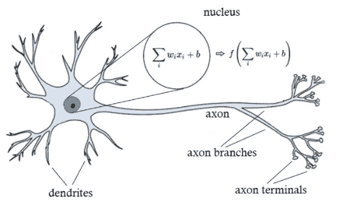

图 2:一个生物神经元

生物神经元从“树突”获得各种输入，然后在细胞核中对每个神经元的权重和输入进行求和，并加上偏差。

**2。什么是人工神经网络(ANN)？**

*   人工神经网络是受构成动物大脑的生物神经网络启发的计算系统。
*   人工神经网络是基于称为人工神经元的连接单元或节点的集合，它松散地模拟生物大脑中的神经元。

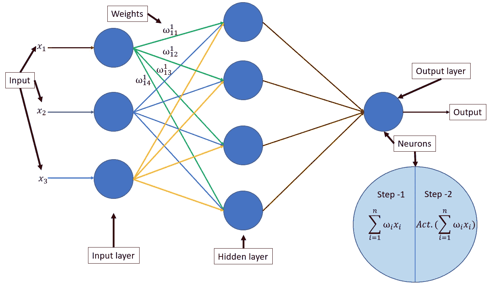

图 1:人工神经网络概述

从神经元和人工神经网络的定义中，我们知道一些术语，如输入、输入层、权值、隐含层、输出层和输出。

## 让我们学一些人工神经网络，

在此之前，我们定义一些**简化假设:**

1.  神经元按层排列，层按顺序排列。
2.  同一层内的神经元之间不传递信息。
3.  所有数据/信息通过输入层进入，信息/输出由输出层输出。
4.  层“l”中的所有神经元都连接到层“l+1”中的所有神经元。
5.  神经网络中的每个互连都有与之关联的权重，每个神经元都有与之关联的偏差。
6.  特定层中的所有神经元使用相同的激活函数。

## —为了演示，

我使用一个简单的神经网络进行二元分类，在输入层有三个神经元，在隐藏层有一个神经元，在输出层有一个神经元，所以我的人工神经网络看起来像这样...

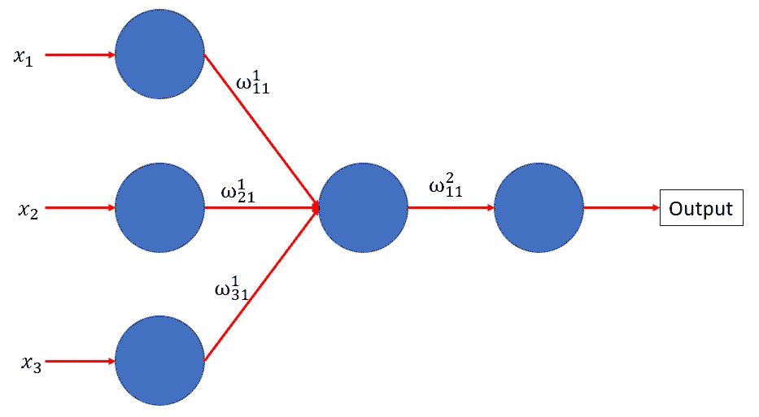

图 3:演示人工神经网络(二元分类)

## 神经元的‣数:

现在，你会问我，你是如何将这些层中的神经元数量作为三个输入，一个隐藏，一个输出。

*   因此，在定义输入层神经元时，考虑神经元的**数量=数据集中的列数。**
*   通过使用**超优化技术**，我们将发现隐藏层中神经元的数量。
*   我们需要来自**二进制分类的两个输出中的一个，因此一个神经元**，如果它是一个**多类分类**我们将采用，**神经元的数量=输出层中的类的数量。**

## ‣重量符号:

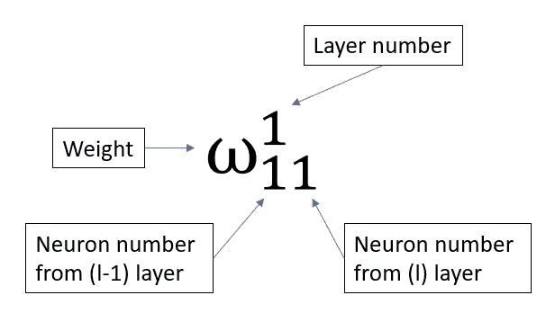

图 4:权重符号

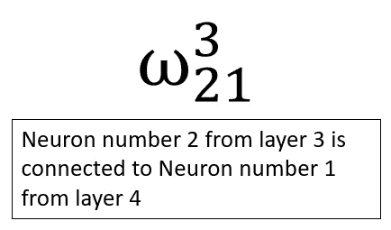

图 4.1:重量连接理解

这就是通常描述重量符号的方式…

回想一下线性回归、逻辑回归、支持向量机等模型。对它们的系数进行训练，即训练是为了找到系数的最佳值以最小化某个成本函数。

神经网络根据权重和偏差进行训练，权重和偏差是网络的参数。

**人工神经网络的超参数或学习算法是在一组固定的超参数上训练的——*层数，输入层的神经元数，隐藏层和输出层*。**

## ‣神经元结构:

从图 1:人工神经网络概述，我们有，

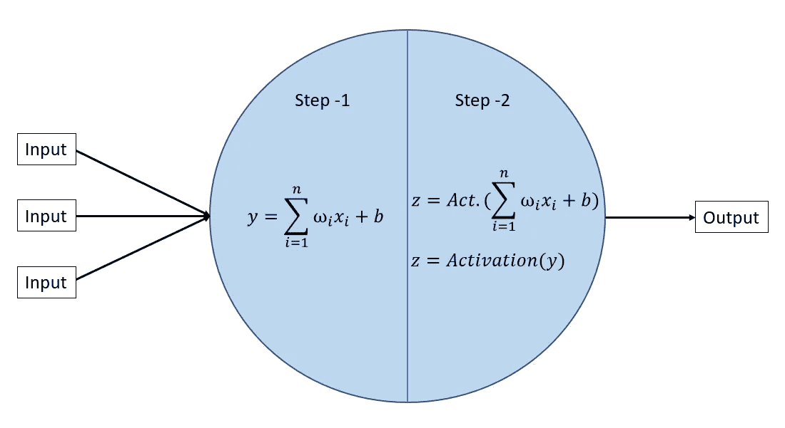

图 5:神经元结构

现在，从图 3:演示安，

*   我们将有三个输入，我们将提供给神经元。
*   步骤-1， **y** = **权重和输入的乘积求和，然后将偏差加到权重和输入的乘积上。**
*   然后，步骤 2，值 **y 被馈送到激活函数，该函数给出神经元的输出值(z)。**
*   类似地，**信息/输出值(z)** 作为输入被馈送到**下一层神经元，**直到输出层。

## ‣ **激活功能:**

我们正在处理一个二元分类问题，因此对于分类，我们将使用 Sigmoid 函数。

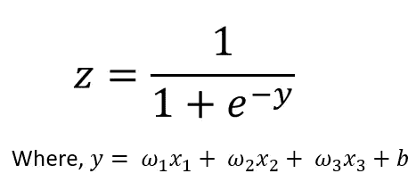

图 6: Sigmoid 函数

## ‣损失函数:

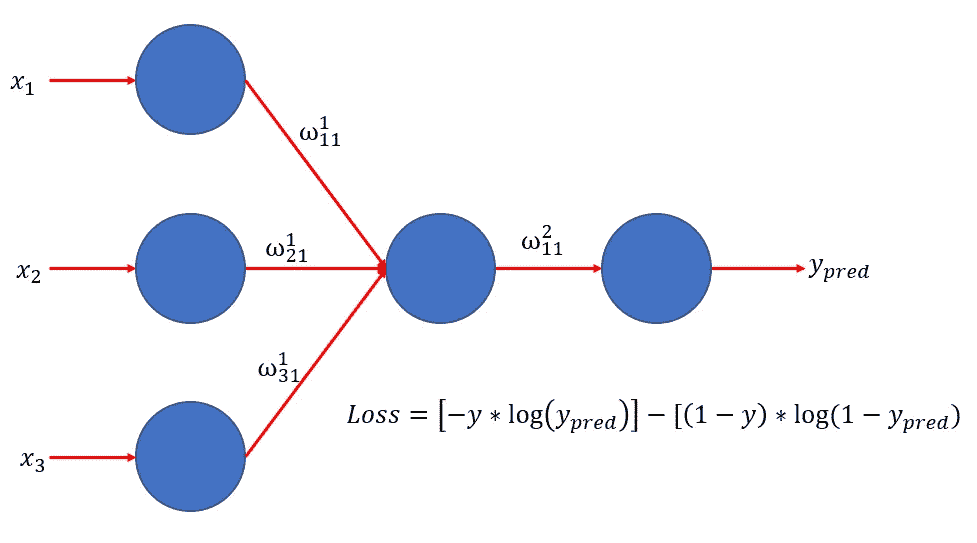

图 7:二进制分类错误

分类中的损失函数，这里是二元交叉熵。

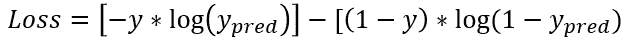

对于二元分类，我们有 y = 0 或 y = 1。

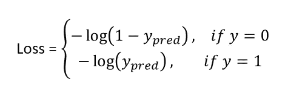

y_pred 由 sigmoid 函数计算，

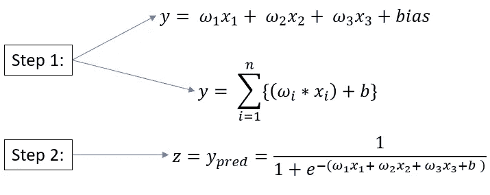

## 这是网络的前向传播。

简单地说，前向传播意味着我们只在一个方向上移动(向前)，从神经网络的输入到输出。

在下一篇博客中，我们将了解带反向传播的神经网络训练。

# 总结:

1.  计算，Z =总和[(权重*输入)+偏差]。
2.  选择激活函数=用于二元分类 sigmoid 函数。
3.  代入“Z”的值，我们会得到 y_pred。
4.  利用二元交叉熵计算损失。

这里，我们学习了人工神经网络的前向传播，接下来我们将学习反向传播。

随着人工神经网络的前向传播和后向传播，我们还需要学习其他激活函数，后向传播中的链规则，消失梯度问题，爆炸梯度问题，丢失，正则化，权重初始化，优化器，损失函数。我们将逐一介绍。

## 参考资料:

*   [https://en.wikipedia.org/wiki/Artificial_neural_network](https://en.wikipedia.org/wiki/Artificial_neural_network)
*   [https://Kris Bolton . com/a-人工神经网络快速介绍-第一部分](https://krisbolton.com/a-quick-introduction-to-artificial-neural-networks-part-1)