# 关于柏林的 Airbnb 业务，你需要了解什么？

> 原文：<https://medium.com/analytics-vidhya/what-do-you-need-to-know-about-the-airbnb-business-in-berlin-a7416d39d138?source=collection_archive---------11----------------------->

图片来自@Mytinaart

Airbnb 的市场份额正在增长。比以往任何时候，你可以成为一个简单的主人或商人。在你选择你的道路之前，你应该问数据。柏林城可以成为你的游乐场。

地下之都揭示了它在卡格尔的秘密。人们可以找到一个巨大的 Airbnb 数据集，其中有 22552 个房源及其 95 个特征，如价格、房间类型、床类型、邻居、主人 id、客人 id…等等。对于所有这些，我们有过去 10 年(2009 年至 2018 年)的 401963 篇评论。最后，在一个日历表中，所谓的“可用性”让我们知道主机在 1 年内(2018 年至 2019 年)何时将他们的家暴露给市场。

我们研究了这个数据集，想知道我们从数据中能得到什么。然后我们把自己想象成主机初学者，想出了以下问题:

1.  客人喜欢什么样的社区？
2.  **什么证明了价格的合理性？**
3.  **职业主持人如何脱颖而出？**
4.  **用哪种语言与客人交流？**

我们试图逐一回答这些问题。让我们一起回顾一下我们的工作。

# **1。客人喜欢什么样的社区？**

俗话说顾客是王道。根据这条黄金法则，应该有更多让客户感到满意的房源，但市场是一个利润问题。是否符合客户的喜好？让我们看看主人是否跟随客人到他们喜欢的任何地方。

在该数据集中，我们有 2255 个列表，由 140 个不同的社区名称和 0 到 10 之间的评论分数位置标记。它反映了客人对这个位置的喜爱程度。我们手里有所有的原料。我们只需要改变它们。

对于每个地区，我们计算列表的数量，并计算相对平均评论分数位置。

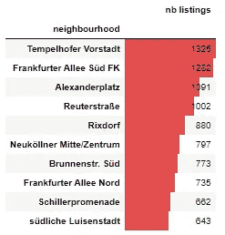

*   房源的数量可以让我们了解房屋的分布情况。

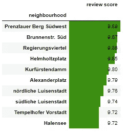

*   平均位置审查分数给出了区域评估的概念。

排序后，我们得到最喜欢的街区的名字。按重要性排序:“普伦茨劳·伯格·西德韦斯特”，“布伦南特”。“南德意志”、“Regierungsviertel”、“亥姆霍兹广场”。除非你来自柏林，否则它没有多大用处。至少，我们意识到，在前 10 名中，只有 4 个社区既密集又受欢迎。

为了了解全局，我们必须将我们的发现投射到 2D 地图上。幸运的是，网上还有另一个 Airbnb 数据集，里面有柏林的虚拟地图。它包含了街区的名称和轮廓。

多亏了邻近区域的名字，我们可以将我们的两个新指标与该区域的轮廓联系起来。现在连接已经建立，我们在 choropleth 地图上表示列表的密度和平均评论分数位置。

> 这是一种专题地图，其中一组预定义的区域按照代表每个区域内地理特征汇总的统计变量的比例进行着色或图案化。

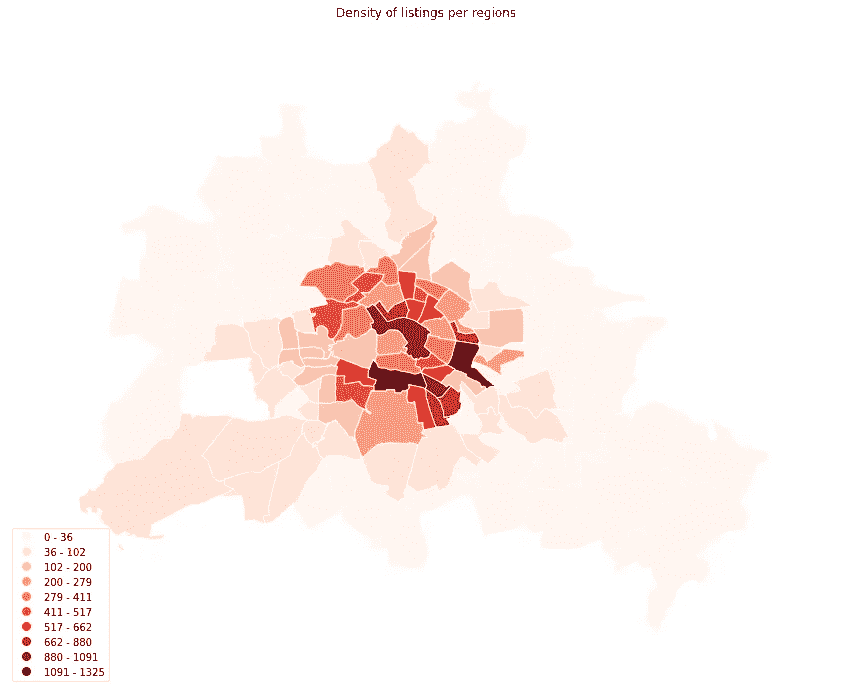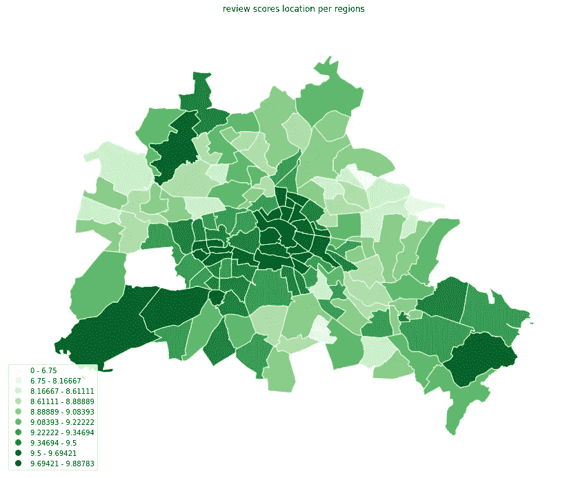

颜色越深，指标越强。重要的是要注意颜色范围不是线性的。该范围由费希尔詹克斯算法确定。这是一种数据聚类方法，旨在确定不同类中值的最佳排列。给定 10 个类别，它会找到自然中断的位置。

红色地图(左侧)表示每个社区的列表密度，而绿色地图(右侧)表示每个地区的平均点评分数。并排展示，哪里有优惠，哪里有客人满意。

不出意外的话，这些清单满足了柏林环内市中心客人的偏好——那里有公共交通运营。报价高，客人喜欢。评论分数在市中心以外的地方被否决。在城市的边缘，北部、东南部和西南部的一些社区显示出可观的评价分数。仔细观察这些区域会发现它们靠近湖泊。

客人喜欢价格高的市中心。原来他们也喜欢待在市郊。

# **2。价格的合理性是什么？**

T4:米饭可能很难辨认。东道主自己可能很难找到一个公平的价格。作为回报，客人有时会不同意，并让他们知道好评或差评。这是调查价格背后隐藏着什么的有效理由。有各种各样的原因，但我们只有 94 个功能(列)的每个列表。第 95 个特点是价格本身。让我们看看它们是如何相互关联的。

**相关性分析**

相关性这个词说明了一切。这是一种数学运算，测量两个变量相对移动的程度。这种技术的使用假设我们处理的是数字数据，因此我们必须去除分类数据，并在可能的情况下估算缺失值。清理之后，我们只剩下 43 个特征。

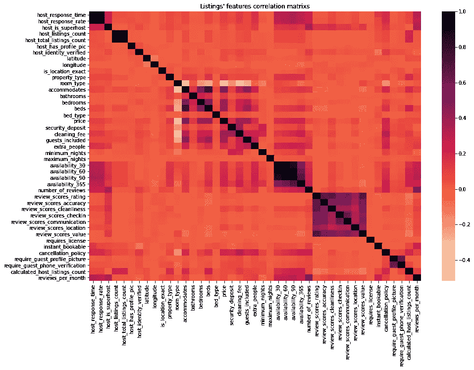

所有列表中的特征的成对相关产生了被称为相关矩阵的矩阵。矩阵是关于对角线对称的。表格中的每个单元格显示了两个变量之间的相关性。在热图表示中，颜色由相关性的大小来调整。

越暗，相关性越强。对角线之所以这么暗，是因为它刻画了一个特征与自身的相关系数。不能再好了。像评论分数这样的其他特征是彼此相关的，因为它们在相遇时会变暗。

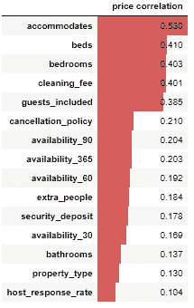

我们感兴趣的是纵坐标对应价格的线。沿着这条线，我们寻找最暗的方块。

这不是很清楚，所以我们把这一行转换成一个表格，并按系数排序。我们注意到 3 种不同的相关强度。

在极点的位置上，我们发现这个家可以容纳多少人。根据第二组调查，价格随着床位、卧室和入住客人的数量而变化。第三组列出了相关性较低的特征。在那里，取消政策和可用性是第一位的。

相关性分析表明，价格波动取决于实际特点，如家庭的能力，设施和清洁费。

**机器学习分析**

还有另一种优雅的方式来理解什么特性影响定价。这个想法包括建立一个机器学习模型，根据所有其他给定的特征来预测价格。在训练时，模型应该理解数据之间的潜在相关性以及它们如何影响价格。之后，我们将尝试确定哪些特征与他最相关。

对于这个回归问题，我们使用一个用梯度推进回归器优化的决策树集合。该模型实现了在训练数据(17606 个输入)上以 5 美元的误差来预测价格，而在测试数据(4402 个输入)上以 13.5 美元的误差来预测价格。误差仍然很高，但是我们认为知道什么特征重要就足够了。如何？我们必须首先对特征重要性进行评分。

2 种方法:

*   **开放:**决策树模型是显式的。特征重要性分数是决策树学习过程所固有的。它用于了解哪些特性对于分支是重要的。
*   **关闭:**它将模型作为一个黑盒来处理。这种方法因其工作原理而被称为排列法。当一个要素的值反复交换时，模型会尝试进行预测。如果预测完全错误，那么模型很大程度上依赖于该特征，否则就不是。

在这两种情况下，分数越高，特性越重要。让我们来看看前 15 名:

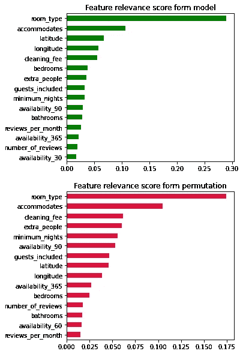

.

这两种方法都认同价格预测中最重要的两个特征:房间类型和可以容纳的人数。到目前为止，这与相关性分析相吻合。

第一种方法特别重视位置(纬度和经度)。这是有道理的，但这是新事物。对于以下特征，该模型挑选了最相关的特征。再次，我们找到卧室，清洁费，并包括客人。

与第一种方法相比，第二种方法确认了相同特征的重要性，但顺序不同。我们发现的不是职位，而是清洁费、额外的人力成本和最低住宿天数。

在机器学习和相关性分析中，可用性特征不是非常重要，而是经常性的。它们(30，60，90，365)彼此之间有很强的相关性，所以它们对价格的影响是相当的。它们应该作为一个整体来考虑。似乎这个变量背后的概念对价格有影响。

**价格先看房型，再看家里容量。这两个特点是不可否认的。设备和清洁费用很高，额外的人员和位置也很重要。可用性的影响尚未完全确定，但值得进一步研究。令人惊讶的是，复习成绩不见了。**

# **3。专业主持人如何脱颖而出？**

不幸的是，没有直接指向专业列表的信息。另一方面，对于每个列表，我们知道主持人和他负责的列表总数。

我们从一个简单的假设开始:当主人至少拥有 4 件财产时，列表是专业的。从那里，我们过滤所有的列表，并将它们分成两个不同的组:专业人员和非专业人员。我们计算每组内标准化特征的平均值，并比较输出。这种差异显示了两组之间的特征是如何平衡的。标准化对于在同一尺度上比较所有特征非常重要。

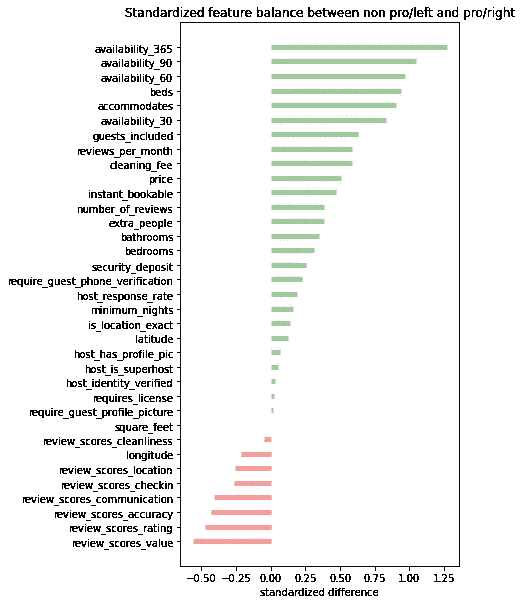

最后，我们可以看到左右两边，非专业列表和专业列表之间的特性是如何平衡的。

专业人士普遍有空，这意味着他们会更频繁地开放日程安排。这可以解释为什么他们有更多的评论。在设施方面，他们有更多的床，浴室，卧室，容纳更多的人。价格更高，还有清洁费和保证金等费用。

专业人士拥有更多的一切，但最引人注目的观察是，所有的评论得分(位置，入住，清洁，沟通)都有利于非专业人士。

到目前为止，我们只关注数字特征，因为它们易于操作和比较。还有很多分类特征。其中一个是房型。在上一章中，我们已经看到了定价的重要性，所以让我们看看专业人士和非专业人士在这一点上有什么不同。

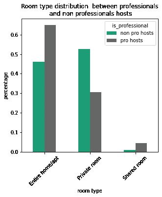

非专业人士租用的整栋房子几乎和私人房间一样多。第一个 46%，第二个 52%。

相比之下，专业人士租用整间公寓的数量是私人房间的两倍。从 30%到 64%。

同时，在整个公寓市场上，专业人士比非专业人士多出了 18%。包间市场的角色颠倒。非专业人士领先 22%。

**职业主持人显然想盈利。他们的策略依赖于数量。他们更经常租更大的房子，更贵，设施更多。质量令人满意(平均评审分数为 8.9/10)，但与其他质量相比相对较差(平均评审分数为 9.4/10)。**

# **4。用哪种语言和客人交流？**

如果能知道客人的国籍就好了，但是信息丢失了。无论如何，交流是超越国界的。人们可以说并理解多种语言，但如果你必须让你的客人听从指示，你会优先使用哪种语言？

我们有一条比国籍更有价值的信息:**点评**。事实上，过去十年我们有 401963 条评论。如果我们设法把它们全部读完并确定语言，我们就能得到问题的答案。然而，阅读这么多评论还需要十年时间。

我们可以使用为检测语言而训练的 NLP 模型。完成这项工作只需要几个小时。它用语言标识符(' en '，' fr '，' de '，…)标记每个评论。然后，统计每个类别中有多少评论变得非常容易。

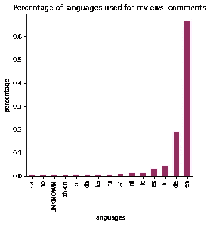

.

总共有 43 种语言。该分布是准指数分布。英语以 66%的比例遥遥领先于其他语言。德语屈居第二，仅占 19%。从这两个数字，我们得出结论，客人主要是国际人士。

法语和西班牙语分别以 4%和 3%位居第三和第四。

仅用 4 种语言，就能保证与 90%的客人沟通。

现在让我们看看不同的语言在一年中是如何分布的。我们将连续 8 年(从 2010 年初到 2018 年初)合并为一年。

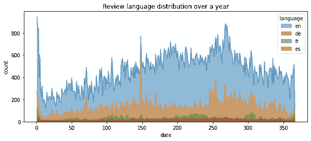

英语每天都占主导地位。与其他语言不同，它变化很大，而其他语言在小范围内保持较低水平。英语缓慢上升，并在夏季保持相当高和稳定。九月底的高峰结束了这个季节。它慢慢减少，直到年底。新的一年从高峰开始，周而复始。

五月底德语和英语比赛。两者都呈现非常高的峰值。在网上快速浏览后，人们可以找到一场与 Pyronale(烟火比赛)的比赛。德国在九月和十月高于正常水平。

法语表现出循环的行为。它随着季节的变化而上下波动。

在柏林，英语是必须的。德语显然很重要，但却是第二位的。其余的语言是可选的。根据季节可以考虑法语。

# 摘要

在本文中，我们试图从数据中回答 4 个问题。

1.  客人比较喜欢什么小区？ **客人可以享受市中心和一些有湖泊的郊区。**
2.  价格的合理性是什么？ **价格主要取决于房型和房屋容量。清洁费，额外的客人，位置也有影响。出人意料的是，复习分数没有影响。**
3.  专业主持人如何脱颖而出？ **他们为更多的客人出租更大的房子，但他们的点评分数却没那么好。**
4.  用哪种语言和客人交流？最重要的语言肯定是英语和德语。法语不可忽视。

如果你不得不涉足 Airbnb 业务，你会说这些数据值得一看吗？