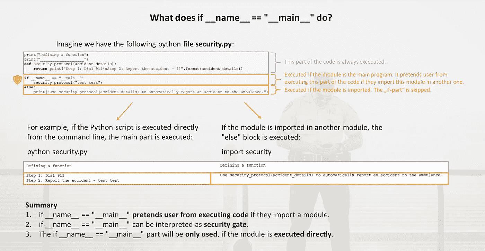

# if __name__ == "__main__ "在 2 分钟内会做什么

> 原文：<https://medium.com/analytics-vidhya/what-does-if-name-main-do-in-2-minutes-299baafb2396?source=collection_archive---------0----------------------->

## 一个广泛使用的概念的简短解释

作者摘要|背景图片由 [Zachary Lisko](https://unsplash.com/@liskozac?utm_source=unsplash&utm_medium=referral&utm_content=creditCopyText) 在 [Unsplash](https://unsplash.com/s/photos/bodyguard?utm_source=unsplash&utm_medium=referral&utm_content=creditCopyText) 上提供

## 如果 __name__ 是保镖

如果 __name__ == "__main__ "用于**保护用户不意外执行另一个模块**的代码。假设您正在创建一个在紧急情况下自动执行某些步骤的安全协议: