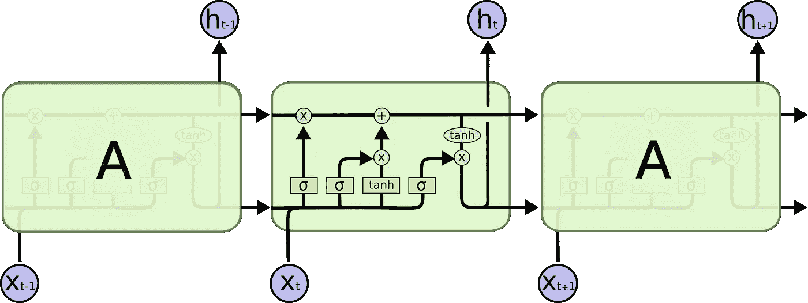
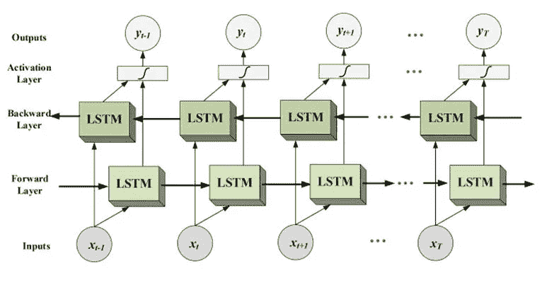
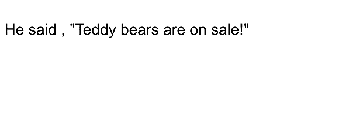

# 双向 LSTM 是什么意思？

> 原文：<https://medium.com/analytics-vidhya/what-does-it-mean-by-bidirectional-lstm-63d6838e34d9?source=collection_archive---------8----------------------->

这改变了旧的方法，从两个方向输入，这样它就能记住长序列。

在我之前的文章中，我们讨论了 RNN、LSTM 和格鲁。现在，LSTM 仍然存在一定的局限性，因为它不能在更长的时间内记住上下文。



来自:[http://colah.github.io/posts/2015-08-Understanding-LSTMs/](http://colah.github.io/posts/2015-08-Understanding-LSTMs/)LSTM 的顺序处理

您可以在这个 LSTM 体系结构中看到，信息仍然需要通过更长的路径传递。引入 LSTM 和 GRU 来克服消失梯度和顺序数据存储的问题，但是两者的结构都具有多个顺序路径。因此，消失梯度问题仍然存在。此外，LSTM 和 GRU 可以记住 10 和 100 的序列，但不能记住 1000 或更多。

**双向网络**

现在，当我们处理长序列数据时，模型也需要学习未来和过去单词之间的关系。我们需要以那种方式发送数据。为了解决这个问题，引入了双向网络。我们可以使用双向网络与 LSTM 和 RNN，但由于的限制

在双向 LSTM 中，我们从从右到左和从左到右两个方向给出输入。**请注意，这不是反向传播，这只是来自两边的输入。**因此，问题是如果我们有 2 个输入，数据如何组合成输出。



通常，在正常的 LSTM 网络中，我们直接获取输出，如图 1 所示，但是在双向 LSTM 网络中，每一级的前向和后向层的输出被提供给作为神经网络的激活层，并且考虑该激活层的输出。这个输出也包含过去和未来单词的信息或关系。

让我们举个例子，假设我们有这样一个句子



这里我们不能用普通的 RNN 网络预测下一个字，但是这可以在双向 RNN 网络中解决。此外，RNN 网络可以是 LSTM 或格鲁

**双向 RNN 在 Tensorflow(Keras)上的实现**

Tensorflow 实现

```
# Import Necessary Libraries
import pandas as pd
import numpy as np
from sklearn.model_selection import train_test_split
from sklearn.metrics import confusion_matrix,accuracy_score
import tensorflow
from tensorflow.keras.layers import Embedding,LSTM,Dense,Bidirectional
from tensorflow.keras.preprocessing.sequence import pad_sequences
from tensorflow.keras.preprocessing.text import one_hot
from tensorflow.keras.models import Sequential
import nltk
import re
from nltk.corpus import stopwords
from nltk.stem.porter import PorterStemmer# Load the dataset 
dataset can be found on kaggle Fake news classifier data [https://www.kaggle.com/c/fake-news/data#](https://www.kaggle.com/c/fake-news/data#)data = pd.read_csv('train.csv')
# check how many values are none and we have to drop it.
data.isnull().sum(axis=0)
```

结果我们会得到低于 null 的值，所以我们需要删除它。

```
id           0
title      558
author    1957
text        39
label        0
dtype: int64df = data.dropna()
```

我们已经删除了所有的空值，这样就不会影响模型的准确性。现在我们将 X 和 Y 定义为自变量和因变量

```
x = df.drop(‘label’,axis=1)
y = df[‘label’]
```

现在，NLP 的关键部分是文本预处理，我们使用 NLTK 库对自变量进行预处理。我们将使用 re 库来删除标点符号，然后我们将从停用字词列表中传递数据，然后对数据进行词干处理。

```
sentences = x.copy()
sentences.reset_index(inplace=True)
nltk.download('stopwords')ps = PorterStemmer()
corpus = []
for i in range(0, len(sentences)):
    review = re.sub('[^a-zA-Z]', ' ', sentences['title'][i])
    review = review.lower()
    review = review.split()
    review = [ps.stem(word) for word in review if not word in stopwords.words('english')]
    review = ' '.join(review)
    corpus.append(review)#here we can see that corpus contains the words after preprocessing done.
corpus[:10]['hous dem aid even see comey letter jason chaffetz tweet',
 'flynn hillari clinton big woman campu breitbart',
 'truth might get fire',
 'civilian kill singl us airstrik identifi',
 'iranian woman jail fiction unpublish stori woman stone death adulteri',
 'jacki mason hollywood would love trump bomb north korea lack tran bathroom exclus video breitbart',
 'beno hamon win french socialist parti presidenti nomin new york time',
 'back channel plan ukrain russia courtesi trump associ new york time',
 'obama organ action partner soro link indivis disrupt trump agenda',
 'bbc comedi sketch real housew isi caus outrag']
```

现在我们将对数据进行热编码，因为我们有单词列表，我们将得到索引 w.r.t vocab_size

```
vocab_size = 5000
onehot = [one_hot(words,vocab_size) for words in corpus]
onehot[:10]3090, 3921, 277, 3803, 561, 2494, 2349],
 [792, 2085, 3099, 206],
 [1083, 2836, 2939, 3433, 2700, 2344],
 [4308, 561, 750, 666, 2017, 2368, 561, 415, 869, 208],
 [4623,
  3529,
  4621,
  2659,
  3924,
  4115,
  2845,
  2475,
  4603,
  4988,
  1575,
  959,
  92,
  1630,
  2349],
 [4348, 1735, 189, 352, 3582, 757, 60, 4393, 373, 1561, 684],
 [1554, 61, 1640, 1548, 2048, 1673, 4115, 2910, 373, 1561, 684],
 [2484, 2659, 3720, 3690, 509, 4227, 4554, 310, 4115, 1168],
 [653, 1048, 646, 2146, 2026, 1062, 3558, 4097]]
```

下一步是填充，因为我们的句子大小不同，所以我们必须做填充，使它们长度相等。我们可以使用前置或后置填充。

```
length = 30
embedding = pad_sequences(onehot,maxlen=length,padding=’pre’)
embedding[:10]array([[   0,    0,    0,    0,    0,    0,    0,    0,    0,    0,    0,
           0,    0,    0,    0,    0,    0,    0,    0,    0, 1076, 2004,
        3855, 3964, 1251, 1177, 2432, 4548, 4821, 3157],
       [   0,    0,    0,    0,    0,    0,    0,    0,    0,    0,    0,
           0,    0,    0,    0,    0,    0,    0,    0,    0,    0,    0,
           0, 3090, 3921,  277, 3803,  561, 2494, 2349],
       [   0,    0,    0,    0,    0,    0,    0,    0,    0,    0,    0,
           0,    0,    0,    0,    0,    0,    0,    0,    0,    0,    0,
           0,    0,    0,    0,  792, 2085, 3099,  206],
       [   0,    0,    0,    0,    0,    0,    0,    0,    0,    0,    0,
           0,    0,    0,    0,    0,    0,    0,    0,    0,    0,    0,
           0,    0, 1083, 2836, 2939, 3433, 2700, 2344],
       [   0,    0,    0,    0,    0,    0,    0,    0,    0,    0,    0,
           0,    0,    0,    0,    0,    0,    0,    0,    0, 4308,  561,
         750,  666, 2017, 2368,  561,  415,  869,  208],
       [   0,    0,    0,    0,    0,    0,    0,    0,    0,    0,    0,
           0,    0,    0,    0, 4623, 3529, 4621, 2659, 3924, 4115, 2845,
        2475, 4603, 4988, 1575,  959,   92, 1630, 2349],
       [   0,    0,    0,    0,    0,    0,    0,    0,    0,    0,    0,
           0,    0,    0,    0,    0,    0,    0,    0, 4348, 1735,  189,
         352, 3582,  757,   60, 4393,  373, 1561,  684],
       [   0,    0,    0,    0,    0,    0,    0,    0,    0,    0,    0,
           0,    0,    0,    0,    0,    0,    0,    0, 1554,   61, 1640,
        1548, 2048, 1673, 4115, 2910,  373, 1561,  684],
       [   0,    0,    0,    0,    0,    0,    0,    0,    0,    0,    0,
           0,    0,    0,    0,    0,    0,    0,    0,    0, 2484, 2659,
        3720, 3690,  509, 4227, 4554,  310, 4115, 1168],
       [   0,    0,    0,    0,    0,    0,    0,    0,    0,    0,    0,
           0,    0,    0,    0,    0,    0,    0,    0,    0,    0,    0,
         653, 1048,  646, 2146, 2026, 1062, 3558, 4097]])
```

从以上所有输出中，我们可以看到我们的句子是如何为 LSTM 输入进行预处理的。现在我们可以实现模型来训练我们的数据。

```
embedding_vector_features = 40
model = Sequential()
model.add(Embedding(vocab_size,embedding_vector_features,input_length=length))
model.add(Bidirectional(LSTM(100)))
model.add(Dense(1,activation=’sigmoid’))
model.compile(loss=’binary_crossentropy’,optimizer=’adam’,metrics=[‘accuracy’])
print(model.summary())# Model Summary 
Model: "sequential"
_________________________________________________________________
Layer (type)                 Output Shape              Param #   
=================================================================
embedding (Embedding)        (None, 30, 40)            200000    
_________________________________________________________________
bidirectional (Bidirectional (None, 200)               112800    
_________________________________________________________________
dense (Dense)                (None, 1)                 201       
=================================================================
Total params: 313,001
Trainable params: 313,001
Non-trainable params: 0
_________________________________________________________________
None#Split the data into training and testing datasetX = np.array(embedding)
Y = np.array(y)
X_train,X_test,y_train,y_test = train_test_split(X,Y,test_size=0.33,random_state=42)
model.fit(X_train,y_train,batch_size=64,epochs=20,validation_data=(X_test,y_test))
```

在 20 个纪元后训练，我得到了下面的结果。

```
Epoch 1/20
192/192 [==============================] - 9s 45ms/step - loss: 0.3227 - accuracy: 0.8448 - val_loss: 0.2034 - val_accuracy: 0.9152
Epoch 2/20
192/192 [==============================] - 8s 39ms/step - loss: 0.1433 - accuracy: 0.9411 - val_loss: 0.1821 - val_accuracy: 0.9238
Epoch 3/20
192/192 [==============================] - 8s 44ms/step - loss: 0.0897 - accuracy: 0.9668 - val_loss: 0.2037 - val_accuracy: 0.9218
Epoch 4/20
192/192 [==============================] - 10s 54ms/step - loss: 0.0573 - accuracy: 0.9803 - val_loss: 0.2556 - val_accuracy: 0.9193
Epoch 5/20
192/192 [==============================] - 10s 52ms/step - loss: 0.0307 - accuracy: 0.9903 - val_loss: 0.3273 - val_accuracy: 0.9158
Epoch 6/20
192/192 [==============================] - 9s 49ms/step - loss: 0.0170 - accuracy: 0.9956 - val_loss: 0.3483 - val_accuracy: 0.9168
Epoch 7/20
192/192 [==============================] - 9s 47ms/step - loss: 0.0138 - accuracy: 0.9950 - val_loss: 0.4654 - val_accuracy: 0.9099
Epoch 8/20
192/192 [==============================] - 10s 55ms/step - loss: 0.0066 - accuracy: 0.9980 - val_loss: 0.5041 - val_accuracy: 0.9117
Epoch 9/20
192/192 [==============================] - 11s 58ms/step - loss: 0.0063 - accuracy: 0.9987 - val_loss: 0.5213 - val_accuracy: 0.9100
Epoch 10/20
192/192 [==============================] - 14s 72ms/step - loss: 0.0042 - accuracy: 0.9989 - val_loss: 0.5411 - val_accuracy: 0.9079
Epoch 11/20
192/192 [==============================] - 14s 73ms/step - loss: 0.0053 - accuracy: 0.9984 - val_loss: 0.5063 - val_accuracy: 0.9122
Epoch 12/20
192/192 [==============================] - 13s 68ms/step - loss: 0.0056 - accuracy: 0.9980 - val_loss: 0.5529 - val_accuracy: 0.9087
Epoch 13/20
192/192 [==============================] - 13s 65ms/step - loss: 0.0054 - accuracy: 0.9982 - val_loss: 0.5330 - val_accuracy: 0.9095
Epoch 14/20
192/192 [==============================] - 13s 69ms/step - loss: 0.0021 - accuracy: 0.9995 - val_loss: 0.5599 - val_accuracy: 0.9118
Epoch 15/20
192/192 [==============================] - 11s 55ms/step - loss: 2.7169e-04 - accuracy: 1.0000 - val_loss: 0.6287 - val_accuracy: 0.9099
Epoch 16/20
192/192 [==============================] - 10s 51ms/step - loss: 1.1285e-04 - accuracy: 1.0000 - val_loss: 0.6487 - val_accuracy: 0.9097
Epoch 17/20
192/192 [==============================] - 11s 58ms/step - loss: 8.3286e-05 - accuracy: 1.0000 - val_loss: 0.6669 - val_accuracy: 0.9097
Epoch 18/20
192/192 [==============================] - 9s 48ms/step - loss: 6.5950e-05 - accuracy: 1.0000 - val_loss: 0.6818 - val_accuracy: 0.9092
Epoch 19/20
192/192 [==============================] - 9s 49ms/step - loss: 5.4030e-05 - accuracy: 1.0000 - val_loss: 0.6961 - val_accuracy: 0.9090
Epoch 20/20
192/192 [==============================] - 11s 59ms/step - loss: 4.4982e-05 - accuracy: 1.0000 - val_loss: 0.7104 - val_accuracy: 0.9094
```

我们最终可以在测试数据上测试我们的模型，并且可以检查混淆矩阵。

```
y_pred=model.predict_classes(X_test)
CM = confusion_matrix(y_test,y_pred)
score = accuracy_score(y_test,y_pred)
print(CM)
print(score)[[3122  297]
 [ 250 2366]]
0.9093620546810274
```

我们有 90%的准确率。然而，我们可以通过处理不同的参数来提高这种准确性，如 vocab_size、句子长度、LSTM 层大小、时期数。

**参考**

# 参考

[1] S. Hochreiter，J. Schmidhuber，[长短期记忆](https://www.researchgate.net/publication/13853244_Long_Short-term_Memory) (1997)，神经计算

[2]http://colah.github.io/posts/2015-08-Understanding-LSTMs/

[3][https://www.youtube.com/watch?v=MXPh_lMRwAI&list = plzotaelrmxvmdj 5 sqbck 2 lim 0 hhqvwnzm&index = 22](https://www.youtube.com/watch?v=MXPh_lMRwAI&list=PLZoTAELRMXVMdJ5sqbCK2LiM0HhQVWNzm&index=22)

[https://medium.com/@raghavaggarwal0089/bi-lstm-bc3d68da8bd0](/@raghavaggarwal0089/bi-lstm-bc3d68da8bd0)