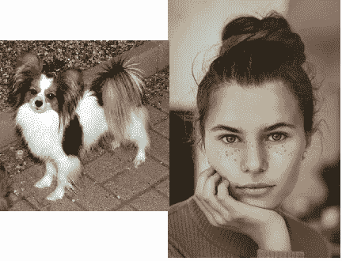

# 我是什么品种的狗？

> 原文：<https://medium.com/analytics-vidhya/what-dog-breed-am-i-851240060b68?source=collection_archive---------10----------------------->

## 使用深度学习的人或狗图像的狗品种分类

## 问题陈述

这个项目的想法是双重的。

*   一个是识别传递给算法的图像中是否有狗，并对狗的种类进行分类。
*   其次，如果图像中没有狗，但有人类，那么算法必须将人类的面部分类为目标标签中最接近的可能物种。

## 战略已实施

使用 CNN 训练神经网络模型。卷积神经网络(CNN)是一种广泛用于图像识别和分类的神经网络。我们使用 CNN 实现了两种架构，一种是具有 3 个 conv2d 层的朴素卷积网络，另一种架构是 resnet50，其最后几层(迁移学习)经过修改以适合该问题。



使用右图像作为输入的模型的性能，以及模型分类为的标签的示例之一。右图像源 unsplash.com

## 数据

这个项目是为我的 Udacity 数据科学家纳米学位。数据由 Udacity 提供给我们。数据包含

```
133 total dog categories.
8351 total dog images.

6680 training dog images.
835 validation dog images.
836 test dog images.
```

我们也有人脸检测的人类图像。

```
13233 total human images.
```

## 系统模型化

**人脸检测**

对于人脸检测，我们将使用 OpenCV 的[哈尔级联。](http://docs.opencv.org/trunk/d7/d8b/tutorial_py_face_detection.html)

```
face_cascade = cv2.CascadeClassifier(‘haarcascades/haarcascade_frontalface_alt.xml’)
```

我们为面部检测创建了一个函数，以便在代码的不同部分使用它。这个函数接收一个图像路径，检查图像是否有一个或多个人脸，并返回 True 或 False。

```
def face_detector(img_path):
    img = cv2.imread(img_path)
    gray = cv2.cvtColor(img, cv2.COLOR_BGR2GRAY)
    faces = face_cascade.detectMultiScale(gray)
    return len(faces) > 0
```

**警犬探测**

现在，我们已经完成了面部检测，我们想看看我们的图像是否有狗。为了检测狗，我们将使用一个预先训练的 resnet50。

```
def ResNet50_predict_labels(img_path):
    # returns prediction vector for image located at img_path
    img = preprocess_input(path_to_tensor(img_path))
    return np.argmax(ResNet50_model.predict(img))
def dog_detector(img_path):
    prediction = ResNet50_predict_labels(img_path)
    return ((prediction <= 268) & (prediction >= 151))
```

狗检测器函数获取图像并调用 ResNet50_predict_labels 函数，该函数使用 ResNet50 模型来预测图像的标签。如果图像包含一只狗，返回的标签的索引将在 151 和 268 之间(包括 151 和 268)。你可以在这里查看 resnet50 可以预测的所有标签的索引[。](https://gist.github.com/yrevar/942d3a0ac09ec9e5eb3a)

我们现在可以从图像中检测到人和狗。下一步是训练一个深度学习模型，用于对狗的品种进行分类。但在此之前，我们必须确保我们所有的图像在所有像素上都是一致的。所以我们把所有这些图片除以 255 来重新调整比例

```
train_tensors = paths_to_tensor(train_files).astype('float32')/255
valid_tensors = paths_to_tensor(valid_files).astype('float32')/255
test_tensors = paths_to_tensor(test_files).astype('float32')/255
```

**模型架构**

我们创建了两个模型。一个从零开始使用基本的朴素架构，另一个我们使用预训练的 resnet50 模型，并添加了一些层来适应我们的问题。

**朴素的建筑**

我们先来看看幼稚的架构。

```
model = Sequential(
 [

 Conv2D(16,(2,2), activation=’relu’, input_shape=(224,224,3)),
 Dropout(0.3),
 MaxPooling2D((2,2)),
 Conv2D(32,(2,2), activation=’relu’),
 Dropout(0.3),
 MaxPooling2D((2,2)),
 Conv2D(64,(2,2), activation=’relu’),
 Dropout(0.3),
 MaxPooling2D((2,2)),
 Flatten(),
 Dense(133, activation=’relu’)

 ])
```

我们有 2 维卷积层，下降和最大池层。接近尾声时，我们有一个扁平化层之前，我们应用密集层，以获得图像的输出标签。

**Resnet50 架构**

我们将在下面的测试部分展示朴素架构的表现。但在此之前，我们将看看我们将训练的另一个模型，由于其复杂的结构和层数，该模型将表现得更好。这可能不总是正确的，但在这种情况下，它会表现得更好。让我们来看看我们可以添加到 resnet 50 模型中的内容，以便针对我们的问题对其进行定制。

我们首先加载已经为这个特定数据编译的瓶颈特性。您可以下载。npz 文件如下图所示[此处](https://s3-us-west-1.amazonaws.com/udacity-aind/dog-project/DogResnet50Data.npz)。

```
bottleneck_features = np.load('bottleneck_features/DogResnet50Data.npz')
train_Resnet50 = bottleneck_features['train']
valid_Resnet50 = bottleneck_features['valid']
test_Resnet50 = bottleneck_features['test']
```

为了定义我们想要在此模型末尾添加的层，我们将创建一个顺序模型。

```
Resnet50_model = Sequential()
Resnet50_model.add(GlobalAveragePooling2D(input_shape=train_Resnet50.shape[1:]))
Resnet50_model.add(Dense(133, activation='softmax'))
```

我们编译并适应我们的架构。让我们来看看他们的个人表现。

## 结果

**朴素的建筑**

我们训练朴素架构 5 个时代。下面是模型的训练细节。

```
Train on 6680 samples, validate on 835 samples
Epoch 1/5
6660/6680 [============================>.] - ETA: 0s - loss: 15.4370 - acc: 0.0104Epoch 00001: val_loss improved from inf to 15.75039, saving model to saved_models/weights.best.from_scratch.hdf5
6680/6680 [==============================] - 30s 5ms/step - loss: 15.4390 - acc: 0.0103 - val_loss: 15.7504 - val_acc: 0.0132
Epoch 2/5
6660/6680 [============================>.] - ETA: 0s - loss: 15.5520 - acc: 0.0120Epoch 00002: val_loss did not improve
6680/6680 [==============================] - 29s 4ms/step - loss: 15.5514 - acc: 0.0121 - val_loss: 15.7563 - val_acc: 0.0084
Epoch 3/5
6660/6680 [============================>.] - ETA: 0s - loss: 15.2091 - acc: 0.0143Epoch 00003: val_loss improved from 15.75039 to 15.02195, saving model to saved_models/weights.best.from_scratch.hdf5
6680/6680 [==============================] - 29s 4ms/step - loss: 15.2070 - acc: 0.0142 - val_loss: 15.0220 - val_acc: 0.0144
Epoch 4/5
6660/6680 [============================>.] - ETA: 0s - loss: 15.5074 - acc: 0.0078Epoch 00004: val_loss did not improve
6680/6680 [==============================] - 31s 5ms/step - loss: 15.5093 - acc: 0.0078 - val_loss: 16.0409 - val_acc: 0.0048
Epoch 5/5
6660/6680 [============================>.] - ETA: 0s - loss: 16.0358 - acc: 0.0051Epoch 00005: val_loss did not improve
6680/6680 [==============================] - 32s 5ms/step - loss: 16.0361 - acc: 0.0051 - val_loss: 16.0409 - val_acc: 0.0048
```

当用以前看不到的数据测试时，朴素的架构导致 1.4%的测试准确度。老实说是不能用的。我们来看看 resnet50 机型表现如何。

**Resnet50 架构**

我们为这个模型训练了 20 个时期。下面是训练输出。与之前的模型相比，该模型在测试数据上的性能要高得多。我们能够在以前看不到的数据上看到 81.3%的准确性，这是一个相当大的飞跃。

(下面的训练过程显示了前 5 个和后 5 个时期，以免本文篇幅过长。)

```
Train on 6680 samples, validate on 835 samples
Epoch 1/20
6540/6680 [============================>.] - ETA: 0s - loss: 1.6424 - acc: 0.6009Epoch 00001: val_loss improved from inf to 0.77969, saving model to saved_models/weights.best.Resnet50.hdf5
6680/6680 [==============================] - 2s 270us/step - loss: 1.6224 - acc: 0.6049 - val_loss: 0.7797 - val_acc: 0.7593
Epoch 2/20
6560/6680 [============================>.] - ETA: 0s - loss: 0.4371 - acc: 0.8623Epoch 00002: val_loss improved from 0.77969 to 0.66353, saving model to saved_models/weights.best.Resnet50.hdf5
6680/6680 [==============================] - 1s 224us/step - loss: 0.4381 - acc: 0.8620 - val_loss: 0.6635 - val_acc: 0.8036
Epoch 3/20
6460/6680 [============================>.] - ETA: 0s - loss: 0.2664 - acc: 0.9150Epoch 00003: val_loss did not improve
6680/6680 [==============================] - 1s 224us/step - loss: 0.2628 - acc: 0.9160 - val_loss: 0.6948 - val_acc: 0.7820
Epoch 4/20
6540/6680 [============================>.] - ETA: 0s - loss: 0.1775 - acc: 0.9462Epoch 00004: val_loss improved from 0.66353 to 0.64685, saving model to saved_models/weights.best.Resnet50.hdf5
6680/6680 [==============================] - 1s 224us/step - loss: 0.1784 - acc: 0.9460 - val_loss: 0.6468 - val_acc: 0.8156
Epoch 5/20
6440/6680 [===========================>..] - ETA: 0s - loss: 0.1243 - acc: 0.9632Epoch 00005: val_loss did not improve
6680/6680 [==============================] - 1s 223us/step - loss: 0.1243 - acc: 0.9623 - val_loss: 0.6880 - val_acc: 0.8120...Epoch 16/20
6620/6680 [============================>.] - ETA: 0s - loss: 0.0092 - acc: 0.9980Epoch 00016: val_loss did not improve
6680/6680 [==============================] - 1s 222us/step - loss: 0.0091 - acc: 0.9981 - val_loss: 0.8508 - val_acc: 0.8228
Epoch 17/20
6620/6680 [============================>.] - ETA: 0s - loss: 0.0071 - acc: 0.9982Epoch 00017: val_loss did not improve
6680/6680 [==============================] - 1s 222us/step - loss: 0.0070 - acc: 0.9982 - val_loss: 0.8501 - val_acc: 0.8359
Epoch 18/20
6500/6680 [============================>.] - ETA: 0s - loss: 0.0066 - acc: 0.9980Epoch 00018: val_loss did not improve
6680/6680 [==============================] - 2s 225us/step - loss: 0.0065 - acc: 0.9981 - val_loss: 0.8925 - val_acc: 0.8240
Epoch 19/20
6500/6680 [============================>.] - ETA: 0s - loss: 0.0060 - acc: 0.9983Epoch 00019: val_loss did not improve
6680/6680 [==============================] - 2s 225us/step - loss: 0.0059 - acc: 0.9984 - val_loss: 0.9231 - val_acc: 0.8299
Epoch 20/20
6500/6680 [============================>.] - ETA: 0s - loss: 0.0064 - acc: 0.9980Epoch 00020: val_loss did not improve
6680/6680 [==============================] - 2s 225us/step - loss: 0.0063 - acc: 0.9981 - val_loss: 0.9584 - val_acc: 0.8216
```

## 丰富

对模型的改进可以使其取得更显著的效果。他们中的一些人可以使用

1.  数据扩充
2.  狗的特殊特征
3.  平衡数据集
4.  不同历元数的训练。

我可能还会创建一个网络应用程序，只是为了好玩。所以也期待一下:)

## 结论

这是一个有趣的项目，我感谢 Udacity 让我走了这么远。为了保持博客的最小规模，我添加了最重要的代码部分，这将有助于更好的阅读体验。然而，如果你想自己玩代码。你可以在我的 [Github 简介](https://github.com/ghemareddy97/Capstone-Dog-Identification-App-Udacity)里找到笔记本。如果你有任何意见或问题，我总是喜欢阅读和回答，所以请让我知道你的想法。

P.S .上图是实际分类。右边的人被归类为巴比隆，所以我加了一个可爱的例子。你们觉得这个分类怎么样？