# 你看起来像什么品种？

> 原文：<https://medium.com/analytics-vidhya/what-dog-breed-do-you-look-like-a1ade21c70e6?source=collection_archive---------10----------------------->

你听过狗和主人长得很像的说法吗？让我们看看卷积神经网络是否能看出这一点。

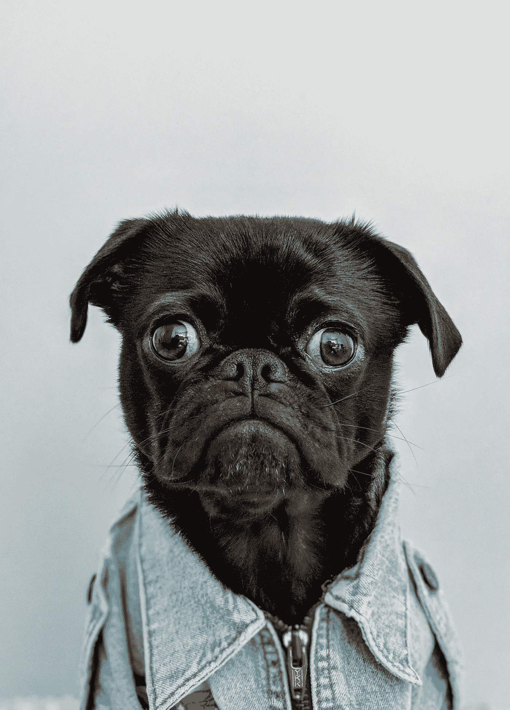

[**等待？…什么？**](https://unsplash.com/photos/K4mSJ7kc0As)

# 项目定义

关于狗和它们主人的有趣事实:根据 BBC[2015 年发表的文章](https://www.bbc.com/future/article/20151111-why-do-dogs-look-like-their-owners)，狗看起来像它们的主人是一个科学事实。如果你花足够的时间在公园散步，你最终会看到一只和它的主人很像的狗。现在，让我们看看深度学习算法是否可以正确识别品种，然后看看它的主人是否真的看起来像他们的狗品种。

我们在这个项目中涉及到两个主要问题。首先，是从传递给神经网络算法的图片中识别它是否是一只狗及其品种。第二，如果它不是一只狗而是一个人，那么预测最接近的狗的品种。

*   为了解决问题的第一部分，我们首先构建一个简单的卷积神经网络(CNN)架构，但这导致了较低的准确性。然后，我们求助于迁移学习方法，使用 [ResNet-50](https://s3-us-west-1.amazonaws.com/udacity-aind/dog-project/DogResnet50Data.npz) 的瓶颈特性，这显著提高了准确性。迁移学习的主要思想是，人们可以很容易地重用预先训练的特征，并用自己的数据重新训练分类部分。
*   对于问题的第二部分，我们使用 OpenCV 实现的[基于 Haar 特征的级联分类器](http://docs.opencv.org/trunk/d7/d8b/tutorial_py_face_detection.html)来检测图像中的人脸。OpenCV 提供了许多预先训练好的人脸检测器，作为 XML 文件存储在 [github](https://github.com/opencv/opencv/tree/master/data/haarcascades) 上。

## 公制的

下面定义了一些指标，这些指标可以由模型计算出来，在评估性能时会有所帮助。

*   **准确度**是正确分类的例子的百分比
*   **假**阴性(FN)和**假**阳性(FP)是被**错误**分类的样本
*   **真**阴性(TN)和**真**阳性(TP)是被**正确**分类的样本
*   **精度**是被正确分类的**预测**阳性的百分比:

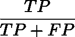

精确

*   **Recall** 是正确分类的**实际**阳性的百分比:

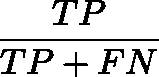

回忆

*   **F1** 是精度和召回率的加权平均值

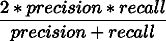

F1 分数

**注意:**由于犬只的等级略有不平衡，准确性对于这个问题并不是一个有用的衡量标准。你可以在这个项目上有 99.8%以上的准确率，只要一直预测错误。因此，为了确保我们对我们的模型做出正确的决策，我们将查看上面提到的所有指标。

# 分析

本项目使用的数据由 Udacity 提供。

总共有 133 种狗。
总共有 8351 张狗的图片。

训练狗图像有 6680 个。
有 835 个验证狗图像。
有 836 张测试狗图片。

还有…

总共有 13233 个人像。

下表显示了每类的一些样本。正如你所看到的，这些班级是不平衡的。其中最低数量的样本对应于挪威 buhund 和 Xoloitzcuintli (33 个样本)，最高数量的样本对应于阿拉斯加雪橇犬(96 个样本)。

```
Index    Breed                                    Number     
1        Affenpinscher                            80        
2        Afghan_hound                             73        
3        Airedale_terrier                         65        
4        Akita                                    79        
5        Alaskan_malamute                         96        
6        American_eskimo_dog                      80        
7        American_foxhound                        63        
8        American_staffordshire_terrier           82        
9        American_water_spaniel                   42        
10       Anatolian_shepherd_dog                   62        
11       Australian_cattle_dog                    83        
12       Australian_shepherd                      83        
13       Australian_terrier                       58        
14       Basenji                                  86        
15       Basset_hound                             92        
16       Beagle                                   74        
17       Bearded_collie                           77        
18       Beauceron                                63        
19       Bedlington_terrier                       60        
20       Belgian_malinois                         78        
21       Belgian_sheepdog                         80        
22       Belgian_tervuren                         59        
23       Bernese_mountain_dog                     81        
24       Bichon_frise                             77        
25       Black_and_tan_coonhound                  46        
26       Black_russian_terrier                    51        
27       Bloodhound                               80        
28       Bluetick_coonhound                       44        
29       Border_collie                            93        
30       Border_terrier                           65        
31       Borzoi                                   70        
32       Boston_terrier                           81        
33       Bouvier_des_flandres                     56        
34       Boxer                                    80        
35       Boykin_spaniel                           66        
36       Briard                                   81        
37       Brittany                                 62        
38       Brussels_griffon                         71        
39       Bull_terrier                             87        
40       Bulldog                                  66        
41       Bullmastiff                              86        
42       Cairn_terrier                            79        
43       Canaan_dog                               62        
44       Cane_corso                               80        
45       Cardigan_welsh_corgi                     66        
46       Cavalier_king_charles_spaniel            84        
47       Chesapeake_bay_retriever                 67        
48       Chihuahua                                68        
49       Chinese_crested                          63        
50       Chinese_shar-pei                         62        
51       Chow_chow                                78        
52       Clumber_spaniel                          61        
53       Cocker_spaniel                           59        
54       Collie                                   71        
55       Curly-coated_retriever                   63        
56       Dachshund                                82        
57       Dalmatian                                89        
58       Dandie_dinmont_terrier                   63        
59       Doberman_pinscher                        59        
60       Dogue_de_bordeaux                        75        
61       English_cocker_spaniel                   76        
62       English_setter                           66        
63       English_springer_spaniel                 66        
64       English_toy_spaniel                      49        
65       Entlebucher_mountain_dog                 53        
66       Field_spaniel                            41        
67       Finnish_spitz                            42        
68       Flat-coated_retriever                    79        
69       French_bulldog                           64        
70       German_pinscher                          59        
71       German_shepherd_dog                      78        
72       German_shorthaired_pointer               60        
73       German_wirehaired_pointer                52        
74       Giant_schnauzer                          51        
75       Glen_of_imaal_terrier                    55        
76       Golden_retriever                         80        
77       Gordon_setter                            54        
78       Great_dane                               50        
79       Great_pyrenees                           74        
80       Greater_swiss_mountain_dog               57        
81       Greyhound                                70        
82       Havanese                                 76        
83       Ibizan_hound                             58        
84       Icelandic_sheepdog                       62        
85       Irish_red_and_white_setter               46        
86       Irish_setter                             66        
87       Irish_terrier                            82        
88       Irish_water_spaniel                      64        
89       Irish_wolfhound                          66        
90       Italian_greyhound                        73        
91       Japanese_chin                            71        
92       Keeshond                                 55        
93       Kerry_blue_terrier                       44        
94       Komondor                                 55        
95       Kuvasz                                   61        
96       Labrador_retriever                       54        
97       Lakeland_terrier                         62        
98       Leonberger                               57        
99       Lhasa_apso                               53        
100      Lowchen                                  42        
101      Maltese                                  60        
102      Manchester_terrier                       36        
103      Mastiff                                  72        
104      Miniature_schnauzer                      53        
105      Neapolitan_mastiff                       39        
106      Newfoundland                             62        
107      Norfolk_terrier                          58        
108      Norwegian_buhund                         33        
109      Norwegian_elkhound                       56        
110      Norwegian_lundehund                      41        
111      Norwich_terrier                          55        
112      Nova_scotia_duck_tolling_retriever       67        
113      Old_english_sheepdog                     49        
114      Otterhound                               44        
115      Papillon                                 79        
116      Parson_russell_terrier                   38        
117      Pekingese                                60        
118      Pembroke_welsh_corgi                     66        
119      Petit_basset_griffon_vendeen             39        
120      Pharaoh_hound                            49        
121      Plott                                    35        
122      Pointer                                  40        
123      Pomeranian                               55        
124      Poodle                                   62        
125      Portuguese_water_dog                     42        
126      Saint_bernard                            37        
127      Silky_terrier                            51        
128      Smooth_fox_terrier                       38        
129      Tibetan_mastiff                          60        
130      Welsh_springer_spaniel                   55        
131      Wirehaired_pointing_griffon              37        
132      Xoloitzcuintli                           33        
133      Yorkshire_terrier                        38
```

# 方法学

在这一节中，我们主要关注用于犬种分类的 CNN 架构。

在我们继续讨论 CNN 架构之前，为 CNN 输入准备数据有几个重要步骤。

*   当使用 TensorFlow 作为后端时，Keras CNN 需要一个 4D 数组(又名 4D 张量)作为输入，带有 shape (nb_samples，rows，columns，channels)，其中`nb_samples`是图像的总数，`rows`、`columns`、`channels`分别对应每张图像的行数、列数和通道数。
*   为 Keras 中的任何预训练模型准备好 4D 张量，需要一些额外的处理。首先，通过对通道重新排序，将 RGB 图像转换为 BGR 图像。所有预训练模型都有额外的归一化步骤，即必须从每个图像的每个像素中减去平均像素(用 RGB 表示为[103.939，116.779，123.68]，并根据 ImageNet 中所有图像的所有像素计算得出)。这在导入的函数`preprocess_input`中实现。

现在我们有了一种方法来格式化我们的图像，以提供给 Keras 中任何预先训练的模型，我们现在准备使用该模型来提取预测。这是通过`predict`方法完成的，该方法返回一个数组，该数组的𝑖-th 条目是模型预测的图像属于𝑖-th ImageNet 类别的概率。如果我们要使用 ResNet-50 作为预训练模型，这将在下面的`ResNet50_predict_labels`函数中实现。

通过获取预测概率向量的 argmax，我们获得了与模型的预测对象类别相对应的整数，我们可以通过使用这个[字典](https://gist.github.com/yrevar/942d3a0ac09ec9e5eb3a)来识别对象类别。

在查看[字典](https://gist.github.com/yrevar/942d3a0ac09ec9e5eb3a)时，您会注意到对应于狗的类别以不间断的顺序出现，并对应于字典关键字 151-268，包括从`'Chihuahua'`到`'Mexican hairless'`的所有类别。因此，为了检查预训练的 ResNet-50 模型是否预测图像包含狗，我们只需要检查上面的`ResNet50_predict_labels`函数是否返回 151 和 268 之间(包括 151 和 268)的值。

# 结果

**模型架构**

我们创建了两个模型。一个从零开始使用基本的朴素架构，另一个我们使用来自 Keras 的预训练的 ResNet-50 模型，并添加一些层来适应我们的问题。

## **朴素的建筑**

有 2D 卷积层，一个辍学和最大池层。最后，在我们使用密集层来获得图像的输出标签之前，我们应用一个平坦层。

```
_________________________________________________________________
Layer (type)                 Output Shape              Param #   
=================================================================
conv2d_1 (Conv2D)            (None, 223, 223, 16)      208       
_________________________________________________________________
max_pooling2d_2 (MaxPooling2 (None, 111, 111, 16)      0         
_________________________________________________________________
conv2d_2 (Conv2D)            (None, 110, 110, 32)      2080      
_________________________________________________________________
max_pooling2d_3 (MaxPooling2 (None, 55, 55, 32)        0         
_________________________________________________________________
conv2d_3 (Conv2D)            (None, 54, 54, 64)        8256      
_________________________________________________________________
max_pooling2d_4 (MaxPooling2 (None, 27, 27, 64)        0         
_________________________________________________________________
flatten_2 (Flatten)          (None, 46656)             0         
_________________________________________________________________
dense_1 (Dense)              (None, 200)               9331400   
_________________________________________________________________
dropout_1 (Dropout)          (None, 200)               0         
_________________________________________________________________
dense_2 (Dense)              (None, 133)               26733     
=================================================================
Total params: 9,368,677
Trainable params: 9,368,677
Non-trainable params: 0
_________________________________________________________________
```

朴素的建筑经过 20 个时代的训练。然后，我们在以前看不到的数据上测试这个简单的模型。这些指标的预测结果是:

```
loss :  4.27126574516
acc :  0.0777511974021
precision :  0.0837320488606
recall :  0.00478468906651
f1 :  0.00901012775002
```

这个挺低的，不靠谱。朴素模型在大约 2 个时期后也开始显著过度拟合，并且不能对验证数据进行概括。

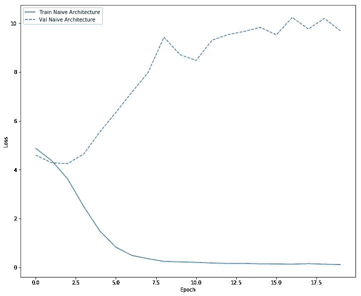

交叉熵与历元数

但是，我们可以使用 Keras 中的预训练模型来优化和提高测试预测精度。

**ResNet-50 架构**

为了定制 ResNet-50 来解决我们的问题，我们添加了一个密集层来获得 133 类狗，对于优化器，这次我们使用 Adam 优化器，并将学习速率降低到 10e-5。

```
_________________________________________________________________
Layer (type)                 Output Shape              Param #   
=================================================================
global_average_pooling2d_2 ( (None, 2048)              0         
_________________________________________________________________
dense_4 (Dense)              (None, 133)               272517    
=================================================================
Total params: 272,517
Trainable params: 272,517
Non-trainable params: 0
_________________________________________________________________
```

我们也为这个模型训练了 20 个时期。与朴素模型相比，这种迁移学习模型对测试数据的准确性要高得多。我们能够在以前看不到的数据上获得更高的指标分数。

```
loss :  0.62373913518
acc :  0.821770344339
precision :  0.856132680149
recall :  0.788277515099
f1 :  0.819878099923
```

为了比较 naive 模型和 ResNet-50 的性能，我们显示了损失函数与历元数的关系，其中我们用蓝色绘制 naive 模型，用绿色绘制 ResNet-50 模型。此外，我们还使用与 ResNet-50 相同的层测试了 VGG-16 的迁移学习，并在此以橙色绘制。

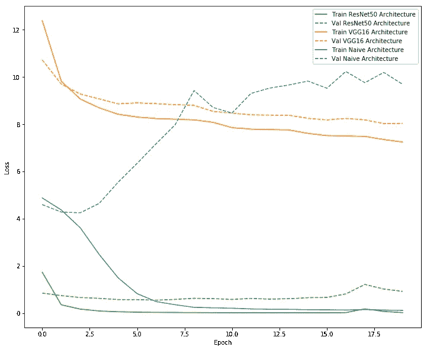

所有模型的交叉熵与历元数

从上面的图中可以看出，ResNet-50 模型表现非常好。我们还可以通过在训练模型时查看其他指标来确认这一点。

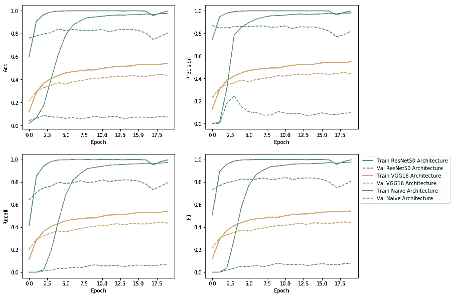

因此，我们能够使用 ResNet-50 在指标上获得最佳结果。让我们实际看看一些狗图像的预测结果。在从网上下载了随机选择的狗的图片后，我们想检查我们的模型实际上预测狗的品种有多好。

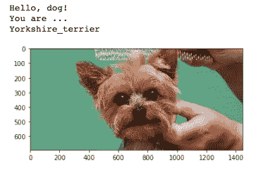

ResNet-50 说它是约克夏梗

根据维基百科的页面，它确实是一只约克夏梗或者简称为约克)

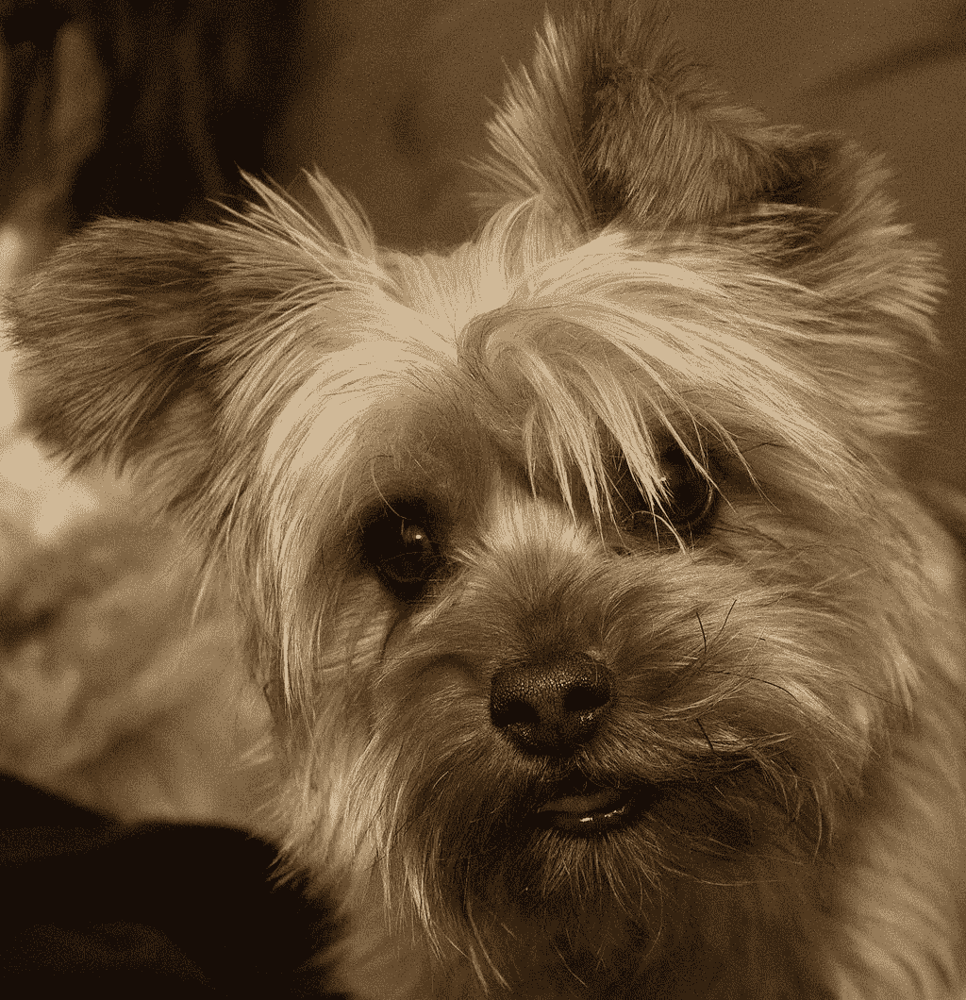

维基百科上的约克夏梗

对狗的又一个品种预测。

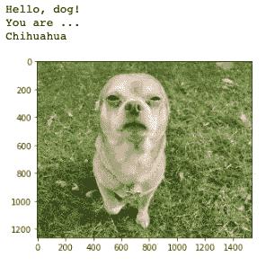

ResNet-50 说你是吉娃娃

这是一张来自维基百科的吉娃娃的照片


维基百科上的吉娃娃

总的来说，这个模型在大多数时候都能预测正确的品种。现在让我们看看一些狗和它们的主人，只是为了好玩。图片摘自这篇[文章](https://lzpetnanny.wordpress.com/2010/04/09/is-it-true-dogs-and-their-owners-look-alike/)。左边是一只狗，右边是狗的主人。

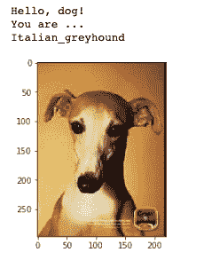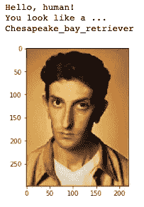

一只狗和它的主人

好的，所以我们的模型预测了狗的正确品种，是[意大利灰狗](https://en.wikipedia.org/wiki/Italian_Greyhound)。然而，我们的模型认为意大利灰狗的主人看起来像切萨皮克湾寻回犬，这是从下图中你可以决定他实际上是否像我们的模型预测的品种。

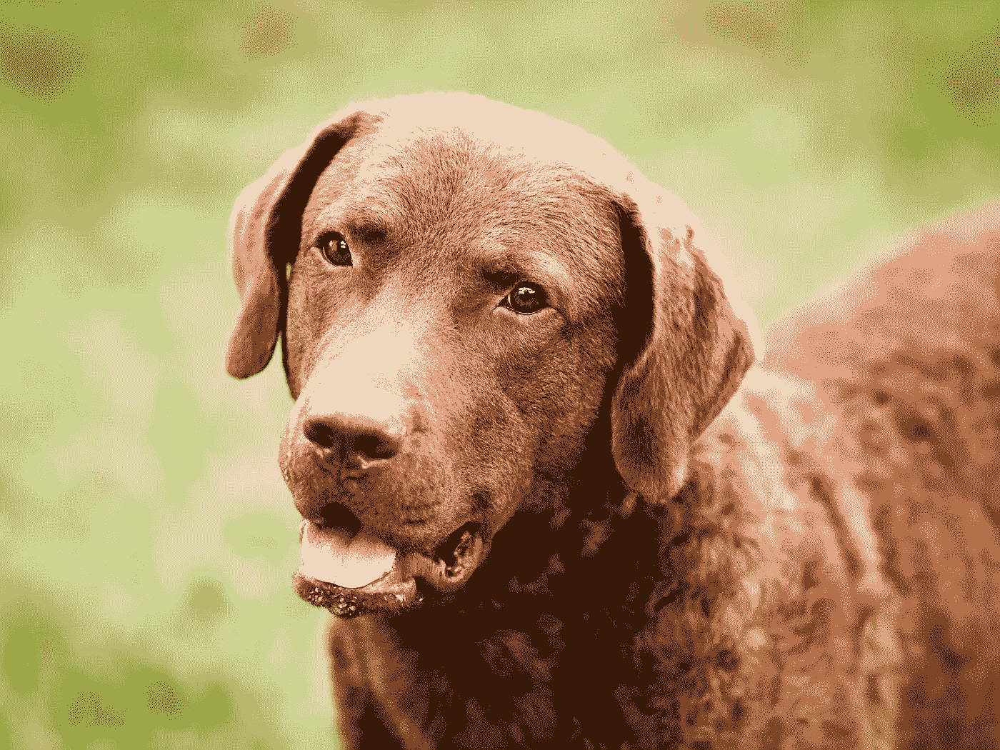

[切萨皮克湾寻回犬](https://www.thesprucepets.com/chesapeake-bay-retriever-full-profile-history-and-care-4693502)

再来看一个。

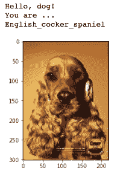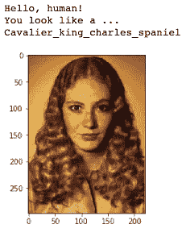

一只狗和它的主人

在这里，模型再次做出正确的预测，那就是[英国可卡犬](https://en.wikipedia.org/wiki/English_Cocker_Spaniel)，我们的模型认为狗的主人长得像[骑士查理王犬](https://en.wikipedia.org/wiki/Cavalier_King_Charles_Spaniel)。那离英国可卡犬不远。

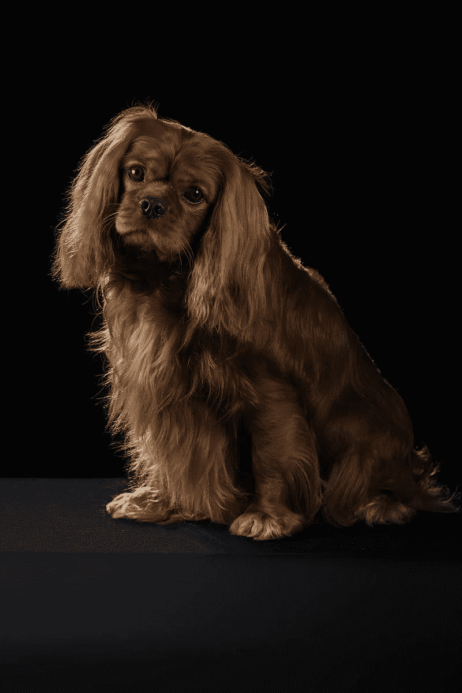

[骑士查理王猎犬](https://en.wikipedia.org/wiki/Cavalier_King_Charles_Spaniel)

# 结论

使用来自 ResNet-50 的预先训练的瓶颈特征，我们能够节省时间来构建我们自己的图像识别模型。通过迁移学习，我们可以实现更好的准确性(朴素模型约 6%的准确性和 ResNet-50 ~ 83%的准确性),但它可以进一步提高，也许有了更好的准确性，模型将能够更好地预测长得像他们的狗的人的品种。虽然，我们可能会考虑对这类问题采取不同的方法；)

1.  数据扩充
2.  狗的特殊特征
3.  平衡数据集
4.  用不同的时期数和批量大小进行训练。
5.  调整超参数(学习率、优化器、密集层中的节点数)

如果你想自己看看代码，或者添加一些细节，你可以在我的 Github [个人资料](https://github.com/SabrinaAL/ML_Projects_Collection/tree/master/dog_app)中找到这个笔记本。