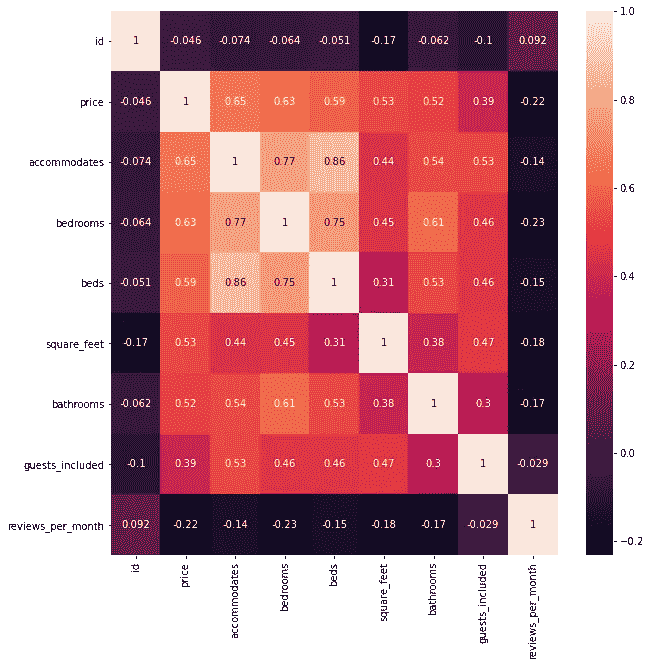
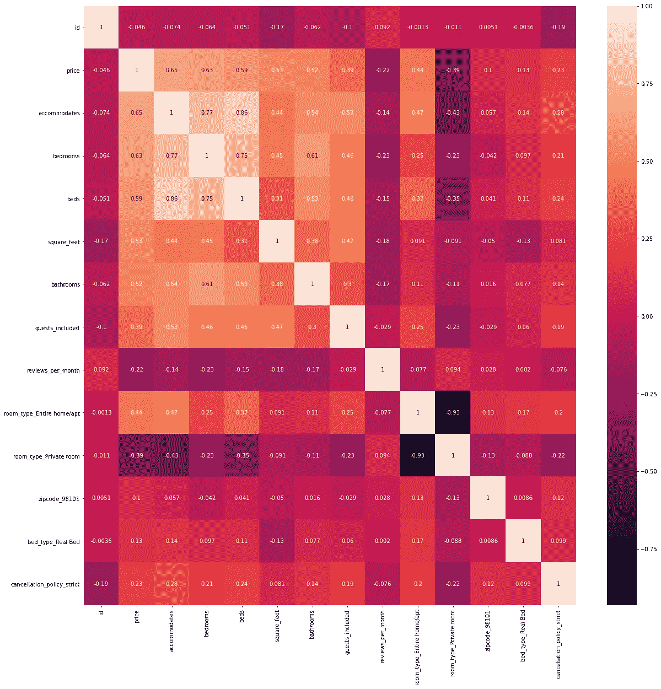
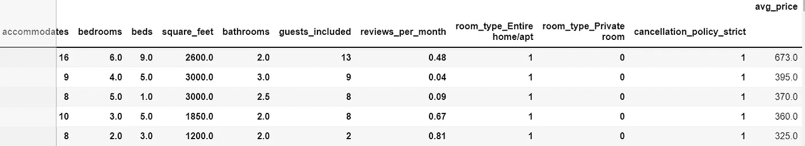
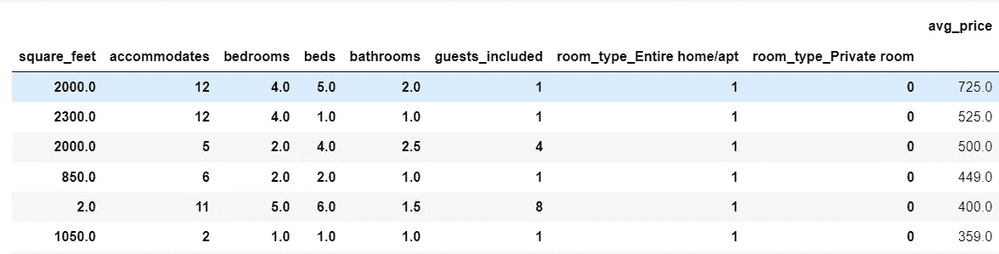
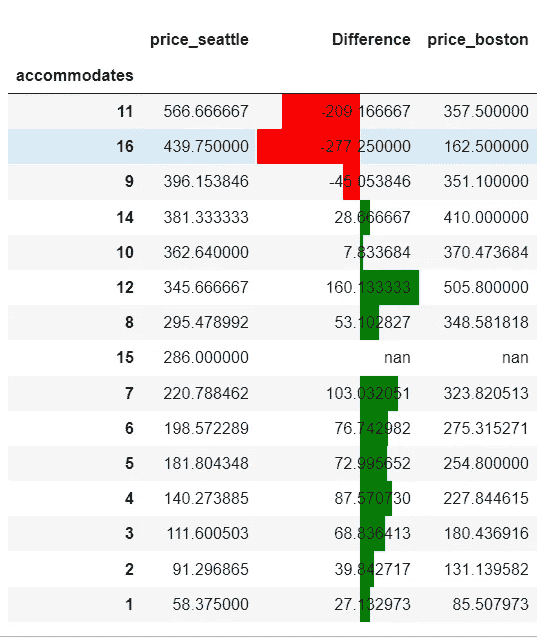
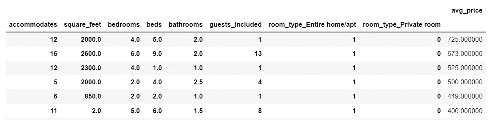

# 是什么推动了住宿家庭和客房的租赁价格？

> 原文：<https://medium.com/analytics-vidhya/what-drives-the-rental-price-of-homes-and-rooms-for-guest-accommodation-496d7726d20?source=collection_archive---------26----------------------->


[假期](https://a0.muscache.com/4ea/air/v2/pictures/a26d9d16-8494-4c8f-ba34-026a55f46aff.jpg)

大家好！我们知道，不同类型的度假/客房有不同的价格。我们可以使用数据驱动的方法来了解什么影响了房地产的价格吗？

如果你刚刚开始进入托管和出租房屋/房间的行业，那么这篇博文会温和地引导你投资合适的房产，以优化你的租金收益。如果你正在寻找一处房产，这也会帮助你根据你的预算/需求选择一处。

**注**:这是一项观察性研究，不是正式研究。因此，这些结果只能作为真正的*指导方针—* 因为外部和其他经济因素往往在决策中占据很大比重。

如果你把这篇博客看作是案例研究的一部分，这将有助于你使用正确的工具对数据进行系统的逐步分析。,

## 问题:

让我们试着回答以下问题

1.  推动租赁价格的关键因素是什么？我们发现什么有趣的发现了吗？
2.  对于同一套关键因素，城市之间是否存在价格差异？
3.  点评分数/点评数量会影响价格或预订吗？

## 数据集选择？

在我们的研究中，选择正确的数据集非常重要。让我们使用在[西雅图 Airbnb 公开数据| Kaggle](https://www.kaggle.com/airbnb/seattle/data) 公开的 Airbnb 数据集

## 能不能猜猜因素？

有许多因素会影响房产的租赁价格。一个普遍的看法是*房产大小、卧室数量、客人数量、正面评价等。推动房地产价格上涨。让我们来验证它们。*

## 数值数据的数据分析

> 得到数值因子。 ***坚持住！我们的数据集不干净。***
> 
> 对于技术用户——美元金额是字符串格式‘$ 125.00’，我们可以使用 regex 来标识价格列。你可以参考我的 github 代码

## 挑选最重要的数字特征

1.  让我们找出价格和其他数字列之间的相关性，只选择那些正相关***>0.2****和负相关 ***< -0.2*** 的列*

**注*:因子‘每月评论数’列在汇总中分析*

*关注关联矩阵中的*价格行*。我们看到“住宿”与价格的关系最密切(0.63)，其他特征如下所示*

```
*['price', 'accommodates', 'bedrooms', 'beds', 'square_feet', 'bathrooms','guests_included', 'reviews_per_month']*
```

**

*价格与数字特征的相关性*

## *查找相关的非数字特征*

```
*dict(listings.select_dtypes(*include=['object']*).nunique().sort_values(ascending=True))
{'last_scraped': 1,
 'jurisdiction_names': 1,
 'requires_license': 1,
 'experiences_offered': 1,
 'calendar_last_scraped': 1,
 'has_availability': 1,
 'market': 1,
 'country_code': 1,
 'country': 1,
 'require_guest_phone_verification': 2,
 'host_identity_verified': 2,
 'host_has_profile_pic': 2,
 'state': 2,
 'host_is_superhost': 2,
 'is_location_exact': 2,
 'require_guest_profile_picture': 2,
 'instant_bookable': 2,
 'room_type': 3,
 'cancellation_policy': 3,
 'host_response_time': 4,
 'bed_type': 5,
 'smart_location': 7,
 'city': 7,
 'property_type': 16,
 'neighbourhood_group_cleansed': 17,
 'zipcode': 28,
 'calendar_updated': 34,
 'extra_people': 45,
 'security_deposit': 46,
 'neighbourhood': 81,
 'neighbourhood_cleansed': 87,
 'host_neighbourhood': 102,
 'host_verifications': 116,
 'cleaning_fee': 118,
 'host_location': 120,
 'last_review': 321,
 'first_review': 984,
 'host_since': 1380,
 'street': 1442,
 'host_name': 1466,
 'notes': 1999,
 'host_about': 2011,
 'neighborhood_overview': 2506,
 'transit': 2574,
 'host_thumbnail_url': 2743,
 'host_picture_url': 2743,
 'host_url': 2751,
 'space': 3119,
 'amenities': 3284,
 'summary': 3478,
 'medium_url': 3498,
 'xl_picture_url': 3498,
 'thumbnail_url': 3498,
 'description': 3742,
 'name': 3792,
 'picture_url': 3818,
 'listing_url': 3818}* 
```

1.  *其中一些只是可以删除的描述性列。经过一点领域/业务分析后，我们可以选择以下内容。*

```
*['price', 'room_type_Entire home/apt', 'room_type_Private room',
       'zipcode_98101', 'bed_type_Real Bed', 'cancellation_policy_strict']*
```

*2.**跳过便利设施**。便利设施也可以发挥重要作用(例如。允许携带宠物(便利设施)。但我们必须清理它，规范拼写，错别字(如下所示)。如果与行数相比，特征的数量变得过高，建模就会变得不准确。因此，如果我们需要进一步了解便利设施与价格的关系，我们可以暂时跳过便利设施，稍后再回到便利设施。*

```
*{"Cable TV","Wireless Internet",Kitchen,"Free Parking on Premises",Breakfast,"Pets live on this property",Dog(s),Cat(s),Heating,Washer,Dryer,"Smoke Detector","First Aid Kit","Safety Card","Fire Extinguisher",Essentials,Hangers,"Hair Dryer",Iron,"Laptop Friendly Workspace"}*
```

## *与价格的相关性——所有类型的最*重要的*功能*

**

*所有因素的价格相关性*

## *让我们按重要特征对价格分组进行平均。*

*数据显示，住宿和床位的数量以及房间类型决定了价格*

**

*西雅图数据透视表*

**

*波士顿数据透视表*

## *比较波士顿和西雅图的价格——使用最重要的特征*

*平均来说，波士顿的房价比西雅图的要贵一些(50 美元)。这应该有助于在正确的城市投资。同样的结果可以外推至周价格和月价格。然而，在一些特殊情况下，西雅图的一些物业价格更高。*

**

*条形图:城市间的平均价格差异*

## *合并两个数据集进行最终分析*

*拥有 12 名客人和 4-5 间浴室的房产的平均价格在 500-700 美元之间。我们也可以将评论数量最多的酒店视为经济型酒店，并对其价格进行猜测。*

**

*数据透视表:合并两个城市的数据*

*摘要*

*让我们回答以下问题*

1.  *推动租赁价格的关键因素是什么？此外，我们有没有发现什么有趣的发现？*

> *通常对于出租/承租的房产，平方英尺是一个很好的价格指标。然而，对于假日/客人托管，当谈到价格时，物业的大小不是最重要的。我们看到 3000 平方英尺的房产价格相对较低。*
> 
> ***'容纳'，'卧室'，'床'，'平方英尺'，'浴室'，'包括客人'，'房间类型 _ 整个家庭/公寓'，'房间类型 _ 私人房间'，'取消 _ 政策 _ 严格'***

*2.对于同一套关键因素，城市之间是否存在价格差异？*

> *是的，平均而言，波士顿市的租金比西雅图市高 **50 美元**。对于较高的“容纳”值也有例外*

*3.点评分数/点评数量会影响价格或预订吗？*

> *平均评论分数与价格没有/很少关系。 ***嗯！评论不推动价格是有道理的:-)*** *，*相反，它们可能会影响预订数量(可以用预订数据集进行分析)*
> 
> *如果你观察了**‘每月评论数’**——评论数越多，房价越低。嗯，它可能**而不是**是一种**因果**关系。相反，有负面经历的客人往往比有正面/中性经历的人给出更多的评价。**或**这也可能意味着评论数量最高的酒店是经济型酒店。领域专业知识/业务理解在这里很重要！！！*

*在以后的文章中，我们将评估便利设施的 ***影响。*** 感谢您的宝贵时间:)*

***参考文献**:*

*Github:*

*[Data-Science/blogpost . ipynb at main ara vind-deva/Data-Science(github.com)](https://github.com/aravind-deva/Data-Science/blob/main/Blog%20Post/BlogPost.ipynb)*

*[Data-Science/Numeric _ correlation _ price . png at main aravind-deva/Data-Science(github.com)](https://github.com/aravind-deva/Data-Science/)*