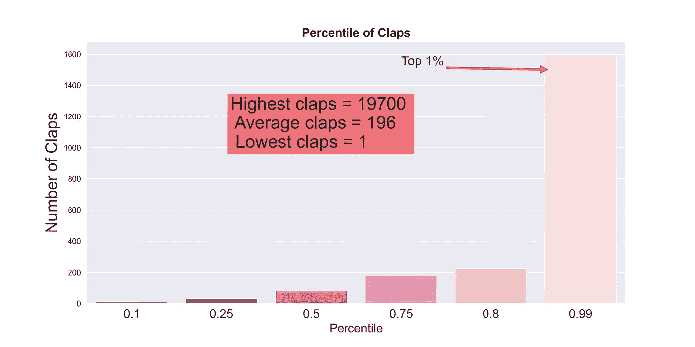
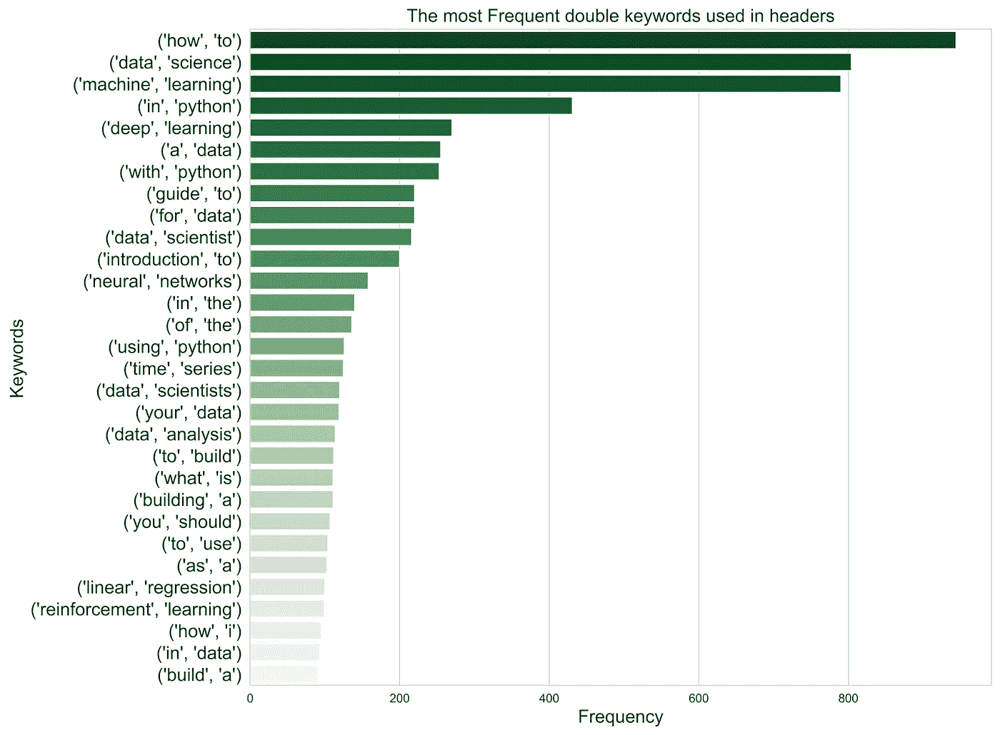

# 我用 Python 分析一万个中等帖子后的发现。

> 原文：<https://medium.com/analytics-vidhya/what-i-discovered-after-analyzing-10-000-medium-posts-with-python-bb012c6e004b?source=collection_archive---------3----------------------->

## 关于如何增加读者参与度、赢得更多掌声和观点的建议。

照片由[与 Raj](https://unsplash.com/@roadtripwithraj?utm_source=medium&utm_medium=referral) 在 [Unsplash](https://unsplash.com?utm_source=medium&utm_medium=referral) 的公路旅行拍摄

*注意:* [***项目源代码*** *的链接在这里*](https://github.com/kuleafenu/exploratory-data-analyisis-on-medium-post) *以及结论部分提供。*

# “更多的掌声==更多的观点”

对，就是这样，但是为什么！。

你知道吗，一个中等的算法，除了让你的文章被一个大的刊物发表来带动更多的流量， [**通过评估用户个人给出的掌声数来给你的文章排名**](https://help.medium.com/hc/en-us/articles/115011350967-Claps) **？**

简单地说， ***你获得的独特鼓掌次数越高，你的排名*** 就越好，这显然会影响你赚的钱数。

此外， [Harrison Jansma](https://www.freecodecamp.org/news/how-i-analyzed-a-million-medium-articles-to-learn-how-many-claps-great-stories-get-d688cf92759f/) 在分析了一百万篇帖子后发表的一篇研究文章表明，61.3%的中等文章获得的掌声不到 10 次——这无疑令人沮丧。

如果是这样，那么问题是，我们如何增加用户参与度，从读者那里获得更多的观点和掌声？

让我们开始吧！

项目目标:分析 1 万篇中型文章，以获得关于如何调整你的文章以赢得读者更多掌声的见解。

**要学的东西**

1.  关于正在使用的数据集。

2.数据汇总统计报告。

3.回答 9 个最紧迫的问题。

4.结论。

# 关于正在使用的数据集。

**从数据科学档案中删除数据集**

为了获取这个项目的数据，我用 python [构建了一个 web scrapper(你可以在这里阅读如何做](/analytics-vidhya/how-to-scrape-all-types-of-websites-with-python-part-1-552aafd93884))从 TDS 数据档案中抓取数据集。

总共收集了 13K 个数据点，在必要的预处理步骤后，剩下 12K。

# 数据汇总统计报告

**在我的统计总结中，我得到了一些有趣的发现，我相信它们也可以用作评估指标。**

*   在我的样本数据中，一篇文章获得的最高掌声是 19700 次。
*   平均而言，媒体作家的文章可以获得 196 次点击。

*   为了让你的帖子成为点击率最高的 1%，你必须获得至少 1600 个点击率。
*   要成为前 20%的一员，你的帖子必须获得至少 225 次点击。
*   50%的文章获得 80 次掌声，比平均掌声数少 116 次。

**我还想知道作者达到前 20%门槛的一致性如何。这就是我所拥有的**

结果是

*   28.12%的作者至少有一篇文章达到 225 拍手；也就是最高的 20%门槛。
*   不到一半的作者的第一篇文章达到了前 20 %,占 10.6%,他们的第二篇文章也达到了前 20%。

所以，一个作者的第二篇文章达到前 20%的比率大约是 11%。

# 回答 9 个最紧迫的问题。

现在让我们来解决前四个提示问题。

1.  **标题和副标题中使用最多的** `**keywords**` **有哪些，这些关键词中哪些是在拍手量大的文章中经常使用的？**

假设`data`、`science`和`how`会出现在常用关键词中，现在猜猜我们得到了什么？

*   主、副标题中使用的前五个关键词分别是*数据*、*学习*、 *python* 、*使用*和*机器*。
*   我们还注意到*分类*、*介绍*、*构建*、*神经*、*制作*和*构建*是使用最少的关键词。

在我们下一篇文章中选择这些关键词之前，让我们先看看它们中的哪一个赢得了最高的掌声，以决定哪些应该优先考虑。

*   我们注意到，在前 20 个关键词中，有 8 个出现在前 20%的文章中更频繁。
    这些是`pandas`、`5 (eg Top 5 Open Data Science Competitions with Cash Prizes)`、`Simple`、`Science`、`Learn`、`make`、`data`、`python`

因此，总结一下，如果没有任何东西，你已经看到了作家经常写的关键词和在顶级文章中经常使用的关键词。

因此，你可以考虑写这 20 个关键词，或者更好的是，在你的标题中优先考虑前面提到的 8 个关键词。

另外，请注意这一点。

例如，不要写，而是明确地陈述。添加一个数字，比如`5` ，使其更加精确。

**2。标题中包含前 20 个关键词会增加文章的点击率吗？**

仅仅知道标题中需要优先排序的关键词是不够的。让我们看看使用它是否有可能导致不同。

*   上图显示，标题中有关键词的文章平均获得 **206.39** 的点击，而标题中没有关键词的文章平均获得 **177.38** 的点击**。**

这证实了这样一个事实，至少在你的标题中有一个关键词会给你带来优势。

好的，稍微推进一下关键词场景，让我们看看这些词是怎么用的；它们与其他单词的组合。这就引出了下一个问题…

**3。我们的标题中最常用的两个关键字组合是什么，哪一个可以用来吸引更多的掌声？**

*   我们可以看到，在最频繁出现的 20 个二元模型(双关键词)中，前四位是`*how to*`、`*data science*`、`*machine learning*`和`*in python*`、T22，后四位是`*build a*`、`*in data*`、`*how i*`和`*reinforcement learning*`。

哦，我知道你要问什么。

这些名人是如何引起掌声的？

为了得到这个，我们绘制了平均鼓掌次数的二元图，结果是，嗯…有点令人惊讶。

*   **我**的平均鼓掌次数最高，其次是`*data scientist*`、`*you should*`、**、*、*、**，其余依次为。

> 如果你还记得，`*how i*` 被记录为最少使用的双关键词之一，然而它却吸引了最高的平均掌声。

原因是:

> **How I，**通常用于讲故事，一位神经科学家“Uri Hasson”进行的一项研究得出结论，讲故事会使一位观众的神经元与讲故事者的大脑同步。
> 
> 人类也与故事有关，因此讲述故事是一种迷人的呈现方式。故事吸引听众，引起共鸣，建立信任，激发行动。[此处阅读更多内容](https://virtualspeech.com/blog/tell-story-delivering-presentation)。

***我如何*** 故事的例子有:

*   *我如何通过优化合适的地点和时间成为一名数据分析师*
*   *我如何在加拿大找到一份数据科学的工作*
*   *我如何发布一个应用程序和模型来对 85 种蛇进行分类(你也可以这样做)*

嗯，我不需要告诉你上面的“怎么样”真的会引发好奇心。

期待在你的下一篇文章中看到它。

**4。好的，下一个问题。**我应该总是包含副标题还是可以选择忽略它？****

在我的研究中，我记录了样本数据集中 16%的文章没有副标题，即使它们有主标题。

所以我决定看看副标题是否能让你获得更多掌声。

*   经过仔细分析，带有副标题的文章平均获得 203 分，而没有副标题的文章平均获得 158 分。

这是有意义的，因为同时具有主标题和描述性副标题的文章，包括正确的[目标明确的关键词，在目标读者的搜索中比其他情况下更容易出现。](https://frontcore.com/blog/seo-how-to-use-keywords-to-get-better-visibility-in-google/)
遂；

*   用户外联和整体点击率有所增加。
*   此外，通过接触正确的用户，你有机会赢得掌声，因为这是她/他可能会期待的。

所以要点是，用正确的关键词写标题，不要忘记包含描述性的和有洞察力的副标题。

**5。是否有任何特定长度的标题可以使用？说到这里，我只是想澄清一下。**

数据科学编辑鼓励使用简短的主标题和深刻的副标题。

如前所述，写一个描述性的主标题和副标题有助于谷歌索引你的文章，它也会在搜索预览中弹出，从而吸引更多的预期用户。

在这方面，让我们看看是否有一个值得推荐的头长度。

**这里的长度是通过出现的字数来计算的。**

*   对于包含 13 到 17 个单词的标题来说，有很多掌声。
*   在包含 30 到 50 个单词的标题之间观察到交替移动，从 60 到结尾保持稳定。
*   主标题中的字长为 20，子标题中的字长为 60 后，拍手次数减少。

总之，我们可以说你选择的标题长度没有特别的优点，但是你可以考虑选择 14 到 17 个单词作为主标题，30 到 50 个单词作为副标题。

但是最重要的是，知道如何选择你的措辞。

**6。阅读时间是如何影响鼓掌次数的？**

我对阅读时间进行了初步分配，发现 87%的文章有 2 到 10 分钟的阅读时间。

那只是顺便说一下:)

*   从上面的图中可以观察到，阅读时间在 20-67 分钟之间的文章平均鼓掌次数最多，其次是 10-20 分钟，5-10 分钟，最后是 0-5 分钟。
*   此外，阅读时间为 5 到 20 分钟的文章有同等的机会从读者那里获得类似的掌声。

因此我们可以说:

*   仅仅因为你认为较长的文章会让你的用户感到厌烦，就强行缩短你的文章是不可取的。
*   此外，上述内容让我们明白，阅读时间越短，并不能保证读者的赞赏，但可以说内容的质量。

> 要知道，只要值得，每个读者都愿意在你的文章上花尽可能多的时间。因此，在尽可能为读者节省时间的同时，你也必须优先考虑它的质量。

只是想让你知道

我做了人工检查，发现大多数阅读时间较长的文章要么是令人感兴趣的顶级研究工作，要么是来自谷歌或脸书等科技巨头的帖子。

**7。你选择的标签数量对你的掌声有影响吗？**

以上清楚地表明了在文章中选择标签数量的重要性。

*   该图显示标签数量越多，掌声越多。

这仅仅意味着，大多数媒体读者根据主题来阅读媒体。因此，对于中等 SEO 来说，为了让你的文章迎合众多读者的不同主题，建议你尽可能多地使用围绕你的文章精心选择的主题。

*   此外，从 0 标签到 3 标签的文章之间没有太大差异，但 3 到 4 和 4 到 5 之间有显著差异。
*   此外，据记录，86.20%的文章使用 5 个标签，而 8.39%的文章使用 4 个标签，其余的文章也是如此。

**总之，建议您在帖子上使用至少 4 个标签。**

**8。我应该嵌入几张图片来吸引读者对我的帖子的兴趣吗？**

> 假设:
> 俗话说“一张图胜过千言万语”，所以我们假设，你在帖子中使用的图片越多，读者的欣赏度就越高。

但是看

*   图像和掌声之间的相关值非常低，只有 0.03。

这意味着图片的数量对读者的欣赏水平几乎没有影响。

*   从柱状图中可以看出，有图片和没有图片的文章平均获得的掌声数量相等。

因此，与其嵌入大量的图片来引起读者的兴趣，不如只在必要的时候使用它们。

**9。文章的发表日期是赢得更多读者兴趣的一个因素吗？**

> 假设:
> 我们可以说，文章的发表日期也影响它的阅读和鼓掌次数。周末发表的文章赢得的掌声较少。

**月**

*   我们观察到从一月到三月中旬掌声更高。
*   从 3 月中旬到 12 月，鼓掌的次数急剧下降。
    这种快速下降可归因于疫情的激增，因为从 2020 年 5 月开始[记录了大量阳性病例](https://www.worldometers.info/coronavirus/)。

由于在此期间的众多不确定性和悲剧，我们无法自信地结束这个月。然而，我们可以说，用户的抑郁、焦虑和压力等因素可能会影响他/她对帖子的行为。

**工作日**

*   星期五记录了最高的鼓掌次数，相比之下，星期六记录了最低的鼓掌次数。

因此，就这些发现而言，不建议在周六发表你的文章。

**周末**

*   工作日发布的拍手次数比周末略有增加。

所以你可以考虑在工作日发表你的文章。

**结论**

因为已经给出了细节，所以简单回顾一下。

*   充分利用标题中前 20%的关键词。
*   开始写**我如何**的文章。把它个人化，让我们看看结果。如果你得到了一些杰出的成果，请告诉我。
*   使用正确的关键词写标题，不要忘记包括描述性的和有洞察力的副标题。
*   更少的阅读时间并不能保证你的读者会欣赏你的作品，但可以说是内容的质量。
*   总之，建议你在帖子上使用至少 4 个标签。
*   与其嵌入大量的图片来引起读者的兴趣，不如只在必要的时候使用它们。
*   不建议在周六发表你的文章。
*   所以你可以考虑在工作日发表你的文章。

我差点忘了。

从[**我的 Github**](https://github.com/kuleafenu/Exploratory-Data-Analysis-and-Machine-Learning/tree/main/medium_analysis) 资源库下载完整代码，点击 ***50*** *拍手。*