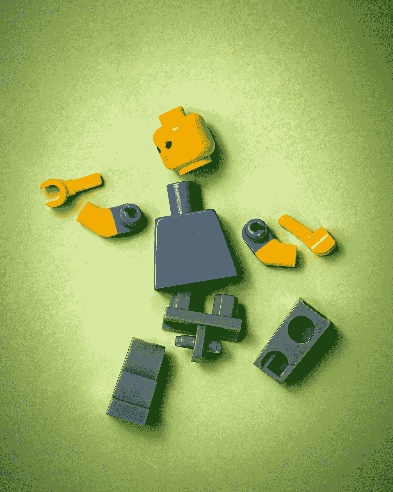

# 从初级到专业，我需要学习的东西

> 原文：<https://medium.com/analytics-vidhya/what-i-had-to-learn-to-level-up-from-junior-to-professional-710c63979ec4?source=collection_archive---------4----------------------->

在 [Unsplash](https://unsplash.com?utm_source=medium&utm_medium=referral) 上由 [Austin Distel](https://unsplash.com/@austindistel?utm_source=medium&utm_medium=referral) 拍摄的照片

> 如果你的成功不是按照你自己的方式，如果它在世界上看起来很好，但你心里并不觉得好，那它根本就不是成功。

职业生涯的提升通常看起来很可怕。我们应该怎么做才能成功？

作为一名软件工程师，从第一天开始，我就一直在纠结这个问题。幸运的是，我有机会遇到一些非凡的人，他们教会了我应该关注什么，应该向谁伸出援手，同时“成功”也会到来。

自从我发现这些提示已经有一段时间了。从那以后，我一直在适应和完善它们。他们工作了！但是不要把我的话当成理所当然。尝试一下，你会亲眼看到结果。

索引

*   5 小时规则；
*   求解答；
*   隔离原则；
*   辩论之美；
*   多一些；

# # 5 小时法则

照片由 [Billetto 编辑](https://unsplash.com/@billetto?utm_source=medium&utm_medium=referral)在 [Unsplash](https://unsplash.com?utm_source=medium&utm_medium=referral) 上拍摄

五小时法则以简单著称，它包括每周留出 5 小时(每天一小时)用于学习或练习。

学习有不同的形式。可以是阅读、反思、实验等。

> 五小时规则不是去工作并希望你学到新东西，而是为个人发展和有意识的学习留出时间。
> 
> 美国电话电报公司首席执行官兼董事长兰德尔·斯蒂芬森，

在他的采访中，兰德尔指出那些每周不花 5-10 个小时在线学习的人将会“被技术淘汰”

作为一名软件工程师，你不能停滞不前，因为那意味着没有进步。困难会更多的出现，越来越熟练会越来越繁琐。

我们都有忙碌的生活，我们大多数人都觉得很难找到那 10 分钟来阅读、运动、写作。但是，如果非常忙碌的人能够抽出时间，就像巴拉克·奥巴马回到白宫一样，你也可以。

# #寻求答案

杰里迈亚·劳伦斯在 [Unsplash](https://unsplash.com?utm_source=medium&utm_medium=referral) 上的照片

没有人生来就知道，你应该是第一个意识到这一点的人。寻求他人的知识和见解取决于你，也只有你。

作为一名软件工程师，你可能已经注意到了大量的工具、技术、模式和概念，明天还会有更多的工具、技术、模式和概念出现。

在一些挖掘和实验之后，不要害怕与你的队友或朋友一起检查你的一些发现。询问他们的看法、想法，甚至是澄清。

无论何时做一项任务，不要害怕分享你的困难，不要隐藏它们。作为一个团队，互相帮助是每个人的责任。否则，没有一家公司能够长久生存。

# #隔离原则

照片由[杰克森煨](https://unsplash.com/@simmerdownjpg?utm_source=medium&utm_medium=referral)于[未煨](https://unsplash.com?utm_source=medium&utm_medium=referral)

每当我们解决一张票、一个问题、一个挑战时，我们可能会被所有的细节完全淹没。

每当被所有的复杂性淹没时，也很容易忘记主要目标。

这时，隔离原则可能会比你想象的更有用。

这个原则也被称为凯撒大帝的[分而治之](https://en.wikipedia.org/wiki/Divide_and_rule)。

通过把大问题分成小问题，它们变得更容易处理和完成。

每当你看到自己想要开始某件事，但是你不能完全激励自己去开始时，这个原则可以被应用。

> 当一项任务太大，以至于当我们在清单上看到它时，我们倾向于把它推迟到“以后”,而是选择做一个更小的任务时，它可以被认为是“大的”。

我们可以通过问以下问题来开始应用它:

*   我能做哪些部分？
*   哪些是我依赖外部帮助的？
*   我能找到哪些小的、快速的或较大的任务？
*   哪些是复杂的和有时间限制的？

解决方法很简单——把任务分成易于管理的小块。

你应该总是以最合适和最可行的方式细分工作，把你带到一个平静的环境中，在那里问题看起来不那么可怕，也更容易管理。

> 任务呈现给你的方式对你采取行动的动力有很大影响。

# #争论的美妙之处

沃洛季米尔·赫里先科在 [Unsplash](https://unsplash.com?utm_source=medium&utm_medium=referral) 上的照片

与更有技能、更有经验或更有资格的人争论可能看起来很可怕，但那是我们学得最多的时候。

我们都有自己的感知和解释方式。每个视角都有它的道理。

通过深入他人的视角，我们学会了用和他们一样的方式看待世界。争论并不一定意味着吵架或者证明对方是错的。主要是提炼思路，检查思路。

[合并&拉取请求](http://oss-watch.ac.uk/resources/pullrequest)是这种方法的最佳之处。每个问题都有很多解决方案，不要满足于人们找到的第一个。检查涵盖所有边缘的可能解决方案。

# #变得更多

照片由 [Unsplash](https://unsplash.com?utm_source=medium&utm_medium=referral) 上的 [Japheth 桅杆](https://unsplash.com/@japhethmast?utm_source=medium&utm_medium=referral)拍摄

对工作的热情应该是你每天都有的一种感觉。没有它，以上所有的都将很难应用。

有时候，你会陷入困境，开始感觉到冒名顶替综合症，感觉没有动力。没有激情和兴奋，从那些地方恢复会成为一项艰巨的任务。

你可能会认为，仅仅因为你对目前的工作不感兴趣或没有激情，你就无能为力。

然而，这并不完全正确，有了正确的努力、心态和坚持，你看到自己在做你努力争取的事情只是时间问题，比如与特定的技术、语言、范式甚至人一起工作。

# #结论

我希望这些发现能帮助你走上正途！

你阅读的任何内容本身都毫无意义，除非你用它做些什么！

你还在等什么？向他们展示你的能力。

直到下一篇文章。

 [## 虚拟对象的 OAuth2 授权类型

### 我们都知道现实世界并不那么简单，我们在每个角落都不断面临新的挑战。

medium.com](/geekculture/oauth2-grant-types-for-dummies-bf911b2ff275)  [## 将改变你 2021 年的 4 本书

### “一个读者在死前经历了一千次生命,”Jojen 说。从不读书的人只能活一次。

rafael-as-martins.medium.com](https://rafael-as-martins.medium.com/4-books-that-will-change-your-2021-ae47bdc7d016)  [## 如何 Kafka 你的微服务

### 应用程序工作流最吸引人和最具挑战性的主题之一是消息/事件驱动的…

medium.com](/geekculture/how-to-kafka-your-microservices-9ef45a9e882a)