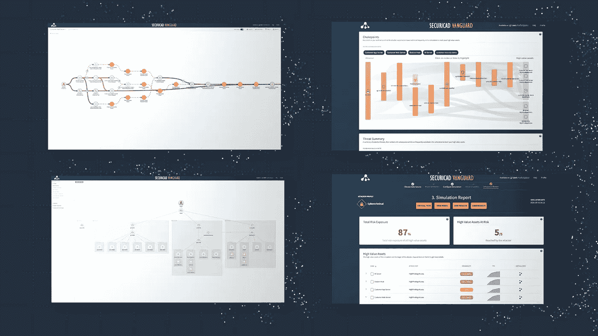

# 我从遵守 AWS 安全要求中学到了什么

> 原文：<https://medium.com/analytics-vidhya/what-i-have-learned-from-working-compliantly-with-aws-security-requirements-a6ee185edef2?source=collection_archive---------17----------------------->

云计算有很多好处，比如灵活性和快速部署。而且也有明显的安全优势。但是网络安全是云提供商和客户的共同责任。而且[绝大多数云安全故障都是客户的错](https://www.gartner.com/smarterwithgartner/is-the-cloud-secure/)。为了实现强大的安全性，我们作为用户需要考虑风险并优先考虑云中的网络安全。

这是我从使用自动化工具 [securiCAD](https://foreseeti.com/securicad/) (见下面的截图)和遵守 AWS 安全要求中学到的总结。希望它能对所有在 AWS 工作的开发人员和安全专家有所帮助。

为了帮助您提高云安全性，AWS 开发了 [AWS 架构良好的框架](http://aws.amazon.com/architecture/well-architected)。使用该框架，您将“获得在云中设计和运行可靠、安全、高效且经济实惠的工作负载的当前架构最佳实践”。[该框架的安全支柱](https://docs.aws.amazon.com/wellarchitected/latest/security-pillar/welcome.html)是关于如何[安全地运行工作负载](https://docs.aws.amazon.com/wellarchitected/latest/security-pillar/operating-your-workload-securely.html)的许多安全基础的起点。

让我们开始行动，深入了解如何在 AWS 中安全地操作工作负载的一些关键要求。

**AWS 要求 1。**“使用威胁模型识别风险并确定其优先级:使用威胁模型识别并维护潜在威胁的最新记录。确定威胁的优先级，并调整您的安全控制措施来预防、检测和响应威胁。在不断变化的安全环境中重新审视和维护这一点。”

威胁建模通常是一个手动过程。然而，考虑到与模型本身同时增长的极端复杂性，手动威胁建模可能非常耗时。更不用说一个人必须优先考虑预防、检测和应对威胁，而这项任务根本不可能手工完成，因为这需要时间，而且太复杂，一个人的大脑无法处理。换句话说，自动化威胁建模告诉我，分析复杂的环境是可能的，而且这个过程比我想象的要高效得多。

**AWS 要求 2。**“确定并验证控制目标:根据您的合规性要求和从威胁模型中确定的风险，推导并验证您需要应用于工作负载的控制目标和控制。持续验证控制目标和控制有助于您衡量风险缓解的有效性。”

正如我前面提到的，环境的复杂性随着模型的大小而快速增长，但是风险也是如此。在最好的两种情况下，很明显，人们希望解决所有潜在的威胁，但众所周知，这是不可能的，通常归结为什么风险最有可能发生，以及我们可以做些什么来防止它们发生？自动化工具为我提供了关于关键风险的见解，我需要对我的环境应用什么措施和控制，以优先考虑最有效地利用我的时间。

**AWS 要求 3。**“自动化测试和验证管道中的安全控制:为安全机制建立安全基线和模板，并作为构建、管道和流程的一部分进行测试和验证。使用工具和自动化持续测试和验证所有安全控制。”

如果你问我，当谈到安全控制的测试和验证时，持续和手动这个词不属于一起，因为手动太耗时了。自动化工具允许我在开发过程中不断测试我的安全性。最棒的是，测试是在一台数字孪生机上进行的，不会干扰现场环境。

总结我在 AWS 良好架构框架的安全需求方面的经验；跳过手动威胁建模，使用自动化威胁建模工具，为您和您的同事节省一些时间。