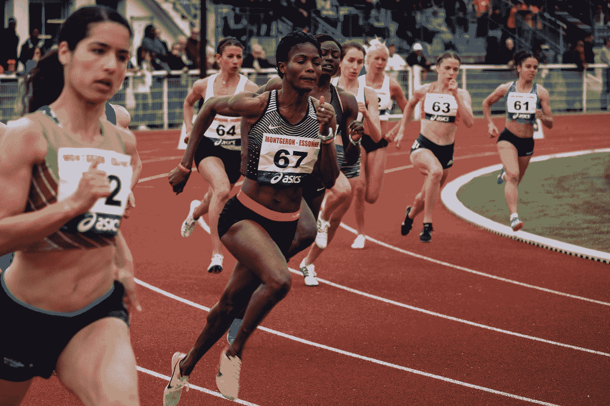

# 我从我的第一次 Kaggle 比赛中学到了什么

> 原文：<https://medium.com/analytics-vidhya/what-i-learned-from-my-first-kaggle-competition-6a7575a7f339?source=collection_archive---------17----------------------->

尼古拉斯·霍伊泽在 [Unsplash](https://unsplash.com?utm_source=medium&utm_medium=referral) 上拍摄的照片

[Kaggle](https://www.kaggle.com/) 最近推出了表格游乐场系列。这些为期一个月的竞赛针对的是数据科学和/或 ML 竞赛的新手。我参加了 2 月的挑战，该挑战提供了包含分类和连续特征的表格数据，目标是预测一个连续的目标。我稳稳地跑在队伍的中间；我的最好成绩是 RMSE 0.84599，而获胜者的分数是 0.84115。虽然我错过了我确信是可怕的 Kaggle swag，但我得到了一次很好的学习经历。我希望分享这些经验能帮助其他想参加大联盟比赛的人。

# **1。就这么做**

几个月来，我一直有参加比赛的想法。但我被一种对其他竞争者技术水平的恐吓感所牵制。虽然赢得比赛需要更多的经验，但是任何技能等级都是完美的！竞争是练习建模技能的一个很好的方式，因为它提供了一定程度的责任和目标，这两者都促进了实际内化这些技能所需的创造力和决心。如果你像我一样，有参加竞赛的想法，现在是加入竞赛的好时机。Kaggle 上的表格游乐场系列的三月[轮刚刚开始，Bitgrit 的](https://www.kaggle.com/c/tabular-playground-series-mar-2021/overview)[视频人气预测挑战](https://bitgrit.net/competition/)还有大约一个月的时间。你可以以个人身份参加比赛，也可以组队参赛。到头来，你真的会失去什么？像耐克一样去做！

# **2。跳进**前做好计划

一旦你加入了竞争，很容易就投入进去并开始建立你的模型。但是强迫自己停下来。花点时间查看提供的信息，理解数据，并记录攻击计划。这将使你有条理，作为你所尝试的文档，并最终防止不必要的重复。我用 Trello 来创建我的比赛计划，但是任何对你有用的跟踪方法都可以。当然，当您开始从建模中获得结果时，计划将会改变，但是在一个文档化的计划中捕捉改变要容易得多。最后，当比赛结束时，你会有一个你的方法的记录，下次会准备得更好。

你的计划应该包含什么？这将取决于比赛的目标。我为这次比赛制定的计划包含以下几个部分，每个部分都有清单，将任务分解成更小、更易管理的项目。

**概述** —用自己的话解释比赛的目标，确保你完全理解任务。记录当时排行榜上的最佳分数，作为评估分数的参考框架

**研究** —你正在完成什么任务(例如回归还是分类)？最近在这方面有没有什么发现可以帮助你实现目标？ML 是一个快速变化的领域，新的发现频繁出现。看看其他竞争对手的资料，尤其是那些在排行榜顶端的。他们经常分享他们在以前的比赛中尝试过的东西，这对从哪里开始很有价值。此外，如果你的模型没有给你想要的，这可以打破僵局，改善你的结果。

工作流程 —您打算在本地还是云中运行您的模型？您将如何从每次运行中获取结果和模型配置，以便选择最佳模型(例如 [MLflow](https://mlflow.org/) )？您需要创建哪些管道？在计划的这一部分，深入思考你的笔记本的布局。随着比赛的进行，把它分成几个部分会使你的生活变得更容易，这样如果你必须关闭内核，你就不必重新运行整个笔记本。反思你的数据流。您是保存预处理后的数据框还是每次都重新运行预处理管道？在一开始就做出这些决定将会避免以后的挫折。

**数据准备** —了解您正在处理的数据类型(文本、数字、图像等)。)并确定您将采取哪些步骤来为建模准备数据。这包括清理、特征选择和特征工程。如果模型性能没有提高，请准备好重新设计特征。

**建模**——根据手头的研究，概述你认为哪些算法可以胜任这项任务。如果您计划使用任何方法来提高性能(比如堆叠模型)，也在这里记录这些方法。创建您的模型优化计划——您将如何找到最佳的模型超参数，在尝试另一个模型之前，您愿意在多大程度上优化一个模型？

**评估** —你的计划应该包括评估模特表现的步骤。使用什么指标来评估提交的竞赛？你想用什么方法给你的模型打分？你怎么知道你的模型是过拟合还是欠拟合？

# **3。早点开始，经常提交**

运行模型可能需要很长时间，而调整它们可能需要更长时间！如果可以的话，从一开始就开始竞争。如果你不能，那就加入吧！在真正的竞争环境中工作一段时间仍然会带来一些好处，所以不要让它阻碍你。虽然这是违反直觉的，但是你的时间越少，你就越需要仔细考虑上面的计划阶段。不要为了节省时间而跳过计划。你将会花费更多的时间去修改和尝试那些效果不佳的模型。

经常提交，尤其是在开始的时候。这是对您的方法进行评估的最佳方式，因为您的评分方法可能会产生与竞争平台的方法略有不同的结果。大多数排名靠前的参赛者都提交了超过 20 份作品。Kaggle 每天最多允许 5 次提交。只有你的前 2 个提交被考虑为最终得分，所以提交经常不会伤害你的排名。

[菠萝供应公司](https://unsplash.com/@pineapple?utm_source=medium&utm_medium=referral)在 [Unsplash](https://unsplash.com?utm_source=medium&utm_medium=referral) 上拍摄的照片

最后，尽量玩得开心。赢的机会很低，我说过了！因此，随着压力的减轻，记住这是关于学习新的东西和实践你所知道的。如果你和一个团队一起参与，为团队中的最佳提交创建你自己的奖励。享受一起工作带来的友情。一旦比赛结束，看看你的作品，陶醉于你所学到的新东西。然后报名参加下一场比赛，因为这东西会上瘾。比赛愉快，祝你好运！