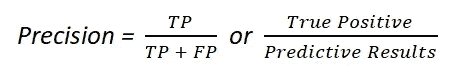

# 什么是机器学习中的混淆矩阵？

> 原文：<https://medium.com/analytics-vidhya/what-is-a-confusion-matrix-in-machine-learning-ecd336058b17?source=collection_archive---------34----------------------->

图像[来源](https://unsplash.com/photos/i--IN3cvEjg)

*A* ***混淆矩阵*** *是一个 N×N****矩阵*** *用于评估一个分类模型的性能，其中 N 是目标类的数量。* ***矩阵*** *将实际目标值与* ***机器学习*** *模型预测的值进行比较。*

*对于二进制分类，混淆矩阵是 2×2，如下所示，有 4 个输出:*

*二元分类器将测试数据集的所有数据实例预测为阳性或阴性。这产生了四种结果-*

1.  ***【真阳性(TP)*** *: TP 是正确的阳性预测，表示实际值为正，模型预测值为正。*
2.  ***【FP】****:FP 是不正确的正预测，是指实际值为负，但模型预测为正。它也被称为****1 型错误。***
3.  ***【真-负(TN)*** *: TN 是正确的负预测意味着实际值为负，模型预测值为负值。*
4.  ***【假阴性(FN)*** *: FN 是不正确的阴性预测，是指实际值为正值，但模型预测为负值。它也被称为****2 型误差。***

# ***从混淆矩阵中导出的基本度量***

***准确度*** *:分类* ***准确度*** *是正确预测与做出的总预测之比。*

***灵敏度*** *(召回率或真阳性率):也叫召回率(REC)或真阳性率(TPR)。* ***灵敏度*** *的计算方法是正确的阳性预测数(TP)除以阳性总数。*

***特异性*** *(真阴性率):也叫真阴性率(TNR)。特异性计算为正确阴性预测数(TN)除以阴性总数。*

***Precision*** *(阳性预测值):Precision 表示误报是指模型错误地标记为阳性而实际上是阴性的情况，或者例如，模型归类为恐怖分子的个人不是恐怖分子。*

***错误率*** *:计算为所有错误预测数除以数据集总数。最好的* ***错误率*** *为 0.0，而最差的为 1.0。*

***F-Score 或 F1-Score*** *(精度和召回率的调和平均值):F 得分是精度和召回率的加权平均值。因此，这个分数同时考虑了误报和漏报。直观上它不像精度那样容易理解，但是 F 通常比精度更有用，尤其是如果你有一个不均匀的类分布。如果假阳性和假阴性具有相似的成本，则准确性最好。如果误报和漏报的代价相差很大，最好同时看精度和召回率。*

***结论:***

在学习的初级阶段，这些术语很容易混淆，但是一旦你熟悉了这些术语，对分析和评价一个模型会有很大的帮助。

*我希望你对混淆矩阵有一些基本的概念，以及如何使用这些概念来判断模型。*

如果你喜欢这个博客或者觉得它很有帮助，请留下你的掌声！

***感谢阅读！***