# 什么是神经网络，它们是如何工作的？

> 原文：<https://medium.com/analytics-vidhya/what-is-a-neural-network-and-how-do-they-work-61b38d2720b8?source=collection_archive---------26----------------------->

杰西·马丁尼在 [Unsplash](https://unsplash.com?utm_source=medium&utm_medium=referral) 上的照片

在*《纯粹理性批判》*中，德国哲学家康德描述了两种类型的知识。先验知识是在没有经验的情况下获得的——例如，推理猫是哺乳动物，哺乳动物是动物，猫也是动物。**后验**知识是从经验中获得的，比如通过实际走访发现一个国家夏天很暖和。[1]

**神经网络**是能够学习如何在没有**先验**知识的情况下执行任务的计算系统。它们的特点是性能随着时间的推移而提高。本质上，当给定一组数据时，他们可以在没有任何背景或不了解数据是什么的情况下得出关于该数据的结论。

# 神经网络的结构

人工神经网络模拟人脑内部的生物神经网络。神经网络的基本元素是神经元。在大脑内部，一个神经元从其他输入神经元收集信号。来自每个输入神经元的信号幅度取决于每个神经元与其输入之间的连接强度。如果神经元接收到的总信号超过一定强度，神经元就会触发。[2]

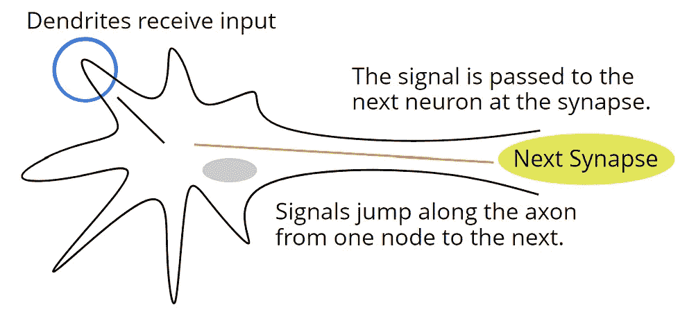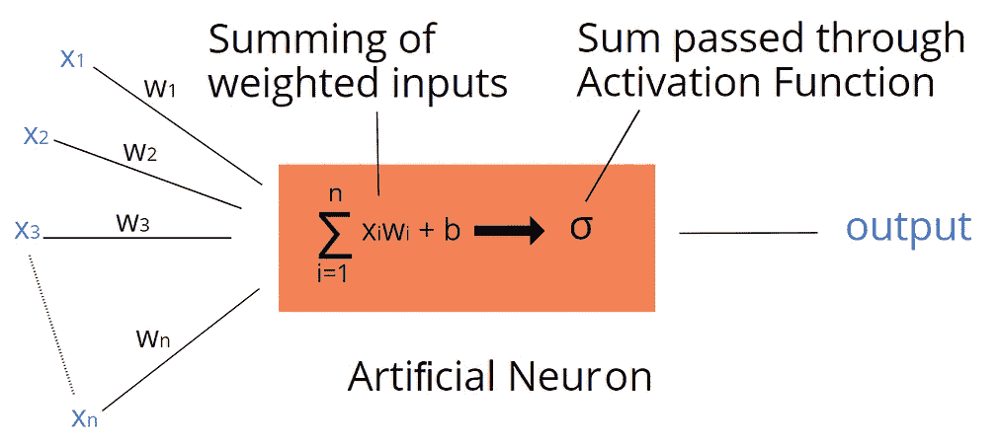

生物和人工神经元

与大脑一样，人工神经网络由相连的神经元组成，但输出数值。一个神经元和它的一个输入神经元之间的每个连接都有一个特定的**权重**。神经元计算来自输入神经元的输出乘以它们各自的权重的总和。然后，它将该结果通过一个**激活函数**产生一个输出值。该**激活功能**限制了可能的输出范围。

# 神经网络是如何学习的？

神经网络通过修改神经元之间连接的权重来产生更好的结果，从而随着时间的推移而改进。这个过程被称为**学习**。一个网络通过**监督学习**或**非监督学习**进行学习。有了监督学习，网络就有了一些已知正确输出的样本输入。通过将其输出与正确的输出进行比较来调整网络，直到它满足可接受的性能。在无监督学习中，网络只是被给予一些输入数据，目的是观察它如何解释和构造这些数据。

## 前馈神经网络

前馈网络将神经元排列成一系列层:

*   一个单一的**输入层**，其神经元拥有来自网络外部信息的值——称为**激活**。
*   一个**输出层**，其神经元的活动是网络的整体输出。
*   在输入和输出层之间，**隐藏层**，它允许网络解释复杂的模式。可以有很多隐藏层。

一层中的每个神经元都与下一层中的每个神经元相连。这些连接总是在朝向输出的方向上，因此得名*前馈*。

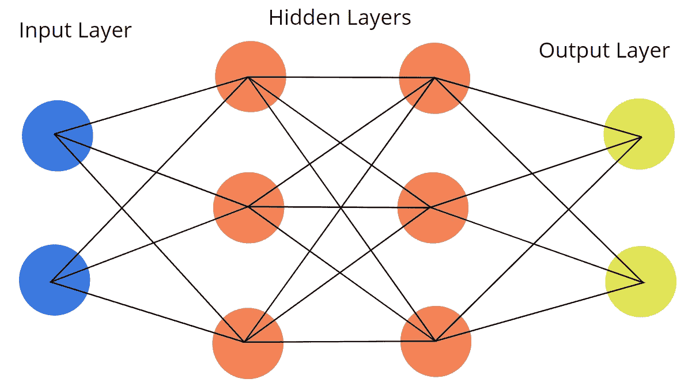

之前提到过，神经元使用**激活函数**计算输出。前馈网络中使用的激活函数被称为 **sigmoid 函数**:

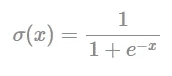

从图中可以看出，该函数将可能的输出范围限制在 0 到 1 之间。

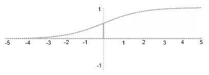

这与感知器的二进制输出相反。在感知器中，即使很小的权重变化也会使加权和超过阈值，从而对网络产生重大影响。这种剧烈的变化不利于学习，因为它会以一种不容易预测的方式显著改变网络的输出。另一方面，sigmoid 函数产生的平滑、连续的输出会受到权重和输入激活的微小调整的微妙影响。

权重可以有任何大小，可以是正的也可以是负的。这意味着一些神经元对它们馈入的神经元的激活具有比其他神经元更大的影响，并且特定输入的激活增加可能导致输出减少。此外，**偏置**值有时被加到加权和上，使得激活倾向于某个值。

前馈网络实现**监督学习**；它们是为学习每一个输入都有正确输出的任务而构建的。当第一次创建前馈网络时，所有的权重和偏差要么被随机化，要么被设置为默认值。无论哪种方式，网络都不太可能产生优于随机的输出。因此，在网络可以使用之前，它必须通过使用**反向传播算法**的训练阶段。

# 反向传播

## 梯度下降

考虑一个多变量的函数，f(x1，x2，…xk) f(x1，x2，…xk)。函数的偏导数是这些变量中每一个的导数，而其他变量是常数。它们表示为:

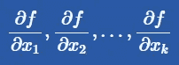

梯度是包含所有偏导数的向量:

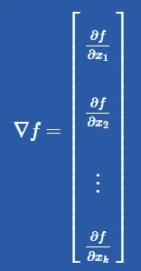

在某一点沿着矢量给定的方向行进，使得函数以尽可能快的速度增加。矢量的大小对应于单位矢量所经过的函数的增长率。由此可见，梯度的负值给出了使函数下降最快的方向。梯度下降是一个迭代过程，在梯度的负值方向上围绕函数“移动”,以找到函数的局部最小值。随着每次迭代，计算新点处的梯度。移动的距离与梯度的大小成比例。

## 价值函数

成本函数是神经网络精确程度的度量，即其输出与期望输出的接近程度。一个简单的成本函数是每个输出神经元的实际值与其期望值之差的平方和。如果输出神经元具有实际激活 a1，a2，…，ak 和预期激活 y1，y2，…，yk，则成本 CC 为:

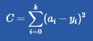

## 反向传播算法

目标是最小化成本函数的输出，因为成本越低，网络的精度越高。为了降低成本，输出层中神经元的激活需要改变。可以通过调整神经元的输入神经元的权重、修改其偏置或改变输入神经元的激活来改变神经元的激活。要改变后者，需要修改这些神经元自身的权重、偏好或自身输入的激活。反向传播是一个递归过程，它通过网络反向工作，在降低成本的方向上调整权重。

这种算法涉及大量复杂的矩阵数学。感兴趣的人可以在这里阅读细节。

## 反向传播的问题

到目前为止所描述的使用带有前馈神经网络的反向传播的方法是 naïve 和简单化的方法。已经开发了改进和技术来加速这种初始方法并减轻其一些问题。首先，上述方法需要很长时间。该方法在低成本值上收敛缓慢，并且需要多次迭代才能达到可接受的精度。因此，已经建议对标准方法进行许多调整，以尝试并加速收敛时间。如上所述，计算成本的标准方法被称为**二次误差**。然而，在 1987 年，Franzini 报告了学习时间减少了 50%，使用了以下方法:[12]

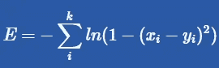

还引入了随机梯度下降的概念，以减少与训练前馈神经网络相关的计算量。在这个模型中，我们从全部训练数据中随机选择一个“小批量”。我们假设这个小批量建议的权重和偏差的变化将类似于我们从整个训练集中获得的变化。这种方法可以获得与在整个集合上训练相似的成功，但是需要更少的计算量。

我们的目标是建立一个能够有效推广 T1 的网络。这意味着*“对于从未用于训练网络的输入/输出模式，网络计算的输入-输出关系是正确的(或接近正确的)。”*【13】存在**过拟合**/过泛化的风险，网络开始记忆训练集本身。在这种情况下，训练数据的正确输出可以几乎完美地重新创建，但网络无法理解与训练示例“相似”的新输入。它只是检测到它们是不同的，而没有产生有价值的输出。

这个问题的一个有用的类比是用多项式来拟合一组数据点。过度拟合类似于为太大的多项式选择一个次数。该曲线仍然符合所提供的数据点，但未能捕捉到投入产出关系的一般形状。

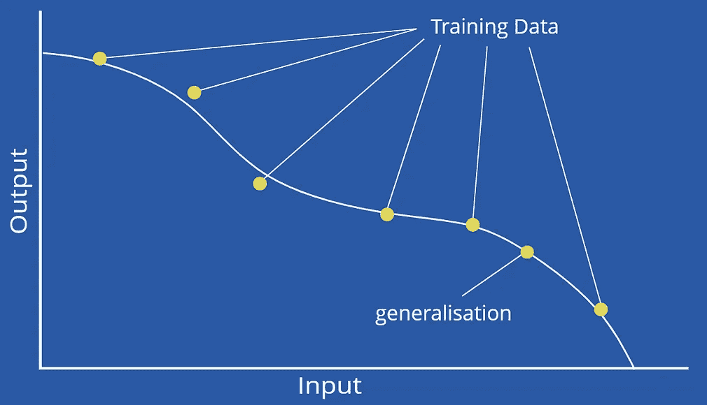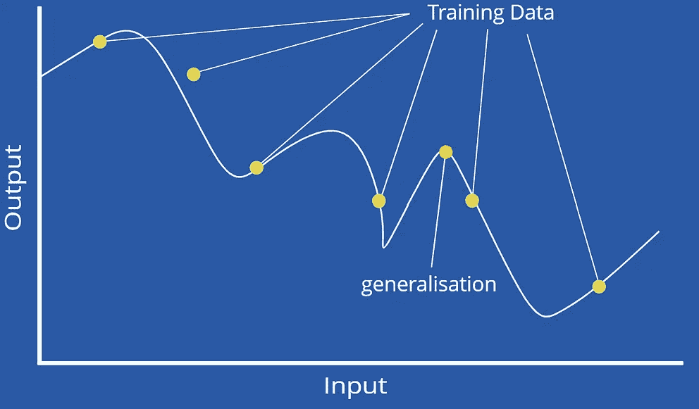

避免过度拟合的最基本方法是使用足够大的训练数据集。

鼓励有价值的概括的另一个简单方法是使用代表更大数据集的训练数据集。归纳有两种类型，内插法和外推法。如果我们试图预测被训练案例包围的新值的输出，那么我们就是在插值。如果新的输入远离任何训练样本，那么我们就在外推。当插值时，网络总是成功的，但是外推更容易出现问题，并且性能经常有问题。具有代表性的数据集减少了外推的需要，因此提高了性能。

## 提前停止

**早停**是另一种提高泛化的方法。在此方法中，常规训练数据在训练和验证之间拆分。训练子集通常用于训练，而验证子集用于跟踪网络的正确性，数据不用于训练。如果验证误差开始增加，则停止训练。

然而，这并不总是可行的。在许多情况下，必须手工建立输入和正确输出之间的关系，这意味着成本通常很高。此外，在一些科学或历史应用中，很难找到训练数据。此外，在早期停止验证数据仍然影响训练，因此验证错误不一定表示泛化错误。

## 梯度下降的局限性

虽然梯度下降法可以找到函数的局部极小值，但它不能保证这个局部极小值就是函数的全局极小值。局部最小值可能高于全局最小值，如下所示:

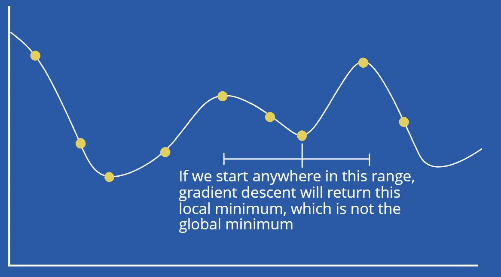

## 调整网络结构

解决反向传播问题的更好方法是改变网络结构。存在调整隐藏层中神经元数量的过程。**修剪方法**从一个大的解决方案开始，并试图减少它，删除网络中冗余和有问题的部分，以实现一个更简单和更高性能的解决方案。一种这样的方法是在被称为*“权重衰减”*的过程中修改误差函数。它基于特别大的重量是有问题的想法。连接到隐藏神经元的大权重值会导致输出函数不连续，而连接到输出神经元的大权重值会产生远远超出数据范围的输出。权重衰减的工作原理是在误差函数中引入一个惩罚项来降低权重。实现这一点的误差函数的示例如下:

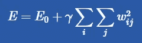

其中 E0 是标准二次差，γγ是用于控制第二项值的常数。在这种方法中，所有权重都以相同的速率趋向于 0。可以通过修改公式来改进该过程，以使较小的重量减少得更快，从而可以更快地移除它们。另一个误差函数实现了这一点:

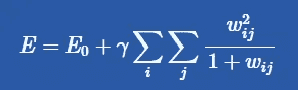

另一种修剪方法是使用基于敏感度的方法。关键的原则是计算哪些神经元和连接对于网络能够完成所需的任务是最不重要的，并消除它们。简化的网络然后通过进一步的训练。基于敏感度的训练的早期尝试将移除连接，测试它是否导致错误显著增加，然后在需要时将其放回。然而，测试所有连接并删除对成本影响最小的连接要有效得多。不管怎样，这两种方法都非常耗时。一种更复杂的启发式方法是由莫泽尔和斯摩棱斯基提出的“骨架化”方法。误差函数相对于被检查的连接的偏导数用于计算连接的“相关性值”。被认为不相关的连接被删除。*‘最佳脑损伤’*是另一种基于灵敏度的方法。它使用误差相对于特定连接的二阶导数来计算该连接的显著性 Sij——重要性:

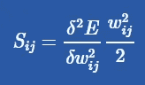

该值指示误差对连接中的微小变化的敏感程度，以便不会删除对最终结果有重大影响的小权重。

其他方法不是从网络中删除元素，而是逐步添加到网络中。一种所谓的**构造方法**是**级联相关**，以自下而上的模式构建树状网络。该算法从直接连接输入层和输出层开始。该网络被训练以学习尽可能多的关联。测量误差。如果它低于网络创建者选择的某个阈值，则算法停止。如果不是，则添加一个新的隐藏神经元，它连接到每个输入和预先存在的隐藏神经元，而这些隐藏神经元最初是没有的。除了输入到新神经元的权重之外，网络中的所有权重都被冻结。调整这些权重以实现新神经元的输出和网络输出误差之间的最大相关性。这是通过最大化以下内容来实现的:

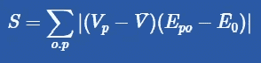

然后，新神经元的输入也被冻结，并连接到输出神经元。网络被重新训练，只调整这些连接。再次测量误差，并与最初使用的相同阈值进行比较。如果具有新添加的神经元的网络已经充分改善，使得现在具有小于阈值的误差，则算法终止。如果网络仍然产生过高的误差值，则添加另一个神经元，并重复该过程。该算法迭代，直到网络误差最终小于阈值。当选择阈值时，我们必须选择一个合理的值；例如，阈值为 0 将需要一个完美的网络，对于大多数问题来说，这意味着算法将永远迭代。

# 神经网络的应用

时间序列是按时间顺序组织的一系列数据点，这种表示信息的方式通常用于货币(股票市场、汇率)和天气。前馈神经网络已被证明特别能够预测时间序列数据。【15】使用风力预测数据和前馈神经网络对风力涡轮机的功率输出进行建模的成功尝试在[中详细描述。](http://ieeexplore.ieee.org/document/6170987/)

下文详细介绍了进一步的科学应用，描述了前馈神经网络如何用于模拟气体沿多孔壁的[运动。](https://www.sciencedirect.com/science/article/pii/S0957417411005550)

前馈神经网络显示出智能的另一个领域是识别手写字符。一个早期的例子是 1989 年 Le Cun 试图识别邮政编码。乐存把汉字分成 16×16 的像素网格。这些像素通过一个网络输入，该网络的三个隐藏层分别有 12、12 和 30 个神经元。Le Cun 能够用 2000 个训练数字实现仅 5%左右的误差。[16]同样，在他的书《神经网络和深度学习》中，迈克尔·尼尔森从零开始构建了一个神经网络来学习识别数字字符。[这本书](http://neuralnetworksanddeeplearning.com/chap1.html#perceptrons)详细介绍了随机梯度下降和批处理模式等技术如何帮助他提高网络的准确性。有效字符识别的应用意义深远——它将允许无数的管理任务实现自动化。

已经发现神经网络在**化学**中的许多应用，关于神经网络在化学*中的应用的文章数量“呈指数增长”*【14】。神经网络已经应用于光谱学、蛋白质折叠、过程控制。[一篇文章](https://www.sciencedirect.com/science/article/pii/S0169743997000610)描述了如何利用网络来预测核磁共振化学位移。

也许最令人兴奋的是，在 20 世纪 80 年代末，卡内基梅隆公司开发了 ALVINN，这是一种经过改装的军用救护车，能够使用车载计算机和前馈神经网络在没有人类干预的情况下驾驶。ALVINN 最初是用图像训练的，可以达到大约 5 英里每小时的速度。后来的版本将网络的一些输出反馈到输入，这意味着它们没有严格遵循前馈模式。然而，任何改变都允许 ALVINN 由实际驾驶它的人来训练；几分钟后，司机可以按下一个按钮，ALVINN 将接管方向盘。ALVINN 已经被证明能够以超过 70 英里/小时的速度安全驾驶，甚至可以正确识别双向道路上需要驶入哪条车道。[本文](https://www.theverge.com/2016/11/27/13752344/alvinn-self-driving-car-1989-cmu-navlab)更详细地解释了 ALVINN，所附视频展示了 ALVINN 在卡内基梅隆大学校园内的使用情况。

## 参考

1.  I .康德，《纯粹理性批判》，德国，亨利·g·博恩，1855 年
2.  D.Svozil，V. Kvasnicka 和 J. Popichal，“多层前馈神经网络简介”，化学计量学和智能实验室系统，第 39 卷，第 1 期，1997 年，第 44 页
3.  C.勒马查尔，“柯西和梯度法”，数学文献增刊，2010 年，第 253 页
4.  E.M. Cliff，“纪念 Henry J. Kelly”，《最优化理论与应用杂志》，第 60 卷，第 1 期，1989 年
5.  米（meter 的缩写））《感知机:计算几何导论》，麻省理工学院，麻省理工学院出版社，1969 年
6.  J.安德森，《神经网络导论》，麻省理工学院，麻省理工学院出版社，1995 年，第 220 页
7.  页（page 的缩写）韦博斯，反向传播的根源，哈佛，威利，1994
8.  D.鲁梅尔哈特，g .辛顿，r .威廉姆斯，通过反向传播错误学习表征，卡内基梅隆大学，1986 年，第 1 页
9.  D.S. Modha，“引入大脑启发的计算机”，[http://www.research.ibm.com/articles/brain-chip.shtml](http://www.research.ibm.com/articles/brain-chip.shtml)，2012 年，(2018 年 2 月访问)
10.  D.Svozil 诉 Kvasnicka 和 J. Popichal，同前。第 46 页
11.  D.Svozil 诉 Kvasnicka 和 J. Popichal，同前。第 46 页
12.  米（meter 的缩写））A. Franzini，“带反向传播的语音识别”，IEE 第 9 届年会。医学和生物工程学会，第 9 卷，第 1 期，1987 年，第 1702-1703 页
13.  D.Svozil 诉 Kvasnicka 和 J. Popichal，同前。第 47 页
14.  D.Svozil 诉 Kvasnicka 和 J. Popichal，同前。第 52 页
15.  H.博兰，y .坎普，“多层感知器和奇异值分解的自动关联”，《生物控制论》，第 59 卷，第 1 期，1988 年
16.  Y.应用于手写邮政编码识别的反向传播算法。神经计算，第一卷，1989