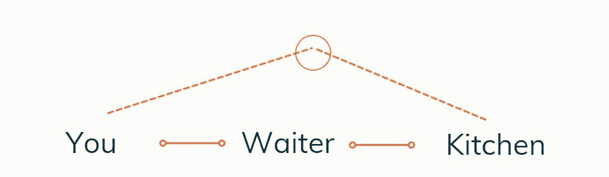
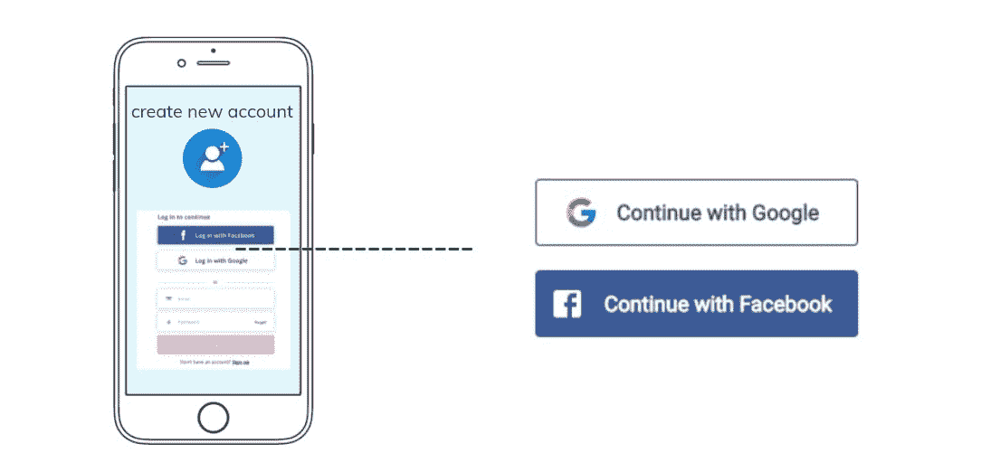
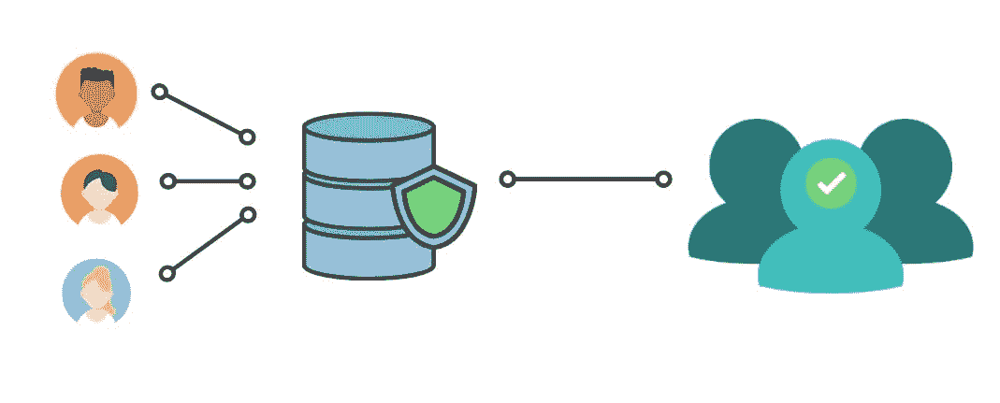
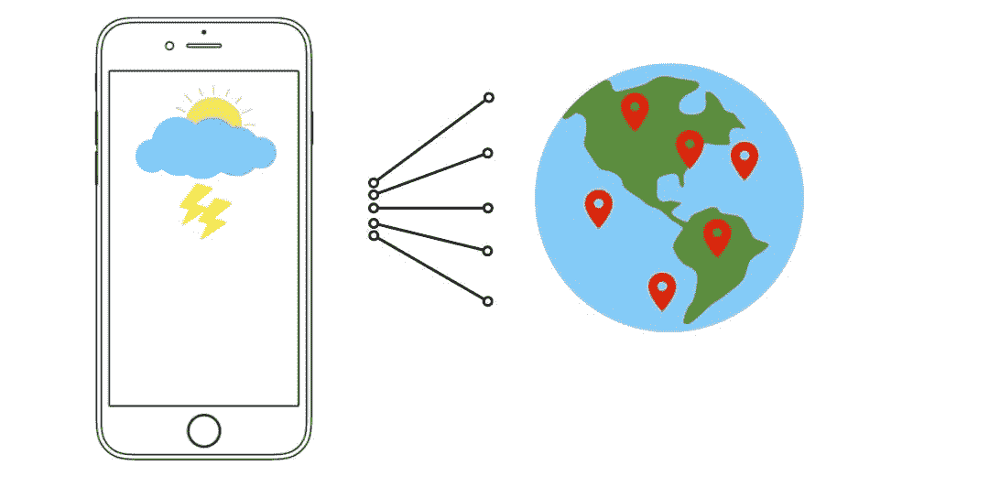
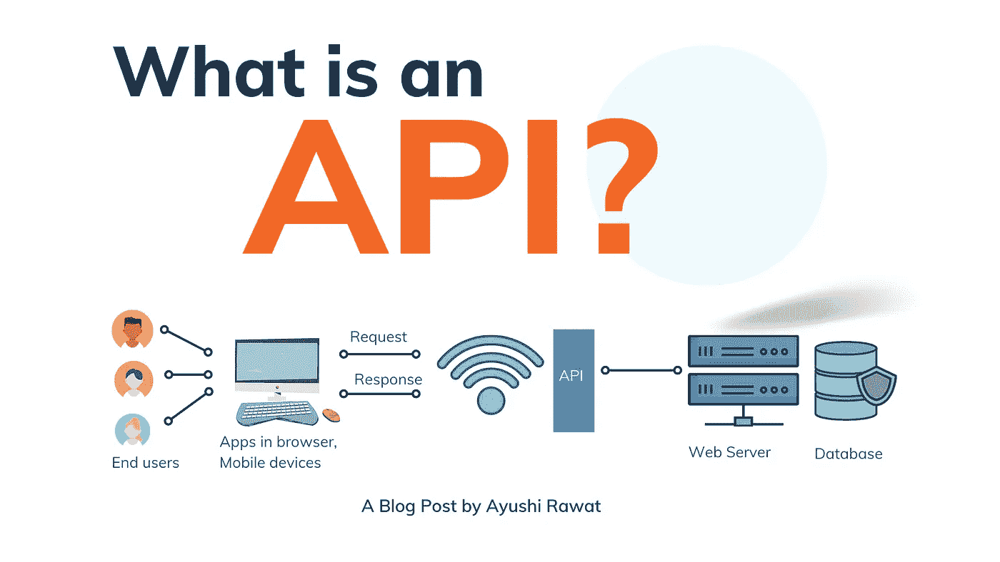

# 什么是 API |适合初学者的 API？

> 原文：<https://medium.com/analytics-vidhya/what-is-an-api-api-for-beginners-4854f34153e?source=collection_archive---------1----------------------->

读者你好！在这篇博文中，我们将用简单的英语学习 API。

你可以参考我的 YouTube 视频教程来看一个工作教程，以便更好地理解和一步一步的指导。

# 这个博客将会涵盖什么

```
1\.    What is an API?
2\.    What is API endpoint?
3\.    What are API functionalities?
```

*我们开始吧！*

# 什么是 API？

API 代表*应用编程接口*。维基百科的定义是:

> API 是[计算机](https://en.wikipedia.org/wiki/Computer)或[计算机程序](https://en.wikipedia.org/wiki/Computer_program)之间的连接。它是一种软件[接口](https://en.wikipedia.org/wiki/Interface_(computing)，为其他[软件](https://en.wikipedia.org/wiki/Software)提供服务。

通俗地说，API 就是一个信使。让我们用一个非常著名的非编程例子来理解这一点。

比方说，你去一家餐馆，服务员给你一张菜单卡。你决定你想吃什么。可以是披萨、意大利面或者薯条。服务员记下你点的菜，然后与厨师分享。一旦你的食物准备好了，他会直接把饭送到你面前。



这是一个非常简单的过程。你不必担心食物是如何准备的，也不必担心厨房里发生的其他事情。在这里，服务员充当了一个 API。他是在你和厨房之间建立连接的纽带。

有不同类型的 API，我们将在下一篇博客中看到。

现在。让我们看一个真实世界的例子。每当你在一个应用程序上创建一个新账户时，你都可以选择注册脸书或谷歌。想知道这是怎么回事吗？



嗯，脸书和谷歌已经有了你的输入，所以这个应用程序通过 API 访问他们的数据库来验证你的证书，而不是执行捕捉每个用户的信息和验证证书的繁琐任务。



另一个非常著名的例子是天气应用程序。如果你想建造一个，你不能亲自去获取来自世界各地的读数。相反，您可以使用第三方 API 来获取天气详情。



# 什么是 API 端点？：

API 为通信设置规则。你不知道后端发生了什么，也不知道它是如何发生的，你只是与 API 接口进行交互并完成工作。

在餐馆的例子中，你不知道食物配方或厨房里的任何东西，你与服务员交互，他在你和厨房之间建立连接，因此，在这个场景中，服务员是你的 API 端点。

这也为安全盗窃敞开了大门。因此，正是因为这个原因，API 使用 API 密钥来添加保护层。API 密钥用于识别和授权，它只不过是一个安全代码，用于跟踪用户。话虽如此，但并不是每个 API 都有一个键。


为了与系统通信，在使用 API 端点时需要遵循某些协议。API 也有相同的文档。

# 基本 API 功能:

1.  在计算机系统之间建立连接并启用数据可访问性。
2.  允许监控用户及其活动。
3.  增强安全性。
4.  通过消除“如何”因素来隐藏复杂性。

就是这样。就这样，结束了！我希望你觉得这篇文章很有用，现在你可以开始用 API 构建一些项目了！

我创建关于职业、博客、编程和生产力的内容，如果你对此感兴趣，请与你的朋友和关系人分享这篇文章。你也可以订阅我的时事通讯，在我每次写东西的时候得到更新！

谢谢你的阅读，如果你已经到目前为止，请喜欢这篇文章，它会鼓励我写更多这样的文章。请分享您的宝贵建议，感谢您的真诚反馈！

我强烈建议你去看看 YouTube 上的视频，别忘了订阅我的频道。我很乐意在 [Twitter](https://twitter.com/ayushi7rawat) | [LinkedIn](https://www.linkedin.com/in/ayushi7rawat/) 与你联系。

你绝对应该看看我的其他博客:

*   [Python 3.9:你需要知道的一切](https://ayushirawat.com/python-39-all-you-need-to-know)
*   [GitHub CLI 1.0:您需要知道的一切](https://ayushirawat.com/github-cli-10-all-you-need-to-know)
*   [如何制作自己的谷歌 Chrome 扩展](https://ayushirawat.com/how-to-make-your-own-google-chrome-extension-1)
*   [从 Python 运行 Javascript】](https://ayushirawat.com/run-javascript-from-python)
*   [使用 Python 自动化 WhatsApp](https://ayushirawat.com/automate-whatsapp-using-python)
*   [使用 Python 自动提供 Cowin 疫苗槽](https://ayushirawat.com/automate-cowin-vaccine-slots-availablity-using-python)
*   [什么是竞争性编程](https://ayushirawat.com/what-is-competitive-programming-or-beginners-guide)

在我的下一篇博客文章中再见，保重！！

