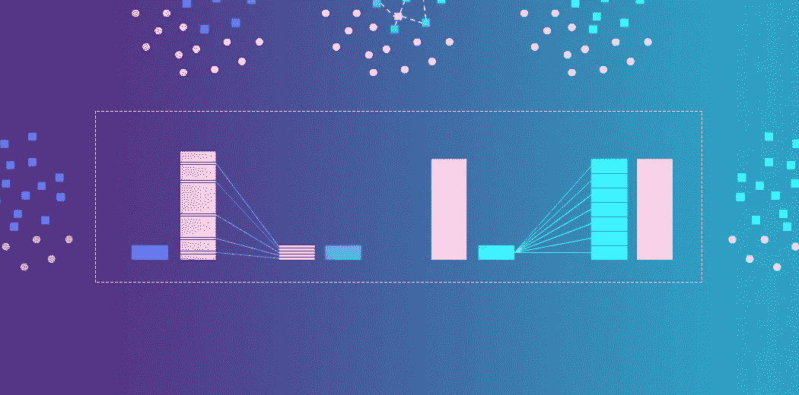
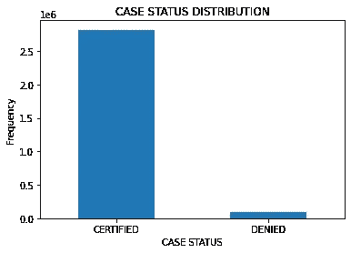

# 什么是不平衡数据？python 中如何处理不平衡数据？

> 原文：<https://medium.com/analytics-vidhya/what-is-an-imbalanced-data-how-to-handle-imbalanced-data-in-python-e6067792950f?source=collection_archive---------9----------------------->

在机器学习中，有时当我们解决分类类型的问题时，我们会看到一个类别的准确率为 95%(类别 1)，而另一个类别的准确率仅为 7.5%(类别 0)。我们可能会想，为什么在我们的项目中会出现这种不相称的精确度呢？为了理解这种比例失调背后的原因，我们需要首先理解以下几点

1.  什么是不平衡数据集？
2.  不平衡分类和不平衡分类(数据集)之间有什么区别？
3.  为什么不平衡数据集是一个问题？

# 什么是不平衡数据集？

不平衡数据集可以定义为“分类预测建模问题，其中样本在类中的分布不相等。”即，等级分布不相等或接近相等，而是有偏差或偏斜的。为了更容易理解，让我们举个例子。

这是 H1-B 签证数据集。在该数据集中，已认证的案例状态接近 280 万，即 96.2%，而被拒绝的案例为 94364，即数据集的 3.2%。这种类型的数据不均匀分布被称为不平衡。

这个问题在异常检测至关重要的情况下尤为突出，例如:-

*   癌症等罕见疾病的识别；肿瘤等，
*   银行中的欺诈交易
*   确定客户流失率(即继续使用某项服务的客户比例)
*   垃圾邮件等。

# 不平衡分类和不平衡分类的区别

*   不平衡指的是曾经平衡而现在不再平衡的阶级分布。
*   不平衡是指一个阶层分布本来就不平衡。

# 为什么不平衡数据集是一个问题？

在我们有不平衡数据集的情况下，使用传统机器学习模型开发的预测模型可能有偏差、不准确，并且倾向于产生不令人满意的分类器。

像决策树和逻辑回归这样的标准分类算法偏向于有几个实例的类。他们倾向于只预测大部分的类数据。少数类的特征被当作噪音，常常被忽略。因此，与多数阶级相比，少数阶级被错误分类的可能性很高。

这是因为机器学习算法通常旨在通过减少错误来提高准确性。因此，它们没有考虑到阶级分布/比例或阶级平衡。

对于大多数案例或任何业务问题，我们主要关注的是少数群体。我们希望模型关注少数阶级，但同时不忽视多数阶级。

# 如何修复数据集不平衡？

可用于修复数据集不平衡的技术有:-

**1。对数据集进行重采样:-**

在这种策略中，我们专注于在将数据作为输入提供给机器学习算法之前，平衡训练数据中的类(数据预处理)。

平衡班级的主要目的是增加少数班级的频率或减少多数班级的频率。这样做是为了获得两个类大约相同数量的实例。从不平衡的数据集生成平衡数据集的两种方法是欠采样和过采样。

**1.1。欠采样**

欠采样通过减少丰富类的大小来平衡数据集。当数据量足够时，使用这种方法。通过将所有样本保存在稀有类中，并在丰富类中随机选择相同数量的样本，可以检索一个平衡的新数据集用于进一步建模。

**1.2。过采样**

相反，当数据量不足时，使用过采样。它试图通过增加稀有样本的大小来平衡数据集。不是去除大量样本，而是通过使用例如重复、引导或 SMOTE(合成少数过采样技术)来生成新的稀有样本。

请注意，一种重采样方法相对于另一种方法没有绝对优势。这两种方法的应用取决于它所应用的用例以及数据集本身。过采样和欠采样的组合通常也是成功的。

**2。使用 K 倍交叉验证:-**

值得注意的是，在使用过采样方法解决不平衡问题时，应适当应用交叉验证。

请记住，过采样获取观察到的稀有样本，并应用于 bootstrap 以基于分布函数生成新的随机数据。如果在过采样之后应用交叉验证，基本上我们所做的就是使我们的模型过度适应特定的人工引导结果。这就是为什么交叉验证应该总是在过采样数据之前进行，就像应该如何实现特征选择一样。只有通过重复重采样数据，才能将随机性引入数据集中，以确保不会出现过拟合问题。

**3。聚类多数类:-**

不是依赖随机样本来覆盖训练样本的多样性，而是将丰富的类聚类成 r 个组，其中 r 是 r 中的病例数。对于每个组，仅保留 medoid(聚类的中心)。然后只使用稀有类和 medoids 训练模型。

# 结论

我们现在终于理解了不平衡数据的含义。不平衡数据集和不平衡数据集之间的区别。由于不平衡数据而出现的问题，以及如何克服或修复这种类型的数据。如果您对本文有任何疑问或建议，请随时通过电子邮件与我联系。快乐学习！