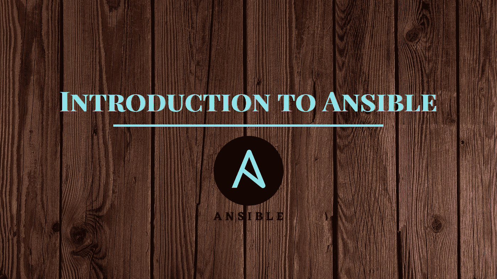

# 什么是 Ansible 及其用例

> 原文：<https://medium.com/analytics-vidhya/what-is-ansible-and-its-use-cases-5b9721416152?source=collection_archive---------1----------------------->

图片由我:)

## ***Ansible..？***

Ansible 是一个开源软件供应、配置管理和应用程序部署工具，支持代码形式的基础设施。简而言之，这是一个简单却非常强大的自动化引擎。

Ansible 可以安装在许多类似 Unix 的系统(Linux)上，您可以使用 Ansible 配置任何类似 Unix 的系统以及 Microsoft windows 系统。

Ansible 最好的一点是它是**无代理**意味着你不需要在被管理的节点/主机上安装任何程序。是不是很神奇？您只需要受管节点上的 ssh 连接，仅此而已。虽然也有其他方法可以连接到受管主机，但 ssh 是首选。

## 为什么 Ansible 会被创造出来？

在大型跨国公司中，每天都有数千台服务器需要配置。现在想象一下，如果您不得不手动配置每台服务器，那将是多么令人厌烦和耗时。这就是 ansible 诞生的原因。Ansible 允许您使用**基础设施作为代码，从一个控制器一次配置多个节点。**

安装了 ansible 的服务器称为控制节点，而配置的远程主机/服务器称为受管节点。

## 但是 Ansible 是怎么做到的呢？

Ansible 使用**声明性语言**，这意味着你只需要告诉它**做什么**而**不要告诉它**怎么做。Ansible 使用 RAL 下划线，代表资源抽象层，这意味着您可以配置目标系统，而不必担心实现细节和其他内部工作。

在 ansible 中，您有两种配置方式:-

1.  即席命令(命令行)
2.  剧本

通常，我们用 Ansible 编写剧本来配置东西。在行动手册中，我们编写了所有需要在远程服务器上配置的任务。剧本包含三件事:- 1)剧本的名称 2)主持人 3)任务。用于编写剧本的格式是 **YAML。**

需要配置的远程服务器或主机在**清单**中提到。库存有两种类型:- 1)静态库存 2)动态库存。如果我们的主机运行在云之上或者在主机频繁启动和关闭的容器引擎中，我们就使用动态清单。

> *ansi ble 的神奇之处在于它的* ***模块*** *。目前 Ansible 中有 750 多个模块，几乎涵盖了从云配置、网络设备配置到容器配置的所有内容。这是因为 ansible 是开源的，非常受社区驱动。*

现在让我们总结一下到目前为止我们看到的关于 Ansible 的要点

1.  无代理
2.  陈述性语言
3.  库存
4.  模块
5.  简单易学

现在我们对 Ansible 有了一些了解，让我们看看 Ansible 的一些行业用例。

## Ansible 的用例

**A)供应环境:-** 假设您有一个需要部署的 web 应用程序，并且您需要用于该应用程序的环境，因此Ansible 可以在各种平台上为您供应环境，如公共云、私有云，甚至裸机。

**B)配置服务器:-**ansi ble 主要用于配置管理。在公司中，您需要每天配置服务器，用于各种目的，例如托管网站。因此 ansible 可以根据需要配置您的服务器，只需点击一下鼠标就可以启动服务。

**C)防火墙配置:-** 使用 ansible，您可以创建防火墙规则并将其应用于多台主机，以确保您的服务器是安全的，并且只有必需的端口是开放的和监听的。

**D)安全补丁:-** 更新和安全补丁对于确保您的服务器免受最新的网络攻击非常重要。使用 Ansible，您可以确保您的所有软件包都是最新的，还可以将安全补丁应用到您的服务器。

**E)应用程序部署:-** 借助 ansible，您可以轻松快速地自动化应用程序部署流程。

ansible 可以为您解决数百个其他用例，但这些是最常见的一些用例。

所以我希望这篇文章有助于你理解 ansible 是什么，以及它为我们解决的一些用例。

如果您有任何疑问，请随时在 LinkedIn 上联系我，您也可以在我的 LinkedIn 上查看可行用例的实践，以获得更多了解。这就是这篇文章的内容，我们将在下一篇文章中讨论一些有趣的话题。再见！

请点赞，分享！！