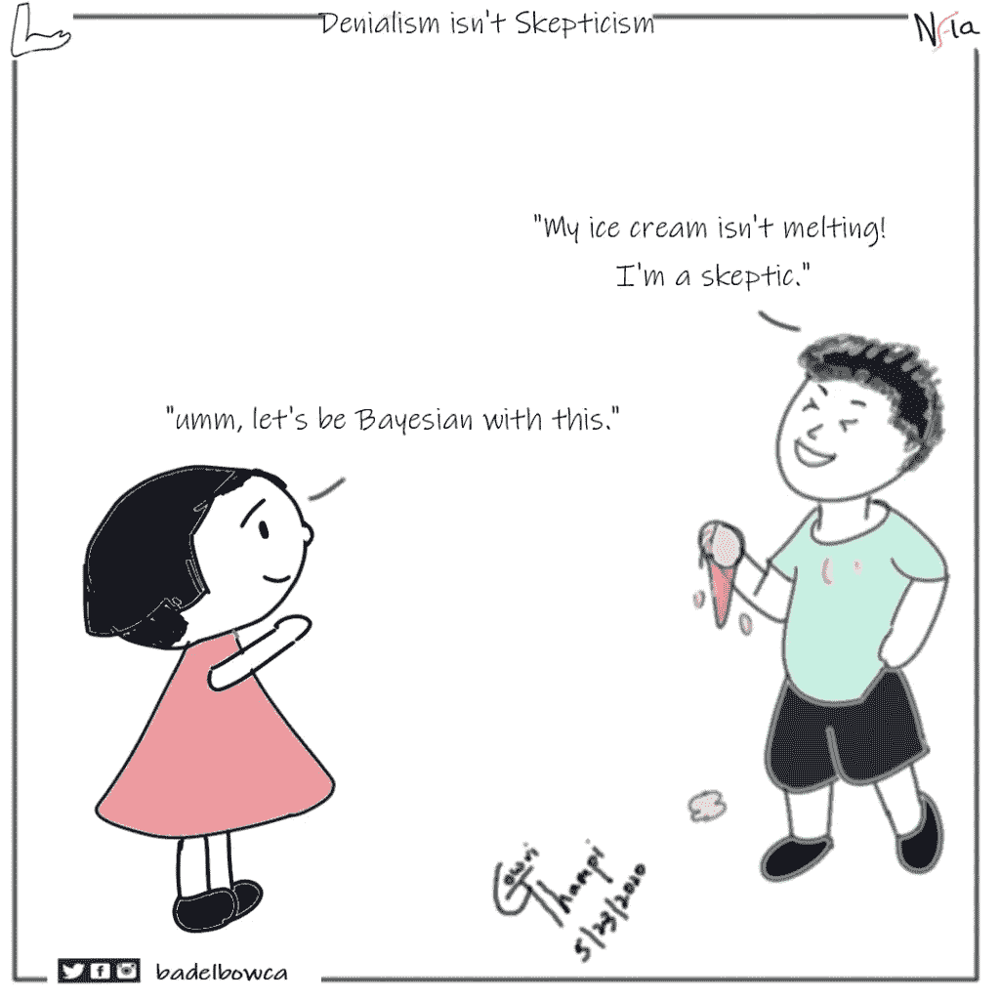
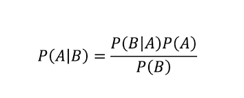
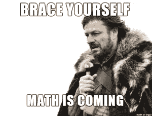
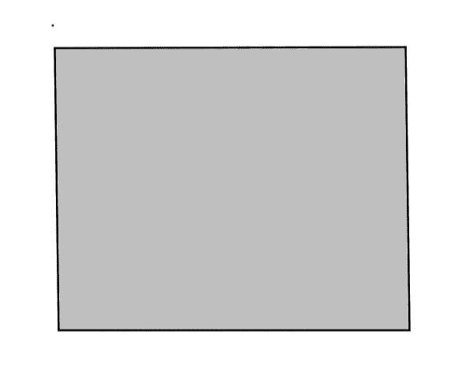
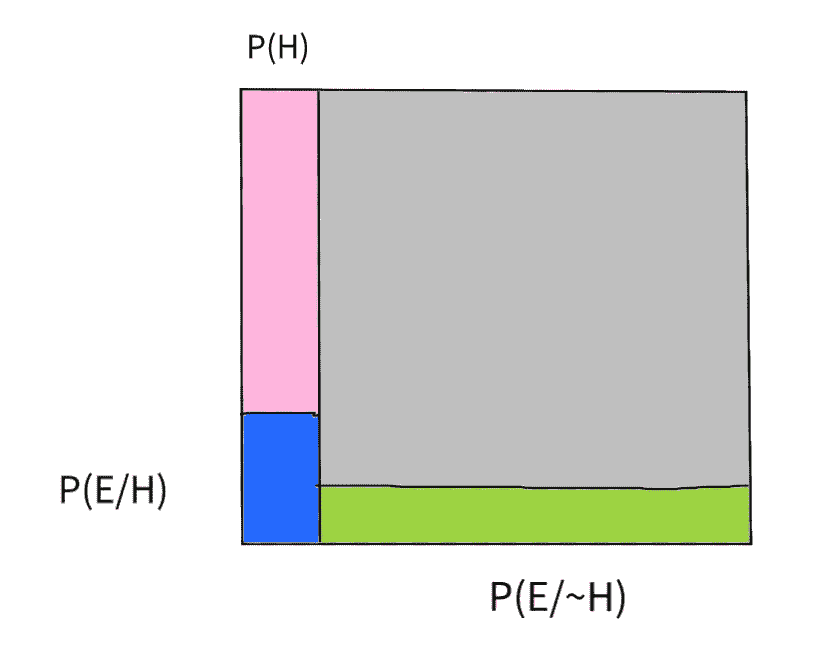
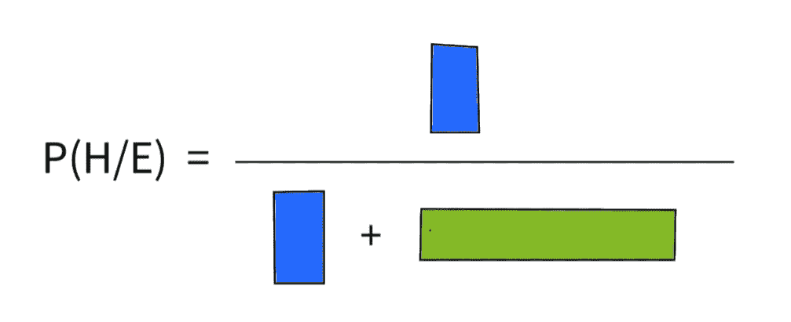
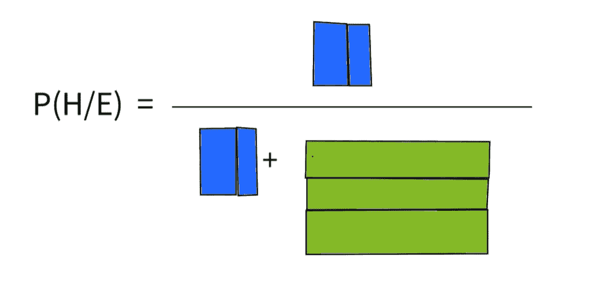
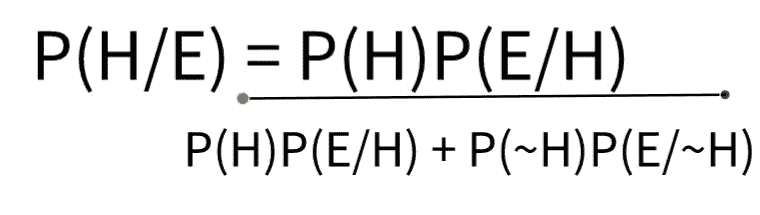
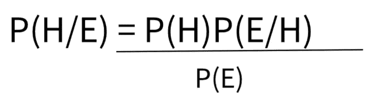

# 贝叶斯方法是什么，它揭示的人生价值是什么？

> 原文：<https://medium.com/analytics-vidhya/what-is-bayesian-approach-and-the-value-it-reveals-for-life-3f9239410945?source=collection_archive---------10----------------------->

在这篇博客中，让我们来看看什么是统计学中的贝叶斯定理，以及它意味着什么。贝叶斯是这种统计方法的追随者。在此之前，我们将了解理解贝叶斯定理所需的基础知识，如条件概率、事件类型等。

做一个贝叶斯！！鸣谢:谷歌

本博客最后知道这个定理后这个形象就有意义了。

我们在高中都学过概率。它告诉我们特定事件发生的可能性。这种可能性叫做概率。

例:概率(在六面骰子中掷出偶数= 3/6 = 1/2)

由于此事件{2，4，6}
有三种可能的结果，其样本空间为{1，2，3，4，5，6}

我们看到了什么是概率。现在让我们继续什么是条件概率。

# **条件概率**

这表示一个事件已经发生的概率(或基于前一个事件发生的概率)。用 **P(B/A)表示。**给定 A 称为 as B .其中 A 为第一事件，B 为第二事件

让我们看一些解释这个定义的例子。

一副牌中第二张牌是王后，第一张牌是国王的概率是多少？

在这里，拿国王是第一件事，所以 P(A) = 4/52
因为一副牌中有 52 张牌，4 个国王是可行的。

王后的概率用 P(B/A)表示，因为事件已经发生。现在
P(B/A) = 4/51
注意样本空间是 51，因为已经从 52 张牌中抽取了一张 k。女王必须从剩下的 51 张牌中取牌。

# **独立和非独立事件**

在独立事件中，一个事件的结果不会影响另一个事件的结果。

在从属事件中，一个事件的结果取决于另一个事件的结果。比如我们在条件概率中看到的。
**例:**选择一个王后，国王已经从牌堆里抽出来了。
这里抽皇后的概率取决于事件之前的结果。

考虑一下这个掷骰子的例子，
**第一事件** -得到 1 的概率
**第二事件**-得到 2 的概率
P(A) = 1/6
P(B) = 1/6
这里 P(B/A)也是 1/6
因此，P(B/A) = P(B)

在第二个国王后得到王后的例子中，
得到国王的概率 P(A) = 4/52
得到王后的概率 P(B) = 4/ 52
这里，得到国王后得到王后的概率
P(B/A) = 4/51
所以，现在 P(B) ≠ P(B/A)

> 所以，这就告诉了
> 当 **P(B) = P(B/A)** 时，事件 A 和 B 是**独立的**
> 和
> 当 **P(B) ≠ P(B/A)** 时，事件 A 和 B 是**依赖的**

因此，条件概率被用来判断事件是相关的还是独立的。

有了这个，我们可以说序列中两个独立事件发生的概率是
**P( A 和 B ) = P(A)。P(B)**
对于两个相依事件
**P(A 和 B) = P(A)。P(B/A)**

现在，有了对基本概率的这些理解，让我们继续讨论主要成分“贝叶斯定理”

# **贝叶斯定理**

贝叶斯定理被定义为

这用于在事件 B 已经发生的情况下找到事件 A 的概率。

但是，我们究竟为什么要用这个呢？让我们看一个例子

考虑一个作者出版一本书的例子。从读者的反馈中，作者得到两种反馈，一种是读者对作者在书中所说的内容的信念，另一种群体对作者的内容提出异议。作者从他们的朋友和家人那里得到了很大的反馈。所以，他相信他的书将会是他的巨大成功。

因此，我们的工作是根据观众的反馈，找出作者的内容是真实的概率。

用统计学术语来说，让我们把
作者的内容真实看作是**的假设(H)**
而把读者的反馈看作是**的证据(E)**
我们得找到 **P(H/E)**

考虑这个灰色的盒子包含了那些给出反馈的人。它包含相信内容的人和拒绝内容的人。它给出了 P(E)(它包含 P(H)和 P(~H)。

左边的竖线(包括粉色和蓝色区域)表示相信作者内容是真实的人。剩下的区域(绿色和灰色)给了人们他们拒绝的内容 P(~H)。我们正在考虑从盒子中取出一小部分来寻找 P(H/E ),根据证据证明他的假设是正确的。

P(E/H)(蓝色区域)表示假设为真的人的证据，而 P(E/~H)表示假设为假的人的证据(即，它考虑不相信其内容的人)。

这通过提供证据的被考虑的或一定数量的人(包括被接受和被拒绝的观众)来告诉接受内容的人的数量。如果这个公式给出 16.5 %，它告诉大约 16%的人喜欢作者的内容。

从长远来看，它会像

因此，考虑到更多的区域进入画面，数字将得到更新。它可以根据包含可能接受或可能不接受该内容的证据的区域而增加或减少。

根据这些图片，该公式将被构造为

分子表示相信假设为真的人数，以及假设为真的证据。分母考虑考虑假设真假的证据总量。

它可以简化为

因此，我们从我们的例子中得到了贝叶斯定理。🎉 🎉 🎉

P(H)-先验(在任何证据之前告诉假设是真的)

P(E/H)-可能性(看到假设为真的证据)

P(E)-证据(包括假设的真假)

P(H/E)-后验(给定一些证据的假设的概率)

术语“后”的意思是“随后”。所以，这个公式讲的是看到证据后假设的概率。

因此，最终的结果将告诉基于证据的作者假设为真的概率。

现在，当我们稍微修改这个定理时，
用 A 和 B 代替 H 和 E

P(B)P(A/B) = P(A)P(B/A)

当我们考虑这个例子时，我们在我们的相关事件(即)中得到一个国王后的概率
P(K) = 4/52 和 P(Q/K) = 4/51

P(Q) = 4/52(先从甲板上拿皇后)
P(K/Q) = 4/51

所以，这也证明了贝叶斯定理
P(K)P(Q/K) = P(Q)P(K/Q)

因此，贝叶斯定理被用来说明一个事件如何依赖于另一个事件。从属事件

在现实生活中的例子，如果一个人依赖另一个人，一个人上学的概率，如果另一个人缺席使用贝叶斯定理，而不是使用个人的概率进行计算。因为贝叶斯定理是使用证据而不是先验知识。

# **生命价值来自贝叶斯定理**

最终，这个贝叶斯定理告诉我们的是，我们不应该相信我们先前的想法。我们应该根据我们在生活中所学到的知识来更新我们的信念。

现在回到顶部，这个涂鸦现在有意义了。😃

PS:欢迎反馈！！并为糟糕的图表道歉

干杯，

巴格瓦蒂·普里亚

参考:

[https://www . coursera . org/learn/Bayesian-methods-in-machine-learning/](https://www.coursera.org/learn/bayesian-methods-in-machine-learning/home/welcome)

https://www.youtube.com/watch?v=HZGCoVF3YvM:这是一颗宝石