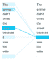

# 伯特是什么？

> 原文：<https://medium.com/analytics-vidhya/what-is-bert-e758ee2b2ab5?source=collection_archive---------15----------------------->

*BERT 代表变压器的双向编码器表示。这里的每个单词都有它的含义，到本文结束时我们会明白的*

# 介绍

*BERT 是一个通用框架，用于解决各种 NLP 任务，包括问题回答(SQuAD v1.1)、分类(MNLI)等。它通过理解文本衔接从大型纯文本中学习语言，然后通过对较小的标签数据集进行微调来进一步学习语言，具体到自然语言任务。*

# 注意机制:自我注意

*同一个词在不同的上下文中可以有不同的意思。例如:*

*过了 _____* 我到了银行

如果不知道词尾，我们就无法知道这个“银行”是指河流还是金融机构。

*BERT 根据周围的所有单词来学习单词上下文，就像人类一样！这是通过自我关注来实现的。让我们来理解一下*

[来源](https://www.analyticsvidhya.com/blog/2019/06/understanding-transformers-nlp-state-of-the-art-models/?utm_source=blog&utm_medium=demystifying-bert-groundbreaking-nlp-framework)

*这句话中的“它”指的是什么？它指的是街道还是动物？对人类来说这是一个简单的问题，但对算法来说就不那么简单了。*

*自我关注解决了这个问题。它允许模型查看句子中的其他单词，以更好地理解“它”。*

把一个句子中的每一个单词和其他每一个单词联系起来，这叫做自我注意。让我们通过一个例子来看看如何计算自我关注度。

想想这句话——“行动得到结果”。

[来源](https://www.analyticsvidhya.com/blog/2019/06/understanding-transformers-nlp-state-of-the-art-models/?utm_source=blog&utm_medium=demystifying-bert-groundbreaking-nlp-framework)

1.  我们为给定短语创建了三个向量:查询向量、关键向量、值向量。这些向量在训练过程中被训练和更新。完成本节后，我们会对他们的角色有更多的了解
2.  *通过取查询向量(q1)与所有单词的关键字向量(k1，k2，k3)的点积来计算第一个单词“Action”的分数。*
3.  *然后，这些分数除以 8，这是关键向量的维数的平方根*
4.  *接下来，使用 softmax 激活函数对这些分数进行归一化。*
5.  *然后，将这些归一化的分数乘以值向量(v1，v2，v3 ),并将结果向量相加，以得到最终向量(z1)。然后作为输入传递给前馈网络:*

*所以，z1 是输入序列“Action gets results”第一个单词的自我注意向量。*

***就是这样——注意力只是加权平均的一个花哨名字！***

# 变压器编码器

*Transformer encoder 是一种神经网络，它接受一个序列作为输入(例如一个单词序列)，并产生一些输出(例如情感预测)。与传统的循环网络(如 LSTMs)依次处理每个序列元素不同，编码器通过称为自关注的过程在各个元素之间形成直接连接，从而同时处理所有元素。这不仅实现了更高的并行性，还提高了一系列任务的准确性。*

[来源](http://jalammar.github.io/illustrated-transformer/)

*自我注意不考虑单词的排序。为了解决这个问题，transformer 编码器向每个输入嵌入添加一个向量，该向量确定每个单词的位置，或者序列中不同单词之间的距离。*

# 伯特建筑

*BERT 架构建立在变压器编码器之上。*

[来源](https://towardsdatascience.com/bert-explained-state-of-the-art-language-model-for-nlp-f8b21a9b6270)

*在将单词序列输入 BERT 之前，每个序列中 15%的单词被替换为一个【掩码】标记。然后，该模型尝试根据序列中其他未屏蔽单词提供的上下文来预测屏蔽单词的原始值。在技术术语中，输出字的预测需要:*

1.  *在编码器输出的顶部添加分类层。*
2.  *将输出向量乘以嵌入矩阵，将其转换到词汇维度。*
3.  *用 softmax 计算词汇中每个词的概率。*

# 结论

*BERT 通过使用转换器模型从令牌上下文的左侧和右侧获取信息来生成嵌入，因此被称为来自转换器的双向编码器表示。*