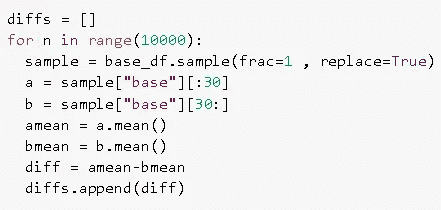
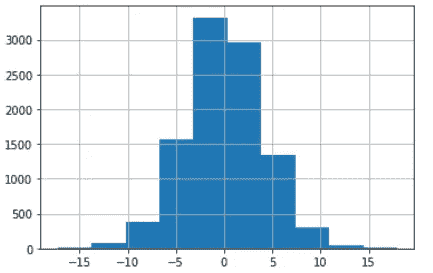
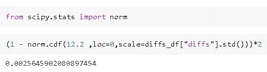
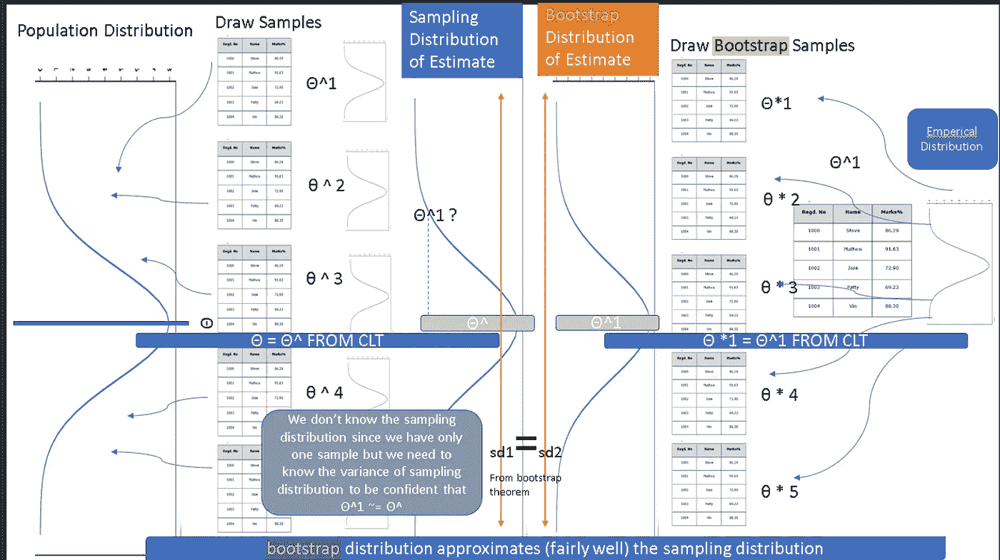

# 什么是机器学习中的自举？

> 原文：<https://medium.com/analytics-vidhya/what-is-bootstrapping-in-machine-learning-777fc44e222a?source=collection_archive---------1----------------------->

大多数统计学处理的是比较两个事物，并确定它们在现实中是否不同，或者只是我们随机观察到我们收集的样本有差异，但实际上没有差异。这就是统计学如此令人兴奋的原因。比如 iphone13 的性能真的比 iphone10 好吗？或者我建立的机器学习模型真的比现有的系统更好吗？

以 iphone 为例，你会怎么做？假设您根据打开优步应用程序所需的毫秒数来衡量性能。所以你会打开应用程序很多次，并注意每一次两部手机所用的时间。

iphone13 = [120，100，110，90，115，123，114，103，111，107，103，118，113，112，121，110，117，115，119，108，124，111，112，113，113，11，112，110，109，109]

iphone10 = [123，119，115，112，100，121，125，122，125，123，128，122，119，118，112，112，126，122，123，127，122，123，119，129，122]

假设这是您观察到的情况，并且现在想要找出性能之间是否存在实际差异。

# 天真的方法

一种天真的方法是采取手段进行比较

iphone13_mean =108.43

iphone10_mean =120.63

现在你可以得出结论，iphone13 表现更好。

但是，如果你进行另一组测量，你能确定这种差异会再次被观察到吗？你能放心地去告诉你的经理，是的，他们的表现有所不同吗？如果他们进行自己的实验，发现两个模型实际上非常相似，该怎么办？

你怎么能确定？

# 传统方法

第二种方法是传统的统计测试

在这种方法中，您

1.  计算 t 统计量
2.  在 t 表中查找理论分布
3.  如果你发现 T 的观察值的概率在理论分布的上 5%(相当任意的阈值)，那么你得出结论，观察到的差异不是因为随机的机会

对于刚刚接触统计测试的人来说，这些测试感觉很武断，因为它们通常像黑盒一样，使用解释不清的阈值，比如 5%

问题来了:我们能做得更好吗？

# 拔靴带

Bootstrapping 是由 Bradley Efron(我猜和扎克·埃夫隆没有关系)在 1979 年提出的[EFRON_1979]。他指出，传统的方法是参数化的，依赖于正态分布理论

这种[传统]方法最明显的缺陷是使用正态分布理论来确定观察值变得“显著”的临界值。主要自 1950 年发展起来的非参数统计给出了一个不依赖于正常理论的答案

他提出了什么建议？

他说如果我们真的想确定 iphone13 比 iphone10 更好。那么，让我们先假设它们不是，我们所做的所有测量都是针对一款名为 iphone_base 的基础 iphone 型号，苹果公司巧妙地将它重新命名，并作为 iphone10 和 iphone13 销售。

所以现在我们有了

iphone_base= [120，100，110，90，115，123，114，103，111，107，103，118，113，112，121，110，117，115，119，108，124，111，112，113，113，11，112，110，109，109，122

现在，如果我们考虑这个 iphone_base 的所有可能的等分(因为我们对每部手机进行了相同数量的测量),那么只有一个

N = 60！/ (30!30!)将符合我们观察到的。其余所有组合将混合 iphone13 和 iphone10 的尺寸。

在这 N 个组合的每一个中，我们计算(分割 A 的平均值)和(分割 B 的平均值)之间的差。因为我们已经混合了测量值，所以我们应该期望差异接近于零，除了我们实际观察到的情况。如果观察到的差异在计算的所有 N 个差异的 5%之内，那么我们可以说观察到的差异在统计上是显著的。

现在问题是 60！/ (30!30!)是超过万亿个组合，这对于仅仅 60 个值来说也是如此！

正如埃夫龙所说，“非参数方法为摆脱正态分布理论付出了高昂的计算代价。”是啊，让我们称之为僵硬。

但是他确实强调了这一点，如果我们试图确定我们的结论，我们可以直接进行计算，而不是对其进行参数假设。

好了，我们明白了，这是一个很酷的方法，实际上并不实用，所以基本上是无用的，我们必须回到那些黑盒 t 测试，对吗？

不，这是事情变得有趣的地方，随机性来拯救。

想法是，如果我们不评估所有可能的组合，而是评估随机选择的组合中选定的数量(N ),其中 n <<<< N？那能行吗？

太好了。

这里的关键是随机选择替换。

对于我们拥有的数据，假设我们决定 n= 10，000。

然后我们用替换从我们的观察中取样。将其分成 2 等份，计算并记录两个样本平均值之间的差异。

这种自举差异看起来像什么？

这是我们所期望的，对吗？因为我们结合了两部 iphones 的测量结果，我们预计平均而言，随机样本将包括两部手机的测量结果，平均值的差异应该接近于零。

我们之前观察到的是

iphone13_mean =108.43

iphone10_mean =120.63

这里的差异是 12 毫秒。在上图中，我们观察到这种差异的可能性有多大？不太可能，意味着表演确实不同。另一件要注意的事情是，如果观察到的差异是 2 毫秒，那么看上面的图，我们将无法得出这些实际上是不同的结论，因为根据上面的图/分布，观察到 2 毫秒的差异是非常可能的。

我们可以假设数据正态分布，均值为 0，标准差为 4.04(根据自举差异数据计算)，而不是目测图表。现在使用正态分布的累积分布函数我们可以找到获得+- 12 毫秒的精确概率。

现在，这个值大约为 0.0025，因此，如果这些观察真的是针对真实的 iphone_base 模型，那么只有 0.25%的机会观察到 12 毫秒的差异。

# 自举为什么有效？

哦，孩子，你真的很好奇，不是吗？

让我尝试失败。

想象一下，你可以接触到所有生产过的 iphone13 和 iphone10，并且在这些手机生产出来并准备发货后，你已经对它们进行了测量。所以基本上你可以接触到所有可能的性能测量。

现在，既然您已经有了所有可能的度量，即使上面讨论的简单方法也可以。就把所有可能的差异(如果你能收集所有的 iphones，我打赌你也能做到这一点。一起玩)并接受他们意思，然后结束它。

现在假设你从所有可能的差异计算中随机抽取样本。那么对于每个随机样本，你会得到一个与原始方法相比略有不同的估计值(平均值)。这种差异称为抽样误差，这种估计值的分布称为估计值的抽样分布(见下图左侧)。其中θ是 iphone13 和 iphone10 的性能差异。theta、theta…等是从人群的每个随机样本中观察到的 iphone13 和 iphone10 的性能差异)

因此，为了真正确定 iphone13 和 iphone10 的性能存在差异，我们可以查看采样分布，并计算在此采样分布中观察到差异的可能性有多大。

但问题是，不，我们不能收集所有可能的 iphone13s 和 iphone10s，不，我们不能计算所有可能的差异，不，我们不能从真实人群中抽取样本。

这就是自举的用武之地。

Boostrapping 帮助我们估计标准误差，方法是从现实生活中我们通常拥有的唯一样本中抽取随机样本进行替换(见下图右侧)。

这个的理论证明超出了我的解释，因为它变得太数学太快，但可以在这里找到一个愉快的阅读；)【SWANEPOEL】

自举如何工作

还有什么问题吗？请随时通过 LinkedIn 联系我

# 来源

[EFRON _ 1979](【https://sci-hub.se/https://doi.org/10.1137/1021092】T2

【SWANEPOEL】([https://sci-hub . se/https://doi . org/10.1080/03610928608829303](https://sci-hub.se/https://doi.org/10.1080/03610928608829303))