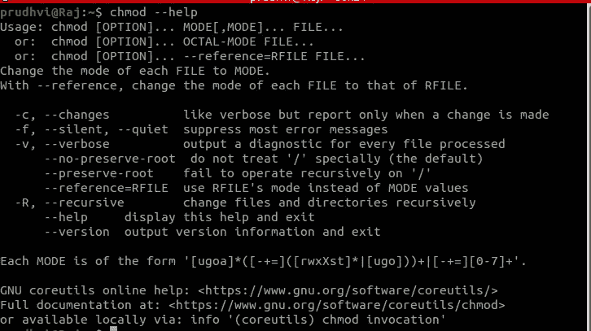

# 什么是 chmod？

> 原文：<https://medium.com/analytics-vidhya/what-is-chmod-1889a4754d40?source=collection_archive---------1----------------------->

当我开始为 Linux 环境中的自动化构建应用程序或开发脚本时，我遇到了一个关键字“ **chmod** ”，它根据场景赋予文件执行、读取或写入的权限。在本文中，我们将研究 chmod 及其参数的用法。

chmod

# chmod

这是 Linux/Unix 发行版中的一个命令，用于更改属性和授予文件/文件夹权限。