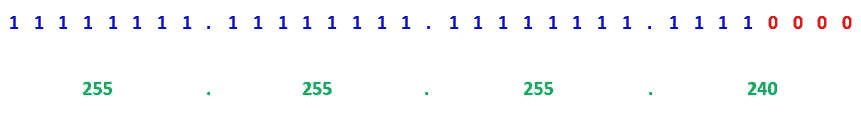
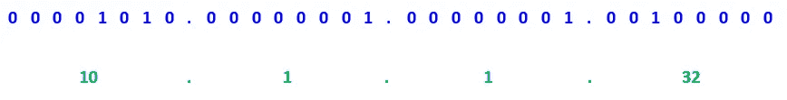
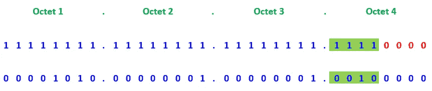
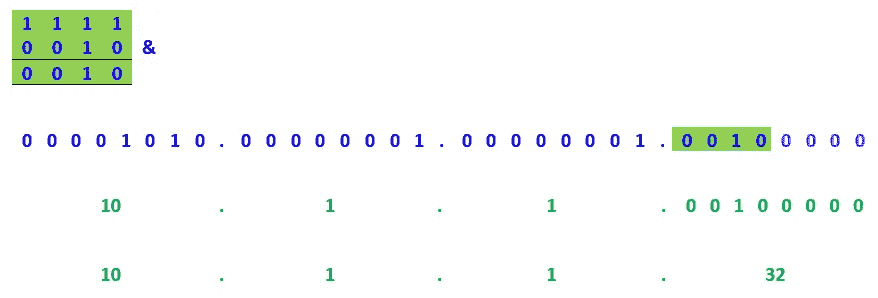
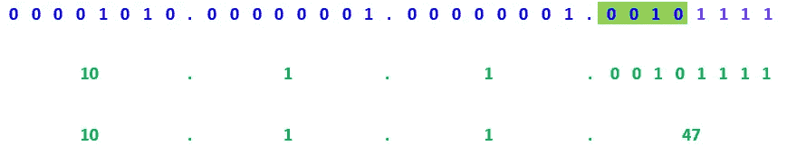

# 无类域间路由(CIDR)

> 原文：<https://medium.com/analytics-vidhya/what-is-cidr-classless-inter-domain-routing-de1238c478e0?source=collection_archive---------4----------------------->

CIDR 代表无类域间路由，用于路由和 IP 寻址。CIDR 也称为超网。CIRD 地址由前缀和后缀两组数字组成。这里，前缀意味着使用二进制数字表示网络地址，类似于普通的 IP 地址。后缀是指网络地址中的位数。拥有 CIDR 的目的是减缓因特网上路由器上路由表的增长，以及减少 IPv4 地址的快速耗尽。IPv4 地址最多允许 32 位，而在 IPv6 地址中可以增加到 128 位。

让我们看看 CIDR 符号

10.1.1.32/28

这里前缀是 **10.1.1.32** ， **28** 是这个网络地址(后缀)的位数。

**计算主机数量**

让我们找到网络地址和广播地址

**步骤 01:**

考虑 CIRD 后缀，生成二进制格式的子网掩码。

**步骤 02:**

**步骤 03:**

让我们来计算一下网络地址。

为了计算网络地址，我们应该考虑步骤 1 和步骤 2 中地址的第 4 个二进制八位数。

**步骤 04:**

**为了计算网络地址**，对第 4 个八位字节的位组(属于为后缀生成的子网掩码)进行 and 运算，剩余的 4 位应该为零。

**为了计算广播地址**，对第 4 个八位字节中的位组(属于后缀)进行“与”运算，剩下的 4 位应该都是 1。(我们已经计算过了)

可作为主机的范围是从**10 . 1 . 1 . 33–10 . 1 . 1 . 46。**

**奖励积分😎✌**

***32 位—网络位***

***= 32–28***

***=4***

***总主持人= 2⁴–2 = 16–2 = 14***

(网络地址和广播地址从 2⁴减少 2)

感谢您的阅读…！！！！😃😃✨

注意安全…！！！😷😷