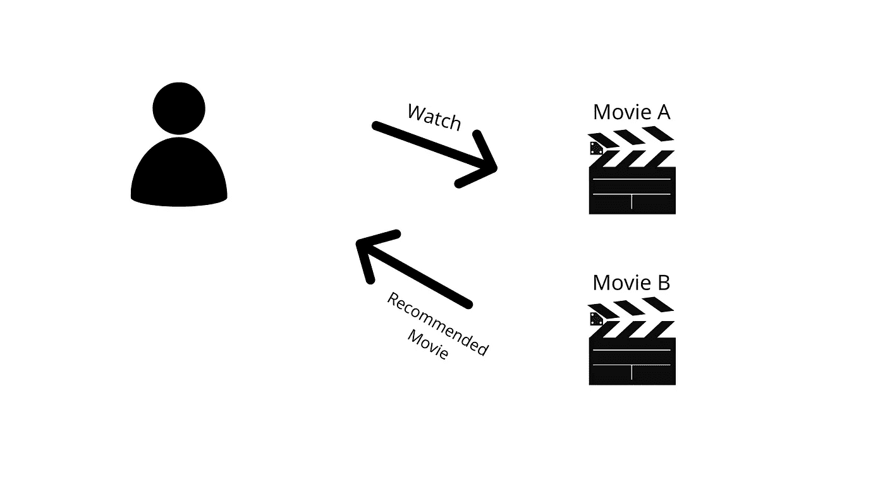
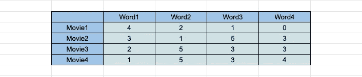
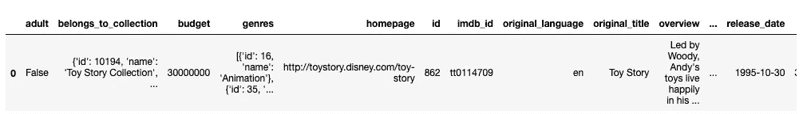
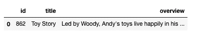
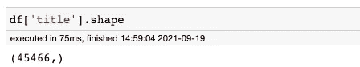
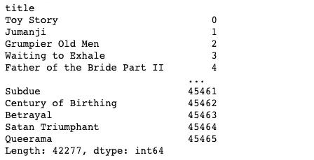
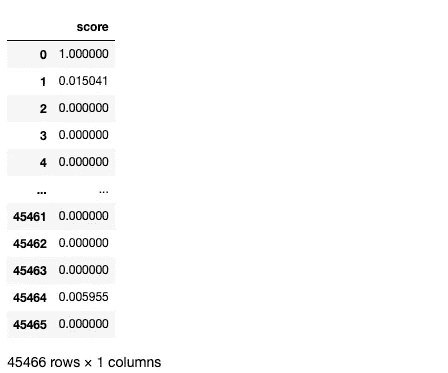
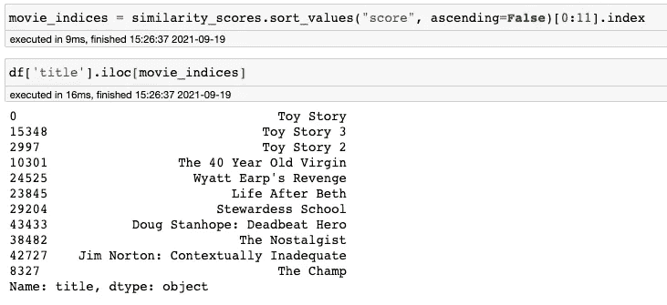
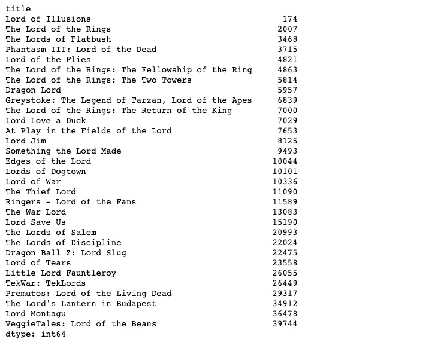
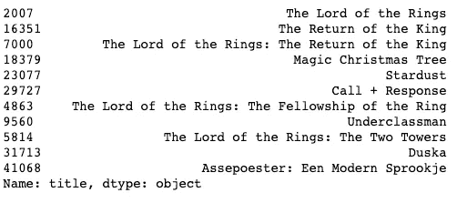

# 什么是基于内容的过滤？Python 中的一个应用实例

> 原文：<https://medium.com/analytics-vidhya/what-is-content-based-filtering-an-applied-example-in-python-42acb4cbaa30?source=collection_archive---------0----------------------->

基于内容过滤的电影推荐系统开发

你好。在这个故事中，我们将试图涵盖什么是基于内容的过滤，我们将通过使用这个数据集来编写一个简单的电影推荐程序。该数据集包含电影和用户评级数据。


由[弗兰基·查马基](https://unsplash.com/@franki?utm_source=unsplash&utm_medium=referral&utm_content=creditCopyText)在 [Unsplash](https://unsplash.com/s/photos/artificial-intelligence?utm_source=unsplash&utm_medium=referral&utm_content=creditCopyText) 上拍摄的照片

# 介绍

有几种类型的推荐系统技术。基于内容的过滤就是其中之一。我们可以简单地解释为；这种技术通过使用项目的描述来创建推荐。



# 什么是基于内容的过滤？

如上所述，我们将使用项目的描述或我们将用于创建推荐系统的功能。然而，正如我们所知，计算机不能像我们理解的那样理解我们的文本。例如，当我正在搜索一部周日晚上的电影时，如果我在电影的描述中看到“战争”这个词，我可以理解为这部电影是关于战争的。但是当电脑看到这个词时，它将不能识别这部电影是关于战争的。这不是他们的本性。因此，我们需要将文本表示为数学形式，以便计算机能够理解。

首先，我们需要矢量化每个文本，然后我们可以使用几种类型的技术。我们可以计算每个向量的相似度或距离。以下是用数学方法表示文本的常用技术:

*   计数向量
*   TF-IDF

我们可以使用以下公式计算它们的距离:

*   欧几里德距离
*   余弦相似性

我们看到下面的数据结构就是我们想要的基于内容的过滤。



行代表项目(电影、产品等。)和列代表单词。我们在专栏中看到了所有电影描述中的独特词汇。交叉单元格表示电影包含 N 个相同的单词。

我们计算行(每个电影的单词向量)距离，并推荐距离较小的电影。

在这个故事中，我们将使用 TF-IDF 矢量化技术。

## 什么是 TF-IDF？

这是一种矢量化技术。下面可以看到 TF-IDF 矢量化的步骤。

*   TF(t):术语频率。t 项在整个文档中的出现频率/文档中的总项数
*   IDF(t):逆文档频率。1 + log_e((文档总数+ 1) /(包含 t 项的文档总数+ 1))。
*   TF-IDF : TF(t) * IDF(t)
*   每个 TF-IDF 值的 L2 归一化

# Python 中的一个应用实例

为了使用基于内容的过滤，我们将使用`sklearn`包。您可以使用以下命令安装它:

```
pip install sklearn
```

## 导入库

```
from sklearn.metrics.pairwise import cosine_similarity
from sklearn.feature_extraction.text import TfidfVectorizer
import pandas as pd
```

## 正在加载数据集

我已经把数据集下载到了我的工作区，我在故事开始时提到过。因此我将直接使用`read_csv`方法。

```
df = pd.read_csv("the_movies_dataset/movies_metadata.csv",
                 low_memory=False)df.head(1)
```



## 正在准备数据集

这个数据集有这么多列。然而，我们不会全部使用它们。我将从中选择 3 个需要的列。

```
df = df[['id','title','overview']]df.head(1)
```



*   id 列保存电影的 id
*   标题列包含电影的标题
*   “概述”栏包含影片的概述。我们将使用这个专栏进行矢量化。我们将创建的推荐系统将使用这些词进行推荐。

## 创建 TF-IDF 矩阵

我将使用`sklearn`中的`TfidfVectorizer`功能。我将把“english”传递给它的 stop_words 参数。如果概览为空，我将用`'’`填充概览。

```
tfidf = TfidfVectorizer(stop_words='english')df['overview'] = df['overview'].fillna('')
```

现在我需要通过使用概述来创建 TF-IDF 矩阵。在这个矩阵中，行代表电影，列代表来自概观的独特单词。

```
tfidf_matrix = tfidf.fit_transform(df['overview'])tfidf_matrix.shape>>> (45466, 75827)
```

我们有 45466 部电影和 75827 个独特的词。如果我检查唯一的电影标题计数，我希望看到与 TF-IDF 矩阵的行数相同的计数。



## 计算余弦相似度

我将使用`cosine_similarity`函数进行计算。我将把 TF-IDF 矩阵传递给这个函数，然后这个函数将计算每个向量(电影)的余弦相似度。

```
cosine_sim = cosine_similarity(tfidf_matrix, tfidf_matrix)
```

在这一点上，我可以看到电影之间的相似之处。我们在下面的中看到了第二部电影的相似之处。正如你可能注意到的，我们在这个数组的第二个索引处看到了 1。因为这意味着第二部电影和第二部电影的相似性，显然他们是一样的。因此，相似性在第二个索引上是 1。

```
cosine_sim[1]>>> array([0.01504121, 1., 0.04681953, ..., 0\. , 0.02198641, 0.00929411])
```

## 利用相似性进行推荐

首先，我将过滤掉标题为空的电影，并将它们从数据集中删除。

```
df = df[~df['title'].isna()]
```

现在，我需要得到电影的索引。因为在我们的余弦相似度计算矩阵中，计算矩阵是基于索引的。比如我想看《玩具总动员》和其他电影的相似度，我就用它的索引:`cosine_sim[0]`来得到它的相似度。

```
indices = pd.Series(df.index, index=df['title'])indices = indices[~indices.index.duplicated(keep='last')]indices
```



我也可以使用这个数据帧来获取电影的 id，如下所示。

```
target_movie_index = indices['Toy Story']target_movie_index>>> 0
```

现在我只需要将这个索引传递给余弦相似度矩阵，以获得这部电影与其他电影的相似度 0 id(玩具总动员)。

```
cosine_sim[target_movie_index]>>> array([1., 0.01504121, 0., ..., 0., 0.00595453, 0.])
```

我将利用这些相似之处创建一个数据框架。

```
similarity_scores = pd.DataFrame(cosine_sim[target_movie_index], columns=["score"])similarity_scores
```



我们得到 45466 行，因为我们的余弦相似度计算矩阵具有相同的行数。

现在我可以通过使用这些分数获得与`target_movie_id`相似的电影。我将使用保存相似性和索引的 score 列对数据帧进行排序，然后我将取前 11 行。第一行是 id 为`target_movie_id`的电影。越早的行指示越高的相似性，这意味着前 11 行中的电影是最相似的。我拿到了他们的指数。

```
movie_indices = similarity_scores.sort_values("score", ascending=False)[0:11].index
```

通过使用上面的这些指数，我可以得到与我的目标电影最相似的前 11 部电影。

```
df['title'].iloc[movie_indices]
```



恭喜你。我们已经推荐了与我们的目标电影相似的电影。

## 创建函数

我将创建一个函数，通过使用我想要的 name 参数来过滤电影名称。我将使用下面的函数获取包含此名称参数的所有电影名称和索引；

```
def get_films_by_name(movie_name, movie_indices):
    return movie_indices[movie_indices.index.str.contains(movie_name, na=False)]get_films_by_name('Lord', indices)
```



我将创建一个函数来获取推荐的电影。

```
def get_recommended_movies(target_movie_index, movie_similarities,movies_df):
    similarity_scores = pd.DataFrame(movie_similarities[target_movie_index], columns=["score"]) 
    movie_indices = similarity_scores.sort_values("score", ascending=False)[0:11].index 
    return df['title'].iloc[movie_indices]get_recommended_movies(2007,cosine_sim,df) 
# 2007 index for "The Lord of the Rings"
```



我们可以看上面的《指环王》推荐电影。

# 最后

希望你喜欢这个。另外，我会在 Kaggle 上分享代码。你可以从[这里](https://www.kaggle.com/enesbaysan/content-based-filtering)买到。

万事如意。