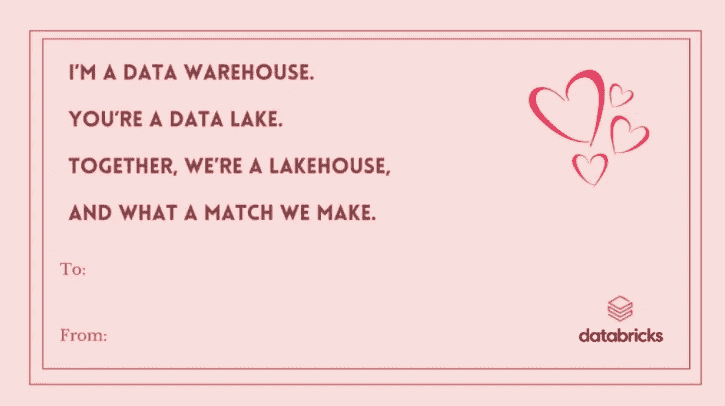

# 什么是数据湖屋？👀

> 原文：<https://medium.com/analytics-vidhya/what-is-data-lakehouse-25ba4ac91a60?source=collection_archive---------9----------------------->

你是说数据湖吗？

号码

数据仓库？

不不。

莱克豪斯。

来吧，让我们重新开始！

> **数据仓库！**

数据仓库是包含来自过去的关系数据的系统，在那里我们用 ETL 执行数据转换或数据清理。数据仓库通常用于寻找现有问题的答案和支持决策过程。

众所周知，数据仓库在商业智能应用中有着悠久的历史，这项技术自 20 世纪 80 年代以来一直在发展。这些发展创造了能够处理更大数据的系统和 MPP(大规模并行处理)架构。有了这些积累的经验，我们现在知道了需求以及如何满足这些需求。

然而，尽管数据仓库是结构化数据的良好解决方案，但许多大型企业现在不得不处理非结构化或半结构化数据。特别是，这些是具有高速度和高容量的数据。我们知道，大数据是一个数据湖和 Hadoop 发挥作用的世界，数据不是结构化的。有一些基本的例子，比如来自 IOT 设备和社交媒体平台的数据流。在这种情况下，数据仓库在使用和成本上都不合适。

> **数据湖！**

在这种情况下，随着公司开始收集大数据，他们开始设计单个系统来适应不同的分析产品和工作负载。这就产生了数据湖。然而，这里的问题是数据湖不支持事务流，并且它们缺乏数据质量和一致性。而且，我们称之为数据仓库和数据湖的两个世界的需求当然是不同的。虽然其中一个完全在控制之下，但另一个是需要实验工作的领域。

由于这个原因，像微软这样开发技术的公司已经转向开发灵活和高性能的系统。

他们开始致力于将包括所有报告、实时数据、数据科学和机器学习研究的系统。

我们可以说[**DataBricks**](https://databricks.com/)**是这种建筑环境的开创者。因此， **Azure Synapse Analytics** 服务与微软的 Azure DataBricks 集成成为了一个类似的 Lakehouse 模型。**

> ****数据湖屋！****

**那么什么是莱克豪斯？以我们无法赶上的技术时代的发展速度，它将把我们带向何方？**

****

**数据湖库是一个数据解决方案概念，它结合了两种不同的结构，我们称之为数据仓库和数据湖。它是通过集成我们在数据仓库中使用的数据结构和更具成本效益的数据湖的特性而诞生的。这种方法消除了组成数据仓库的 ETL / ELT 过程。因此，查询引擎直接从数据湖中查询，并创建了一种将提供高运营成本节约的技术。**

**其中一个重要因素是，随着技术的发展，对流和实时报告的需求也在增加。另一方面，Lakehouse 使我们无法在数据仓库中使用的实时流动数据可以与这两个世界中的数据湖的实时功能一起使用。**

**数据仓库和数据湖是非常流行的概念。是啊！它还可以在许多业务中协同工作，不会出现大问题。但是，作为数据解决方案，仍有一些方面需要改进。**

**顺便说一下，让我们列出数据湖库概念将解决的一些问题:**

*   **数据重复:我们知道公司中有多个数据仓库和数据湖。每个系统根据项目需要分别生成的数据会造成重复。尽管我们忽略了数据的分散性、主数据概念的缺失和缺乏一致性，但我们甚至可能不想考虑成本损失。**
*   **高存储成本:除了上一篇文章中提到的成本，我们可以说数据仓库和数据湖中使用的不同技术和基础设施格式增加了成本。在 Lakehouse 中，这两种系统的技术结合在一起。**
*   **BI 和分析项目中的资源差异:分析团队处理的数据不是来自数据湖，而 BI 团队和分析团队处理的是来自数据仓库的已处理数据和历史数据。有了 Lakehouse，两个团队有了一个联合的存储库，他们的工作产生了重叠的结果。**

**当然，有些问题被视为数据湖库概念的问题。例如，它不能灵活使用，不能像其他结构一样灵活定位，或者并非所有实际预期提供的好处都是有效的。我认为通过正确的需求和基础设施分析，这些问题可以被最小化。**

****

**5 月 16 日 XD 在 Unsplash 上拍摄的照片**

**嗯！**

**那么，有没有什么科技公司开发或者提供了呢？**

**[Azure Synapse 分析](https://azure.microsoft.com/tr-tr/services/synapse-analytics/)**

**[阿里云湖畔小屋](https://www.alibabacloud.com/blog/alibaba-cloud-lakehouse-an-industry-leading-next-generation-big-data-platform-of-alibaba-cloud-to-integrate-data-warehouses-and-data-lakes_596682)**

**[亚马逊红移湖畔小屋](https://aws.amazon.com/redshift/lake-house-architecture/)**

**[谷歌大查询](https://cloud.google.com/bigquery)**

**[阿帕奇演习](https://drill.apache.org/)**

**如果你想体验湖边小屋的基础设施，你可以通过下面的链接访问 Azure Synapse Analytics，有 30 天的期限和消费限制。**

** [## 立即创建您的 Azure 免费帐户| Microsoft Azure

### 利用人工智能创造个性化体验构建互联的跨平台体验-为客户互动量身定制…

azure.microsoft.com](https://azure.microsoft.com/en-us/free/synapse-analytics/)** 

**嗯，你最近遇到过情人节庆祝活动吗？:)**

**所以让我们从这篇文章中选一首歌送给他们。**

****

**源文章:**

** [## 什么是湖边小屋？Databricks 博客

### 在过去的几年里，我们在 Databricks 看到了一种新的数据管理架构，它独立地出现在…

databricks.com](https://databricks.com/blog/2020/01/30/what-is-a-data-lakehouse.html)  [## 什么是数据湖屋？

### 数据湖库是一种新兴的数据仓库结构，它结合了数据仓库和数据仓库的优点

www.xplenty.com](https://www.xplenty.com/glossary/what-is-a-data-lakehouse/)  [## 雪花深潜

### 这个世界充斥着数据，而且数据还在不断增长。公司必须衡量和跟踪一切:来自销售的数据，数据…

hhhypergrowth.com](https://hhhypergrowth.com/a-snowflake-deep-dive/)**