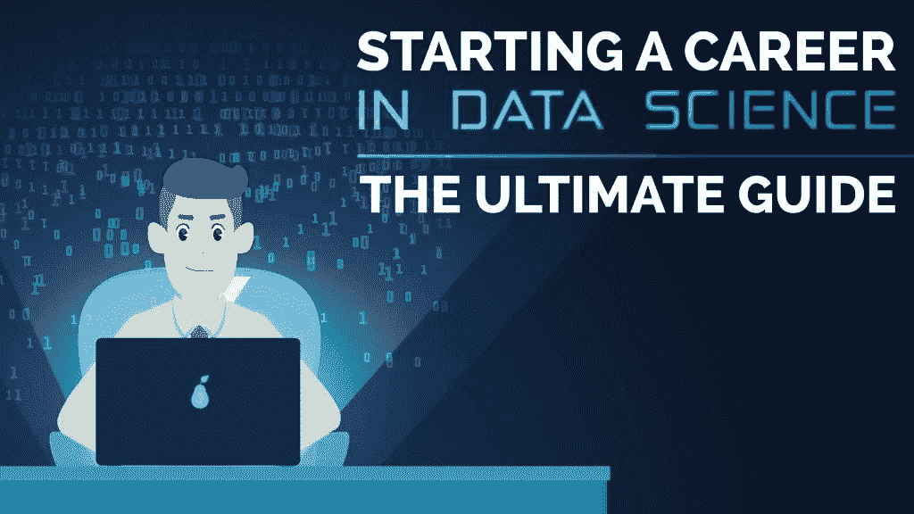
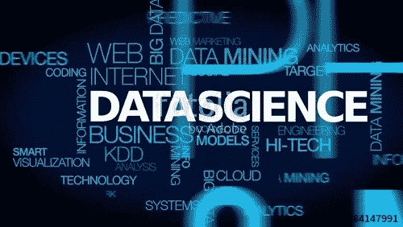
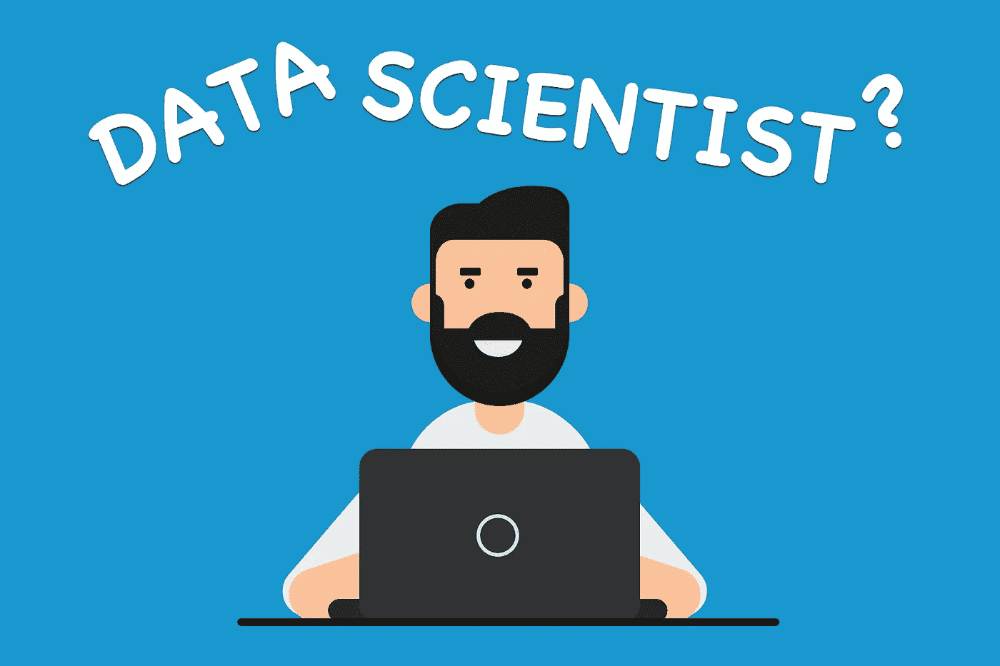

# 什么是数据科学？所有数据科学爱好者指南。

> 原文：<https://medium.com/analytics-vidhya/what-is-data-science-a-guide-for-all-data-science-enthusiast-77c899ae9a7c?source=collection_archive---------23----------------------->

数据科学是近来越来越流行的一个词。然而，什么是数据科学，一个人必须需要什么样的技能，等等。，知道在这个领域追求职业生涯是很重要的。首先，让我解释一下什么是数据科学，为什么是数据科学，以及成为一名成功的数据科学家的技巧等等。

随着世界进入大数据时代，对大数据存储的需求也在增长。直到 2010 年，这一直是企业行业面临的主要挑战和担忧。主要重点是构建一个框架和解决方案来存储数据。现在当 Hadoop 等框架成功解决了存储的问题，重点就转移到了这些数据的处理上。数据科学是这里的秘方。你在好莱坞科幻电影中看到的所有想法都可以通过数据科学变成现实。数据科学是人工智能的未来。因此，了解什么是数据科学以及它如何为您的业务增加价值非常重要。

# 什么是数据科学？

简单来说，数据科学被定义为通过使用各种工具和技术从结构化和非结构化数据中获取有价值的见解的过程。数据科学中实践的一些技术包括数据提取、数据分析、数据挖掘和数据检索，以产生有价值的结果。从事这类工作的人被称为数据科学家。此外，它还被广泛用于通过使用规范分析、机器学习和预测性因果分析来做出决策和预测。

*数据科学是利用各种科学方法从数据中提取知识和见解的过程。*

**“*如果你折磨数据的时间足够长，它会坦白任何事情。”*T5 由**罗纳德·科斯****

# 为什么是数据科学？

传统上，我们拥有的数据大多是结构化的，并且大小较小，可以使用简单的 BI 工具进行分析。不像传统系统中的数据大多是结构化的，如今大多数数据是非结构化或半结构化的。让我们看看下图中的数据趋势，该图显示到 2020 年，超过 80 %的数据将是非结构化的。

这些数据是从不同的来源生成的，如财务日志、文本文件、多媒体表单、传感器和工具。简单的 BI 工具无法处理如此庞大的数据量和数据种类。这就是为什么我们需要更复杂和先进的分析工具和算法来处理、分析并从中得出有意义的见解。

为了管理所有数据并从数据中发现有用的见解，我们需要数据科学。

# 数据科学职业生涯中的工作角色有哪些？

## 1.数据科学家

数据科学家是“21 世纪最性感的工作”。数据科学家必须明白挑战已经过去，他们必须使用数据分析和数据处理来提供最佳解决方案。

数据科学家检查哪些问题需要回答，以及在哪里可以找到相关数据。他们有商业头脑和分析技能，以及挖掘、清理和展示数据的能力。企业使用数据科学家来获取、管理和分析大量非结构化数据。然后将结果进行综合，并传达给关键利益相关方，以推动组织的战略决策。

## 2.数据分析师

数据分析师负责多种任务，包括可视化、处理和分析海量数据以及它们之间的关系。数据分析师最重要的技能是优化。这是因为他们必须创建和修改算法，以便在不破坏数据的情况下从一些大型数据库中提取信息。

数据分析师在开发、实现和维护分析系统中扮演技术角色。他与项目经理合作确定关键指标和 KPI，并向相关决策者提供可操作的见解。像数据科学家一样，分析师也执行统计分析并建立预测模型。

## 3.数据工程师

数据工程师负责将数据转换成易于分析的格式。他们与数据科学团队密切合作，主要负责为数据科学家设计解决方案，使他们能够开展工作。数据工程师创建最佳的管道架构。他们根据业务需求组装大型复杂数据集。

数据工程师的主要职责是构建和测试可扩展的大数据生态系统。

## 4.商业分析员

业务分析师是一个帮助企业分析他们的流程、产品、服务和系统的人，以改善当前的流程，并通过洞察力和数据分析做出有利可图的决策。业务分析师还通过评估业务模型及其与技术的集成来帮助组织记录业务流程。

业务分析师主要关注业务增长。业务分析师是数据工程师和管理人员之间的调解人。业务分析师精通业务财务和业务智能，也喜欢数据建模和数据可视化工具等。

## 5.统计员

统计员是对整个统计数据和基本方法有很好理解的人。他负责创建数据驱动的调查、民意测验和问卷。此外，他与管理层会面，讨论收集数据的最佳方法。

统计学家具有统计理论和数据组织的良好知识。他应该擅长数学，统计学，逻辑运算，机器学习算法。

## 6.数据架构师

数据架构师是数据架构背后的策划者，将来自不同业务单位的业务需求转化为数据和系统需求。

Data architect 为数据管理创建了一个蓝图，以便可以轻松地集成、集中数据库，并采用最佳安全措施对其进行保护。数据架构师必须精通数据仓库、数据建模和信息提取。

## 7.数据库管理员

数据库管理员(DBA)是专门的计算机系统管理员，通过指导或执行所有相关活动来保持数据安全，从而维护一个成功的数据库环境。DBA 专业人员的首要职责是维护数据完整性。这意味着 DBA 将确保数据不会受到未经授权的访问，但是用户可以访问。

除了获得计算机科学学位和实际现场经验以及其他相关的 IT 认证之外，数据库管理员通常还具备各种数据库管理产品的工作知识和经验，如基于 Oracle 的软件、SAP 和 SQL。

## 8.数据和分析经理

数据和分析经理承担向数据科学团队分配职责和运营的角色。他领导对数据有大量需求的跨职能项目。此外，经理设计支持业务问题的技术流程。最重要的是，他对生成的报告的准确性负责，因为这些报告将在组织的各个级别使用。

他们还带头开发有效的数据分析和报告流程。为此，他们需要结合数据分析和商业技能。只有了解组织的短期目标和长期业务战略，数据分析经理才能就如何最好地使用数据分析提出建议。

# 数据科学职业需要哪些技能？

以下是在数据科学领域取得成功所需的技能。

**技能:**

1.  数据科学的基础知识
2.  统计数字
3.  编程语言知识
4.  数据提取、转换和加载
5.  数据争论和探索
6.  数据可视化
7.  机器学习
8.  一些深度学习概念
9.  模型部署
10.  数据叙事

## #1.数据科学的基础知识

因为你决定在数据科学领域开始你的职业生涯。您必须从各种资源中收集一些关于数据科学职业道路的数据。你需要在数学、统计学、编程语言和机器学习概念方面做一些准备工作。

## #2.统计数字

统计学是数据科学的核心部分。统计学是一个应用广泛的领域。数据科学家必须非常了解统计数据。这可以从统计学有助于解释和组织数据这一事实中推断出来。描述性统计和概率知识是必须了解的数据科学概念。

必须了解描述性统计的概念，如平均值、中位数、众数、方差、标准差。接下来是各种概率分布、样本和总体、CLT、偏度和峰度、推断统计——假设检验、置信区间等等。你必须熟悉语法来构建正确的句子。同样，在你能够生成高质量的模型之前，统计学是一个基本的概念。机器学习从统计开始，然后进步。甚至线性回归的概念也是一个古老的统计分析概念。

## #3.编程语言知识

首先，选择自己喜欢的编程语言。Python、R 或 Julia 仅举几个例子，它们都有自己的优缺点。Python 是一种通用编程语言，具有多个数据科学库和快速原型，而 R 是一种用于统计分析和可视化的语言。Julia 提供了两个世界的优点，而且速度更快。

[**Python**](https://www.edureka.co/blog/python-tutorial/) 和 [**R**](https://www.edureka.co/blog/r-tutorial/) 是数据科学家使用最广泛的语言之一。主要原因是可用于数值和科学计算的软件包的数量。

## #4.数据提取、转换和加载

数据提取、转换和加载(ETL)，这三个数据库功能合并到一个工具中，用于将数据从一个数据库中取出并放入另一个数据库中。

*   **提取**是*从数据库中读取数据*的过程。在这一阶段，通常从多种不同类型的来源收集数据。
*   **转换**是将提取的数据从其之前的形式转换成其需要的形式的过程，以便将其放入另一个数据库。通过使用规则或查找表，或者通过将数据与其他数据相结合，可以进行转换。
*   **Load** 是*将数据*写入目标数据库的过程

## #5.数据争论和探索

数据争论是发现数据、清理数据、验证数据、构建可用性、丰富内容(可能通过添加来自公共数据的信息，如天气和经济状况)以及在某些情况下聚合和转换数据的过程。

数据探索是分析过程的初始步骤之一，用于开始探索和确定在数据集中发现了哪些模式和趋势。

数据争论是一个耗时的过程，我们必须分析丢失的数据、空值、没有正确格式的数据等。数据角力也是对未使用数据的清理过程。在那之后，数据探索开始了，在那里数据有意义或价值。

## #6.数据可视化

数据可视化是数据分析最重要的部分之一。以易于理解和视觉上吸引人的格式呈现数据总是非常重要的。有很多工具可以用于数据可视化，如 Tableau 和 PowerBi，还有一些 python 库，如 Matplotlib、Seaborn 和 Plotly 等。

首先，你必须熟悉直方图、条形图、饼图等图表，然后再学习瀑布图、温度计图等高级图表。这些图在探索性数据分析阶段非常有用。使用彩色图表，单变量和双变量分析变得更容易理解。

## #7.机器学习

顾名思义，机器学习是让机器变得智能的过程，这些机器具有思考、分析和决策的能力。通过建立精确的机器学习模型，组织有更好的机会识别有利可图的机会或避免未知的风险。

机器学习是一种自动建立分析模型的数据分析方法。它是人工智能的一个分支，基于系统可以从数据中学习，识别模式并在最少的人工干预下做出决策的想法。

## #8.一些深度学习概念

当你开始在数据科学领域的职业生涯时，你需要了解一些深度学习概念以及机器学习，以便更好地理解。

深度学习将传统的机器学习方法提升到了一个新的水平。它受到生物神经元(脑细胞)的启发。这里的想法是模仿人脑。使用这种人工神经元的大型网络，这被称为深度神经网络。

## #9.模型部署

模型部署是机器学习生命周期中最被低估的步骤。部署是一种方法，通过这种方法，您可以将机器学习模型集成到现有的生产环境中，以根据数据做出实际的业务决策。这是机器学习生命周期中的最后一个阶段，也可能是最繁琐的阶段之一。

模型部署是从机器学习中获得价值的最困难的过程之一。它需要数据科学家、It 团队、软件开发人员和业务专业人员之间的协调，以确保模型在组织的生产环境中可靠地工作。

## #10.数据叙事

讲故事是数据科学家最重要的习得技能。数据故事讲述是一种用于交流数据见解的结构化方法，它涉及三个关键元素的组合:数据、视觉和叙述。当视觉应用于数据时，他们可以启发观众的洞察力，如果没有图表或图形他们不会看到。

# 结论

我希望你喜欢看我在上面提到的话题上的文章。你在数据科学领域开始职业生涯的旅程肯定会很长。

祝你未来一切顺利。随时更新我的帖子。注意安全。