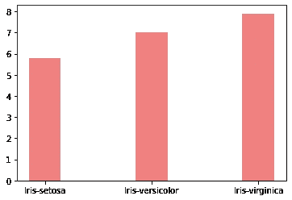
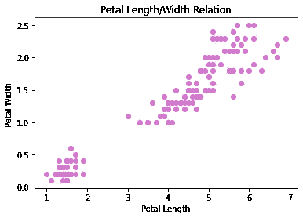
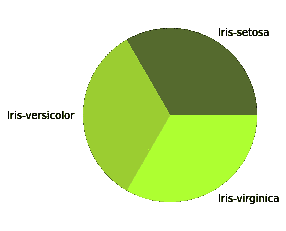
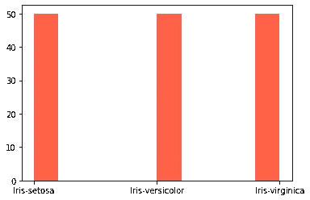

# 数据可视化和 Matplotlib

> 原文：<https://medium.com/analytics-vidhya/what-is-data-visualization-f68233a1ff85?source=collection_archive---------6----------------------->


被称为当今之矿的数据越来越受欢迎。这种增长使得数据分析、数据清理和数据可视化等子分支变得越来越普遍。最近数据科学的流行同样影响了编程语言和库的使用频率。这些库中最著名的是 Python 库，如 Pandas、NumPy、Scikit-learn 和 Matplotlib。

数据科学家需要提出正确的问题来分析数据，也应该以最好的方式分析和报告结果。这种分析最重要的元素之一是数据可视化。可视化可以让我们更好地理解数据，看到我们错过的细节，并体现我们的分析。

在 Pyhton 中，有许多用于可视化的库。其中最著名的是 Matplotlib、Seaborn 和 Plotly。Python 中的大多数库都有自己的特点。现在来说说 Matplotlib 的特点和用途。

# Matplotlib

Python 中有许多用于数据可视化的库。其中一个，也许是最简单的实现阶段，也是功能最高的是 Matplotlib 库。Matplotlib 是一个 2D 的 3D 图形库，帮助美国分析师可视化图形。Matplotlib 包含流行的图表，如条形图、散点图、饼图和直方图。

让我们创建这些图形来理解和应用 matplotlib 库。在浏览示例之前，您可以在 [Kaggle](https://www.kaggle.com/uciml/iris) 的页面上访问我们将在本文中使用的样本数据集，其中包含用于机器学习的数据集。在应用部分的示例中，我们将分析“Iris”数据集。

首先，导入 Matplotlib 和熊猫。

```
import matplotlib.pyplot as plt
import pandas as pd
```

然后将数据集加载到变量中，在本例中为“df”。

```
df = pd.read_csv('Iris.csv')
```

## 条形图:

柱状图是一种用分类数据进行线性和一维比较的图表。

在这个例子中，我想看看不同物种的萼片长度的变化。

```
plt.bar(df['Species'], df['SepalLengthCm']
                     ,color = 'lightcoral'
                     , width = 0.3)  
plt.show() 
```

输出:



## 散点图:

我们使用散点图来显示大数据集中的相关性和聚类。散点图用圆点显示两个数值参数之间的关系。

让我们用散点图来考察鸢尾花花瓣的宽度和长度之间的关系。

```
plt.scatter(df['PetalLengthCm'],df['PetalWidthCm'], color = 'orchid')plt.xlabel('Petal Length')plt.ylabel('Petal Width ')plt.title('Petal Length/Width Relation')plt.show()
```

输出:



## 饼图:

饼图，圆形结构让人想起比萨饼。而且根据数据出现的频率，它会有不同大小的披萨切片。

在本节中，在给定物种列作为第一个参数之后，我们给定该列的唯一值作为标签。

```
plt.pie(df['Species'].value_counts()
          ,labels = df['Species'].unique()
          ,colors= ['darkolivegreen','yellowgreen','greenyellow'])plt.show()
```

输出:



## 直方图:

直方图是数据分布的柱状表示。它通常帮助我们找到数据集中某个元素的出现频率，发现数据集的分布。

在这一部分，我将数据集中鸢尾花物种的分布可视化为直方图。

```
plt.hist(df['Species'], label = 'Species', color = 'tomato')plt.show()
```

输出:



在这篇文章中，我提到了可视化，Matplotlib 库和一些小规模的图形。如果你想更好地了解可视化，你可以查阅 Matplotlib 文档。