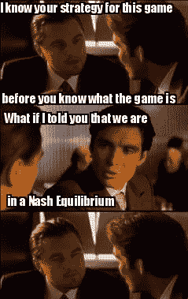
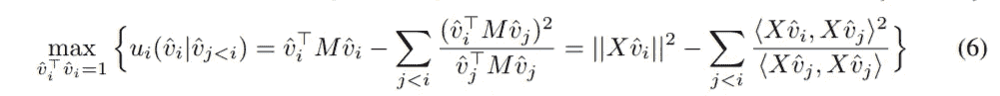
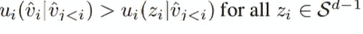
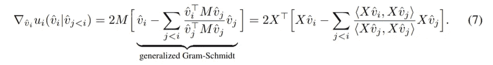
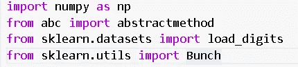

# 什么是 Eigen Game？

> 原文：<https://medium.com/analytics-vidhya/what-is-eigen-game-d6dda6c980b1?source=collection_archive---------3----------------------->

> **这篇文章的目的是让读者详细了解主成分分析作为一种纳什均衡，并使用 Sklearn 的 Mnist 数据进行必要的数学证明和实现**
> 
> **伊恩·金普、布莱恩·麦克威廉姆斯、克莱尔·弗纳德的原创作品&托雷·格雷佩尔@DeepMind。在 ICLR 2021(国际学习表示会议)上以“特征博弈:作为纳什均衡的 PCA”的形式发表:**

 [## 本征博弈:作为纳什均衡的 PCA

### 我们提出了一个新颖的观点，即主成分分析(PCA)是一个竞争游戏，其中每个近似…

arxiv.org](https://arxiv.org/abs/2010.00554) 

**所有的符号和数字都是从论文本身借来的，以防读者想要浏览论文中提出的所有证明。**

# **博客的流量**

> **1。概述主成分分析和纳什均衡。**
> 
> **2。将 PCA 伪装成一个特征游戏。**
> 
> **3。PCA 解是唯一的严格纳什均衡**
> 
> **4。算法**
> 
> **5。Python 代码和测试**
> 
> **6。纳什证明**
> 
> 7。本征博弈的收敛性
> 
> 8。收敛证明
> 
> 9。结论

# 1.让我们回顾一下主成分分析和纳什均衡。

# **纳什均衡概述。**

在[博弈论](https://en.wikipedia.org/wiki/Game_theory)中，以数学家[约翰·福布斯·纳什二世](https://en.wikipedia.org/wiki/John_Forbes_Nash_Jr.)命名的**纳什均衡**，是定义涉及两个或更多玩家的[非合作博弈](https://en.wikipedia.org/wiki/Non-cooperative_game)的[解](https://en.wikipedia.org/wiki/Solution_concept)的最常见方式。在纳什均衡中，每个参与者都知道其他参与者的均衡策略，没有人会因为只改变自己的策略而获益。纳什均衡的原理可以追溯到古诺的时代，他把它应用于竞争公司选择产量。

如果每个玩家都选择了[一个策略](https://en.wikipedia.org/wiki/Strategy_(game_theory))——一个根据游戏中目前发生的事情选择他们自己行动的行动计划——并且没有玩家可以通过改变他们的策略来增加他们自己的预期收益，而其他玩家保持他们的策略不变，那么当前的策略选择集就构成了纳什均衡。

如果两个参与者[爱丽丝和鲍勃](https://en.wikipedia.org/wiki/Alice_and_Bob)选择策略 A 和 B，(A，B)是一个纳什均衡，如果爱丽丝没有比 A 更好的策略来最大化她对鲍勃选择 B 的收益，鲍勃也没有比 B 更好的策略来最大化他对爱丽丝选择 A 的收益。在卡罗尔和丹也是参与者的博弈中，(A，B，C， D)是纳什均衡，如果 A 是爱丽丝对(B，C，D)的最佳对策，B 是鲍勃对(A，C，D)的最佳对策，依此类推。

## 竞赛游戏示例

这可以通过一个两人游戏来说明，在这个游戏中，两个玩家同时从 0 到 3 中选择一个整数，并且他们都赢得两个数字中较小的一个。此外，如果一个玩家选择的数字比另一个大，那么他们必须让出两分给另一个玩家。

这个博弈有一个独特的纯策略纳什均衡:双方都选择 0(用浅红色突出显示)。任何其他的策略都可以通过一个玩家将他们的号码比另一个玩家的号码少一个来改进。在邻桌中，如果游戏从绿色方块开始，移动到紫色方块符合玩家 1 的利益，移动到蓝色方块符合玩家 2 的利益。虽然这不符合竞赛游戏的定义，但如果游戏被修改，如果两个玩家都选择相同的数字，他们将赢得指定的金额，否则将一无所获，则有 4 个纳什均衡:(0，0)、(1，1)、(2，2)和(3，3)。

**因此，与纳什均衡相反，这里将主成分分析作为一个竞争游戏，其中每个近似特征向量由一个参与者控制，其目标是最大化他们自己的效用函数。**

**主成分分析概述。**

> 数据的**主成分**是与最大方差方向对齐的向量。
> 
> 这些有两个主要目的
> 
> 作为可解释的特征
> 
> 对于数据压缩

**主成分分析(PCA)** 的主要思想是降低由大量相关变量组成的数据集的维度，同时保留数据集中存在的最大可能变化。

让我们定义一个对称矩阵 a。

其中 X 是独立变量的 m×n 矩阵，m 是列数，n 是数据点数。矩阵 A 可以分解成以下形式

其中 D 是对角矩阵，E 是按列排列的 A 的特征向量矩阵。

x 的主成分(PCs)是 XX **ᵀ** 的特征向量，这表明特征向量/主成分的方向取决于独立变量(x)的变化。

因此，**主成分分析(PCA)** 集中于明确地陈述目标，以找到捕捉最大方差的 *k* 维子空间，并将在该子空间内旋转的问题留给例如更有效的下游奇异值(SVD)分解

例如，任何一对二维正交向量都跨越整个ℝ，因此可以获取任何二维数据集的最大方差。然而，为了使这些向量成为主分量，它们还必须与最大方差的方向对齐，这取决于数据的协方差。通过学习最优子空间，而不是主成分本身，聚焦于子空间误差的目标忽略了 PCA 的第一个目的。

不切实际的是，计算完整 SVD 的成本与 0(min{nd，n d})时间和 0( *nd* )空间成比例。

与这些方法相反，我们将每个主成分(等价地，特征向量)视为游戏中的参与者，其目标是在与其他向量的受控竞争中最大化它们的局部效用函数。

# **2。将 PCA 伪装成特征游戏**

我们将使用的符号为:

> 旨在近似主分量的向量和矩阵(相当于特征向量)用帽子来表示。V̂和 v̂，而真正的主成分是 *v* 和 *V*
> 
> 下标表示向量与哪个特征值相关。例如，vi 是第 *i* 个最大特征向量。这里，我们将假设每个特征值是不同的。
> 
> vj
> 
> *Sums over indices should be clear from context*

**

*5\. The Euclidean inner product is written *(u，v)* = *uTv (T 表示转置)**

*6.在 *d* 维环境空间中，我们用*Sd—*1 表示单位球，用∈*d—*1 表示单形*

**

*图片借用自 [Deepmind](https://deepmind.com/blog/article/EigenGame)*

> *在特征游戏中，每个玩家控制一个特征向量。玩家通过解释数据中的差异来增加他们的分数，但如果他们与其他玩家过于接近，就会受到惩罚。我们还建立了一个等级制度:参与人 1 只关心方差的最大化，而其他参与人也必须担心最小化他们与等级制度中比他们高的参与人的联盟。这种奖励和惩罚的结合定义了每个玩家的效用。*

# ***我们开始吧***

***框架的推导***

*如引言中所述，PCA 问题通常被误解为学习将数据投影到捕捉最大方差(Equiv)的子空间中。最大化下面介绍的合适矩阵 R 的轨迹)。这与学习主成分的最初目标相反。我们首先通过(I)表明仅最大化 R 的迹不足以恢复所有主分量(Equiv ),来产生确定我们的效用函数的直觉。特征向量)，以及(ii)表明降低 R 中的非对角项是最大化迹的补充意图，并且可以恢复所有分量。然后，我们承认只学习前 k 名，并构建与(I)和(ii)中的发现一致的效用，等于我们构建的博弈的 Nash 的真实特征值，并在响应分析的博弈中成功。*

***播放器实用程序的来源***

*对称矩阵的特征值问题*

**

*找到 d 个正交列向量 V 的矩阵(意味着 V 是满秩的),使得 MV = Vλ，对角线为λ。给定这个问题的解决方案，V 的列被称为特征向量，λ中的对应条目是特征值。通过左乘 V .T(转置)并调用*

*通过正交归一(即，V 是酉的)，我们可以将等式改写为*

**

*让 V-表示真实特征向量 V 的猜测或估计，并定义*

**

*主成分分析问题通常被认为是最大化 R (equiv。最小化重建误差):*

**

***注**:*

*令人惊讶的是,( 2)中的目标与 vˇ无关，因此不能用于恢复 M-(I)的所有(即 k = d)特征向量。或者，等式(1)暗示特征值问题可以表述为确保 R 的所有非对角项为零，从而确保 R 是对角的— (ii):*

**

*值得进一步详细检查 R 的条目。对角元素 Rii = { vˇI，mvˇI }被认为是瑞利商，因为| | vˇI | | = 1。非对角元素 Rij = { vˇI，mvˇj }测量广义内积{，}M 下 vˇI 和 vˇj 之间的对齐*

*每个玩家 I 的效用函数依赖于它的双亲，这里用有向无环图表示。每个父节点必须以固定的顺序广播它的向量“位置”。*

**

*到目前为止，我们已经考虑学习所有的特征向量。如果我们用 k < d, then by Equation (1), R must still be diagonal. V is not square, so*

**

*but assuming V is orthonormal as before, we have*

**

*Where P is a projection matrix. Left-multiplying Equation (1) by V now reads as*

**

*so we are solving an eigenvalue problem for a subspace of M.*

*If we only aspire to the top-k eigenvectors, maximizing the trace backs learning a subspace spanned by the top-k eigenvectors, but does not recover the eigenvectors themselves. On the other hand, Equation (3) places no preference on recovering large over small eigenvectors but does enforce the columns of Vˆ to be eigenvectors. The preceding exercise is intended to introduce minimizing the off-diagonal terms of R as a possible complementary objective for solving top-k PCA. Next, we will use these two objectives to construct utility functions for each eigenvector vˆi.*

*We canto consolidate the objectives to take advantage of both their strengths. Proposing as:*

**

*We can observe that this objective ignores the natural hierarchy of the top-k eigenvectors. For example, vˆ1 is penalized for aligning with vˆk and vice versa.*

*vˆ1, being the estimate of the largest eigenvector, should be free to search for the direction that captures the most variance independent of the locations of the other vectors.*

*Instead, first consider solving for the top-1 eigenvector “vˆ1” in which case R = [{vˆ1, Mvˆ1}] is a 1 × 1 matrix. In this setting, Equation (3) is not applicable because there are no off-diagonal elements.*

*So,*

**

*is a sensible utility function for vˆ1.*

*If considering the top-2 eigenvectors, vˆ1’s utility remains as before, and we advance a new utility for vˆ2\. Equation (3) is now applicable, so vˆ2’s utility is*

**

*where we have divided the off-diagonal penalty by {v1, Mv1} so*

1.  *the two terms in Equation (5) are on a similar scale*
2.  *for reasons that ease analysis.*

***重复前 k 个特征向量的逻辑，注意**:*

**

*所以对于每个向量 i ∈ {1，.。。，k}我们有*

**

*其中符号 ui(ai |b)强调参与人 I 调整 ai 以最大化 b 的效用。*

*有趣的是，通过包括自然层次的知识(参见非循环图)，我们立即被引导去构造不对称的效用，并因此受到启发，将 PCA 问题公式化为一个游戏，而不是像等式(4)中的直接优化问题。*

*博弈中的一个关键概念是纳什均衡。纳什均衡为每个参与者指定了一个变量，任何参与者都不能单方面偏离这个变量来改善他们的结果。在这种情况下，vˇ是一个(严格)纳什均衡当且仅当对于所有 I，*

**

# ***3。PCA 解是唯一的严格纳什均衡***

*假设{X(转置)X}的前 k 个特征值是正的且不同的。然后，前 k 个特征向量形成等式(6)中提出的博弈的唯一严格纳什均衡。3 证明将在后面的 tis 部分显示*

*该游戏是分层的，每个玩家的效用仅取决于其父母，可以通过依次解决每个玩家的优化问题来构造收敛的顺序算法。*

*已经提到，对等式(5)中的惩罚项进行归一化的动机不仅仅是缩放。除以{ vˇj，mvˇj }得到参与人 I 的梯度如下*

**

*顺序算法。每个特征向量可以通过最大化其效用来学习。向量被约束到单位球，非凸黎曼流形，因此我们可以使用黎曼梯度上升，其梯度由等式(7)给出。在这种情况下，黎曼优化理论只需要一个中间步骤，将梯度∇vˆi 投影到球面的切空间，以计算黎曼梯度∇r vˇI。**回想一下，每个 ui 都依赖于 vˇj***

**

*具有归一化惩罚项的结果梯度具有直观的意义。它包括一个广义的 Gram-Schmidt 步骤，然后是幂迭代中的标准矩阵乘积和 Oja 规则。*

***Oja 规则**，以芬兰计算机科学家[埃尔基·Oja](https://en.wikipedia.org/wiki/Erkki_Oja)命名，是大脑或[人工神经网络](https://en.wikipedia.org/wiki/Artificial_neural_networks)中的神经元如何随着时间的推移改变连接强度或学习的模型。它是标准 Hebb 规则(参见 [Hebbian 学习](https://en.wikipedia.org/wiki/Hebbian_learning))的修改，通过乘法归一化，解决所有稳定性问题，并生成用于[主成分分析](https://en.wikipedia.org/wiki/Principal_components_analysis)的算法*

***有关 Oja 规则的更多详情，请参考**[**https://en.wikipedia.org/wiki/Oja%27s_rule**](https://en.wikipedia.org/wiki/Oja%27s_rule)*

# *4.算法*

**

# ***5。Python 实现和测试***

1.  ***算法 1 从第一篇论文开始。使用 Mnist 是因为为什么不使用***
2.  ***算法 1 返回一组正交特征向量***

***导入所需的包***

**

***准备好数据***

****

***v _ I 的初始化***

**

***使算法 1 起作用:-)***

******

***测试正交性***

**

***如果你热爱数学和游戏，请随意使用代码***

***你可以在这里找到代码:***

*[https://github.com/Khanamin-XOR](https://github.com/Khanamin-XOR)*

# *6.纳什证明*

*设 vˇ是任意单位长度列向量(vˇj)的矩阵，M(对称)对角化为 UλU >且 U 是酉矩阵。然后，*

**

***1***

*其中 Z 也是单位长度列向量的矩阵，因为酉矩阵保持内积*

**

*因此，与其考虑任意矩阵 vˇ对 M 的作用，不如考虑任意矩阵 Z 对λ的作用。这简化了分析。*

*假设{X.transpose，X}的前 k 个特征值是正的且不同的。然后，前 k 个特征向量形成方程中所提出的博弈的唯一严格纳什均衡*

*在下文中，设 p，q = {1，.。。，d}和 i ∈ {1，.。。，k}。我们将用归纳法证明 vi 的最优性*

*显然，v1 是 u1 的最佳值，因为*

**

*λ11 是瑞利商，已知最大特征值最大。*

*现在，考虑一下*

**

*作为真实特征向量的线性组合。为了确保| | vˇI | | = 1，我们要求||w|| = 1。然后，*

**

*在哪里，*

**

*这是单纯形上的线性优化问题。对于不同的*

**

*ei 是唯一的。假设每个参与人 I 都参与了 ei。任何单方面偏离 ej 的参与者 j 都会严格降低其效用，因此，由于 z∫= ei = w 2 I，纳什均衡在符号变化之前是唯一的，这是意料之中的，因为 vi 和 vi 都是主成分。*

# *7.特征对策的收敛性*

*这里，首先表明等式(6)具有简单的形式，使得 u_i 的任何局部最大值也是全局最大值。参与人 I 的效用取决于它的父母，所以我们接下来解释父母的错误是如何通过参与人 I 效用的错误设定传播给孩子的。使用第一个结果并考虑这个误差，然后我们能够通过利用最近的非凸黎曼优化理论，在全批次设置中给出全局的有限样本收敛保证*

*等式(6)是深奥的，但是我们证明了在 vˇI 与最优值的角度偏差中，参与人 I 的效用的形状是简单的正弦曲线。正弦曲线的振幅随着沿着单位球面的角度偏差的方向而变化，并且依赖于玩家 j 的准确度*

*。不失一般性，设 vˇI = cos(θI)VI+sin(θI)⇼I。然后，*

**

*其中，θi 为角度偏差，z∈D1 表示偏差方向。注意，sin(square)的周期为π，而不是 2π，这只是反映了 vi 和 vi 都是本征向量这一事实。*

*误差传播分析表明，以给定的准确度学习双亲是至关重要的。vi 和具有近似双亲的参与人 I 的效用的最大值之间的角距离具有 tan-1 依赖性*

*算法 1 实现了前 k 个主分量的有限样本收敛到θtol 角误差内，而与初始化无关。此外，如果每个 vˇI 初始化至 vi 的π 4 范围内，算法 1 会返回 T 中角度误差小于θtol 的分量，其中 T 为*

**

*角度误差定义为 vˇI 和 vi 之间的角度:θ，由*

**

*T 公式中的第一个 k 来自学习每个 VJ 所需迭代次数的最差情况界限的简单求和，常数 16 来自误差传播分析；父向量 vˇj 必须被学习到低于标准误差阈值的 1/16*

**

*对于 gi 所在的子 VI*

**

*我们利用的黎曼优化理论规定，需要 1/ρ*p 次迭代来满足 O(ρ)误差阈值。这就是这里出现误差阈值平方倒数的原因。*

# ***8。收敛证明***

***非凸黎曼最优化理论***

****假设*** :*

*1 .存在 f∞使得 f(x)≥f∞对于所有的 x ∈ M*

*2.存在ξ，ξ0 > 0，使得对于所有 k ≥ 0，f(xk)—f(xk+1)≥min(ξ||∇rf(xk)||，ξ0 )||∇Rf(xk)||.*

*在这两个假设下，一般的黎曼下降(下面的算法)返回 x ∈ M 最多满足 f(x) ≤ f(x0)和||∇Rf(x)|| ≤ ρ in*

**

***迭代次数***

*通用黎曼下降算法*

**

***注意:EIGENGAME 的收敛证明可以在提供的链接中找到。***

***参考第 31 页第 0.2 节***

* [## 本征博弈:作为纳什均衡的 PCA

### 我们提出了一个新颖的观点，即主成分分析(PCA)是一个竞争游戏，其中每个近似…

arxiv.org](https://arxiv.org/abs/2010.00554) 

# **9。结论**

**PCA 作为可微分博弈的新观点可以导致进一步的算法开发和见解。**

**它是从多人游戏的角度激发的，启发了一种能够进行大规模主成分估计的分散算法。**

如果你发现错误或漏洞，请不吝赐教。请原谅我所犯的任何错误。

**跟我来:**[**https://www.linkedin.com/in/mdaminkhan/**](https://www.linkedin.com/in/mdaminkhan/)

**感谢阅读:)***