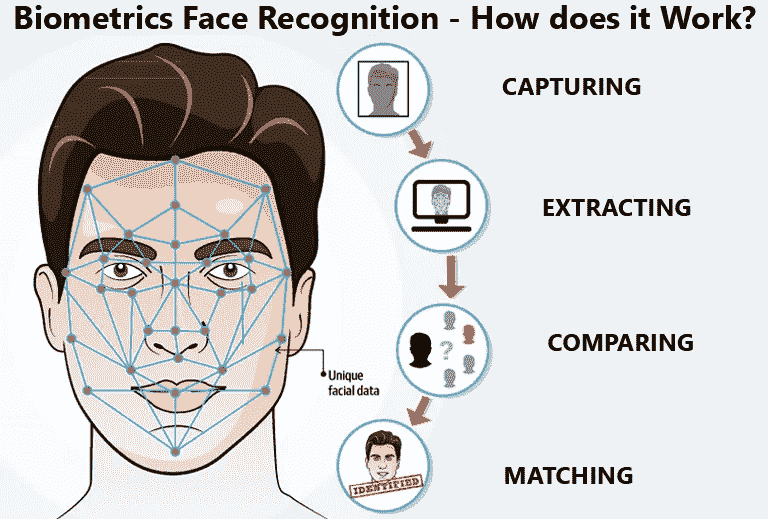

# 什么是“FaceNet ”,面部识别系统是如何工作的？

> 原文：<https://medium.com/analytics-vidhya/what-is-facenet-and-how-does-facial-recognition-system-work-d7c1eb6e2800?source=collection_archive---------5----------------------->

面部识别无处不在。从你的手机到你的笔记本电脑，它已经成为世界安全系统的新面孔(没有双关语！🤭).它不仅是保护和访问您的系统的最简单的方法，也是唯一一个将您的脸(您可以随身携带)作为安全系统的系统。

来源:StarlinkIndia