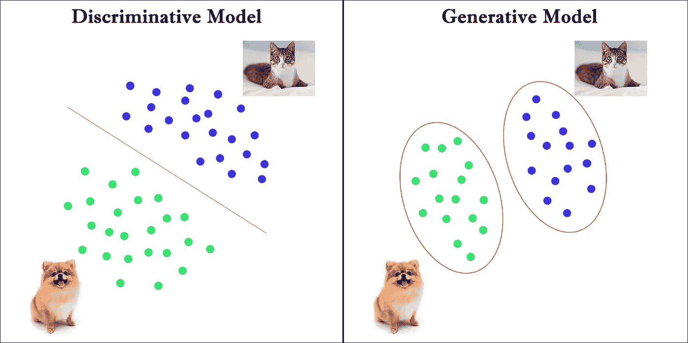
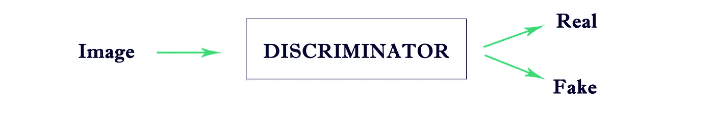
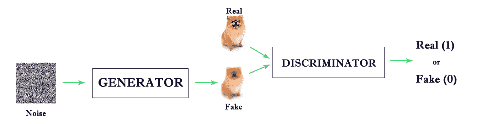

# 什么是甘？

> 原文：<https://medium.com/analytics-vidhya/what-is-gans-7e2118c4699f?source=collection_archive---------27----------------------->

GAN 代表生成性对抗网络。

2014 年，Jan J Goodfellow、Jean Pouget-Abadie、Mehdi Mirza、David Warde、Sherjil Ozair、徐炳、Yoshua Bengio 和 Aaron Corville 发表了*生成对抗网络*论文。Yann LeCun 将其称为最近 20 年来深度学习领域最酷的想法。

**GANs** 一般用于生成图像。将灰度图像转换为彩色图像，生成逼真的人脸，以及许多其他应用都是最受欢迎的。

在深入探讨 GANs 之前，我们先来看看判别模型和生成模型之间的区别。

判别模型通过学习分隔类别的最佳决策边界来学习将数据点分类到各个类别中。而生成模型通过学习每个类的特征来学习分类数据点。

考虑一个图像分类任务，其中我们必须预测给定的图像是狗还是猫。如下图所示，判别模型寻找最优决策边界来区分狗和猫，而生成模型通过学习它们的特征来学习区分它们。

生成模型学习联合概率分布，而判别模型基于输入预测标签。判别模型的例子有逻辑回归、SVM 等。马尔可夫随机场和朴素贝叶斯是生成模型的两个例子。

**现在让我们仔细看看 GANs。**

GANs 由两部分组成— *发生器*和*鉴别器*。

*生成器*学习数据集中图像的分布，并生成新图像。*鉴别器*对生成的图像执行分类任务，以预测图像是真是假。让我们通过考虑下面的场景来理解这一点。

一名警察和一名伪造者玩双人游戏，其中一人试图击败另一人。造假者的作用是制造假钱，愚弄警察。警察的任务是确定钱是真是假。GANs 的工作方式类似。生产者类似于伪造者，而鉴别者类似于警察。

GAN 的生成器组件基本上是一个生成模型，它学习类的分布。鉴别器组件基本上是一个学习类的决策边界的鉴别模型。

如下图所示，我们首先给生成器输入一个随机噪声。然后，它学习数据集中存在的图像的不同特征。之后，它将随机噪声转换成与训练集中的图像相似的新图像，但不与训练集中的图像完全相同。生成器生成的图像称为假图像，训练集中的图像称为真实图像。然后，真假图像被馈送到鉴别器以执行分类任务。它将预测假图像成为真图像的概率。如果图像是假的，它返回 0，如果图像是真的，它返回 1。

*如果鉴频器返回 1，GAN 正常工作。*