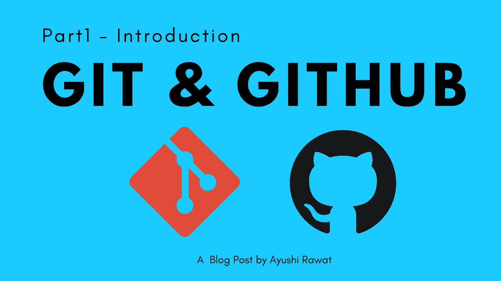
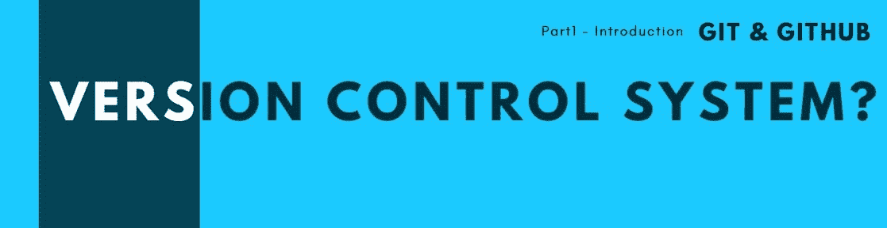
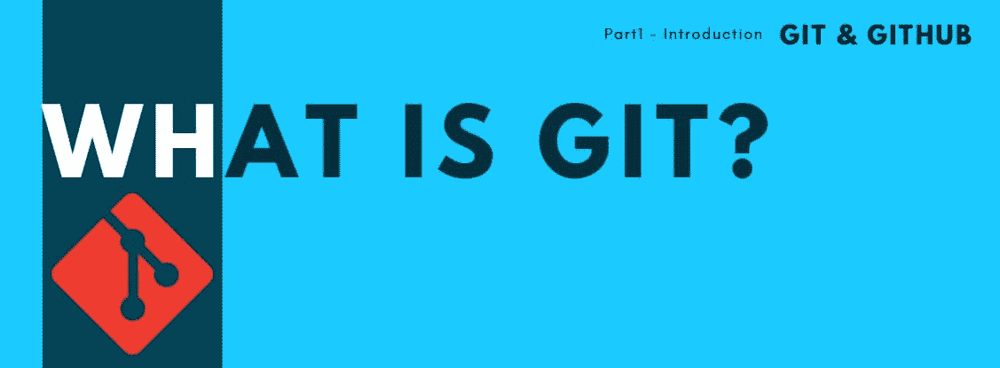
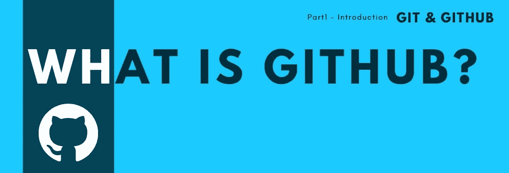
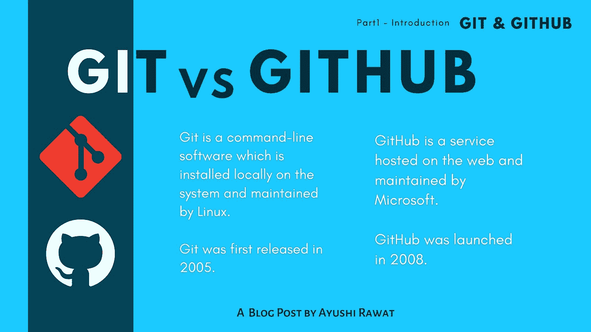

# 什么是 Git 和 Github？| Git vs GitHub

> 原文：<https://medium.com/analytics-vidhya/what-is-git-and-github-git-vs-github-27d6a606875b?source=collection_archive---------22----------------------->

读者你好！



如果你是程序员，你一定听说过 Git 和 GitHub。本文将不包含任何代码，我们将首先熟悉界面，我将尝试用简单的英语向您解释理论和概念的基础，以帮助您开始使用 Git。这是 Git 和 GitHub 系列的第一篇文章。

[查看 python 的终极资源库](https://github.com/ayushi7rawat/Ultimate-Python-Resource-Hub)。发现有用就掉颗星！有什么要补充的吗？开个 PR 就一样了！

[](https://github.com/ayushi7rawat/Ultimate-Python-Resource-Hub) [## ayushi 7 rawat/Ultimate-Python-Resource-Hub

### Python 的终极资源中心:全部集中在一个地方，请参阅贡献、行为准则了解详细信息，然后再…

github.com](https://github.com/ayushi7rawat/Ultimate-Python-Resource-Hub) 

你可以参考我的 YouTube 视频教程来看一个工作教程，以便更好地理解和一步一步的指导。

# 这个博客将会涵盖什么

```
1\.    What is Version Control System and its Types
2\.    What is Git?
3\.    What is GitHub?
4\.    And the difference between the two.
```

*让我们开始吧！*

# 什么是版本控制系统？



在开始使用 git 之前，让我们了解一下什么是版本控制。

*   VCS 或版本控制是一种跟踪计算机文件变化的管理系统。
*   它是一个软件工具，记录并管理一段时间内对源代码的更改。

想象一下，你和你的朋友正在处理一个共享的文档，而你们两个同时在修改这个文件，会发生什么呢？您将如何跟踪变更并标记变更的所有者？或者你在一个大团队中工作，你将如何管理？

*   它有助于开发人员高效工作。

考虑另一个场景，如果您正在处理一个项目，并且定期在某一天修改或更新您的代码，您希望回滚并将文件恢复到以前的状态，或者将整个项目恢复到以前的状态，比较一段时间内的更改，查看谁最后修改了可能导致问题的内容，谁引入了问题，以及版本控制系统可以在何时为您完成这些工作。

# 版本控制的类型

所以基本上有三种主要的 VCS。

1.  本地版本控制系统
2.  集中式版本控制系统
3.  分布式版本控制系统

在这篇文章中，我们不会涉及太多的细节。

# Git 是什么？



市场上有各种版本控制系统，但 Git 是其中最受欢迎的一个。

*   Git 最初是由 Linux 的创造者在 2005 年开发的。
*   Git 是免费的开源软件，所以任何人都可以使用它。

你不可能记得你做的每一个改变，很明显，对吗？但是你能做的是记住一个简单的命令。

*   老实说，它让我们的生活变得更容易，因为它跟踪你正在做的事情的整个历史，并允许我们恢复到以前的版本，不管你对你的文件做了多少次更改。
*   它简化了与其他人合作的过程，鼓励开发人员之间的协作，并使团队工作变得非常容易。
*   Git 被各种组织、企业甚至初创公司广泛用于管理他们的代码，它让你可以观察整个时间线。我们将在本系列的下一部分学习如何设置、安装和使用 GitHub 时详细研究这一点。

# 什么是 GitHub？



GitHub 是最先进和最发达的版本控制和协作托管平台之一。它是一个基于 web 的版本控制服务，使用 git 拥有 Git 的所有优点，甚至更多。

我已经在视频中解释了外观和感觉以及 GitHub 的概述。查看详细解释。

# Git 和 GitHub 一样吗？

不，Git 和 GitHub 是不一样的。

Git 是一个版本控制系统，可以让你管理和跟踪你的源代码和历史，而 GitHub 是一个基于云的托管服务，可以让你管理 git 库。



简而言之就是 Git 和 GitHub。你有 GitHub 账户吗？分享下面的链接。就这样，结束了！我希望这篇文章对你有用！哪一个是你最喜欢的播客？请在下面的评论中分享。我创建关于职业、博客、编程和生产力的内容，如果你对此感兴趣，请与你的朋友和关系人分享这篇文章。你也可以订阅我的时事通讯，在我每次写东西的时候得到更新！

谢谢你的阅读，如果你已经到目前为止，请喜欢这篇文章，它会鼓励我写更多这样的文章。请分享您的宝贵建议，感谢您的真诚反馈！

我强烈建议你去看看 YouTube 上的视频，别忘了订阅我的频道。我很乐意在 [Twitter](https://twitter.com/ayushi7rawat) | [LinkedIn](https://www.linkedin.com/in/ayushi7rawat/) 与你联系。

你绝对应该看看我的其他博客:

*   [Python 3.9:你需要知道的一切](https://ayushirawat.com/python-39-all-you-need-to-know)
*   [GitHub CLI 1.0:您需要知道的一切](https://ayushirawat.com/github-cli-10-all-you-need-to-know)
*   [如何制作自己的谷歌 Chrome 扩展](https://ayushirawat.com/how-to-make-your-own-google-chrome-extension-1)
*   [从 Python 运行 Javascript】](https://ayushirawat.com/run-javascript-from-python)
*   [使用 Python 自动化 WhatsApp】](https://ayushirawat.com/automate-whatsapp-using-python)
*   [使用 Python 自动化 Cowin 疫苗槽可用性](https://ayushirawat.com/automate-cowin-vaccine-slots-availablity-using-python)
*   [什么是竞技编程](https://ayushirawat.com/what-is-competitive-programming-or-beginners-guide)

在我的下一篇博客文章中再见，保重！！