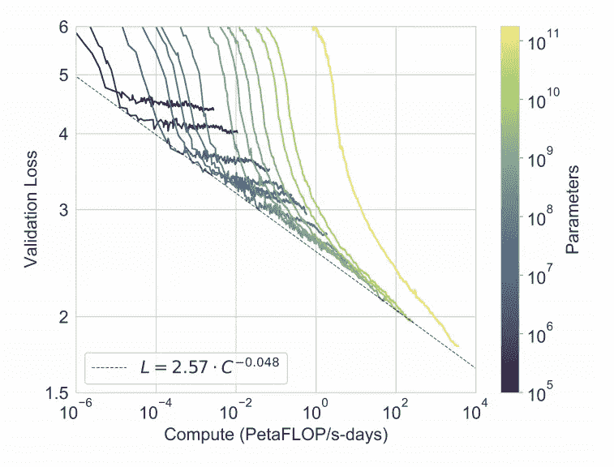
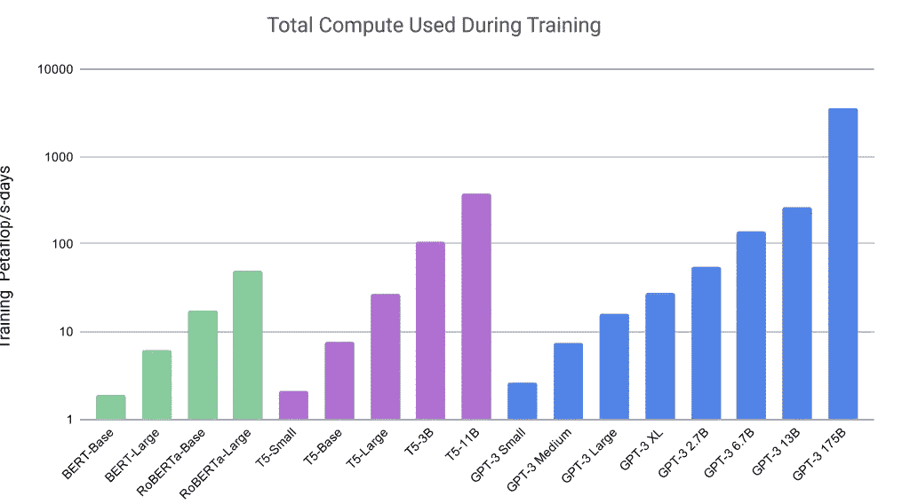

# 什么是 GPT-3，为什么它是人工智能的革命？

> 原文：<https://medium.com/analytics-vidhya/what-is-gpt-3-and-why-it-is-revolutionizing-artificial-intelligence-44d8e17c7edf?source=collection_archive---------2----------------------->

G**generative 预训练变形金刚 3** ( **GPT-3** )是一个自动回归的语言模型，它使用深度学习来产生类似人类的文本。它是 GPT-n 系列中的第三代语言预测模型(也是 GPT-2 的继任者)，由旧金山的人工智能 OpenAI 创建

> GPT 3 是有史以来最强大的语言模型。
> 
> GPT 3 可以写诗，翻译文本，令人信服地聊天，并回答抽象的问题。它被用于编码、设计等等。

该模型有 1750 亿个参数，它的上一个模型 GPT 2 被认为是最先进的，去年发布时有 15 亿个参数，很快就被英伟达的 80 亿个参数的威震天超越，随后是微软的图灵能源，有 170 亿个参数。现在开放 ai 通过发布一个比图灵能源大 10 倍的模型扭转了局面。gpt3 在很大程度上因其语言能力而得到认可，当人类适当引导时**它可以写创造性的小说。**

研究人员表示，GPT3 样本不仅接近人类水平，事实上，它们富有创造力，机智，深刻，通常很漂亮，它们表现出处理抽象概念的能力，如风格，模仿，写诗等。他们还表示，与 gpt3 聊天感觉非常类似于与人类聊天，它还可以在最新消息中生成功能代码。

# **GPT3 创建一个简单的 react 应用程序:**

在这里，开发人员描述他们想要的 React 应用程序，人工智能编写一个函数，其中包含正确运行所需的钩子和事件。

# GPT 三号能做什么？

从最基础的开始，GPT-3 代表预训练的生成式变形金刚 3——这是该工具发布的第三个版本。

这意味着它使用预先训练好的算法生成文本——它们已经获得了执行任务所需的所有数据。具体来说，他们已经获得了大约 570GB 的文本信息，这些信息是通过爬取互联网(一个公开可用的数据集，称为 CommonCrawl)以及 OpenAI 选择的其他文本(包括维基百科的文本)收集的。

# GPT 3 号有什么特别之处？

GPT-3 模型可以生成多达 50，000 个字符的文本，没有监督。除了基于事实的写作，它甚至可以产生创造性的莎士比亚风格的小说故事。这是神经网络模型第一次能够以可接受的质量生成文本，这使得一个典型的人很难(如果不是不可能的话)判断输出是由人还是由 [GPT-3](https://www.fullstackpython.com/gpt-3.html) 写的。

# GPT 3 号是如何工作的？

GPT-3 是一个被称为语言模型的例子，这是一种特殊的统计程序。在这种情况下，它被创建为一个神经网络。

名称 [GPT-3](https://www.zdnet.com/article/what-is-gpt-3-everything-business-needs-to-know-about-openais-breakthrough-ai-language-program/) 是首字母缩写，代表“生成性预训练”，这是迄今为止的第三个版本。它是可生成的，因为不像其他神经网络那样给出数字分数或者是或否的答案，GPT-3 可以生成原始文本的长序列作为输出。从某种意义上说，它是经过预先训练的，没有任何领域知识，尽管它可以完成特定领域的任务，如外语翻译。

**举几个例子:**

名词+动词=主语+动词

名词+动词+形容词=主语+动词+形容词

动词+名词=主语+动词

名词+动词+名词=主语+动词+名词

名词+名词=主语+名词

名词+动词+名词+名词=主语+动词+名词+名词

# GPT 3 号有什么特别之处？

GPT-3 模型可以生成多达 50，000 个字符的文本，没有监督。除了基于事实的写作，它甚至可以产生创造性的莎士比亚风格的小说故事。这是神经网络模型第一次能够以可接受的质量生成文本，这使得普通人很难(如果不是不可能的话)判断输出是由人类还是 GPT-3 写的。

在第 **e** 最高级别，训练 GPT-3 神经网络包括[两个步骤](https://www.fullstackpython.com/gpt-3.html)。

第一步需要创建词汇表、不同的类别和产生规则。这是通过给 GPT 3 号喂书来实现的。对于每个单词，模型必须预测该单词所属的类别，然后，必须创建一个产生式规则。

第二步包括为每个类别创建一个词汇表和产生规则。这是通过向模型输入句子来实现的。对于每个句子，模型必须预测每个单词所属的类别，然后，必须创建一个产生式规则。

> ***训练的结果是每个类别的词汇和产生式规则。***

这个模型也有一些技巧，可以提高它生成文本的能力。例如，它能够通过观察单词的上下文来猜测单词的开头。它还可以通过查看一个句子的最后一个单词来预测下一个单词。它还能预测句子的长度。

虽然这两个步骤和相关技巧在理论上听起来很简单，但实际上它们需要大量的计算。在 2020 年中期训练 1750 亿个参数的成本大约为 460 万美元，尽管其他一些估计计算出这可能需要高达 1200 万美元，具体取决于硬件的供应方式。

# 背景:

GTP3 来自一家名为 OpenAI 的公司。OpenAI 由埃隆·马斯克(Elon Musk)和萨姆·奥特曼(Sam Altman，创业加速器 Y-combinator 的前总裁)创立。OpenAI 成立时投入了超过 10 亿美元来合作和创造人类水平的人工智能，以造福人类。

> OpenAI 多年来一直在开发其技术。早期发表的论文之一是关于生成性预训练的。生成性预训练背后的想法是，虽然大多数人工智能都是在标记数据上训练的，但有大量数据是没有标记的。如果你可以评估这些词，并用它们来训练和调整人工智能，它就可以开始根据未标记的数据预测未来的文本。重复这个过程，直到预测开始收敛。(来源:https://Greg raiz . com/GPT-3-demo-and-explain/)

> 最初的 GPT 代表生成性预训练，最初的 GPT 使用 7000 本书作为训练的基础。新的 GPT3 在更多方面进行了训练…事实上，它是在来自爬行互联网的 4100 亿个令牌上进行训练的。670 亿来自书籍。来自维基百科的 30 亿甚至更多。总共有 1750 亿个参数和 570GB 的过滤文本(超过 45tb 的未过滤文本)

训练完整数据集所需的计算时间超过一天。

用于预先训练模型的计算能力令人震惊。这超过了一天的计算机能力。一秒钟的 exaflop 计算机能力将允许你每秒钟运行一次计算超过 37 万亿年。

GPT3 技术目前处于有限的测试阶段，早期接入开发者刚刚开始制作该技术的演示。随着有限的测试版的扩展，你可以期待看到更多有趣和深入的技术应用。我相信它将塑造互联网的未来，以及我们使用软件和技术的方式。(来源:【https://gregraiz.com/gpt-3-demo-and-explanation/ )

# 链接:

*   关于 GPT3 的论文——少数射击学习者【https://arxiv.org/abs/2005.14165 
*   https://beta.openai.com/GPT 3 应用开发者
    [的测试网站](https://beta.openai.com/)
*   原 GPT 论文
    [存档原论文](https://gregraiz.com/wp-content/uploads/2020/07/language_understanding_paper.pdf)