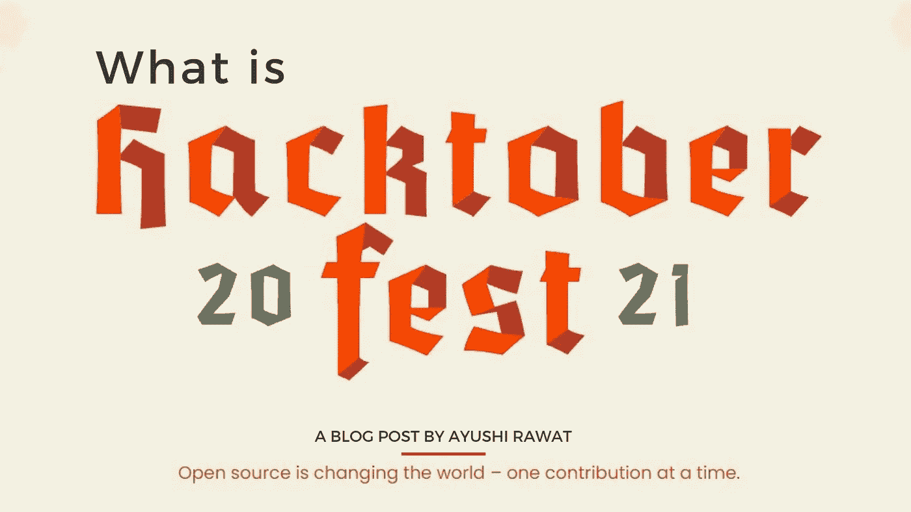
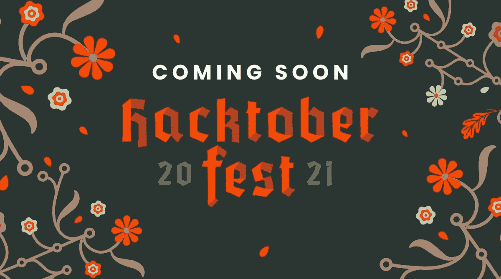
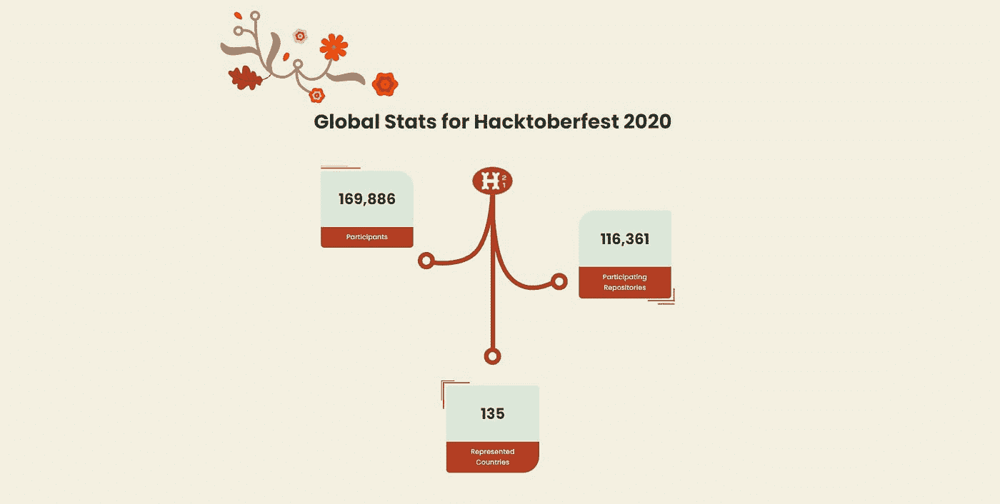
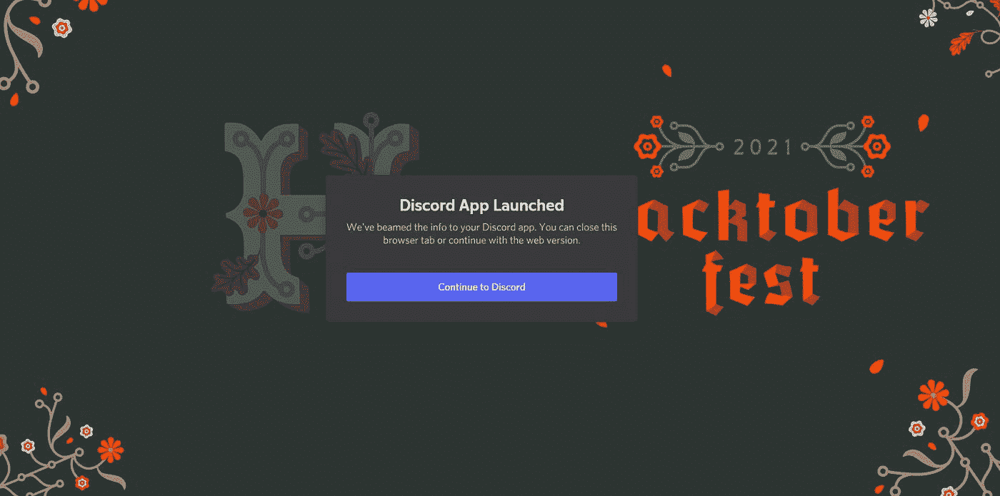

# 什么是 Hacktoberfest？Hacktoberfest 101

> 原文：<https://medium.com/analytics-vidhya/what-is-hacktoberfest-hacktoberfest-101-3269630183c?source=collection_archive---------7----------------------->

读者你好！



在接下来的一个月里，你会听到很多关于 Hacktoberfest 的事情。

你可以参考我的 YouTube 视频教程来看一个工作教程，以便更好地理解和一步一步的指导。

Hacktoberfest 将由 Digital Ocean 与 GitHub 和其他公司合作举办，是的，你没看错。我个人喜欢它的一点是，它将世界各地有着相同想法的开发人员聚集在一起。

那么，到底什么是 Hacktoberfest？我们将在接下来的几分钟内了解全部情况。

# 这个博客将会涵盖什么

```
1\. What is Open Source?
2\. What is Hacktoberfest?
3\. Who can Join?
4\. PERKS of participating
5\. Global Stats for Hacktoberfest 2020
```

*我们开始吧！*

# 什么是开源？

根据[维基百科](https://en.wikipedia.org/wiki/Open_source)，

> 开源是免费提供的源代码，可以进行修改和重新发布。
> 
> 当一些源代码成为开放源代码时，它包括使用、修改、贡献现有源代码的许可。这个术语的使用起源于软件，但是已经扩展到软件领域之外的协作和贡献。

托管在公共存储库中的开源项目受益于更广泛的开发人员社区的贡献，并且通常通过 Git 进行管理。

现在你对开源有了一个基本的概念，我们可以谈谈 Hacktoberfest 了。

# 什么是 Hacktoberfest？

Hacktoberfest 是一个长达一个月的挑战。它发生在每年的十月。

Hacktoberfest 对所有人开放，它标志着开源的庆祝。这是最大的开源活动，鼓励新手参与开源，创造他们的第一个有意义的公关。Hacktoberfest 鼓励通过完成 pull 请求、参与活动和向开源项目捐款来回馈开源社区。此外，鼓励所有背景和技能水平的人完成挑战。

当然，要参与，你必须先有一个 GitHub 账号。刚接触 GitHub？查看我的 GitHub 博客和播放列表，了解更多信息。

# 谁能加入？

> 贡献者:全球任何希望帮助推动开源发展并为不断发展的社区做出积极贡献的人。鼓励所有背景和技能水平的人参加。
> 
> 维护者:任何在 GitHub 或 GitLab 上运行开源项目并希望从社区获得帮助来改进项目的人都可以加入 Hacktoberfest。
> 
> 公司:鼓励人们为公司的知识库做出贡献，组织社区活动，并让内部员工参与进来。
> 
> 活动组织者:创建活动将人们聚集在一起进行指导和代码协作，这样世界上就有更多的人帮助支持开源！

注册于 9 月 28 日开始，想知道如何参与和参与前你必须知道的事情，我将在我的下一篇博客中涉及这些。



# 额外津贴:

*   你可以和社区里的老年人一起工作。
*   无论是你的第一次公关还是第十次，你都会学到新的东西。
*   你将成为最大的开源活动的一部分。
*   当然，还有纪念品。

让我们看看我在 2020 年 Hacktoberfest 上的礼物包。你会得到一些很棒的东西，包括一件免费的限量版 t 恤！\ 还有一些贴纸。

有什么要补充的吗？在下面的评论框中提及，我会更新列表。


在我即将发布的博客中，我将分享，如何参加 Hacktoberfest 2021 以及其他你在投稿前必须知道的重要细节。

# 让我们看看 2020 年黑客啤酒节的全球统计数据，好吗？

*   169 886 名参与者
*   116，361 个参与存储库
*   135 个代表国家



# 专业提示:

您可以加入 Hacktoberfest discord 服务器，与社区和其他开源爱好者建立联系，提出问题并找到项目。[点击链接，导航](https://discord.com/invite/hacktoberfest)至服务器。



有兴趣听听我 2020 年的黑客啤酒节经历吗？你不会想错过的，所以。请继续关注我即将发布的博客。

这就是这篇文章的全部内容，到此为止！我希望这篇文章对你有用。谢谢你的阅读，如果你已经到目前为止，请喜欢这篇文章，它会鼓励我写更多这样的文章。请分享您的宝贵建议，感谢您的真诚反馈！

我创建关于职业、博客、编程和生产力的内容，如果你对此感兴趣，请与你的朋友和关系人分享这篇文章。你也可以订阅我的时事通讯，在我每次写东西的时候得到更新！

我强烈推荐你去看看 T4 的 YouTube 视频，别忘了订阅我的频道。我很乐意在推特|[LinkedIn](https://www.linkedin.com/in/ayushi7rawat/)与你联系。

你绝对应该看看我的其他博客:

*   [Python 3.9:你需要知道的一切](https://ayushirawat.com/python-39-all-you-need-to-know)
*   [GitHub CLI 1.0:您需要知道的一切](https://ayushirawat.com/github-cli-10-all-you-need-to-know)
*   [如何制作自己的谷歌 Chrome 扩展](https://ayushirawat.com/how-to-make-your-own-google-chrome-extension-1)
*   [从 Python 运行 Javascript】](https://ayushirawat.com/run-javascript-from-python)
*   [使用 Python 自动化 WhatsApp】](https://ayushirawat.com/automate-whatsapp-using-python)
*   [使用 Python 自动化 Cowin 疫苗槽可用性](https://ayushirawat.com/automate-cowin-vaccine-slots-availablity-using-python)
*   [什么是竞技编程](https://ayushirawat.com/what-is-competitive-programming-or-beginners-guide)

# 资源:

*   [hacktoberfest.digitalocean.com](https://hacktoberfest.digitalocean.com/)

快乐贡献，在我的下一篇博客文章中再见，保重！！