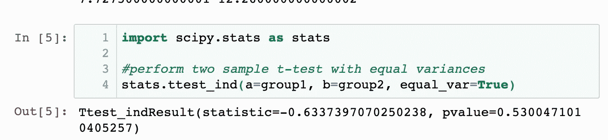

# 什么是假设检验？

> 原文：<https://medium.com/analytics-vidhya/what-is-hypothesis-testing-b824afc00264?source=collection_archive---------1----------------------->

假设检验是一种统计方法，用于利用实验数据进行统计决策。假设检验基本上是我们对总体参数的一种假设。

# 为什么我们要使用假设检验？

假设检验是统计学中的一个基本步骤。
假设检验评估**关于总体的两个互斥陈述，以确定哪一个陈述最能得到样本数据的支持。**当我们说一个发现具有统计学意义时，这要归功于假设检验。

**零假设:**在推断统计学中，零假设是一种一般性的陈述或默认立场，即两个测量的现象之间没有关系，或者群体之间没有关联，换句话说，它是一种基本假设，或者是基于领域或问题知识做出的。

**备选假设** :
备选假设是假设检验中使用的与原假设
相反的假设。人们通常认为这些观察结果是真实效应的结果(叠加了一些偶然变化)。

# t 检验:

t 检验是一种推断统计，用于确定在某些特征上可能相关的两组平均值之间是否存在显著差异。它主要用于数据集，如作为投掷硬币 100 次的结果而记录的数据集，
将遵循正态分布，并且可能具有未知的方差。t 检验用作假设检验工具，它允许检验适用于总体的假设。

**T 检验有 2 种类型:** 1。一个样本 t 检验
2。双样本 t 检验

# 一个样本 T 检验:

单样本 T 检验确定样本均值在统计上是否不同于已知或假设的总体均值。单样本 T 检验是一种参数检验。**示例**:您有 10 个年龄，您正在检查平均年龄是否为 30 岁。

# 双样本 T 检验

双样本 t 检验用于检验两个总体的平均值是否相等。例如:假设我们想知道两种不同类型的植物的高度是否相同。下面我们有两组植物。

**我们的零假设将是:**

**H0:** 1 = 2(两个总体均值相等)

**我们的替代假设将是:**

**HA:** 1 ≠ 2(这两个群体的平均值是*不*相等)

然而，在我们进行测试之前，我们必须假设两个总体的方差是否相等。*根据统计学“根据经验法则，如果较大样本方差与较小样本方差之比小于 4:1，我们可以假设总体方差相等* *。* ***求方差！***

# 由于较大样本方差与较小样本方差之比是 12.26 / 7.73 = 1.586，我们可以假设总体方差相等。

因此，我们可以用相等的方差进行双样本检验:

因为我们测试的 p 值 **(0.53005)** 大于 alpha = 0.05，所以我们无法拒绝测试的零假设。我们没有足够的证据证明这两个种群的平均植株高度不同

# 感谢阅读！