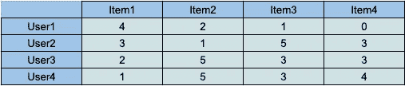
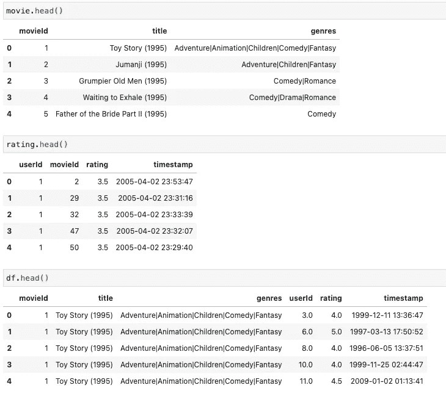
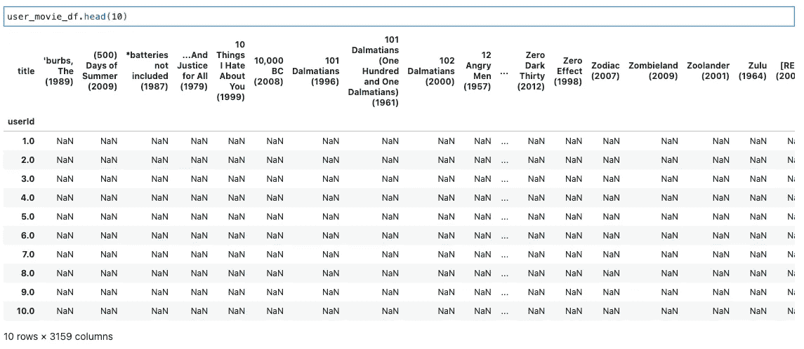
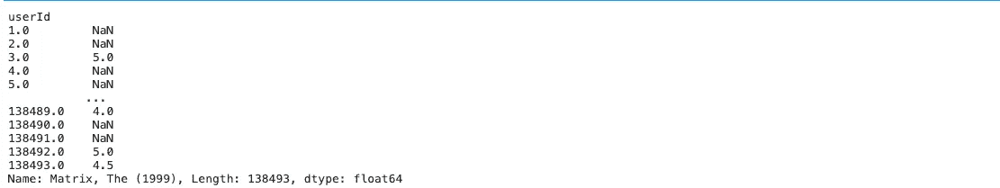
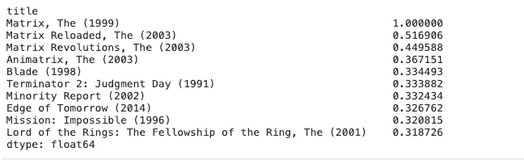

# 什么是基于项目的过滤？Python 中的一个应用实例

> 原文：<https://medium.com/analytics-vidhya/what-is-item-based-filtering-an-applied-example-in-python-70746737e5b1?source=collection_archive---------3----------------------->

创建电影推荐器

你好。在这个故事中，我们将尝试理解什么是基于项目的过滤，并且我们将看到 Python 中的一个应用示例。

你可以从[这里](https://www.kaggle.com/enesbaysan/item-based-filtering-basic)访问我为这个故事创建的 Kaggle 笔记本。


马库斯·温克勒在 [Unsplash](https://unsplash.com/s/photos/item?utm_source=unsplash&utm_medium=referral&utm_content=creditCopyText) 上的照片

# 基于项目的过滤

实际上，基于项目的过滤是一种协作过滤技术。有时候我们可以把这种技术看做“基于记忆”。推荐与 X 项目具有相似“喜欢”结构的项目是基本的心态。

我们将创建一个如下的矩阵。



在这个矩阵中，行代表用户，列代表项目，交叉单元格代表喜欢的计数。例如，用户 1 不喜欢项目 4，项目 1 被喜欢 10 次。但是在这种技术中，我们将更关注项目而不是用户。

# 应用示例

我们将使用[这个](https://www.kaggle.com/grouplens/movielens-20m-dataset)数据集。我已经把它导入到我的工作区了。

我要导入`pandas`并读取数据。之后，我将合并这两个数据集。如上所述，我们需要使用项目(电影)名称和项目喜欢计数。因为这种过滤技术使用了这两个特征，并通过使用项目的喜好结构来创建推荐。因此我合并了这些数据集。

```
import pandas as pdmovie = pd.read_csv('movie_lens_dataset/movie.csv')rating = pd.read_csv('movie_lens_dataset/rating.csv')df = movie.merge(rating, how="left", on="movieId")
```



## 创建用户-项目矩阵

实际上，重点是基于项目的过滤。我们需要创建过滤技术将使用的矩阵。

首先，我会选择评论数超过 1000 的电影。

```
comment_counts = pd.DataFrame(df["title"].value_counts())rare_movies = comment_counts[comment_counts["title"] <= 1000].indexcommon_movies = df[~df["title"].isin(rare_movies)]
```

我不希望过滤技术受到评价较低的电影的影响。

现在我可以创建用户-项目矩阵。其实就是个数据透视表。此表按行保存用户 id；列中的项目标题和交叉点单元格中的评分计数(喜欢计数)。

```
user_movie_df = common_movies.pivot_table(index=["userId"], columns=["title"], values="rating")user_movie_df.shape>>> (138493, 3159)user_movie_df.head(10)
```



其实我们完成了最大的挑战点。其他的东西就是几行代码而已。

## 推荐电影

我将选择一部电影，并从我们的数据透视表中选择其评级值。

```
movie_name = "Matrix, The (1999)"# getting the ratings of the choosed movie
movie_name = user_movie_df[movie_name]movie_name
```



正如我们上面所说的，这种过滤技术计算所选项目(电影)与其他项目(电影)的喜欢(评级)结构。因此，我需要计算与他人的`moive_name`相关性。`movie_name`变量保存的是所选电影的点赞结构。所以我可以用这个变量来计算相关性。

```
movie_name = "Matrix, The (1999)"movie_name = user_movie_df[movie_name]user_movie_df.corrwith(movie_name).sort_values(ascending=False).head(10)
```



推荐电影

是的，我们完成了基于项目的过滤。我们看到了上面推荐的电影《黑客帝国(1999)》。

如果你去 Kaggle 笔记本，可以看到一些有帮助的推荐电影的功能。

希望你喜欢这个。关于其他推荐技巧的阅读，你可以访问我的个人资料。

亲切的问候。