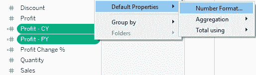

# 什么是 KPI，如何在 Tableau 中建立 KPI

> 原文：<https://medium.com/analytics-vidhya/what-is-kpi-and-how-to-build-kpi-in-tableau-a5c652b41fd6?source=collection_archive---------3----------------------->

> 查看我的仪表板[这里](https://public.tableau.com/app/profile/lavanya4954/viz/Sales_KPI_Dashboard/SalesKPI_Dashboard)

**那么什么是 KPI 呢？**

KPI(关键绩效指标)是一个视觉提示，用于衡量我们是否达到目标。它有助于跟踪项目目标的有效性。KPI 可用于评估组织、团队的绩效，也可用于评估个人的绩效。

**为什么企业需要 KPI？**

当你开车时，只需看一眼你的仪表板，就能知道你是否有足够的燃料，你行驶的速度有多快，发动机是否能很好地适应你的驾驶。汽车还配有警示灯，当你的车遇到麻烦或需要维修时，警示灯会闪烁或变红。性能仪表板应该为您的业务做同样的事情。

**如何开发 KPI 并构建仪表板？**

**衡量**:这基本上就是我们要衡量的东西，例如:总销售额、利润等。
**目标**:您希望在截止日期前达到的数值。我们是否超过了我们设定的销售、利润目标。
**来源**:数据来自哪里。这里，我们将使用 [Kaggle](https://www.kaggle.com/rohitsahoo/sales-forecasting?select=train.csv) 上提供的销售商店数据，我们仪表板的重点是测量以下指标(业务任务)。

> **1。当前利润是否超过上年利润额？**
> 
> **2。目前的销售额是否超过了上一年的销售额？**
> 
> **3。有多少产品达到当年销售额和利润的门槛？**
> 
> **4。每个品类的销售趋势都不一样吗？**
> 
> **5。20%以上的折扣是增加利润吗？**

我们将了解使用 Tableau 可视化 KPI 的方式。然后，我们将为 KPI 创建计算字段，以构建用于衡量数据进度的数字。我们将根据调查结果设置阈值并创建图表。最后，我们将在下节课讨论这些发现的建议。所以不要再拖延了，让我们开始吧。

1.  打开 Tableau 桌面，通过打开 excel 文件连接 Tableau 中的数据(可以下载 [Kaggle](https://www.kaggle.com/rohitsahoo/sales-forecasting?select=train.csv) 中的数据)
2.  将 ***订单*表**拖到显示*的位置。将表拖到此处并保持数据提取，并将工作簿保存为“销售 _ KPI _ 仪表板”*

可选—在开始构建工作表之前，我发现最好在工作簿级别进行一些格式化。为了保持一致并确保您不必分别更改每个工作表，您可以使用 ***格式工作簿→字体*** 并将其设置为 ***Tableau Book* 或*Tableau Medium****。*

## **第一部分—构建利润工作表**

> ***KPI 利润:*当前利润是否超过上年利润？**

1.  创建新工作表。称之为 ***KPI 利润*** *。这里，我们将比较本年度的利润(衡量)和上一年度的利润(目标)*

> 创建一个名为 ***的计算字段，即当前年度指标*。**创建如下所示的计算字段:
> **YEAR([订单日期])= { FIXED:MAX(YEAR([订单日期]))}**

右击**当前年份指示器**，选择**复制**。将新字段重命名为 ***上年指标*** *。(CY 是当年，PY 是上一年)*

> 右键点击**上一年指标**，选择 ***编辑*** 。更改计算，在末尾添加 ***-1*** 。
> **年([订单日期])= {FIXED: MAX(年([订单日期]))} — 1**

创建一个名为 ***利润— CY*** 的计算字段。对于此计算，使用:

**如果为空(如果[当年指标]则[利润]结束，0)**

右击该字段并选择**复制**。将新字段称为 ***利润— PY* 。**将计算改为参照 ***上年指标*** *。*

**If null(If[上年指标]THEN[利润] END，0)**

创建一个名为 ***利润—变更$*** 的计算字段，如下所示:

> **(SUM([利润—CY])-SUM([利润—PY])**

创建一个名为 ***利润-变化%*** 的计算字段，如下所示:

> **(SUM([利润—CY])-SUM([利润—PY])/SUM([利润— PY])**

**现在该格式化数字了**

1.控制键点击选择**利润— PY** 和**利润— CY** 。

2.选择**默认属性→数字格式**。改为**货币自定义** →小数位数 *0* 和单位*千位* **。**

3.右击**利润-变化%** 。

4.将**默认属性—数字格式**更改为**自定义。**

5.在**格式:**框中，使用下面显示的格式字符串获得上下箭头(见下图)。

> **复制此格式** : ▲ #，# # # . 0%；▼ -#,###.0%

## 让我们构建 KPI 利润指标

1.  将**利润 CY** 带到**行。**
2.  在**行**货架上，右键点击 **SUM(利润 CY** )并将其更改为 **Discrete。**
3.  右击**行**架上的 **SUM(利润 CY** )。选择**格式** —改为 *Tableau Book，*尺寸 *20。*
4.  将**利润—将%** 更改为标记卡下的**文本。**
5.  在您的衡量标准下，点击**利润-变化%** 。
    选择**默认属性→颜色。** 选择**编辑颜色**并选择以下选项:
6.  阶梯式颜色→ **2 步。**
7.  点击<<**高级。**将**中心**改为 **0。**
8.  使其**橙蓝色发散。**点击红色方块。为了让眼睛看起来更舒服，将*红色*改为*橙色*(见下文)。

1.  带来**利润—改变%** 并在标记卡上加入*颜色。*

1.  在工作表中，右键单击**Profit-CY**和*标题*，并选择**隐藏行的字段标签。**
2.  右键单击工作表标题 *KPI 利润*并选择**隐藏标题。**
3.  点击顶部菜单中的**格式**。选择**格式** **边框** → **行分隔线。**改为*无。*
4.  您的 KPI 利润工作表应该如下所示:

**KPI 利润为 93k，上年利润为 82k。该公司的利润增长了 14.2%。如果销售下降，三角形符号将变成橙色**

**第二部分—构建销售工作表**

> ***KPI 利润:*当前销售额是否超过上年销售额？**

现在，我们需要生成与利润相同的计算字段，但是我们将引用销售。为了使这更容易，我们将复制我们为利润创建的字段，并将**利润更改为销售额**。

1.  复制字段**利润— CY、利润— PY、利润—变动金额**和**利润变动百分比**
2.  将重复的字段重命名为**销售— PY、销售— CY** 、**销售—变化$** 和**销售变化%**
3.  编辑新销售字段的每个计算，将引用**利润**的字段更改为引用**销售额。** *见下例* ***销售— CY*** *。*
4.  If null(If[当前年度指标]THEN[销售] END，0)
    提示:对于**销售变化%** ，请确保您的计算如下所示:

1.  复制 **KPI 利润**工作表，调用您的新工作表 *KPI 销售。*
2.  将您放置在**行、文本**和**颜色**上的字段更改为新的销售计算。
3.  确保**销售变化%** 具有自定义格式▲ #，# # # . 0%；▼ -#,###.0%.
4.  像上面第 17 步一样编辑**销售变化%** 上的颜色。
5.  确保**销售-CY**上的格式设置为 *Tableau Book 20。*
6.  您的新工作表 **KPI Sales** —应该是这样的:

**KPI 销售额为 73.3 万英镑，去年销售额为 60.9 万英镑。该公司的销售额增长了 20.4%。如果销售下降，三角形符号将变成橙色**

**第三部分—构建 KPI 仪表板*(到目前为止，我们构建 2 个 KPI)***

1.  创建一个新仪表板，并将其命名为**销售 KPI 仪表板。**
2.  在**仪表盘**下，将**尺寸**从**桌面浏览器** — **固定**改为**自动。**
3.  在**水平布局容器上拖动。**
4.  拖过 **KPI 销售。**
5.  旁边拖过来 **KPI 利润。**
6.  单击所有三种颜色的图例，然后单击 **X** 将其从仪表板中移除。
7.  可选:为了确保您的三个工作表均匀分布在仪表板上，您可以使用**布局容器**中的**均匀分布内容**功能。
8.  点击最右边的空白区域并选择**选择** **布局容器。**
9.  选择**平均分配内容**(见下图):

# 摘要

本教程可能看起来像是用两个 KPI 数字构建仪表板的许多步骤，所以我想分成 2 个教程。例如，我创建了“**阈值”**、“**火花线”**来预测每个类别的未来销售，并且“折扣**对利润有影响吗**将在下一个教程中解释”。查看我建的那个， [**这里**](https://public.tableau.com/app/profile/lavanya4954/viz/Sales_KPI_Dashboard/SalesKPI_Dashboard) **。**

> 我们可以在下一个教程的结尾推荐我们的数据发现。