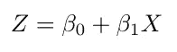
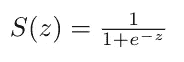
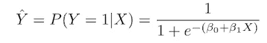
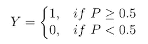
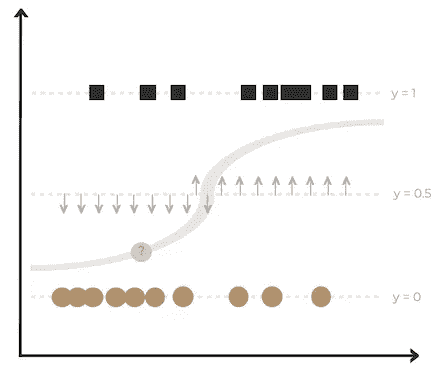

# 什么是逻辑回归？

> 原文：<https://medium.com/analytics-vidhya/what-is-logistic-regression-6f58c25471df?source=collection_archive---------14----------------------->

## 逻辑回归指南

## 第 1 部分:定义模型

> ***算法是什么？***

**逻辑回归(LR)** 是一种**监督机器学习**算法。LR 的目的是预测查询样本的分类(例如是/否)。它借助 sigmoid 函数，使用标记的输入数据预测动作的概率(在 0 和 1 之间)。为了确定类别结果，选择一个**阈值**作为预测要发生的事件的截止值。

> ***算法是如何工作的？***

步骤 1:对查询样本执行线性回归，以预测作为连续值的结果。

线性回归方程

步骤 2:通过 sigmoid 函数传递线性回归输出，以获得介于 0 和 1 之间的概率值。

Sigmoid 函数方程

概率方程

第三步:确定阈值(一般为 0.5)。

步骤 4:将阈值应用于概率，以获得 1 或 0 的输出。

阈值方程

第五步:返回类标签(例如:是/否)→查询样本的预测！

> ***算法的例子***

逻辑回归算法

A 级

B 类

查询样本

*   当 P ≥ 0.5 时，Y=1 代表 A 类→查询样本归类为 A 类。
*   当 P < 0.5, Y = 0 which represents Class B → the query sample is classified as Class B.

In this example, since the query example has a Probability < 0.5 (and hence falls below the threshold line), the query example will have an outcome of Y = 0 and be classified as Class B.

*下一个 Up —* [*如何实现 Logistic 回归？第二节:用 Python*](https://kopaljain95.medium.com/how-to-implement-logistic-regression-6f27ce4c45fd) *…* 建立模型