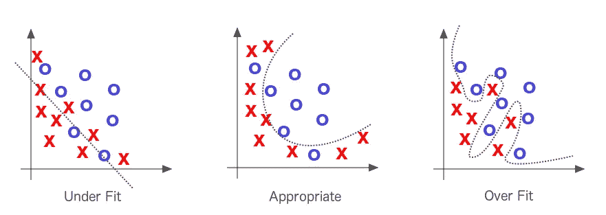
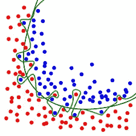
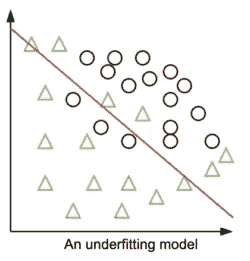
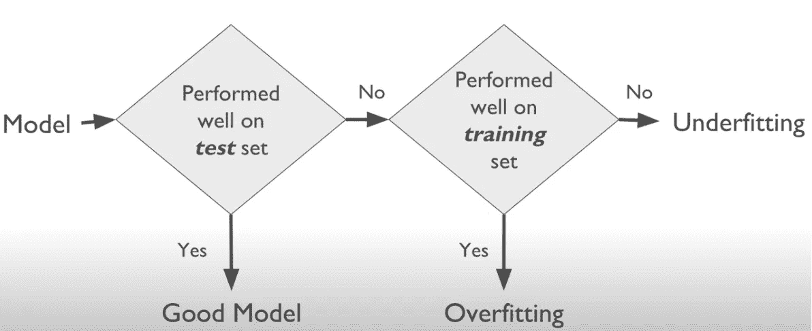

# 什么是机器学习？(第二部分)

> 原文：<https://medium.com/analytics-vidhya/what-is-machine-learning-part-2-b1340d9a0410?source=collection_archive---------21----------------------->

机器学习中使用的一些基本概念和词汇的分类——初学者水平。

布雷特·乔丹在 [Unsplash](https://unsplash.com?utm_source=medium&utm_medium=referral) 上的照片

为了更好地理解这篇文章，请点击这里查看文章的第一部分[。](https://loischo594.medium.com/what-is-machine-learning-part-1-f84944e19e8c)

**使用机器学习进行以下操作:**

*   当有问题时，用长长的规则列表来寻找解决方案。
*   当问题复杂且传统方法无法提供解决方案时。
*   当环境不稳定，涉及数据时，使用机器学习，因为它适应新的数据。

## 学习模型时避免以下情况:

*   训练数据质量差且数量不足。
*   质量差的数据(充满异常值和错误的数据)。
*   无关的特征。

## 数据的训练和测试

**数据的训练:**数据被分成两(2)组，训练和测试，通常是 80%的数据。训练仅仅是教模特如何表演。

**数据测试:**简单地将一个经过训练的模型放在一个环境中，并监控它的表现。本质上是要知道这个模型对新案例是否有效。不要假设，总是测试模型。

## 什么是模型？

模型是一个被训练来识别特定类型模式的文件，它也是一种描述两个变量如何一起工作的方式。

图片来自 kaggle.com

## 机器学习中的过拟合和欠拟合

任何机器学习模型的目标都是能够很好地从训练数据推广到问题领域的任何数据。更像是使用训练数据来理解和解决问题，并可能对模型从未见过的数据进行预测。

然而，事情并不总是按计划进行。该模型要么过度概括，要么概括不足。这些通常是机器学习表现不佳的原因。例如，过度拟合的模型在训练期间可能具有 90%的准确度，而在测试期间其准确度变为 50%。不太好对吗？

## 过度装配:

想象一下去一个环境，你的钱被偷了。然后你就断定那里的人都是贼，那就是“**过度概括**”，类似于机器学习中的**过度拟合**。该模型在它已经看到的数据上表现很好，而在没有看到的数据上表现很差。这是因为在过拟合中，模型很好地学习了噪声而不是信号，从而对模型产生负面影响。

> 如果我们的模型在训练集上比在测试集上表现得更好，我们可能会过度拟合。

图片来自 wikepedia.com

## 如何克服过度拟合:

*   交叉验证-仅用于调整原始训练集的超参数。
*   手动减少特征数量或进行特征选择，降低模型的复杂性。
*   正规化。
*   使用更多数据进行训练有助于更好地检测信号，从而确保数据是干净的。

图片来自 google.com

## 欠装配:

它的特点是模型太简单，特征太少或数据信息太少。因为拟合的模型仅仅是接近目标值或函数的模型。所以有一个不合适的模型就像没有达到目标，即使在现实生活中也是不好的。

图片来自 allcloud.io

## 如何避免装配不足:

*   增加模型的复杂度。
*   去除数据中的噪声。
*   增加训练数据的数量。事实上，模型在数据越多的情况下表现越好。

> 找到过度拟合和欠拟合之间的平衡是一切。在训练和测试数据上都表现良好的模型被认为是非常适合的。

图片来自 datascience.foundation

## 偏见:

通常指由于采样和估计造成的数据误差

## 异常值:

这些观察值与数据集中的其他值相距很远。它们可能是数据收集过程中出现的噪声。因此，应该对它们进行调查和了解。

## 超级参数:

超参数是其值用于控制机器学习中的学习过程的参数。

## **聚类**

数据点根据某些特征和属性进行分组。这是一种无监督的机器学习。

## 自然语言处理

人工智能的一个子领域，用于处理人类语言。非结构化语言数据被转换成人类语言。

## 计算机视觉

这是一个人工智能领域，训练计算机解释和理解视觉世界。

机器学习中使用的词汇非常多，但以上这些对于机器学习初学者来说是一个进步。

由[皮特·佩德罗萨](https://unsplash.com/@peet818?utm_source=medium&utm_medium=referral)在 [Unsplash](https://unsplash.com?utm_source=medium&utm_medium=referral) 上拍摄

## 参考资料:

机器学习的一步一步——鲁道夫·拉塞尔

精英数据科学(机器学习中的过度拟合)

机器学习掌握(机器学习算法的欠适应和过适应)

[https://data science . foundation/science white paper/机器学习中的欠适应和过适应](https://datascience.foundation/sciencewhitepaper/underfitting-and-overfitting-in-machine-learning)

[https://www . springboard . com/blog/ai-machine-learning/machine-learning-terminal/](https://www.springboard.com/blog/ai-machine-learning/machine-learning-terminology/)