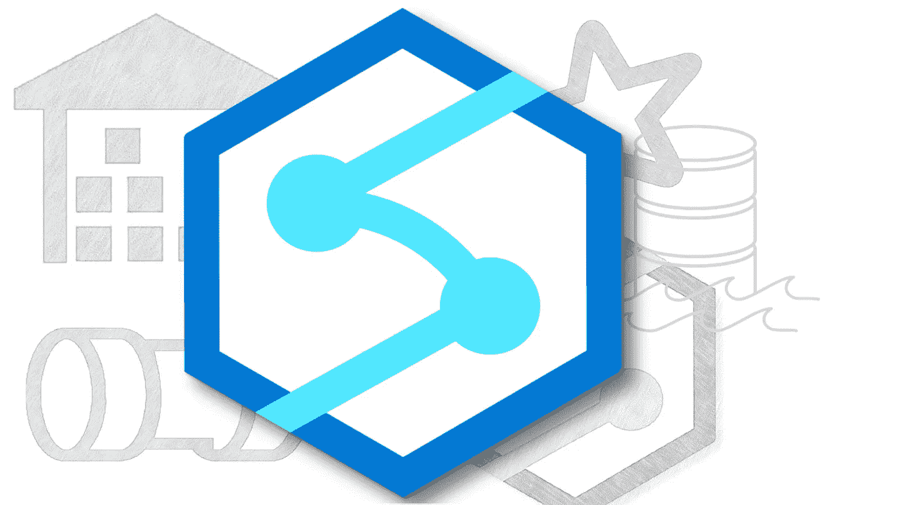
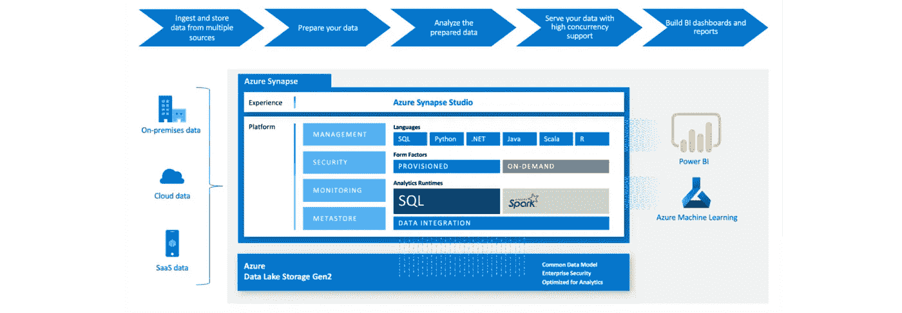
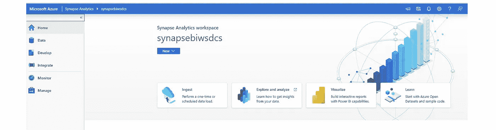

# 微软的 Azure Synapse Analytics 是什么？

> 原文：<https://medium.com/analytics-vidhya/what-is-microsofts-azure-synapse-analytics-45c0685bab00?source=collection_archive---------25----------------------->

## 端到端数据分析项目的 Synapse

这是微软 Azure 分析服务中最后一个发布的综合服务。

*   无限的可扩展性，
*   在不移动数据的情况下查询数据，
*   分析周期的端到端管理

凭借这些特性，它被宣传为*新一代数据分析*平台。

那么，为什么要创建这项服务呢？

根据研究，**分析和人工智能(AI)** 是每个领域的领先投资领域之一。我们都说我们正在走向数字化，我们谈论投资这些工具的重要性。然而，当我们审视事实时，不幸的是，大多数公司还不能有效地使用数据。但是，数据的整合在**报告、机器学习**和**人工智能项目**中变得非常重要。

在数据分析领域，有**个数据仓库**，在那里执行过去的关系数据，使用 ETL 移动数据，我们用它来寻找过去问题的答案。我们现在非常了解系统、基础设施、需求以及如何在数据仓库中实现。

在预测和高级分析场景中，有一个**大数据**世界，其中数据湖和 Hadoops 开始发挥作用。最常见的例子是来自 IOT 设备、社交媒体平台的数据流。

Synapse Analytics**服务旨在将这两个世界融合在一起。一个可以存储所有数据并对其进行分析操作的世界。**

合并的一个重要优势是能够保护单个服务，而不是保护不同的服务。另一种是在同一平台上整合技术差异。换句话说，两个具有不同技术能力的专有技术(如 Python 和 Spark)可以在新世界中的同一平台上工作，并可以作为单个平台使用。此外，他们的经验应该能够与数据湖相结合。

今天，重要的一点是，它使作为**数据工程师和数据科学家**的团队成员能够在单个平台上使用多个版本。

综上所述，Azure Synapse Analytics 从单点的技术、安全和性能上，可以称为这两个世界的服务。

正如我们所说，Synapse 为企业数据仓库汇集了 Spark 的大数据分析能力和数据集成技术，它提供了一个完全统一的环境。

因此，Synapse 框架可以用作单一的端到端服务，我们可以轻松地查询、管理和呈现商业智能项目或机器学习项目的数据。

Synapse 实际上是一个更加先进和全面的服务，它取代了旧的 Azure SQL 数据仓库服务。使用 Azure SQL DW 的特性，Synapse 通过基于列的存储将数据存储在关系表中。这种形式为我们提供了什么？它显著降低了数据存储成本并提高了查询性能。

在 SQL 池中，外形规格(计费)部分有两个选项。Provisioned option 表示**专用 SQL 池**，On-Demand (PerQuery)表示**无服务器**。

无服务器与传统使用的专用服务有何不同？

通常情况下，当资源被分配给我们时，费用是不变的。然而，在**无服务器**中，资源不是专用的，分配的资源不收费。您将只为查询中处理的数据付费。因此，这是一个真正的**按使用定价模型**。

> Synapse 将 SQL 和 Spark Pool 基础设施、数据工厂功能以及 Power BI 和可视化功能结合在一起。

我们从单个平台访问服务并完成工作的接口被称为 **Synapse Studio** 。我们完全可以通过这个界面来进行改进。

我们还可以通过 Studio 创建我们的 Apache Spark 连接。我们可以通过编写可选语言中的代码来执行数据准备、清理和丰富等操作。

如果你想体验 Azure Synapse Analytics，我们可以通过下面的链接访问它。我们可以使用 30 天的期限和消费限制。

 [## 润土|微软 Azure

### 布于伦勒，艾勒克·利米莱尔·卡达尔，12 日博因卡·克瑞西兹迪尔。kullan labilirlik Kay nak ve b lgeye ba ldr . 12 ay…

azure.microsoft.com](https://azure.microsoft.com/tr-tr/free/synapse-analytics/)