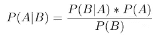
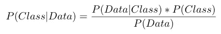
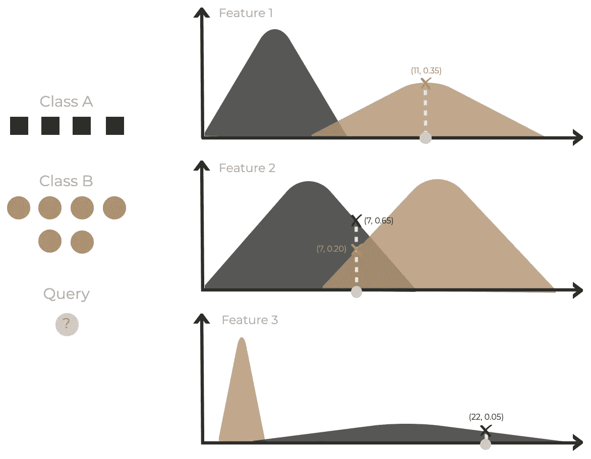

# 什么是朴素贝叶斯？

> 原文：<https://medium.com/analytics-vidhya/what-is-naive-bayes-9cb4fe1ba0c3?source=collection_archive---------6----------------------->

## 朴素贝叶斯指南

## 第 1 部分:定义模型

> ***算法是什么？***

**朴素贝叶斯(NB)** 是一种**监督机器学习**算法。NBs 的目的是通过依赖被分成类的标记输入数据来预测查询样本的分类。名称 *naive* 源于算法是特征的独立性假设，而 *bayes* 源于算法使用了一种称为 **Bayes 定理**的统计分类技术。

> ***算法是如何工作的？***

步骤 1:计算训练数据中给定类别标签的先验概率。

步骤 2:获取每个类的每个特征属性的似然概率。

第三步:利用贝叶斯定理计算后验概率。

贝叶斯定理方程

*   P(A|B) —事件 A 发生的概率，假设事件 B 已经发生[后验概率]
*   P(B|A) —事件 B 发生的概率，假设事件 A 已经发生[似然概率]
*   P(A) —事件 A 的概率[A 的先验概率]
*   P(B) —事件 B 的概率[B 的先验概率]

第四步:返回后验概率较高的类别标签→查询样本的预测！

> ***算法的例子***

*让我们根据朴素贝叶斯(高斯)方程改写贝叶斯定理……*

朴素贝叶斯(高斯)方程

*   P(Class)代表**类** (y 输出)的**先验概率**。
*   p(数据)代表**预测器** (X 特征)**的**先验概率**。**
*   p(数据|类别)表示给定类别时**预测器的**似然概率**。**
*   *P* (类|数据)表示给定预测值的**类的**后验概率**。**

*让我们从一个带有…* 的模拟数据帧开始

*   *4 列(3 个特征[X:* x₁、x₂、x₃ *]和 1 个输出[*y—*a 类或 b 类])*
*   *10 行(观察值)，其中 4 行属于 A 类，6 行属于 B 类*

*本例的目标是预测查询样本的类别(A 或 B)，其中特征 1、特征 2 和特征 3 的输入值分别为 11、7 和 22。*

*注意:由于我们正在检查高斯朴素贝叶斯，因此使用均值(μ)* *和标准差(σ)绘制每个特征的每个类的正态(或高斯)分布曲线。*

朴素贝叶斯(高斯)算法

*让我们使用每个类别的计数来计算 P(类别)的先验概率…*

*   P(Class=A) → [4 /(4+6)] = 0.40
*   P(Class=B) → [6 /(6+4)] = 0.60

*让我们计算 P(数据)的先验概率……*

*   在这个例子中没有计算 p(数据),因为特征值是连续的而不是分类的

*让我们使用上面的正态分布图为每个特征计算 P(数据|类别)的似然概率…*

*   l(特性 1 = 11 |类别=A) →接近 0
*   l(特性 2 = 7 |类别=A) → 0.65
*   l(特性 3 = 22 |类别=A) → 0.05
*   l(特性 1 = 11 |类别=B) → 0.35
*   l(特性 2 = 7 |类别=B) → 0.20
*   l(特性 3 = 22 |类别=B) →接近 0

*让我们使用朴素贝叶斯方程计算 P(类|数据)的后验概率…*

*   P(Class=A|Data)

= P(Class = A)x(L(Feature 1 = 11 | Class = A)x L(Feature 2 = 7 | Class = A)x L(Feature 3 = 22 | Class = A))

= [0.60 x((接近于 0) x 0.65 x 0.05)]

注意:如果概率是一个小数字(接近于 0)，取计算的 logₑ(以避免下溢。

logₑ(p(class=a|data)= logₑ[0.60 x((更接近于 0) x 0.65 x 0.05)]

= logₑ(0.60) + logₑ(closer 到 0) + logₑ(0.65) + logₑ(0.05)

=-0.51+-101.71+-0.43+-3.00 =**-105.65**

*   P(Class=B|Data)

= P(Class = B)x(L(Feature 1 = 11 | Class = B)x L(Feature 2 = 7 | Class = B)x L(Feature 3 = 22 | Class = B))

= [0.40 x (0.35 x 0.20 x(更接近于 0))]

类似地，取计算的 logₑ()以避免下溢。

logₑ(p(class=b|data))= logₑ[0.40 x(0.35 x 0.20 x(更接近于 0))]

= logₑ(0.40)+logₑ(0.35)+logₑ(0.20)+logₑ(closer 到 0)

=-0.92+-1.05+-1.61+-94.84 =**-98.42**

由于与类别 A 的后验概率对数(-105.65)相比，类别 B 具有更高的后验概率对数(-98.42)**→查询样本将被预测为类别 B！**

***接下来—* [*如何实现朴素贝叶斯？第二节:用 Python*](https://kopaljain95.medium.com/how-to-implement-naive-bayes-24e92f2b49f3)*……*建立模型**