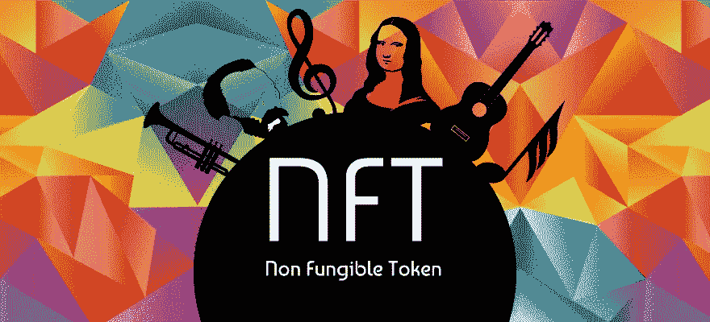
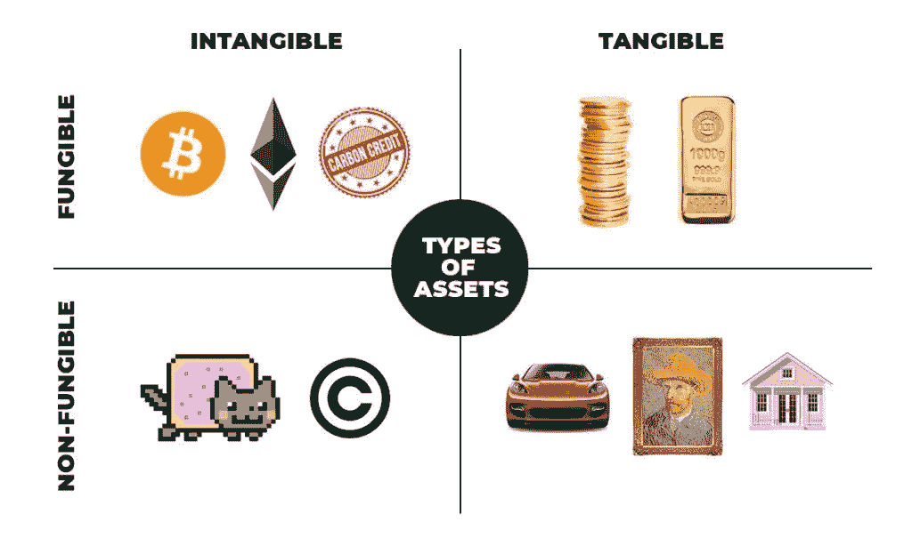
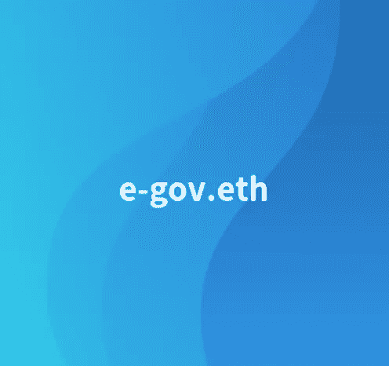

# 什么是 NFT？特征和使用案例解释！

> 原文：<https://medium.com/analytics-vidhya/what-is-nft-characteristics-and-use-cases-explained-ad7dc77f350f?source=collection_archive---------2----------------------->

图片来源:瑞秋·麦金托什

**NFT** ，你一定听说过。无论是艺术、游戏还是收藏品市场，NFT 现象从未停止以其记录给我们带来惊喜。更好的是，它重新发明了数字财产的概念。

*那么什么是 NFT 呢？如何理解并受益于这一仅处于起步阶段的新技术？
我们现在经历的革命仅仅是因为围绕加密货币的投机泡沫吗？
在这篇文章中发现，我们的第一答案！*

# 1.什么是 NFT？

NFT 是不可替代令牌的缩写。为了把事情搞清楚，让我们从理解两个原则概念开始:

**什么是代币？**

*“在区块链生态系统中，任何可以在两个人之间进行数字转移的资产都被称为代币”(来源:*[coinhouse.com](https://www.coinhouse.com/coinhouse-academy/ethereum/what-is-a-token)*)*

这些代币在区块链上发行，最常见的是在以太坊。根据它们的属性，它们有不同的分类和用途。

**什么是可替代性？**

可替代性意味着一项资产的各个单元是可以互换的，本质上是无法区分的。
货币是可替代资产的典型例子。50 美元始终是 50 美元，不管问题中的 50 美元钞票的序列号是多少。
相反，艺术品是所谓的不可替代资产。毕加索的画不同于梵高的画，它们是两种完全不同的、可辨别的作品，不能互换。

## 那么什么是 NFT 或不可替代的令牌呢？

因此，这些 NFT 是唯一的令牌，并且数量有限。
这意味着，如果你取 2 个 NFT，这两个数字对象会有明显的不同，你就能用区块链证明这一点。简而言之:它是一种由加密货币网络支持的独特“令牌”。因此，它的所有者肯定是唯一的所有者。

## 最后，NFT 和加密货币有什么区别？

如前所述，货币是可替代的，就像加密货币一样。正是这种特性造成了所有的不同。
如下图解释，持有一个比特币或另一个比特币是等价的。但是，持有单个令牌 A 并不等同于持有单个令牌 b。

图片来源:理查德·惠丁顿

以下是你在 [OpenSea](https://opensea.io/assets) 平台上买卖 NFT 资产的一些例子:

山羊费德勒——这位最伟大网球运动员的漫画在 opensea.io 网站上出售

[以太坊域名服务公司](https://opensea.io/collection/ens)拥有的 e-gov.eth 域名在 [opensea.io](https://opensea.io/assets/0x57f1887a8bf19b14fc0df6fd9b2acc9af147ea85/45203489466192446236548756880661244348235580310886730799726918074236274538167) 上出售

正如你在这里看到的，即使你没有制作或创建漫画或域名，你也可以从所有者/创造者那里购买并拥有它！你可以用任何你想要的方式使用那件艺术品或领域或任何其他形式的资产。

# **2。NFT 的特点是什么？**

如前所述，每个 NFT 都是独一无二的。这种独特性由 4 个主要特征定义:

*   **唯一创作者**

当 NFT 被创造出来的时候，创造者会来“签署”它。事实上，通过与“智能契约”(区块链上的契约)交互，创建者将在区块链上启动一个事件，这将允许时间标记，并以不可更改的方式创建 NFT。
为了通过区块链给你一个更有意义的签名图像，你可以把它想象成一个画家在画布上的签名。这个签名可以让你区分原件和复印件。

*   **不可改变的标识符**

相当于 NFT 身份证号码的是它的标识符。正是这一系列不可修改和不可改变的数字或字母，将在区块链上识别 NFT。
与物理世界画一个平行线，这对应一个唯一的序列号。

*   **其内容**

NFT 的标识符和内容是两个不同的元素。标识符是在创建时定义的，并且是不可更改的，这将是 NFT 的“身份”所确定的。内容也是在创建过程中定义的，但可以全部或部分修改。
在内容方面，格式多种多样:可以是图像、视频、文档或其他。
在大多数情况下，NFT 的内容将不可编辑。
但是，在某些情况下，可能会对内容进行更改。所有者确实可以对其进行限定，并在区块链内输入“关于 NFT”的信息。例如，我可以拿着一个与物理对象相对应的 NFT，并根据它的磨损情况用其当前状态来限定我的 NFT 的内容。
因此，决定 NFT 价值的不是它的内容，而是它唯一不可改变的标识符。

*   **现任主人**

当前所有者是将用于定义 NFT 的最后一个特征。事实上，NFT 最后的主人将通过两个区块链钱包之间的转移而为人所知。因此，通过使用带有时间戳的区块链转移，可以按照时间顺序知道所有的所有者。所有权的这种转让产生了某些权利，但也产生了某些义务。

# **3。NFT 的主要使用案例有哪些？**

## 收藏品

就销售额而言，收藏品是目前最受欢迎的 NFTs 应用之一，上个月约 23.6%的销售额来自收藏品项目。

随着 NFT 技术被用于创造明星运动员和名人的象征性版本供粉丝收集，这一类别继续增长和扩大。

## 赌博

玩家是 NFTs 的理想目标市场，因为他们已经熟悉虚拟世界和货币的概念。NFT 在游戏行业蓬勃发展，因为它们允许游戏元素被丢弃，并易于在交易和对等市场中转移或交易。

这与传统游戏截然不同，传统游戏禁止出售或转让游戏中的物品，如稀有武器和皮肤。NFT 还使游戏体验更加有形和有益，因为玩家对他们的数字资产拥有真正的所有权。他们也创造了一个新的经济，因为玩家现在有潜力通过建立和扩大他们的游戏资产来赚钱。

> 区块链潜力的关键在于一个理论，即当玩家在游戏中拥有更多皮肤时，他们的忠诚度将会增加:当他们的数字资产可以在游戏或平台之间转移，或在公开市场上交易时，他们会将更多的辛苦赚来的现金进行投资。离开游戏时将数字物品留在桌面上与创造时间或金钱投资是对立的，理论上是这样的。(来源:[cointelegraph.com](https://cointelegraph.com/magazine/2020/06/29/investing-blockchain-gaming-vc))

## 艺术

数字艺术家面临的最大挑战之一是保护他们的创作免受版权侵犯，但 NFT 是最好的解决方案，因为它们提供所有权、真实性的证明，并消除假冒、版权侵犯和欺诈问题。

[coin desk 的一篇文章](https://www.coindesk.com/as-museums-go-dark-crypto-art-finds-its-frame)指出，由于博物馆和画廊在新冠肺炎面前被迫关闭，许多艺术家转向了非网络艺术和在线展厅，并且“正如比特币通过创建事件的共享账本为没有信任的点对点交易铺平了道路，加密艺术[…]也有内在的来源。”

## 执照和证书

NFT 用例还可以为许可和认证验证提供显著的好处。与任何其他文凭或执照一样，课程完成证书通常以数字或纸质形式提供给成功的申请人。大学和雇主在向公司或研究所的人提供职位之前，需要课程完成文件的副本作为参考。

管理员可以通过使用 NFTs 的功能来访问这些许可证，从而节省大量时间。NFTs 形式的证书和许可证消除了检查和验证记录的负担。随后，该方法还提供了一种更简单的方法来存储课程或许可证完成的证据。

# 总之，NFT 有什么值得记住的？

NFT 只是一个单一的令牌，在区块链上运行。四个主要特征定义了它:它的**唯一创造者**，它的**不可改变的标识符**，它的**内容**和**当前所有者**。

这种“数字唯一性”及其属性吸引了不同的领域，如视频游戏、收藏品、数字身份、许可证、证书和艺术品。

我们相信加密 NFT 将在未来几年继续强劲增长。更容易储存，不可改变，对艺术家来说更有利可图，这个市场将很快超过几十亿美元。