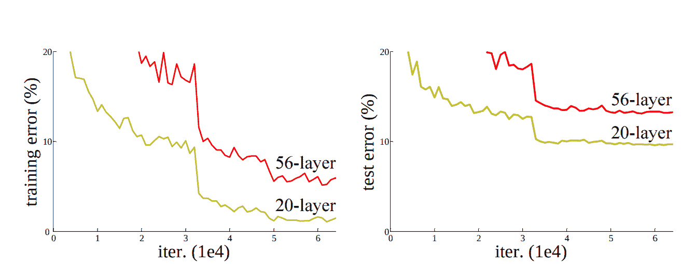
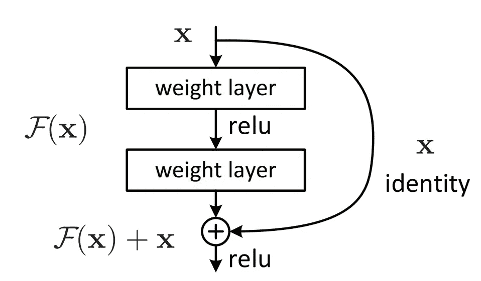
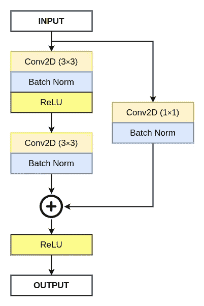
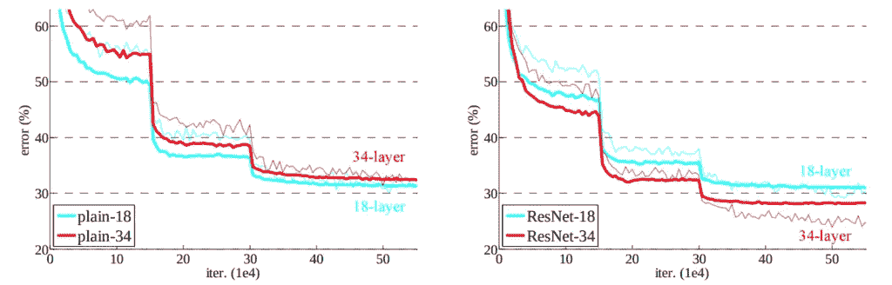
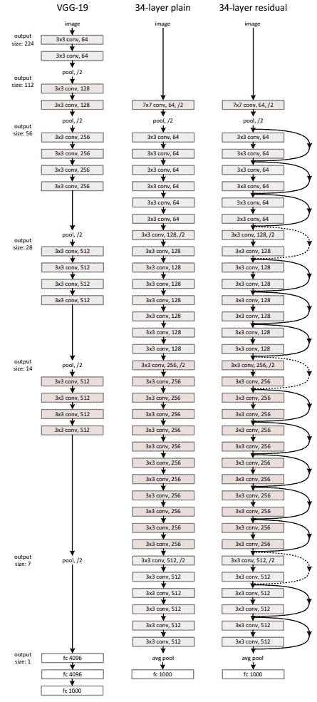

# 什么是剩余网络或 ResNet？—白痴开发者

> 原文：<https://medium.com/analytics-vidhya/what-is-residual-network-or-resnet-idiot-developer-6a1daa7c3b09?source=collection_archive---------0----------------------->

深度神经网络因其在现实世界应用中的高性能而变得流行，如[图像分类](https://idiotdeveloper.com/dog-breed-classification-using-transfer-learning-in-tensorflow/)，语音识别，机器翻译等等。随着时间的推移，深度神经网络变得越来越深，以解决更复杂的任务。向深度神经网络添加更多层可以提高其性能，但在一定程度上。之后，训练网络变得困难，性能开始下降。为了解决这些挑战，研究人员引入了剩余网络。

在本文中，我们将了解更多关于剩余网络及其工作原理，并帮助解决上述挑战。

**目录:**

1.  什么是剩余网络
2.  为什么我们需要一个剩余网络？
3.  什么是残块？
4.  残余块如何帮助
5.  ResNet 架构
6.  摘要
7.  阅读更多

# 什么是残余网络？

残差网络(ResNet)是由、何、、、任、于 2015 年在他们的论文“[用于图像识别的深度残差学习](https://arxiv.org/pdf/1512.03385.pdf)”中提出的。

这些 ResNet 模型的成功可以从以下几点看出:

*   ResNet 模型以 3.57%的前 5 名错误率在 ILSVRC 2015 分类竞赛中获得第一名。
*   该网络在多个 ILSVRC 和 COCO 2015 竞赛中获得第一名。这些竞赛包括— ImageNet 检测和定位、COCO 检测和分割。
*   通过用 ResNet-101 替换更快的 R-CNN 中的 VGG-16 层，观察到 28%的改进。

# 为什么我们需要一个剩余网络？

我们知道神经网络是通用函数逼近器，当给定一个好的数据集时，它们可以学习将输入 X 映射到输出 Y。神经网络的性能随着层数的增加而提高。添加更多层的原因是这些层将学习更复杂的功能。最初的层将学习检测线条、边缘等，随后的层在最后可以检测可识别的对象，如狗或猫。

向神经网络添加层数是有限制的。达到该阈值后，模型的精度开始饱和，然后下降。这是由于消失/爆炸梯度，这导致梯度成为 0 或太大。因此，当我们增加层数时，训练和测试错误率也会增加。

从上图中，我们可以说浅网络比深网络表现更好。我们可以看到 20 层网络在训练和测试中的错误率都小于 56 层网络。

你可能还会认为 56 层模型是过度拟合的。在过拟合的情况下，模型的训练性能急剧增加，而测试性能显著下降。这里，56 层网络的性能在训练和测试中都较差。

由于网络的深度和维数灾难，网络不能被适当地训练。因此，浅层(20 层)网络比深层(56 层)网络表现更好。

# 什么是残块？

剩余网络由作为网络主要组成部分的剩余单元或块组成。在深入细节之前，这里是残差块的示意图。

在以前的方法中，每一层向其下一层馈送，并且同样的事情随后继续。在剩余网络中，每一层都连接到下一层，并直接连接到下一层的 2-3 层。

残差块由两个 3×3 卷积层和一个标识映射(也称为快捷连接)组成。每个卷积层后面都有一个批量标准化层和一个 ReLU(校正线性单位)激活函数。在标识映射与最后一批规范化的输出之间执行元素式加法。

对于两个特征的元素相加，输出通道(特征通道)的数量应该相同。在输出通道的数量不相同的情况下，我们对身份映射执行 1×1 卷积和批量归一化。

# 残余块如何帮助

残余块帮助研究人员建立和训练更深的网络，而没有消失/爆炸梯度的问题。剩余块中存在的身份映射或快捷连接在以下方面有所帮助:

如果正常流程中的层没有学到任何东西，那么身份映射基本上是从更早的层复制信息。这有助于神经网络即使在更深的架构中也能更好地执行。

使用残差网络或 ResNet 可以极大地提高神经网络的性能，尽管有更多的层。

上图清楚地表明，与 plain-34 相比，ResNet-34 的错误率要低得多。此外，我们可以看到 plain-18 和 ResNet-18 的错误率几乎相同。

# ResNet 架构

有许多 ResNet 体系结构是用网络中不同数量的层构建的。这些网络是:

剩余网络采用受 VGG-19 协议启发的 34 层平面网络架构，然后添加快捷连接，从而形成 34 层剩余网络，如下图所示:

# 摘要

在本文中，您将了解剩余网络及其相关内容。

1.  现有的神经网络有什么问题，残差网络是如何解决的？
2.  什么是剩余块，它是如何工作的？
3.  剩余块如何帮助。

仍然，有一些问题或疑问？就在下面评论吧。更多更新。跟我来。

# 阅读更多

*   [剩余网络简介](https://www.geeksforgeeks.org/introduction-to-residual-networks/)
*   [剩余积木 ResNet 的积木](https://towardsdatascience.com/residual-blocks-building-blocks-of-resnet-fd90ca15d6ec)
*   [Resnet 或残差网络简介](https://www.mygreatlearning.com/blog/resnet/)

*原载于 2021 年 9 月 25 日 https://idiotdeveloper.com**[*。*](https://idiotdeveloper.com/what-is-residual-network-or-resnet/)*