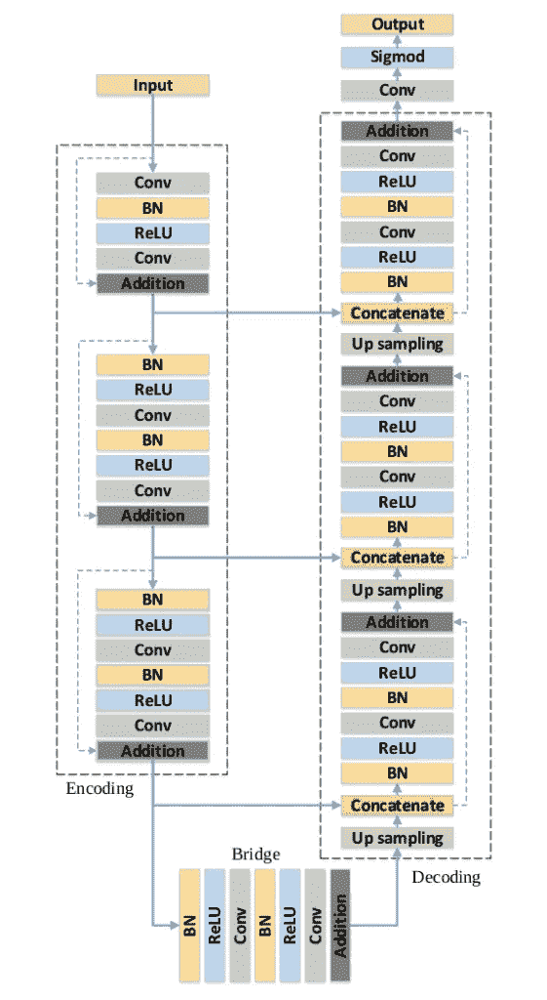

# 什么是 RESUNET——白痴开发者

> 原文：<https://medium.com/analytics-vidhya/what-is-resunet-idiot-developer-9a28762f14b4?source=collection_archive---------11----------------------->

RESUNET 指深度残余 UNET。它是由张等人开发的一种用于语义切分的编解码体系结构。它最初用于遥感图像分析领域的高分辨率航空图像的道路提取。后来，它被研究人员用于多种其他应用，如[息肉分割](https://idiotdeveloper.com/polyp-segmentation-using-unet-in-tensorflow-2)，脑肿瘤分割，人类图像分割，等等。

原文：<https://arxiv.org/pdf/1711.10684.pdf>

RESUNET 是一个完全卷积的神经网络，旨在用更少的参数获得高性能。这是对现有的 [UNET](https://idiotdeveloper.com/what-is-unet/) 架构的改进。RESUNET 利用了 [UNET](https://idiotdeveloper.com/what-is-unet/) 架构和深度剩余学习的优势。



# RESUNET 的优势

*   残余块的使用有助于建立更深的网络，而不用担心消失梯度或爆炸梯度的问题。这也有助于网络的简单训练。
*   RESUNET 中丰富的跳跃连接有助于不同层之间更好的信息流动，这有助于训练时更好的梯度流动(反向传播)。

# RESUNET 的整体架构

RESUNET 由编码网络、解码网络和连接这两个网络的网桥组成，就像一个 U-Net。U-Net 使用两个 3×3 卷积，每个卷积后面都有一个 ReLU 激活函数。在 RESUNET 的情况下，这些层由预激活的残余块代替。


# 编码器

编码器获取输入图像，并将其通过不同的编码器模块，这有助于网络学习抽象表示。编码器由三个编码器模块组成，使用预激活的残差模块构建。每个编码器块的输出充当相应解码器块的跳跃连接。

为了减少特征图的空间维度(高度和宽度)，第一个 3×3 卷积层在第二个和第三个编码器块中使用步长 2。跨距值 2 将空间维度减少一半，即从 256 减少到 128。

# 桥

该桥还包括一个跨距值为 2 的预激活剩余块。

# 解码器

解码器采用来自桥的特征图和来自不同编码器块的跳过连接，并学习更好的语义表示，用于生成分段掩码。

解码器由三个解码器块组成，并且在每个块之后，特征图的空间维度加倍，并且特征通道的数量减少。

每个解码器模块从 2×2 上采样开始，这使得特征图的空间维度加倍。接下来，将这些特征映射与来自编码器模块的适当跳跃连接连接起来。这些跳跃连接有助于解码器模块获得编码器网络学习到的特征。此后，来自连接操作的特征映射通过预激活的残差块。

最后一个解码器的输出通过一个 1×1 的 sigmoid 激活卷积。sigmoid 激活函数给出了表示逐像素分类的分割掩模。

# 张量流(Keras)码

```
from tensorflow.keras.layers import Conv2D, BatchNormalization, Activation, MaxPool2D, UpSampling2D, Concatenate, Input
from tensorflow.keras.models import Model

def batchnorm_relu(inputs):
    """ Batch Normalization & ReLU """
    x = BatchNormalization()(inputs)
    x = Activation("relu")(x)
    return x

def residual_block(inputs, num_filters, strides=1):
    """ Convolutional Layers """
    x = batchnorm_relu(inputs)
    x = Conv2D(num_filters, 3, padding="same", strides=strides)(x)
    x = batchnorm_relu(x)
    x = Conv2D(num_filters, 3, padding="same", strides=1)(x)

    """ Shortcut Connection (Identity Mapping) """
    s = Conv2D(num_filters, 1, padding="same", strides=strides)(inputs)

    """ Addition """
    x = x + s
    return x

def decoder_block(inputs, skip_features, num_filters):
    """ Decoder Block """

    x = UpSampling2D((2, 2))(inputs)
    x = Concatenate()([x, skip_features])
    x = residual_block(x, num_filters, strides=1)
    return x

def build_resunet(input_shape):
    """ RESUNET Architecture """

    inputs = Input(input_shape)

    """ Endoder 1 """
    x = Conv2D(64, 3, padding="same", strides=1)(inputs)
    x = batchnorm_relu(x)
    x = Conv2D(64, 3, padding="same", strides=1)(x)
    s = Conv2D(64, 1, padding="same")(inputs)
    s1 = x + s

    """ Encoder 2, 3 """
    s2 = residual_block(s1, 128, strides=2)
    s3 = residual_block(s2, 256, strides=2)

    """ Bridge """
    b = residual_block(s3, 512, strides=2)

    """ Decoder 1, 2, 3 """
    x = decoder_block(b, s3, 256)
    x = decoder_block(x, s2, 128)
    x = decoder_block(x, s1, 64)

    """ Classifier """
    outputs = Conv2D(1, 1, padding="same", activation="sigmoid")(x)

    """ Model """
    model = Model(inputs, outputs, name="RESUNET")

    return model

if __name__ == "__main__":
    shape = (224, 224, 3)
    model = build_resunet(shape)
    model.summary()
```

*原载于 2021 年 2 月 6 日*[*【https://idiotdeveloper.com】*](https://idiotdeveloper.com/what-is-resunet/)*。*