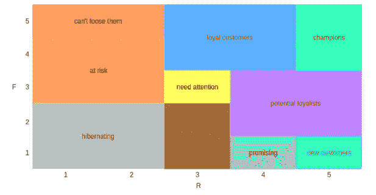
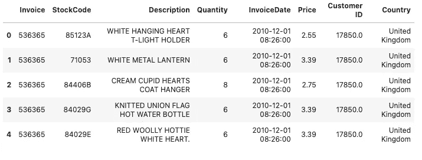
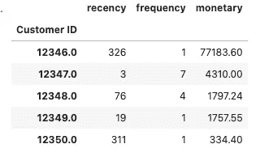
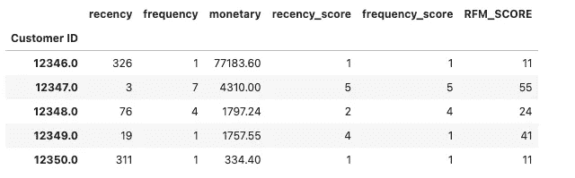
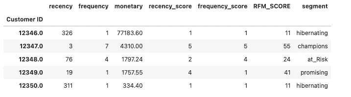

# 什么是 RFM 分析？Python 中的一个应用实例

> 原文：<https://medium.com/analytics-vidhya/what-is-rfm-analysis-an-applied-example-in-python-1979b9853f0b?source=collection_archive---------1----------------------->

大家好。在这个故事中，我们将介绍什么是 RFM 分析，并且我们将看到 Python 中的一个应用示例。我会在这里解释代码的含义，我也会在 Kaggle 中分享代码。你可以从[这里](https://www.kaggle.com/enesbaysan/rfm-analysis-in-python)访问 Kaggle 笔记本。


照片由[艾萨克·史密斯](https://unsplash.com/@isaacmsmith?utm_source=unsplash&utm_medium=referral&utm_content=creditCopyText)在 [Unsplash](https://unsplash.com/s/photos/customer-analysis?utm_source=unsplash&utm_medium=referral&utm_content=creditCopyText) 拍摄

# 什么是 RFM？

RFM 是使用 RFM 指标对客户进行细分的过程。我们将 RFM 指标标准化，从而得到细分市场。创建细分后，我们通过使用这些细分来采取行动。RFM 非常适合销售数据。

RFM 分析可以应用于不同的钟表，以便我们可以比较他们的结果。我们可以根据这些结果来衡量和评估所采取的措施和成本。

RFM 有两个基本术语:度量和分数。

## RFM 度量

实际上，RFM 是基于这三个指标而产生的。

*   紧急情况
*   **F** 频率
*   一元钱

最近时间表示客户最后一次购买是在多少天前。

频率表示客户购买的总次数。

货币表示客户购买的总付款。

## RFM 得分

我们通过标准化 1 到 5 之间的 RFM 指标来获得 RFM 分数。

## RFM 分析步骤

*   RFM 度量标准在 1 到 5 之间
*   通过使用标准化的 RFM 指标获得 RFM 分数
*   连接分数(例如:325)
*   使用串联分数创建细分市场
*   我们可以通过使用分段来采取行动

## RFM 电网



我们可以假设

*   当 R 值上升时，客户刚刚进行了购买
*   随着 F 值的上升，顾客会购买更多的东西
*   随着 M 值的上升，我们从客户那里赚得更多

我们不应该忘记，当我们计算这些分数时，我们是将所有客户一起计算的。

# Python 中 RFM 分析的应用实例

在本节中，我们将使用[这个](https://www.kaggle.com/nathaniel/uci-online-retail-ii-data-set)数据集。还有，你可以从[这里](https://archive.ics.uci.edu/ml/datasets/Online+Retail+II)得到。

## 加载数据

我准备在笔记本里导入`pandas`和`datetime`。

```
import pandas as pd
from datetime import datetime
```

我们将使用`datetime`来创建`today_date`变量。因为数据集包含 2009 年到 2011 年的数据，我们将在 2010 年到 2011 年间使用它。所以我们需要在 2010 年和 2011 年之间创建一个日期。

```
raw_data = pd.read_excel('../input/uci-online-retail-ii-data-set/online_retail_II.xlsx',sheet_name='Year 2010-2011')df = raw_data.copy()df.head()
```



这里我想停止编码一点来解释变量的含义。

*   发票:发票编号。如果这个号码以“C”开头，就意味着这个交易取消了。
*   库存代码:产品代码
*   描述:产品名称
*   数量:产品数量
*   发票日期:交易日期
*   价格:单个产品价格
*   CustomerID:唯一的客户号
*   国家:客户的国家名称

我们可以向数据集提出一些问题，并获得一些见解，就像我们在之前做的[一样，但我不会这样做。因为我现在想专注于主题。](/@mebaysan/rule-based-customer-segmentation-without-ml-6d194648813d)

## 删除空值

我将删除所有空值。在这种情况下，我不想和他们争。

```
df.dropna(inplace=True)
```

## 筛选已取消的交易记录

我们知道，如果发票变量以“C”开头，它的意思是取消交易。因此，我想把它们从数据集中过滤掉。

```
df = df[~df['Invoice'].str.contains('C', na=False)]
```

## 应用 RFM

如上所述，我需要创建一个旧日期。为此，我将使用`datetime`。

```
today_date = datetime(2011, 12, 11)
```

现在，我正在计算每个客户的 RFM 指标。

```
rfm = df.groupby('Customer ID').agg({
    'InvoiceDate': lambda x: (today_date - x.max()).days,
    'Invoice': lambda x: x.nunique(),
    'TotalPrice': lambda x: x.sum()
})rfm.columns = ['recency', 'frequency', 'monetary']rfm = rfm[rfm['monetary'] > 0]
```

在第一段代码中，我们已经为每个客户计算了 RFM 指标。

*   在第一个汇总过程中，我们计算了 R 值。我们从`today_date`变量中为每个客户挖掘最后一次购买。
*   在第二个汇总过程中，我们计算了 F 值。我们统计了每个客户的独特交易。
*   在第三个聚合过程中，我们计算了 M 值。我们合计了每个客户的交易金额。

在第二部分中，我们重命名了`rfm`数据集的列。

在这一部分的最后，我们筛选了客户，选择了那些货币价值大于 0 的客户。

```
rfm.head()
```



## **对 RFM 指标评分**

现在我们需要对指标进行评分。为此，我将使用`pandas`中的`qcut`函数。该函数对数据集列进行升序排序，并将其除以四分位数，然后使用`labels` arg 标记这些值。你可以从[这里](https://towardsdatascience.com/all-pandas-qcut-you-should-know-for-binning-numerical-data-based-on-sample-quantiles-c8b13a8ed844)获得更多关于`qcut`功能的信息。

我获得了下面的`recency`指标。在这里你可能会问，如果`qcut`按升序排序，为什么我要把标签从大到小设置呢？我的答案是:因为如果最近度越小，分数就越大。所以，如果最近值在第一个四分位数，我应该给它打 5 分。因为最近值越小，表示日期越近，这就是我们的目标。

```
rfm.loc[:, 'recency_score'] = pd.qcut(rfm['recency'], 5, [5, 4, 3, 2, 1])
```

现在我需要对`frequency`指标进行评分。我会用同样的技术得分，但有一点很重要；我们将使用`rank`方法。如果你不知道排名法是什么，我准备掉几篇文章学习一下。

*   [熊猫 DataFrame: rank()函数](https://www.w3resource.com/pandas/dataframe/dataframe-rank.php)
*   [Python | Pandas data frame . rank()](https://www.geeksforgeeks.org/python-pandas-dataframe-rank/)
*   [熊猫排名—给你的数据排名— pd.df.rank()](https://www.dataindependent.com/pandas/pandas-rank/)

```
rfm.loc[:, 'frequency_score'] = pd.qcut( rfm["frequency"].rank(method="first"), 5, labels=[1, 2, 3, 4, 5])
```

为了完成这一部分，我们需要连接 RFM 分数。

```
rfm.loc[:, 'RFM_SCORE'] = rfm['recency_score'].astype(
    str) + rfm['frequency_score'].astype(str)rfm.head()
```



## 标记 RFM 分数

在这一节中，我们将标记`rfm`数据集中的`RFM_SCORE`列。我已经使用 regex 创建了一个标记分数的字典。

```
seg_map = {
    r'[1-2][1-2]': 'hibernating',
    r'[1-2][3-4]': 'at_Risk',
    r'[1-2]5': 'cant_loose',
    r'3[1-2]': 'about_to_sleep',
    r'33': 'need_attention',
    r'[3-4][4-5]': 'loyal_customers',
    r'41': 'promising',
    r'51': 'new_customers',
    r'[4-5][2-3]': 'potential_loyalists',
    r'5[4-5]': 'champions'
}rfm['segment'] = rfm['RFM_SCORE'].replace(seg_map, regex=True)rfm.head()
```



是的，我们和 RFM 结束了。希望它是有帮助的和清楚的。

亲切的问候。