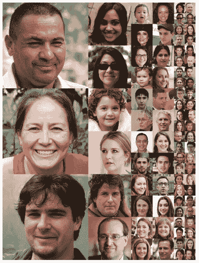
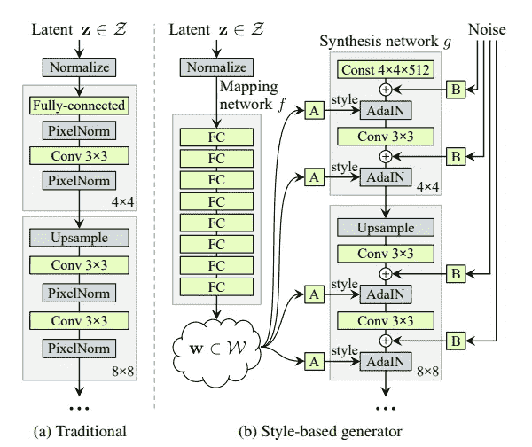
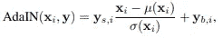
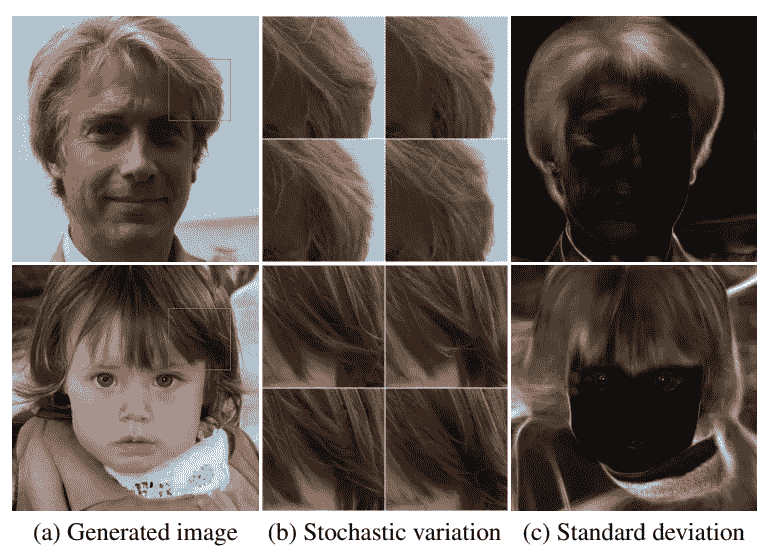
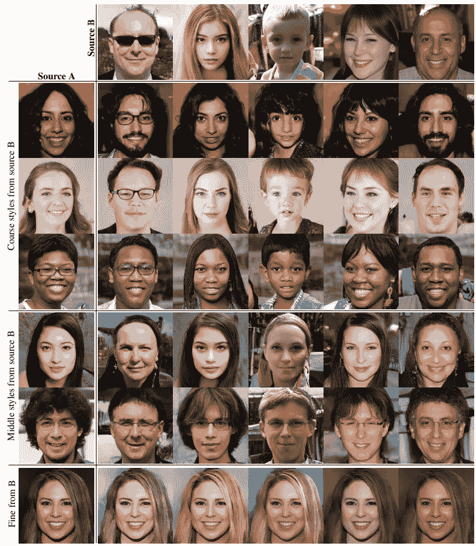
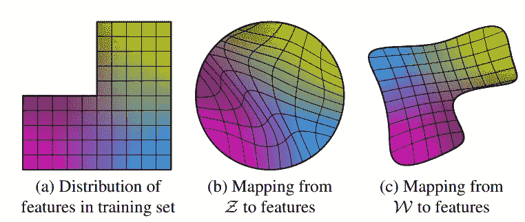
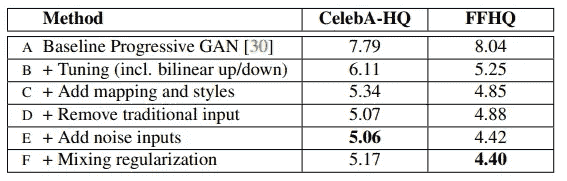
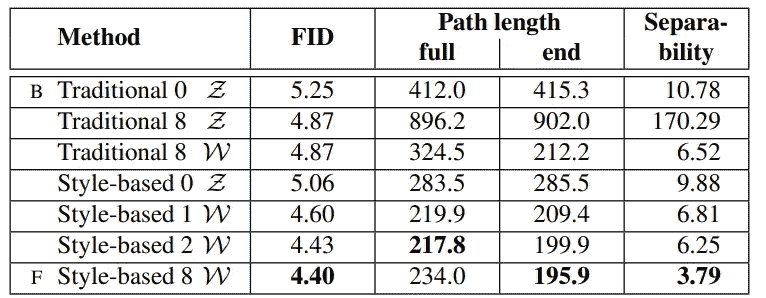
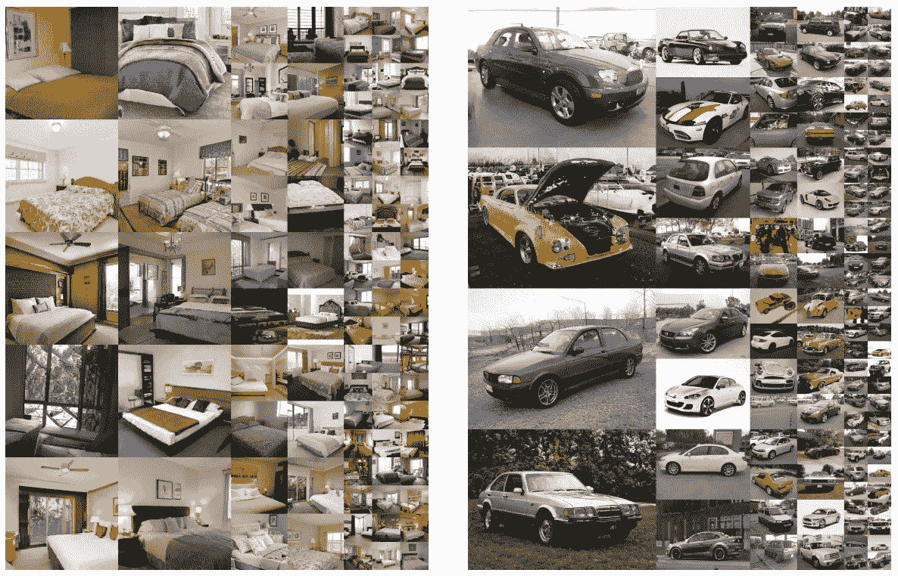
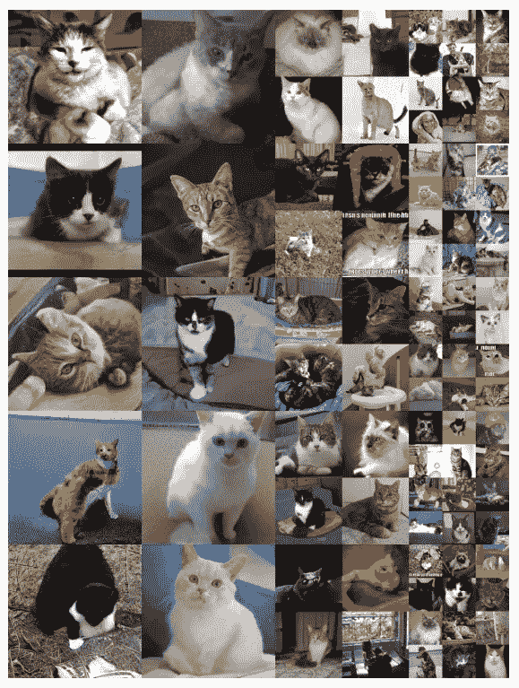

# StyleGAN 是什么？StyleGAN 关键概念概述

> 原文：<https://medium.com/analytics-vidhya/what-is-stylegan-an-overview-of-the-key-concepts-of-stylegan-3c1031775fb?source=collection_archive---------3----------------------->

StyleGAN[1]最初于 2019 年提出，通过将姿势和面部表情等高级属性与头发和雀斑等图像的随机变化分离开来，在基于风格的生成器架构创建逼真图像方面表现出惊人的性能。此外，它旨在通过引入中间潜在空间 W 来扩展潜在空间，生成器从该中间潜在空间 W 而不是经典潜在向量进行推断。

# 关键概念

*   学习的“风格”而不是潜在向量解开了复杂的图像空间，并实现了潜在空间中的平滑过渡。
*   使用 AdaIN 或条件批处理规范化，样式以各种比例应用于发生器的生成过程。
*   在每个尺度上添加随机噪声，以将随机变化添加到模型中。
*   本文中应用的每种方法都通过各种指标进行了比较和评估。

# 风格建筑

StyleGAN 基于渐进式 GAN[2]发生器和鉴别器。不同之处在于，初始的 4x4x512 是一个恒定的学习向量，而潜在向量是通过样式映射生成的，并通过 AdaIN 层馈入生成器。鉴别器架构和损耗函数(WGAN-GP)与渐进式 GAN 并无不同。

## 样式映射和 AdaIN

总之，潜在的 z 通过非线性映射网络 f: z -> W 映射到风格映射 W。映射函数是全连接的非线性函数或具有泄漏 ReLU 激活的 8 层 MLP。学习到的风格映射 W 被线性地转换成 AdaIn 层的多个向量“A”。

AdaIN 操作定义如上，基本上是一个基于学习向量 y 进行缩放的通道式批量归一化层。在这种情况下，y 是根据相应层的 A 向量计算的。因此，风格向量 W 可以在生成的不同阶段缩放网络的各种特征。

## 随机变化的随机噪声

为了给图像提供随机变化，随机噪声 B 的矢量被添加到网络的多层中。结果如上所示。该模型可以生成不同的头发纹理和背景，同时保留面部的重要细节。这对于克服来自鉴别器的压力以通过简单地利用给定的噪声和模型来产生新的图像以集中于产生真实的图像是特别有用的。

## 风格混合/混合正则化

风格混合，就像上图中的结果一样，是通过混合图像不同尺度的风格向量来实现的。这证明了 W 空间捕捉图像“风格”的有效性。例如，4x4、8x8 的粗糙样式会影响图像的姿势和发型，16x16、32x32 的中等样式会带来较小比例的面部特征，而精细比例的样式会改变配色方案和细节。

使用混合正则化，在训练期间使用两个随机潜在码而不是一个来生成一定百分比的图像。这被应用来引导样式按照预期进行调整，并生成如上图所示的惊人的图像混合。

## 风格空间

您可能想知道为什么在将 z 映射到 W 之后再输入到生成器中有助于提高性能。这是因为它解开了潜在空间和图像的空间。因为潜像空间和图像空间是连续的，并且生成器必须为每个潜像向量提供看似合理的图像。但是通过从 z 到 W 的非线性映射，W 不必总是固定的形状，因此生成器在潜在空间中布置图像的压力较小。

# 实验

各种模型设置的结果

上表显示了本文中讨论的方法的有效性。B 操作意味着在渐进增长阶段使用双线性上/下采样来放大图像。FFHQ 数据集是与本文一起提出的一种新数据集，根据作者的说法，它比 CelebA-HQ 数据集具有更大的多样性，CelebA-HQ 数据集最初是从名人的面部构建的。

上表比较了产生 W 空间的方法。路径长度通过从两幅图像之间的潜在向量生成的图像的 VGG 嵌入的差异来计算。

如果一个潜在空间被充分地解开，应该有可能找到与个体变异因素一致的方向向量。可分离性得分通过训练线性 SVM 来预测基于潜在空间的标签，从而衡量属性在整个潜在分布中的分离程度。这样我们可以测量潜在空间和人类理解的类之间的线性关系的强度。

根据图表，通过增加潜在编码的复杂性，FID 没有显著改变，但是可分离性似乎增加了，并且潜在空间中的翻译图像似乎变得更加平滑。这证明了所提出的 StyleGAN 成功地学习并分离了风格空间 w 中的各种风格。

# 参考

[1]一种基于风格的生成式对抗网络生成器架构([https://arxiv.org/abs/1812.04948](https://arxiv.org/abs/1812.04948)

[2]为了提高质量、稳定性和多样性而逐步种植甘蔗(【https://arxiv.org/abs/1710.10196】T2

我们将通过在 LSUN 数据集上使用这种惊人的方法生成更多示例来结束本文。

