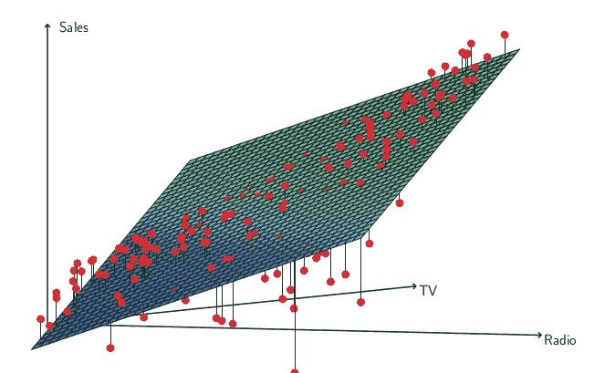

# 线性回归|机器学习中的协同效应是什么

> 原文：<https://medium.com/analytics-vidhya/what-is-synergy-effect-in-linear-regression-machine-learning-3fda2bc65f24?source=collection_archive---------1----------------------->

协同效应或交互效应是在机器学习的多元线性回归设置中出现的一种现象，当一个自变量的值增加时，另一个自变量对因变量的影响也会增加。如果上面的陈述不容易理解，也没关系。我们来看一个例子
*注:你要熟悉多元线性回归才能理解这个*

# 广告销售数据集

让我们考虑一个数据集，其中包含一家公司针对不同类别的广告预算以及该公司的销售额。因此，数据集的 3 列是**广播广告**、**报纸广告**和**销售额。让我们在这个数据集中拟合一个线性模型。这个线性模型的方程应该是这样的。**

> y = beta 0+beta 1 *电台+ beta2*报纸

其中β0、β1 和β2 是要学习的权重和偏差。
尽管这可能很好，但在某些情况下，该模型的预测可能会低估某些地区的实际销售额，而高估其他地区的实际销售额。

在这些情景中，当广播投资或报纸投资的价值都非常小或非常高时，模型低估了销售额。即，当它们都具有中等价值并且对 y 有显著贡献时。
当报纸或广播具有极高价值时，该模型高估了销售额，即，报纸投资高而广播投资低，反之亦然。(当一个特定的预测值较高时)。
这是因为，有时在现实中，当所有预测器都对预测有贡献时，而不是只有一个预测器贡献较多而其他预测器贡献较少时，结果目标将具有较高的值。
当广播和报纸都做出适度贡献，而不是只有报纸或广播投资成为极端贡献者时，原始销售额较高，这种现象被称为协同效应或互动努力。

**关联性更好的例子** : 工人数量极高，资源数量极低，不会带来太大的进步。就这样，大量的资源和极少数的工人也不会带来多大的进步。我们需要工人和资源的良好平衡。这也是一个协同效应的例子，很多现实生活中的情况也是如此，而不是简单的线性关系。

# 我们的原始模型缺少什么？

回到我们的广告数据集，我们的模型缺少什么？

> y = beta 0+beta 1 *电台+ beta2*报纸

在这个等式中，模型缺少的重要内容是，当一个预测变量的值发生变化时，要考虑另一个预测变量对预测的影响的变化。
更简单地说，当对广播的投资发生变化时，报纸投资对预测 Y 的影响也发生变化。但是，我们简单的线性模型无法解释报纸投资对 Y 的影响的变化，这种变化是基于对广播的投资金额的变化。

# 协同效应的解决方案

这个新模型可能在预测销售方面做得更好

> y = beta 0+beta 1 *电台+beta 2 *报纸+ beta3*(报纸*电台)

那么，这种新模式是如何改变模式的效率的呢？
利用一些基本的数学知识，上述等式可以修改为

> y = beta 0+(beta 1+beta 3 *报纸)*电台+beta 2 *报纸

当报纸的投资发生变化时，它不仅仅直接改变销售。但是，这也改变了广播投资对销售的影响。
在上面的等式中，如果我采用报纸公用，而不是电台公用，那么反过来也可以很容易地显示出来。

# 识别协同作用

可以使用 2 个预测因子和预测变量之间的三维图，并在同一图上绘制回归模型平面，来确定 2 个变量之间的协同作用。如果模型在两个预测因子都有显著贡献的区域低估了原始目标值，而在其中一个预测因子有极值的区域高估了原始目标值，则可以确定变量之间存在协同作用。
在这些情况下，使用上述模型可能证明是有效的。

# 参考

*统计学习导论及其在 R 中的应用*

# 谢谢你